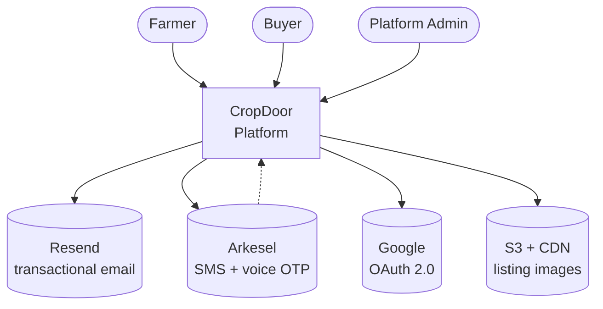
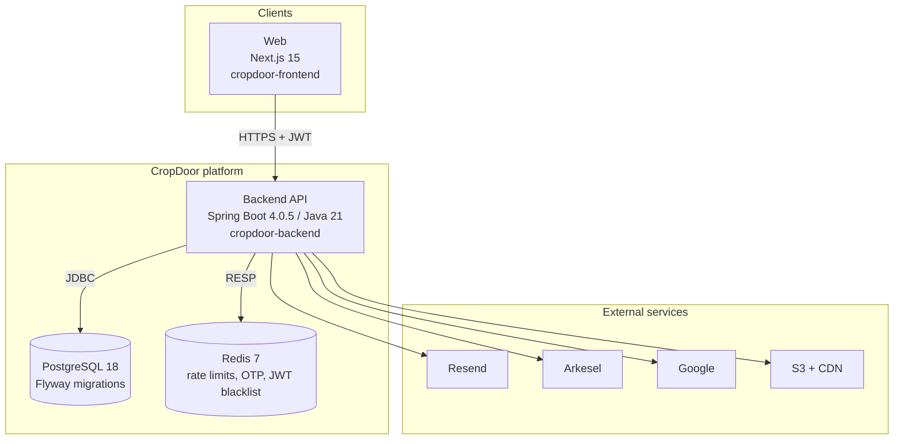

# Architecture

The platform-level view: what runs where and which subsystems are load-bearing.

This page is the **front door** — the briefest possible answer to "what is CropDoor and how is it shaped?" For the deeper reference material, the pages under this section have it: [Module map](module-map.md), [Request lifecycle](request-lifecycle.md), [Persistence and transactions](persistence.md), [ArchUnit pins](archunit-pins.md), [Roadmap surfaces](roadmap.md).

## What CropDoor is

CropDoor is a farm-to-buyer marketplace. **Farms** list produce; **buyers** place orders against those listings; **platform admins** police the system. Every side has its own org-scoped role catalog, parallel to a platform-admin RBAC tier. Orders run through a state machine with two-sided audits, immutable status history, and a commission + tax layer underneath.

The codebase is a Spring Boot 4.0.5 / Java 21 monolith with PostgreSQL 18 as the system of record, Redis 7 for ephemeral state, and a handful of third-party services for email, SMS, voice, OAuth, and object storage. A Next.js 15 frontend is in flight in a separate repo.

## System context

Three human actors, one platform, four outbound integrations plus one inbound webhook (Arkesel posts SMS delivery status back to `controller/webhook/`).

## Container view

Backend authentication is stateless: access + refresh tokens (HS512) carry identity, Redis carries everything ephemeral (rate-limit buckets, OTP codes, JWT blacklist on logout). PostgreSQL carries everything durable. There is no session store — `Authorization: Bearer <token>` is the only auth channel.

## Load-bearing subsystems

Four subsystems pin invariants the rest of the platform depends on. Read their dedicated section pages before changing any of them.

### Security stack

JWT (HS512) + Spring Security filter chain + Redis-backed rate limiting + correlation IDs + CORS allow-list. The filter chain is the *only* path identity travels — there is no session fallback. See [Security](../security/index.md).

### RBAC

Two-tier: platform-admin RBAC sits parallel to org-scoped RBAC. Every permission code follows `<SCOPE>::<DOMAIN>::<ACTION>`, every check funnels through a `Permissions.*` constant, every constant has a matching DB row. ArchUnit pins the consistency. The no-privilege-escalation rule is re-checked at role create, role update, member invite, and member role change. See [RBAC & Permissions](../rbac/index.md).

### Audit logging

Five-layer pipeline: typed action catalog (`AuditAction`) → wire contract (`AuditKeys`) → single-source-of-truth emitter (`AuditEmitter` / `AuditEmitterImpl`) → async event listener → durable `audit_log` rows. Sugar aspect (`@Audited`) handles the trivial happy-path subset. The per-org audit feed (`OrgAuditViewService`) filters by JSONB-extracted `ownerType` + `ownerId` keys, which is why **every farm-scoped or buyer-scoped emission must bake those keys into the details map**. See [Audit Logging](../audit/index.md).

### Org-scoped domain model

A user is a member of **at most one organisation** at a time, enforced by a partial unique index on `members(user_id) WHERE status IN ('PENDING','ACTIVE')`. Each org auto-mints an `Owner` system role on creation; the Owner role is **immutable and non-invitable** and can only be changed by Flyway migration. STAFF users with no active membership are dormant — they can authenticate but every org-scoped endpoint returns 403. See [Domain](../domain/index.md).

## Deeper detail in this section

| Page | Covers |
| --- | --- |
| [Module map](module-map.md) | Every top-level Java package and what it owns |
| [Request lifecycle](request-lifecycle.md) | Edge-to-audit-row request flow + filter chain detail |
| [Persistence and transactions](persistence.md) | Flyway rules, transactional policy, async listener pattern |
| [ArchUnit pins](archunit-pins.md) | Architectural invariants enforced at build time |
| [Roadmap surfaces](roadmap.md) | What's in model but not yet wired through |

## Where to next

- **Security** — filter chain, JWT lifecycle, key rotation, OAuth, rate limiting → [Security](../security/index.md)
- **Authentication flows** — every registration, login, OTP, MFA, recovery path → [Authentication](../auth/index.md)
- **RBAC** — the two-tier model, permission catalog, three-layer gates → [RBAC & Permissions](../rbac/index.md)
- **Audit logging** — the five-layer pipeline, action catalog, per-org feed → [Audit Logging](../audit/index.md)
- **Domain** — farms, buyers, members, listings, orders → [Domain](../domain/index.md)
- **Payments** — payments, payouts, commissions, fees, taxes (mostly roadmap) → [Payments](../payments/index.md)
- **Notifications** — email, SMS, voice OTP, delivery webhooks → [Notifications](../notifications/index.md)
- **Operations** — env vars, deploy flow, Docker, observability → [Operations](../operations/index.md)
