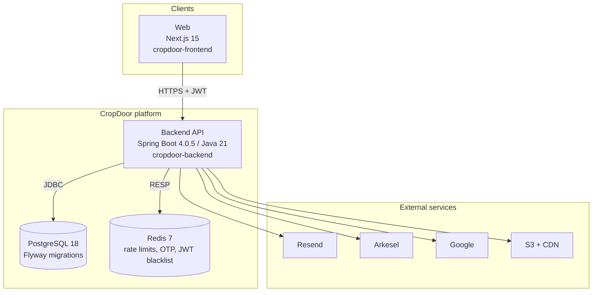
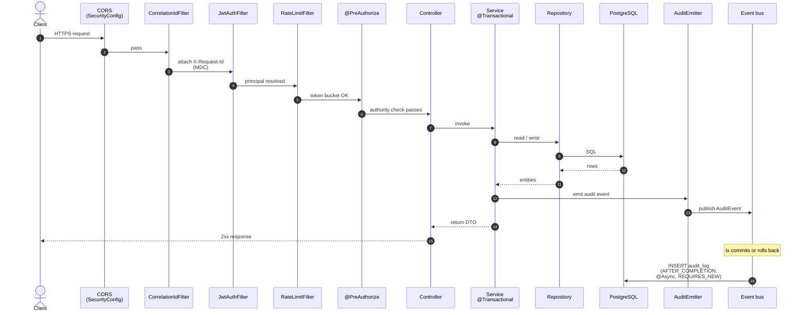

# Architecture

The platform-level view: what runs where, how a request flows through it, and which subsystems are load-bearing.

This page is the front door. If you're a new contributor, read it end to end — by the time you reach the bottom you should know which package owns what, how a request becomes an audit row, and where to go for deeper detail on any given subsystem.

## What CropDoor is

CropDoor is a farm-to-buyer marketplace. **Farms** list produce; **buyers** place orders against those listings; **platform admins** police the system. Every side has its own org-scoped role catalog, parallel to a platform-admin RBAC tier. Orders run through a state machine with two-sided audits, immutable status history, and a commission + tax layer underneath.

The codebase is a Spring Boot 4.0.5 / Java 21 monolith with PostgreSQL 18 as the system of record, Redis 7 for ephemeral state, and a handful of third-party services for email, SMS, voice, OAuth, and object storage. A Next.js 15 frontend is in flight in a separate repo.

## System context

Three human actors, one platform, four outbound integrations plus one inbound webhook (Arkesel posts SMS delivery status back to `controller/webhook/`).

## Container view

Backend authentication is stateless: access + refresh tokens (HS512) carry identity, Redis carries everything ephemeral (rate-limit buckets, OTP codes, JWT blacklist on logout). PostgreSQL carries everything durable. There is no session store — `Authorization: Bearer <token>` is the only auth channel.

## Backend module map

Top-level packages under `com.cropdoor.backend.*`:

| Package | Owns |
| --- | --- |
| `annotations` | Custom Java annotations |
| `aspect/audit` | `@Audited` annotation, the audit AOP aspect, principal resolution |
| `aspect/validation` | Boot-time validation post-processors (e.g. `AuditedMethodValidationPostProcessor`) |
| `bootstrap` | Startup runners (super-admin seeding, waitlist backfill) |
| `config` | `@Configuration` beans — CORS, Resend, Async, Clock, JPA auditing, S3, Swagger |
| `controller/{admin,auth,buyer,farm,order,waitlist,webhook}` | REST controllers grouped by domain side |
| `dto/{domain}/{request,response}` | Request + response records (Java records, immutable) |
| `event` | Spring application events (`AuditEvent`, email events) and their listeners |
| `exception` | Custom exceptions and `GlobalExceptionHandler` |
| `job` | Scheduled jobs (unverified-user purge cron, invite expiry sweeps) |
| `mapper` | MapStruct interfaces; one hand-written mapper where business logic intrudes |
| `model/{address,buyer,commission,common,delivery,dispute,driver,farm,fee,listing,order,payment,platform,rbac,review,user,waitlist}` | JPA entities, grouped by aggregate |
| `observability` | `MetricsService`, health indicators |
| `repository/{domain}` | Spring Data JPA repositories |
| `security` | Spring Security config, JWT, OAuth, rate limiting, correlation ID, password policy |
| `service/{admin,auth,buyer,farm,listing,notification,order,org,platform,rbac,waitlist}` | Business logic — one service package per bounded context |
| `util` | Pure helpers (E.164 normalization, hashing, etc.) |
| `validation` | Bean Validation constraints + validators |

The naming convention is **one package per bounded context**, with the same name reused across `controller`, `dto`, `mapper`, `model`, `repository`, and `service`. A new domain area gets six folders, not one.

## Request lifecycle

A few things worth knowing about the chain:

- **`CorrelationIdFilter` runs first** so every log line downstream carries the request ID via MDC. The header is `X-Request-Id` and is echoed back on the response.
- **`JwtAuthFilter` resolves the principal** from the `Authorization: Bearer <token>` header. No cookies. No session store. If the token is on the Redis blacklist (set on logout), the filter rejects the request.
- **`RateLimitFilter` (and the admin-specific `AdminPerUserRateLimitFilter`) gate on token buckets stored in Redis**, keyed by identifier and scope.
- **`@PreAuthorize` is layer 1 of authorization**. Layer 2 (`requireActiveMembership`) and layer 3 (`enforceNoEscalation`) live inside services — see [RBAC](../rbac/index.md) for why three layers.
- **Audit emission happens inside the service transaction** but the persistence happens *outside* it. The listener is `@TransactionalEventListener(AFTER_COMPLETION) @Async @Transactional(REQUIRES_NEW)`, which means audits land even when the outer transaction rolls back. This is load-bearing for failed-login audits.

## Load-bearing subsystems

The four subsystems below pin invariants the rest of the platform depends on. Read their dedicated pages before changing any of them.

### Security stack

JWT (HS512) + Spring Security filter chain + Redis-backed rate limiting + correlation IDs + CORS allow-list. The filter chain is the *only* path identity travels — there is no session fallback. See [Security](../security/index.md).

### RBAC

Two-tier: platform-admin RBAC sits parallel to org-scoped RBAC. Every permission code follows `<SCOPE>::<DOMAIN>::<ACTION>`, every check funnels through a `Permissions.*` constant, every constant has a matching DB row. ArchUnit pins the consistency. The no-privilege-escalation rule is re-checked at role create, role update, member invite, and member role change. See [RBAC & Permissions](../rbac/index.md).

### Audit logging

Five-layer pipeline: typed action catalog (`AuditAction`) → wire contract (`AuditKeys`) → single-source-of-truth emitter (`AuditEmitter` / `AuditEmitterImpl`) → async event listener → durable `audit_log` rows. Sugar aspect (`@Audited`) handles the trivial happy-path subset. The per-org audit feed (`OrgAuditViewService`) filters by JSONB-extracted `ownerType` + `ownerId` keys, which is why **every farm-scoped or buyer-scoped emission must bake those keys into the details map**. See [Audit Logging](../audit/index.md).

### Org-scoped domain model

A user is a member of **at most one organisation** at a time, enforced by a partial unique index on `members(user_id) WHERE status IN ('PENDING','ACTIVE')`. Each org auto-mints an `Owner` system role on creation; the Owner role is **immutable and non-invitable** and can only be changed by Flyway migration. STAFF users with no active membership are dormant — they can authenticate but every org-scoped endpoint returns 403. See [Domain](../domain/index.md).

## Persistence and migrations

PostgreSQL 18 is the system of record. Schema lives entirely in `src/main/resources/db/migration/` as Flyway `V<n>__description.sql` files. Two hard rules:

- **Never edit an applied migration.** Flyway computes a checksum on every file in `flyway_schema_history`. Editing a file after it has run anywhere — local, testing, staging, prod — produces a checksum mismatch and the application refuses to start (`spring.flyway.validate-on-migrate=true`). Fix forward with a new `V<n+1>` migration.
- **Don't write `${...}` in migration files unless you mean it as a Flyway placeholder.** Flyway's `PlaceholderReplacingReader` scans the entire file — including comments — before the SQL parser runs. An unregistered `${TOKEN}` aborts the migration and unwinds the entire application context. If you need to document a placeholder shape in a comment, write it in prose form: `[CDN_BASE_URL]/[s3_key]`, not `${CDN_BASE_URL}`.

JSONB is used deliberately, not as an escape hatch. The only routine JSONB column is `audit_log.details`, accessed via `function('jsonb_extract_path_text', ...)` from the per-org audit feed query.

## Transactions and async work

- **Default policy:** services own `@Transactional` boundaries; repositories don't declare their own. A single service method is one unit of work.
- **Async listeners** (`@Async @TransactionalEventListener`) run on a separate executor configured in `AsyncConfig`. They have their own persistence context and never share state with the caller.
- **Audit emission uses `AFTER_COMPLETION`**, not `AFTER_COMMIT`. The reason is failed-login audits: they're emitted from a catch-and-rethrow path, so the outer transaction rolls back. With `AFTER_COMMIT` the audit silently disappears; with `AFTER_COMPLETION` plus `REQUIRES_NEW` it persists regardless of the outer outcome.
- **Email events** use the same pattern — published in-transaction, sent out-of-transaction, so a transactional failure doesn't leak partial-state emails.

## Architecture pins (ArchUnit)

Every load-bearing rule the human-readable docs claim is also enforced at build time under `src/test/java/com/cropdoor/backend/architecture/`:

| Test | Enforces |
| --- | --- |
| `AuditAopArchitectureTest` | `@Audited` has exactly one method named `value`. `@AuditPrincipal` is a zero-method marker. Every `@Audited` method is public, non-static, non-final. `@AuditPrincipal` only marks `User`-typed parameters. The `aspect/` directory stays under its 6-file cap. |
| `OrgIsolationArchitectureTest` | No class in `controller/farm/**` injects buyer-side beans, and vice versa. No class in `service/farm/**` injects `BuyerProfileService`, and vice versa. Cross-side leakage fails CI. |
| `PermissionsCatalogConsistencyTest` | Every `Permissions.*` constant matches the `<SCOPE>::<DOMAIN>::<ACTION>` pattern. Allowed scopes and actions are pinned to an allow-list. Constant names mirror their code values (`::` → `_`). |
| `EmailEventListenerArchitectureTest` | Pin against direct Resend send-calls; emails must flow through the event-listener pipeline. |

If you add a new aspect, a new permission scope, or a new cross-cutting integration, expect to update one of these tests *or* deliberately decide not to. Don't skip the conversation.

## Roadmap surfaces (in model, not in flow)

The following entities exist in `model/` but the surrounding service + controller integration is partial or not yet wired. Pages that describe them mark current-vs-planned explicitly.

- **Payments** — `Payment`, `PaymentAttempt`, `Payout`, `PaymentStatus`, `PayoutStatus`. Provider integration (escrow, settlement) is not in code.
- **Disputes** — `Dispute` entity exists; controller and dispute-lifecycle service are roadmap.
- **Drivers + delivery** — `DriverProfile`, `Delivery`. Roadmap.
- **Reviews** — `Review`. Roadmap.

`OAuthRoleStateStore` and `RoleAwareOAuth2AuthorizationRequestResolver` are *in flow*, not roadmap — Google OAuth is shipped. Phone-verification gate (the `phone-verification-gate` branch) is in flow on a feature branch and will be folded into [Authentication](../auth/index.md) once it merges to `main`.

## Where to next

- **Security** — filter chain, JWT lifecycle, key rotation, OAuth, rate limiting → [Security](../security/index.md)
- **Authentication flows** — every registration, login, OTP, MFA, recovery path → [Authentication](../auth/index.md)
- **RBAC** — the two-tier model, permission catalog, three-layer gates → [RBAC & Permissions](../rbac/index.md)
- **Audit logging** — the five-layer pipeline, action catalog, per-org feed → [Audit Logging](../audit/index.md)
- **Domain** — farms, buyers, members, listings, orders → [Domain](../domain/index.md)
- **Payments** — payments, payouts, commissions, fees, taxes (mostly roadmap) → [Payments](../payments/index.md)
- **Notifications** — email, SMS, voice OTP, delivery webhooks → [Notifications](../notifications/index.md)
- **Operations** — env vars, deploy flow, Docker, observability → [Operations](../operations/index.md)
