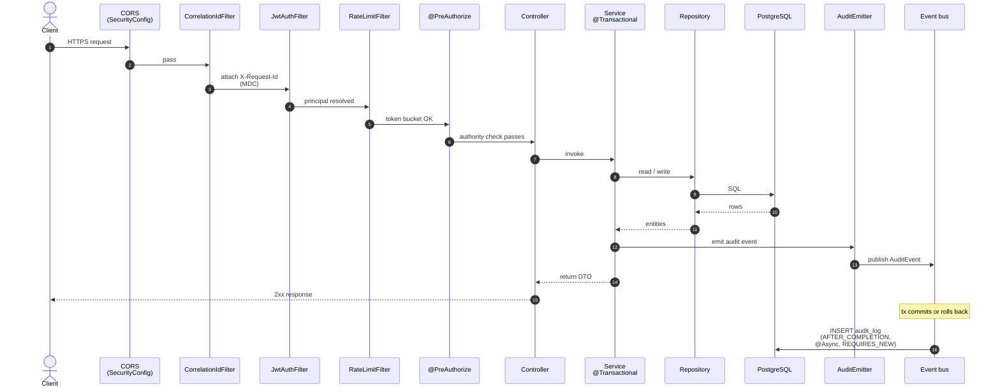

# Request lifecycle

How an inbound HTTP request travels from the edge to a persisted audit row.

The chain is short but every hop is load-bearing. If you change any filter ordering or transactional boundary, expect knock-on effects — most subtly, audit emission, which depends on the listener firing on `AFTER_COMPLETION` rather than `AFTER_COMMIT`.

## Diagram



## Filter chain

The Spring Security filter chain runs in this order:

### 1. CORS (`SecurityConfig`)

Allow-list comes from the `CORS_ALLOWED_ORIGINS` env var. Pre-flight `OPTIONS` requests short-circuit here and never reach the controller. Browser cookies are not relevant — we only accept `Authorization: Bearer <token>`.

### 2. `CorrelationIdFilter`

Reads the inbound `X-Request-Id` header. If absent, mints a UUID. Stores it in the SLF4J MDC so every log line downstream carries the same ID. Echoes the value back on the response header.

### 3. `JwtAuthFilter`

Extracts the bearer token, validates the signature against the active `JwtKeyEntry`, and (critically) checks the Redis-backed blacklist for revoked tokens. On success, populates the Spring `SecurityContext` with a `CustomUserDetails`. On failure, throws — caught by `JwtAuthEntryPoint`, returns 401.

### 4. `RateLimitFilter` + `AdminPerUserRateLimitFilter`

Two token-bucket rate limiters keyed in Redis:

- The public filter scopes by IP for unauthenticated paths and by user ID for authenticated ones.
- The admin filter applies a stricter per-identifier bucket to `/v1/admin/**` to slow brute-force attempts against admin credentials.

### 5. `@PreAuthorize` (layer 1 of authorization)

Spring Security's expression evaluator checks declared authorities (`hasAuthority('FARM::LISTING::CREATE')`). This is **admission control**, not domain authorization. Org-membership checks and no-privilege-escalation enforcement happen inside the service body — see [RBAC](../rbac/index.md) for the three-layer model.

## Service + repository layer

The controller's job is parameter binding and DTO conversion via MapStruct. Business logic lives in the service. Each service method is one `@Transactional` boundary; repositories don't declare their own transactions.

Inside the transaction, the service may emit one or more `AuditEvent` instances via `AuditEmitter`. The publish goes through Spring's `ApplicationEventPublisher` — but the audit row is **not** written yet. It can't be: writing it inside the caller's transaction would defeat the entire async-listener pattern.

## Audit persistence (after the response)

The `AuditEventListener` is annotated:

```java
@Async
@TransactionalEventListener(phase = TransactionPhase.AFTER_COMPLETION, fallbackExecution = true)
@Transactional(propagation = Propagation.REQUIRES_NEW)
public void handleAuditEvent(AuditEvent event) { ... }
```

Three annotations doing distinct work:

- `AFTER_COMPLETION` (not `AFTER_COMMIT`) — fires whether the outer transaction committed or rolled back. This is load-bearing for failed-login audits emitted from a catch-and-rethrow path: the outer transaction rolls back, but the audit still lands.
- `REQUIRES_NEW` — opens its own transaction. The outer one is already done.
- `@Async` — runs on the executor configured in `AsyncConfig`, off the request thread, so the response goes out without waiting on the audit write.

The end result: a single inbound request produces one HTTP response plus one to N audit rows that arrive a moment later, independently of whether the business operation succeeded.

## Related

- [Audit logging](../audit/index.md) — full five-layer pipeline and the `AuditEmitter` contract
- [Security](../security/index.md) — JWT lifecycle, key rotation, OAuth, rate limit details
- [RBAC & Permissions](../rbac/index.md) — the three-layer authorization model
- [Persistence and migrations](persistence.md) — transactional policy and Flyway rules
