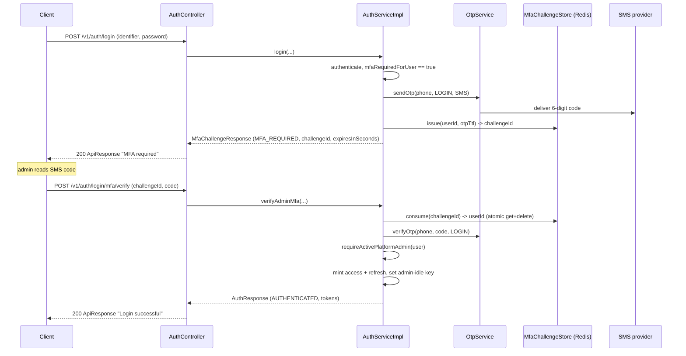

# Admin login & MFA

Platform admins do not log in in a single round-trip. When an admin presents valid credentials, `POST /v1/auth/login` does **not** return tokens — it returns a short-lived MFA challenge and dispatches a one-time code by SMS to the admin's phone. The client then posts the challenge id back, together with the code, to a second endpoint that mints the JWT pair. This page covers that two-phase handshake, the Redis-backed challenge store, which principals are put through it, the dev-only magic-login shortcut, and the admin-specific hardening layers (rate limiting, the forced password-reset gate, and the idle-session gate).

MFA is driven by a **per-role** flag rather than a hardcoded "admins always" rule, so the machinery lives in the shared login path in `service/auth/AuthServiceImpl.java`. In practice the completion endpoint is admin-only — see [Who is challenged](#who-is-challenged) for the exact resolution and the org-role edge. For the single-round-trip login outcomes (`AUTHENTICATED`, `VERIFICATION_REQUIRED`), see [Login & the phone gate](login-and-the-phone-gate.md); for what the minted tokens carry, see [JWT & sessions](jwt-sessions-and-refresh.md).

## The two-phase handshake

Step 1 is the ordinary `POST /v1/auth/login`. `AuthServiceImpl#login` normalizes the identifier, rejects locked accounts, applies the admin-login rate limit, and authenticates the credentials. Once the principal is resolved it consults `PermissionResolutionService#mfaRequiredForUser`; when that returns `true` it branches into `startMfaChallenge` instead of minting tokens. The polymorphic return type is `LoginResponse` (a sealed interface over `AuthResponse`, `MfaChallengeResponse`, `VerificationChallengeResponse`); the MFA branch returns a `MfaChallengeResponse` whose `outcome` discriminator is `MFA_REQUIRED`.

Step 2 is `POST /v1/auth/login/mfa/verify`, handled by `AuthServiceImpl#verifyAdminMfa`. It is **unauthenticated** (the controller marks it `permitAll`) — the challenge id itself is the bearer of proof-of-step-1. The client submits `{challengeId, code}` (`AdminMfaVerifyRequest`) and receives the full `AuthResponse` (tokens + user summary + context + permissions) inside the usual `ApiResponse` envelope.

The org-member accept-invite flow (`POST /v1/auth/invites/accept`) reuses the same fork: `AuthServiceImpl#issueSessionAfterInviteAccept` also calls `startMfaChallenge` when the invitee's role requires MFA, so a freshly-accepted admin invite can land on the challenge handle too.

### Step 1 — issuing the challenge

`startMfaChallenge` does the following, in order:

1. Rejects an admin with **no phone on file** — `AdminPhoneNotConfiguredException` (`ADMIN_PHONE_NOT_CONFIGURED`, HTTP 409), since SMS step-up is impossible without a number. A `loginFailedWithUser` audit with reason `ADMIN_PHONE_MISSING` is emitted first.
2. Resets the account-lockout attempt counter for the identifier (credentials were valid, so the failed-attempt streak is cleared).
3. Dispatches a fresh OTP via `otpService.sendOtp(phone, OtpPurpose.LOGIN, OtpChannel.SMS, ...)`. OTP generation, hashing, and TTL are owned by [OTP & password recovery](otp-and-password-recovery.md).
4. Issues a challenge through `MfaChallengeStore#issue`, keyed to the user id with a TTL equal to the OTP lifetime (`otpService.getOtpTtl()`).
5. Emits the `mfaPending` audit and increments the `cropdoor.login.attempts` meter with outcome `mfa_pending`, tagged by login kind (admin / farm / buyer / dormant) so observability can split step-up channels.

The response body (`MfaChallengeResponse`) carries only `outcome`, `challengeId`, and `expiresInSeconds` — deliberately no token material.

### Step 2 — verifying the challenge

`verifyAdminMfa` is defensive by construction, and the ordering of its guards matters:

1. **Consume the challenge.** `MfaChallengeStore#consume` atomically reads-and-deletes the entry. Unknown / expired / already-used all collapse to `MfaChallengeNotFoundException` (`MFA_CHALLENGE_NOT_FOUND`, HTTP 400). This is single-use: a replayed challenge id fails.
2. **Resolve the user** by id, else the same `MFA_CHALLENGE_NOT_FOUND`.
3. **Reject non-admins.** If the resolved user's `role != ADMIN`, throw `MFA_CHALLENGE_NOT_FOUND` ("resolved to a non-admin user"). This is why the verify endpoint is effectively admin-only.
4. **Verify the OTP** (`otpService.verifyOtp(..., OtpPurpose.LOGIN, ...)`). A wrong or expired code fails here.
5. **Re-assert active admin status** via `requireActivePlatformAdmin` — the user must still have an `ACTIVE` `PlatformAdmin` row. This runs *after* OTP verification so a caller without a valid code cannot probe suspension state through the failure shape. Without this guard, an admin suspended during the OTP TTL would receive freshly-minted tokens only to be rejected on the next request, leaving a misleading `loginSucceeded` audit behind.
6. **Re-resolve the login context** (`LoginContextResolver#resolve`) fresh rather than trusting a value cached at challenge issuance — the role chain may have shifted during the TTL.
7. Mint the access + refresh pair, persist the refresh session, set the admin idle-session key (see [Idle-session gate](#idle-session-gate)), and emit both `loginSucceeded` (via `LoginVia.ADMIN_MFA`) and `adminLoginSucceeded` audits, plus the `success` login metric tagged `admin`.

## The challenge store

`service/auth/MfaChallengeStore.java` is a thin Redis wrapper over `StringRedisTemplate`. Each challenge is a random UUID key whose value is the user id.

| Property | Behaviour |
| --- | --- |
| Backing store | Redis (`StringRedisTemplate`) |
| Key shape | `mfa-challenge:<challengeId>` → user id (UUID string) |
| TTL | Matches the OTP lifetime (`otpService.getOtpTtl()`) |
| Single-use | `consume` uses `getAndDelete` — the read and the delete are one atomic op |
| Corruption handling | A stored value that is not a UUID is logged and treated as absent |

Because the entry self-expires and is deleted on first read, an expired, unknown, or already-redeemed challenge all collapse to the same "empty" result, and the caller surfaces the same `MFA_CHALLENGE_NOT_FOUND` for every one of them — no oracle for which of the three it was.

## Who is challenged

Step-up is gated on `PermissionResolutionService#mfaRequiredForUser`, which walks the caller's **active role** and reads its `mfa_required` flag:

- For a `UserType.ADMIN` user it looks up the `ACTIVE` `PlatformAdmin` row and returns `role.isMfaRequired()`.
- For everyone else it looks up the `ACTIVE` `Member` row and returns `role.isMfaRequired()`.
- Dormant users, non-`ACTIVE` admins, and any role with the flag unset all resolve to `false`.

The flag is genuinely per-role and configurable by design — not a static "admins only" constant. That said, the completion endpoint hard-rejects any non-admin user (guard 3 above), so today MFA can only be *finished* by admins. The platform invariant that every `PLATFORM`-scoped role must carry `mfa_required = true` (pinned by a DB CHECK and a server-side force) is documented under [RBAC — security invariants](../rbac/security-invariants.md); see also the [principal model](principal-model.md) for how `User` / `PlatformAdmin` / `Member` relate.

## Magic-login: the dev-only OTP shortcut

Passing admin MFA over plain HTTP in local and integration-test runs would otherwise require a real SMS. The magic-login path removes that dependency for **allowlisted phones only**. In `OtpServiceImpl#sendOtp`, when the phone is on the magic-login allowlist the code becomes a fixed operator-supplied value (`123456` in the local recipe) instead of a random draw, and the SMS/voice dispatch is **suppressed** — the code is persisted (hashed) and the `otpSent` audit is emitted exactly as normal, but nothing is handed to a provider.

The gate is deliberately narrow and dead by default:

- The allowlist is `TestDataSeederProperties#magicLoginPhones`, bound from `app.bootstrap.seed-test-data.magic-login-phones` (env `SEED_MAGIC_LOGIN_PHONES`).
- The properties bean exists **only** when `app.bootstrap.seed-test-data=true` (a `@ConditionalOnProperty` gate). If the bean is absent, `isMagicLoginPhone` returns `false` — so the feature is entirely inert in any environment that does not opt in, including production.
- The allowlist is **empty by default**, and every entry is validated as E.164 at binding time (`^\+\d{9,15}$`).
- The fixed code comes from `magicOtp` (`app.bootstrap.seed-test-data.magic-otp`), which is required to be non-blank whenever seeding is enabled.

This is the sanctioned local path for driving the two-step admin login without SMS; it is not a production capability. Attaching the seeded `FE_TEST_ADMIN` role to the handoff admin is itself gated on the same allowlist, so a known-password full admin never materializes in an env that leaves the allowlist unset.

## Admin session hardening

Beyond MFA, three admin-specific layers wrap the authenticated admin surface.

### Two rate-limit buckets

Admin traffic is throttled at two distinct points, both backed by Redis:

| Layer | Where | Key | Limit | On breach |
| --- | --- | --- | --- | --- |
| Pre-auth admin-login | `AuthServiceImpl#applyAdminLoginRateLimit` (inside `login`) | `admin-login` scope, keyed by identifier | `ADMIN_LOGIN_MAX_REQUESTS` = 5 per 60s | `RateLimitExceededException`, audited `ADMIN_LOGIN_RATE_LIMITED` |
| Post-auth per-user | `security/ratelimit/AdminPerUserRateLimitFilter.java` | `admin-user:<userId>` | `ADMIN_MAX_REQUESTS` = 30 per `ADMIN_WINDOW_SECONDS` = 60 | HTTP 429 `RATE_LIMIT_EXCEEDED` + `Retry-After` |

The pre-auth limiter fires only when the submitted identifier resolves to an existing admin account (`looksLikeAdminIdentifier`); identifier normalization to a single canonical form (E.164 phone or lower-cased email) prevents an attacker from rotating letter-case to reset the bucket.

The post-auth filter targets `/v1/admin/**` and runs **inside** the Spring Security chain. Both it and `JwtAuthFilter` are registered before `UsernamePasswordAuthenticationFilter`, with `JwtAuthFilter` added first so it runs earlier — by the time this filter fires, the admin principal is already in the `SecurityContextHolder`. It exists as defense-in-depth: the pre-auth IP-based `RateLimitFilter` buckets by source IP, whereas this one buckets by user id, so a single admin hammering from many IPs is still counted against one quota. A subtlety pinned by `AdminPerUserRateLimitFilterConfig`: because the filter extends `OncePerRequestFilter`, Spring Boot's automatic servlet-layer registration is explicitly **disabled** (a `FilterRegistrationBean` with `setEnabled(false)`), otherwise the outer pass — where the security context is still empty — would set the once-per-request marker and silently no-op the in-chain invocation. It skips actuator, OpenAPI, and CORS `OPTIONS` preflight requests.

### Forced password-reset gate

`security/AdminPasswordResetInterceptor.java` is a `HandlerInterceptor` registered **globally** (against every route) by `config/WebConfig.java`, not scoped to `/v1/admin/**`. Any authenticated admin whose `User.passwordResetRequired` flag is still `true` is rejected with HTTP 403 `ADMIN_PASSWORD_RESET_REQUIRED` on every request, regardless of target path — so an admin-only endpoint introduced outside `/v1/admin/**` (say under `/v1/platform/**` or `/v1/audit-logs/**`) still enforces the gate.

The one deliberate exception is `/v1/auth/change-password`: `WebConfig#addInterceptors` excludes it via `excludePathPatterns`, because that endpoint is what *clears* the flag. Without the exclusion an admin gated on first login would be blocked from the very route that recovers them — a deadlock. The bootstrap super-admin is seeded with the flag set; invitee admins have it cleared when they accept their invite and set a permanent password. The `POST /v1/auth/change-password` flow (`AuthServiceImpl#changePassword`) sets `passwordResetRequired = false`, so the admin proceeds freely on subsequent requests. Non-admin principals are never blocked — the flag defaults to `false` for farm and buyer users. Unauthenticated requests pass through: Spring Security has already rejected missing/forged tokens with 401 before the interceptor runs, so a principal reaching the pass-through branch is necessarily on a `permitAll` route and cannot be a mid-reset admin.

### Idle-session gate

The two-phase verify (`verifyAdminMfa`) writes an `admin-idle:<userId>` Redis key with a TTL of `AdminSessionProperties#idleTimeoutSeconds` (default 1800s / 30 min). On every subsequent admin request, `JwtAuthFilter#enforceAdminIdleGate` checks that key: if it is missing the request is rejected with HTTP 401 `SESSION_IDLE` ("Session idle — please refresh"); if present, its TTL is slid forward so activity keeps the session alive. A token refresh (`AuthServiceImpl#refreshToken`) also re-arms the key for admins. `AdminSessionProperties` (prefix `app.security.admin.*`) is additionally the authoritative source for admin access-token TTL (5 min) and refresh-token TTL (1 day), consumed by `JwtProvider` — see [JWT & sessions](jwt-sessions-and-refresh.md).

## Where it lives

| Concern | Source |
| --- | --- |
| Login fork + step-up issuance | `service/auth/AuthServiceImpl.java` (`login`, `startMfaChallenge`) |
| MFA verify + admin guards | `AuthServiceImpl#verifyAdminMfa`, `AuthServiceImpl#requireActivePlatformAdmin` |
| Endpoints | `controller/auth/AuthController.java` (`login`, `verifyMfaChallenge`) |
| Challenge store (Redis) | `service/auth/MfaChallengeStore.java` |
| Step-1 / step-2 request/response DTOs | `dto/auth/response/MfaChallengeResponse.java`, `dto/auth/response/LoginResponse.java`, `dto/auth/response/LoginOutcome.java`, `dto/auth/request/AdminMfaVerifyRequest.java` |
| MFA requirement resolution | `service/rbac/PermissionResolutionService.java` (`mfaRequiredForUser`) |
| Magic-login dev path | `service/auth/OtpServiceImpl.java` (`sendOtp`, `isMagicLoginPhone`), `bootstrap/TestDataSeederProperties.java` |
| Pre-auth admin-login limit | `AuthServiceImpl#applyAdminLoginRateLimit`, `security/ratelimit/RateLimitConfig.java` |
| Post-auth per-user limit | `security/ratelimit/AdminPerUserRateLimitFilter.java`, `AdminPerUserRateLimitFilterConfig.java` |
| Forced password reset | `security/AdminPasswordResetInterceptor.java`, `config/WebConfig.java` |
| Idle gate + admin TTLs | `security/jwt/JwtAuthFilter.java` (`enforceAdminIdleGate`), `security/ratelimit/AdminSessionProperties.java` |

## See also

- [Login & the phone gate](login-and-the-phone-gate.md) — password login, lockout, and the phone-verification outcome
- [OTP & password recovery](otp-and-password-recovery.md) — OTP generation, hashing, TTL, and SMS/voice dispatch
- [JWT & sessions](jwt-sessions-and-refresh.md) — token minting, the filter chain, refresh rotation, and admin TTLs
- [Principal model](principal-model.md) — `User` vs `PlatformAdmin` vs `Member`
- [RBAC — security invariants](../rbac/security-invariants.md) — the PLATFORM-must-MFA invariant
- [Audit](../audit/index.md) — where `mfaPending`, `adminLoginSucceeded`, and denial events land
