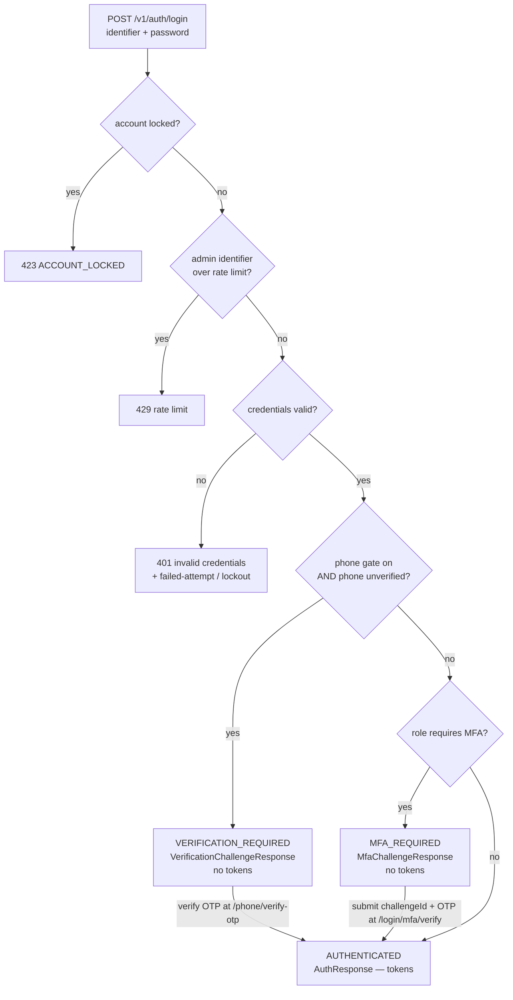
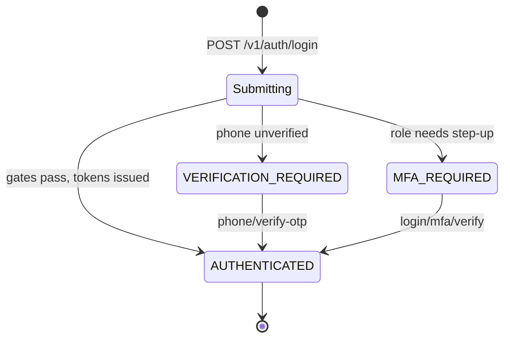

# Authentication overview

Authentication answers one question: **who is this caller?** It turns a set of credentials — a password, a Google identity token, a phone OTP, a refresh token — into a signed access token that names a `User` and their resolved login context. Everything downstream that asks **what may they do?** is [RBAC](../rbac/index.md), a separate layer that reads the permissions this section hands it. Auth mints identity, RBAC gates action.

This page is the section's front door: the identity surfaces at a glance, the one response shape every successful path converges on, the login-outcome state machine that is the spine of the whole section, the full endpoint surface, and a map to the seven sub-pages that own each flow in detail.

## Identity surfaces at a glance

CropDoor has one credential-holding entity and two role-carrying attachments. A person always logs in as a `User`; the login context is resolved by walking their attachments.

| Surface | What it is | Where it appears |
| --- | --- | --- |
| `User` | The account row — credentials, phone, email, `UserType` (`FARMER` / `BUYER` / `DRIVER` / `ADMIN` / `STAFF`). Every login authenticates a `User`. | Every response's `user` field (`UserSummary`). |
| `PlatformAdmin` | Attachment giving a `User` a platform role (e.g. `SUPER_ADMIN`, a custom `Moderator`). Present only for `UserType.ADMIN`. | Resolves the `PLATFORM_ADMIN` context. |
| `Member` | Attachment binding a `User` to exactly one farm or buyer organization with an org role. | Resolves `FARM_MEMBER` / `BUYER_MEMBER` context. |

A `User` with neither an active `PlatformAdmin` nor an active `Member` row resolves to `DORMANT` — they authenticate successfully, but every org-scoped endpoint returns 403 `STAFF_DORMANT_NO_MEMBERSHIP`. Why these are three separate entities (and stay separate) is the subject of [Principal model](principal-model.md).

## The one unified response: `AuthResponse`

Every terminal success — password login, admin MFA verify, OAuth, waitlist claim, phone-OTP verification, invite accept, token refresh — returns the **same** `AuthResponse` shape (as the `data` field of the `ApiResponse<T>` envelope). Clients learn one payload and reuse it everywhere.

| Field | Type | Meaning |
| --- | --- | --- |
| `outcome` | `LoginOutcome` | Discriminator — `AUTHENTICATED` on the token-bearing path. |
| `accessToken` | `String` | Short-lived signed JWT (see [JWT & sessions](jwt-sessions-and-refresh.md)). |
| `refreshToken` | `String` | Opaque rotating refresh token. |
| `expiresIn` | `long` | Access-token lifetime, in seconds. |
| `tokenType` | `String` | Always `"Bearer"` (defaulted by the record's compact constructor). |
| `user` | `UserSummary` | Public user fields — id, names, `displayName`, phone, email, `role`, admin-only `platformRoleName`, `emailVerified`, `phoneVerified`. |
| `context` | `LoginContextResponse` | Resolved context — `type`, org `ownerType`/`ownerId`/`ownerName`, `memberId`, `roleName`, `isOwner`, `isSuperAdmin`, `mfaRequired`. Never null. |
| `permissions` | `List<String>` | Effective permission codes for the resolved context — the FE gates UI on these, the same strings back the server-side gates. Never null. |

`context` and `permissions` are required on every issuance; `AuthResponse`'s canonical constructor rejects nulls. The identical `user` / `context` / `permissions` triple is also served standalone by `GET /v1/auth/me` (as `MeResponse`) for page-reload rehydration and mid-session permission refresh.

Two of the three `LoginOutcome` values do **not** carry tokens — they are challenges, described next.

## The spine: the login-outcome state machine

A single `POST /v1/auth/login` fans out through an ordered set of gates in `AuthServiceImpl#login`. The order is load-bearing: lockout and rate-limit checks run before credentials, and the phone-verification gate runs before the MFA check. Each terminal is one of three `LoginResponse` variants keyed by the `outcome` discriminator, so a client switches on one stable field rather than sniffing for `accessToken`.

The three variants and their owning sub-pages:

| `outcome` | Variant | Carries | Resolved by | Owner page |
| --- | --- | --- | --- | --- |
| `AUTHENTICATED` | `AuthResponse` | Full token pair + `user` + `context` + `permissions`. | — (terminal) | [Login & the phone gate](login-and-the-phone-gate.md) |
| `VERIFICATION_REQUIRED` | `VerificationChallengeResponse` | Canonical `phone`, `phoneMasked`, OTP `expiresInSeconds`, `channelsAvailable`, `resumed`. | `POST /v1/auth/phone/verify-otp` → `AuthResponse` | [Login & the phone gate](login-and-the-phone-gate.md) |
| `MFA_REQUIRED` | `MfaChallengeResponse` | Opaque `challengeId`, `expiresInSeconds`. | `POST /v1/auth/login/mfa/verify` → `AuthResponse` | [Admin login & MFA](admin-login-and-mfa.md) |

`LoginOutcome` is deliberately additive: new outcomes (password-rotation-required, terms-acceptance-required) can extend the enum, and clients should fail closed on unknown values.

The **phone-verification gate** is the newest arc. When `cropdoor.auth.phone-gate.enabled` is on (default `true`) and the credential-validated user has `phoneVerified = false`, login short-circuits to `VERIFICATION_REQUIRED` instead of issuing tokens — the OTP is dispatched and the challenge names the phone to verify. The same `VerificationChallengeResponse` shape is emitted by `POST /v1/auth/register`; the `resumed` flag distinguishes a fresh registration challenge (`false`) from resuming an existing unverified account (`true`, always the case at login). The gate is on **phone**, not email — `emailVerified` is informational and never blocks login. Full arc in [Login & the phone gate](login-and-the-phone-gate.md); registration's entry into it in [Registration & email verification](registration-and-email-verification.md).

As a state view, every non-token outcome funnels back to `AUTHENTICATED` once its challenge is redeemed:

### How the context is resolved

Independent of which outcome fires, the `LoginContextResponse` is computed by `LoginContextResolverImpl#resolve`: an `ADMIN` user is resolved against the **active** `PlatformAdmin` row (`PLATFORM_ADMIN`, or `DORMANT` if suspended/revoked); any other user is resolved against their **active** `Member` row (`FARM_MEMBER` or `BUYER_MEMBER` by `ownerType`), falling through to `DORMANT` when none exists. The `mfaRequired` flag on the context mirrors the active role's `mfa_required` column — always `true` for platform admins (pinned by the `V37` `roles_platform_must_require_mfa` check constraint), and per-role for org members.

## Endpoint surface

Three controllers make up the auth surface. All are unauthenticated except the session-management and profile endpoints, and all responses are wrapped in `ApiResponse<T>`.

### `AuthController` — `/v1/auth`

| Method + path | Purpose | `data` shape |
| --- | --- | --- |
| `POST /register` | Start a phone-verification challenge for a new/resumed account (no tokens). | `VerificationChallengeResponse` |
| `POST /login` | Password login — fans out to the three outcomes above. | `LoginResponse` (polymorphic) |
| `POST /login/mfa/verify` | Redeem an MFA `challengeId` + OTP for tokens. | `AuthResponse` |
| `GET /me` | Authenticated user's profile, context, and permissions. | `MeResponse` |
| `POST /refresh-token` | Rotate the refresh token, mint a fresh access token. | `AuthResponse` |
| `POST /logout` | Blacklist the access token, revoke the supplied refresh token. | `Void` |
| `POST /logout-all` | Revoke every session for the user. | `Void` |
| `GET /sessions` | List active sessions (flags the caller's current one). | `List<SessionResponse>` |
| `DELETE /sessions/{sessionId}` | Revoke a single owned session. | `Void` |
| `POST /change-password` | Change password (revokes all sessions). | `Void` |
| `POST /verify-email` | Consume an email-verification token (idempotent). | `Void` |
| `POST /forgot-password` | Request a reset via email link or SMS OTP (enumeration-safe). | `Void` |
| `POST /reset-password` | Reset via emailed token or phone + SMS OTP. | `Void` |
| `POST /resend-verification` | Resend the email-verification link (rate-limited). | `Void` |
| `POST /oauth/exchange` | Exchange a one-time OAuth code for tokens. | `AuthResponse` |
| `POST /waitlist/claim-link` | Mail a waitlist-claim link (enumeration-safe). | `Void` |
| `POST /waitlist/resolve-claim` | Resolve a claim token to a signup prefill (non-consuming). | `WaitlistClaimResolution` |
| `POST /waitlist/claim` | Consume a claim token, create the account, issue tokens (201). | `AuthResponse` |
| `POST /invites/accept` | Accept an org-member invite — same `LoginResponse` shape as login. | `LoginResponse` |

### `PhoneOtpController` — `/v1/auth/phone`

| Method + path | Purpose | `data` shape |
| --- | --- | --- |
| `POST /send-otp` | Send a phone-verification OTP (enumeration-safe). | `OtpSentResponse` |
| `POST /verify-otp` | Verify the OTP — mints tokens for an anonymous first-time verify, else `{"outcome":"PHONE_VERIFIED"}`. | `AuthResponse` or `PHONE_VERIFIED` envelope |
| `POST /login/send-otp` | Send a passwordless-login OTP (enumeration-safe). | `OtpSentResponse` |
| `POST /login/verify-otp` | Verify a passwordless-login OTP for tokens (rejects admins + suspended). | `AuthResponse` |

### `OAuthSignupController` — `/v1/auth/oauth/signup`

| Method + path | Purpose | `data` shape |
| --- | --- | --- |
| `GET /preview` | Read-only preview of a pending Google signup. | `OAuthSignupPreview` |
| `POST /send-otp` | Send a phone OTP to complete an OAuth signup. | `OtpSentResponse` |
| `POST /complete` | Verify the OTP, create the user, issue tokens. | `AuthResponse` |

## Section map

| Page | Covers |
| --- | --- |
| [Principal model](principal-model.md) | `User` vs `PlatformAdmin` vs `Member` — why three entities, and why they stay separate. |
| [Registration & email verification](registration-and-email-verification.md) | Signup, waitlist-claim signup, the `resumed` fresh-vs-resume distinction, email-verification token lifecycle. |
| [Login & the phone gate](login-and-the-phone-gate.md) | Password login, failure/lockout branches, and the phone-verification gate arc end to end. |
| [Admin login & MFA](admin-login-and-mfa.md) | Two-phase admin login, the SMS-OTP MFA challenge, magic-login, and the admin-login rate limit. |
| [OAuth (Google)](oauth.md) | Google login vs signup, post-OAuth phone verification, and the one-time code exchange. |
| [JWT, sessions & refresh](jwt-sessions-and-refresh.md) | JWT signing + key rotation, the filter chain, refresh rotation + reuse detection, logout. |
| [OTP & password recovery](otp-and-password-recovery.md) | OTP internals (generation, hashing, TTL, SMS/voice routing), forgot / reset / change password. |

## Where it lives

| Concern | Source |
| --- | --- |
| Auth REST surface (login, refresh, sessions, password, waitlist, invite) | `controller/auth/AuthController.java` |
| Phone-OTP + passwordless-login endpoints | `controller/auth/PhoneOtpController.java` |
| OAuth signup completion endpoints | `controller/auth/OAuthSignupController.java` |
| Login orchestration + the outcome fan-out | `service/auth/AuthServiceImpl.java` (`#login`) |
| Context resolution (admin / member / dormant) | `service/auth/LoginContextResolverImpl.java` |
| Unified success payload | `dto/auth/response/AuthResponse.java` |
| Polymorphic login return + discriminator | `dto/auth/response/LoginResponse.java`, `LoginOutcome.java` |
| Challenge payloads | `dto/auth/response/VerificationChallengeResponse.java`, `MfaChallengeResponse.java` |
| Context + user wire shapes | `dto/auth/response/LoginContextResponse.java`, `LoginContextType.java`, `UserSummary.java` |
| Phone-gate config flag | `cropdoor.auth.phone-gate.enabled` (`application.properties`) |

## See also

- [Principal model](principal-model.md)
- [Login & the phone gate](login-and-the-phone-gate.md)
- [Admin login & MFA](admin-login-and-mfa.md)
- [JWT, sessions & refresh](jwt-sessions-and-refresh.md)
- [RBAC & permissions](../rbac/index.md) — what an authenticated caller may do.
- [Audit logging](../audit/index.md) — every login outcome and failure is audited.
