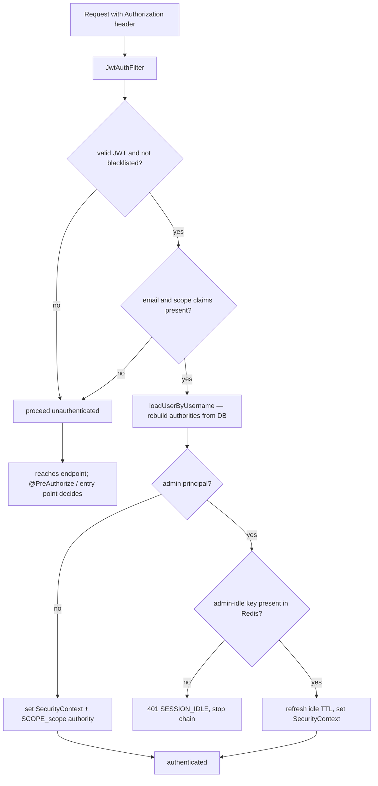
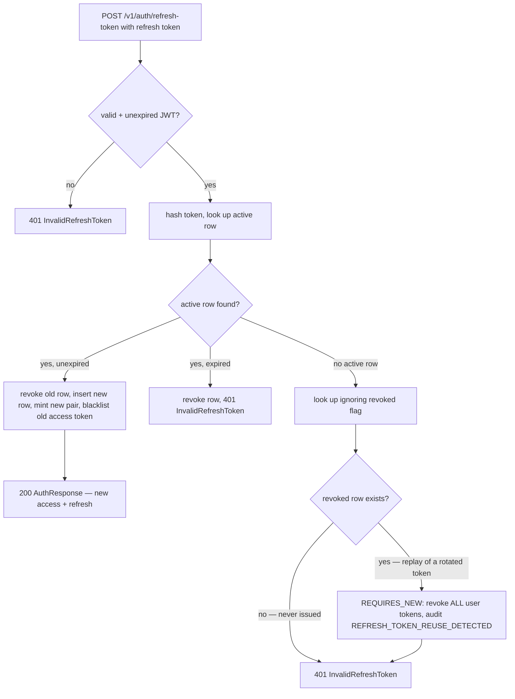

# JWT, sessions & refresh

This page owns the token machinery behind every authenticated CropDoor request: how an access token and a refresh token are minted and signed, how signing keys rotate without logging anyone out, how the filter chain re-authenticates each request, and how refresh-token rotation detects a stolen token and burns the whole session. Everything above the login flows — [login and the phone gate](login-and-the-phone-gate.md), [admin login and MFA](admin-login-and-mfa.md), [OAuth](oauth.md) — ends by calling `JwtProvider` to produce the pair described here, so this is the shared plumbing they all sit on.

Two facts anchor the rest of the page. First, **authorities are never in the token** — the JWT carries identity and a login-`scope`, and permissions are re-resolved from the database on every single request. Second, **only hashes hit disk** — the raw refresh JWT is returned to the client once and never persisted, and the blacklist stores a SHA-256 digest, not the token. All response payloads below are the `data` field of the `ApiResponse<T>` wrapper.

## The token pair — `JwtProvider`

`security/jwt/JwtProvider.java` mints both tokens, signing each with HMAC-SHA512 (`HS512`) using the active signing key and stamping the key's `kid` into the JWS header. `JwtProvider#generateToken` builds the access token; `JwtProvider#generateRefreshToken` builds the refresh token. Both take a `CustomUserDetails` and the resolved `LoginContextResponse`, so the token records *which* context the session runs in.

| Claim | Access token | Refresh token | Meaning |
| --- | --- | --- | --- |
| `kid` (header) | yes | yes | Which signing key verifies this token |
| `sub` | yes | yes | Login identifier — email when present, otherwise phone (`CustomUserDetails#getUsername`) |
| `jti` | yes | yes | Random `UUID` per token |
| `iat` / `exp` | yes | yes | Issued-at / expiry, from the injected `Clock` |
| `userId` | yes | yes | The `users` row id |
| `email` | yes | no | Same value as `sub` (email-or-phone); named `email` for historical reasons |
| `type` | no | `"refresh"` | Marks the refresh token; informational (see below) |
| `scope` | yes | yes | The `LoginContextType` name, e.g. `PLATFORM_ADMIN`, `FARM_MEMBER`, `BUYER_MEMBER`, `DORMANT` |
| `ownerId` / `ownerType` | org contexts only | org contexts only | The owning farm/buyer org for member contexts |

There are **no role or permission claims**. `JwtProvider#generateToken` documents this deliberately: embedding authorities would leak permission codes in any captured token, bloat the token, and go stale the instant a role is edited. Authorization is instead rebuilt per request (next section) and is the canonical topic of [RBAC authorization](../rbac/authorization.md).

### Token lifetimes

TTLs are role-aware. Non-admins use the platform defaults bound under `app.jwt.*` on `JwtKeyConfig`; admins use the tighter `app.security.admin.*` values on `AdminSessionProperties`, which `JwtProvider` reads directly as the authoritative source for admin token lifetimes.

| Principal | Access TTL | Refresh TTL | Source |
| --- | --- | --- | --- |
| Non-admin (`FARMER` / `BUYER` / `STAFF`) | 15 min (`900000` ms) | 7 days (`604800000` ms) | `JwtKeyConfig` (`app.jwt.expiration-ms`, `app.jwt.refresh-expiration-ms`) |
| Admin (`UserType.ADMIN`) | 5 min (`300000` ms) | 1 day (`86400000` ms) | `AdminSessionProperties` (`app.security.admin.access-ttl-ms`, `app.security.admin.refresh-ttl-ms`) |

One subtlety: the persisted `refresh_tokens.expires_at` row is always stamped with the platform default (7 days) in `RefreshTokenServiceImpl`, even for admins, whereas the admin refresh JWT's own `exp` is 1 day. Because `AuthServiceImpl#refreshToken` runs `JwtProvider#validateToken` (which checks the signature and `exp`) before the stored row's `expires_at` is ever consulted, the shorter 1-day JWT expiry governs for admins — the longer DB expiry never gets a chance to matter.

## Signing keys & rotation — `JwtKeyProvider`

Keys are configured as a list under `app.jwt.keys[n]`, each a `JwtKeyEntry` with `kid`, `secret`, and `active`. `security/config/JwtKeyConfig.java` binds the list; `security/jwt/JwtKeyProvider.java` loads it at startup (`@PostConstruct init`) into a `kid → SecretKey` map and enforces the invariants — boot fails fast if:

- no keys are configured,
- any secret is shorter than 64 characters (512 bits, the `HS512` minimum), or
- zero or more-than-one entry is marked `active`.

Exactly one key is the **active signing key** (`JwtKeyProvider#getActiveKey`, its id from `getActiveKid`); every configured key — active or retired — remains a **verification key** reachable by `getKey(kid)`. Verification is keyed by the header: `JwtProvider` reads the `kid` out of the JWS header, resolves the matching `SecretKey`, and verifies with it. A token whose `kid` is missing or unknown fails validation outright.

That split is what makes rotation seamless. New tokens sign with the new active key; tokens already in the wild keep verifying against whichever retired key their `kid` names.

```
Rotation procedure (no live token is invalidated):
  1. add a new keys[n] entry: fresh kid, fresh 64+ char secret, active = true
  2. flip the previous active entry to active = false — but KEEP it in the list
  3. redeploy: JwtKeyProvider now signs with the new kid, still verifies the old
  4. wait out the max refresh TTL (7 days) so every old-kid token has expired
  5. only then remove the retired keys[n] entry
```

## Per-request authentication — the filter chain

`security/config/SecurityConfig.java` runs a stateless (`SessionCreationPolicy.STATELESS`) filter chain. Three custom filters are registered ahead of Spring's `UsernamePasswordAuthenticationFilter`, in this order:

1. `CorrelationIdFilter` — seeds the MDC with `requestId` first, so every downstream log line correlates.
2. `JwtAuthFilter` — the bearer-token authenticator described below.
3. `AdminPerUserRateLimitFilter` — post-auth per-admin rate limiting (see [admin login and MFA](admin-login-and-mfa.md)).

`security/jwt/JwtAuthFilter.java` (`OncePerRequestFilter`) re-authenticates on **every** request — there is no server session to reuse. Its logic in `authenticateRequest`:

```
parse "Authorization: Bearer <jwt>"  (absent → continue unauthenticated)
if !validateToken(jwt) OR isBlacklisted(jwt)        → continue unauthenticated
if email claim missing/blank                        → continue unauthenticated
if scope claim missing/blank                        → continue unauthenticated
userDetails = CustomUserDetailsService.loadUserByUsername(email)
if principal is ADMIN and admin-idle key missing    → write 401, stop chain
add SCOPE_<scope> authority, set SecurityContext
```

The load-bearing step is `loadUserByUsername`: `CustomUserDetailsService` re-derives the principal's authorities from the database (`ROLE_ADMIN` / `ROLE_SUPER_ADMIN` plus bare permission codes, or the member's role-permissions) on each call — this is why a revoked permission takes effect on the very next request without re-issuing tokens. The filter then layers on a request-scoped `SCOPE_<scope>` authority read from the JWT's `scope` claim, letting endpoints gate org-side surfaces with `hasAuthority('SCOPE_FARM_MEMBER')`. Authority resolution is the canonical topic of [RBAC authorization](../rbac/authorization.md).



A benign no-auth case (no token, bad token, blacklisted token) does **not** 401 inside the filter — it lets the request proceed unauthenticated so the authorization layer can decide. If the endpoint requires authentication, Spring Security invokes `security/jwt/JwtAuthEntryPoint.java`, which writes a `401` with a deliberately generic `"Unauthorized"` message and `ErrorCode.INVALID_TOKEN`. The concrete Spring Security exception (bad credentials, locked, unknown user) is logged server-side at WARN but never returned, to avoid handing an unauthenticated caller account-enumeration signal.

The admin idle-session gate — the `admin-idle:<userId>` Redis key and its sliding 30-minute TTL — is enforced here but owned by [admin login and MFA](admin-login-and-mfa.md).

## Token blacklist — `JwtBlacklistService`

`security/jwt/JwtBlacklistServiceImpl.java` is a Redis-backed deny-list used to kill an access token before its natural `exp`. It stores the SHA-256 hex digest of the token under `jwt:blacklist:<digest>` with a TTL equal to the token's **remaining** lifetime — so the entry self-expires exactly when the token would have anyway, and Redis never accumulates dead keys. A zero-or-negative remaining TTL is a no-op. `blacklist` increments a metric via `MetricsService#countJwtBlacklist`. `JwtAuthFilter` calls `isBlacklisted` on every request. Blacklisting happens on logout and on refresh (the outgoing access token is blacklisted), both covered below.

## Refresh rotation & reuse detection — `RefreshTokenService`

`POST /v1/auth/refresh-token` (`AuthController#refreshToken` → `AuthServiceImpl#refreshToken`) exchanges a refresh token for a brand-new access **and** refresh token pair. The endpoint is unauthenticated (the refresh token is the credential), and the caller may pass the old — even expired — access token in the `Authorization` header so it can be blacklisted on the way out. The `RefreshTokenRequest` body carries the refresh token itself.

The service validates the refresh JWT's signature and expiry, resolves the user from its `sub`, mints the new pair (re-resolving the login context so a context change is picked up), then hands the actual rotation to `RefreshTokenServiceImpl#rotateRefreshToken`. Refresh tokens are **one-time-use**: rotating marks the presented row `revoked = true` and inserts a fresh row. Raw tokens are never stored — `service/auth/RefreshTokenServiceImpl.java` hashes every token with `util/TokenHasher.java` (SHA-256) and matches on the hash, so the `type = "refresh"` claim is only informational: an access token replayed here simply finds no persisted hash row and is rejected.

**Reuse detection** is the theft countermeasure. Because a rotated row is marked `revoked` but not deleted (it lingers until the daily cleanup or its expiry), replaying an already-rotated token still finds its row — now flagged revoked. That is the tell:

- Presented hash matches an **active** (`revoked = false`) row → normal rotation: revoke it, issue the new pair.
- Presented hash matches **no active** row → `handlePotentialReuse` looks the hash up ignoring revoked-state. If it finds a **revoked** row, this is a replay of an already-consumed token → **revoke every refresh token for that user** (`revokeAllByUser`) and emit `AuditAction.REFRESH_TOKEN_REUSE_DETECTED`. Either way the caller gets `InvalidRefreshTokenException`.
- Presented hash matches nothing at all (a garbage or never-issued token) → just `InvalidRefreshTokenException`, no mass revocation.

The mass-revocation and its audit run in a fresh `REQUIRES_NEW` transaction, deliberately: the caller throws `InvalidRefreshTokenException` immediately afterward, which would otherwise roll back the very revocation (and the `AFTER_COMMIT` audit) meant to contain the breach. The audit carries `RefreshTokenReuseContext` (the compromised user + the offending token id).



On a successful rotate the service also blacklists the old access token for its remaining TTL, refreshes the admin idle key for admin principals, and audits `TOKEN_REFRESH`.

## Sessions & logout

Each refresh token row *is* a session — one per device/login, carrying `deviceInfo`, `ipAddress`, `lastUsedAt`, and its `revoked` flag (`model/user/RefreshToken.java`, table `refresh_tokens`).

| Operation | Endpoint | Effect |
| --- | --- | --- |
| List sessions | `GET /v1/auth/sessions` | Every non-revoked row for the caller as `SessionResponse`; pass `?currentRefreshToken=` to flag the caller's own row `current = true` |
| Revoke one session | `DELETE /v1/auth/sessions/{sessionId}` | Revokes that row; `404 SessionNotFound` if it is not the caller's (never leaks another user's session) |
| Logout (this device) | `POST /v1/auth/logout` | Blacklists the access token; revokes the refresh token if supplied in the body; audits `LOGOUT` |
| Logout everywhere | `POST /v1/auth/logout-all` | `revokeAllUserTokens` + blacklists the current access token; audits with scope marker `all_devices` |

`GET /v1/auth/sessions` maps rows through `mapper/auth/RefreshTokenMapper.java`; the `current` flag is computed by hashing the caller-supplied refresh token and comparing to each stored `tokenHash` (passing no token flags every row not-current). `deviceLabel` is presently just an alias of `deviceInfo`.

The two logout endpoints are distinct routes, not one endpoint with a `scope` parameter — `all_devices` is only an internal audit-scope marker on `LogoutScopeContext`, surfaced through the emitter, not a request field. `logout` tolerates a missing refresh token (it still blacklists the access token); `logout-all` needs no body.

Finally, a **password change** (`POST /v1/auth/change-password`, `AuthServiceImpl#changePassword`) verifies the current password, re-hashes the new one, and calls `revokeAllUserTokens` — every session dies and the user must log in again. Password *reset* (forgot-password flow) does the same. Those flows are detailed in [OTP & password recovery](otp-and-password-recovery.md).

### Cleanup cron

`RefreshTokenServiceImpl#cleanupExpiredTokens` runs every 6 hours (`cron = "0 0 */6 * * *"`) and hard-deletes rows whose `expires_at` has passed — this is what eventually reaps the revoked-but-lingering rows that reuse detection relies on within their window.

## Where it lives

| Concern | Source |
| --- | --- |
| Token minting, claims, HS512 signing, TTL resolution | `security/jwt/JwtProvider.java` |
| Signing/verification key map + rotation invariants | `security/jwt/JwtKeyProvider.java` |
| Key config binding | `security/config/JwtKeyConfig.java`, `security/config/JwtKeyEntry.java` (`app.jwt.*`) |
| Admin TTL / idle knobs | `security/ratelimit/AdminSessionProperties.java` (`app.security.admin.*`) |
| Per-request auth + admin idle gate | `security/jwt/JwtAuthFilter.java` |
| Authority re-resolution | `security/CustomUserDetailsService.java`, `security/CustomUserDetails.java` |
| Filter ordering, stateless policy, entry point wiring | `security/config/SecurityConfig.java` |
| 401 on missing/invalid token | `security/jwt/JwtAuthEntryPoint.java` |
| Access-token blacklist (Redis) | `security/jwt/JwtBlacklistServiceImpl.java` |
| Refresh rotation, reuse detection, session revocation | `service/auth/RefreshTokenServiceImpl.java` |
| Refresh-token hashing (SHA-256 at rest) | `util/TokenHasher.java` |
| Blacklist-digest hashing (inline SHA-256) | `security/jwt/JwtBlacklistServiceImpl.java` |
| Refresh/logout/session endpoints | `controller/auth/AuthController.java` |
| Session + refresh DTOs | `dto/auth/response/SessionResponse.java`, `dto/auth/request/RefreshTokenRequest.java` |
| Session mapping | `mapper/auth/RefreshTokenMapper.java` |
| Refresh-token entity + table | `model/user/RefreshToken.java` (`refresh_tokens`) |
| Reuse audit context | `service/platform/audit/context/RefreshTokenReuseContext.java` |
| Password bcrypt encoder bean | `security/config/CryptoConfig.java` |

## See also

- [Principal model](principal-model.md) — what the `userId`/`scope`/`ownerType` claims resolve to.
- [Login and the phone gate](login-and-the-phone-gate.md) — the standard login that mints this pair.
- [Admin login and MFA](admin-login-and-mfa.md) — the admin-specific TTLs and the idle-session gate.
- [OAuth](oauth.md) — the one-time-code exchange that ends in the same token pair.
- [RBAC authorization](../rbac/authorization.md) — how per-request authorities are resolved and gated.
- [Audit](../audit/index.md) — where `LOGOUT`, `TOKEN_REFRESH`, and `REFRESH_TOKEN_REUSE_DETECTED` land.
