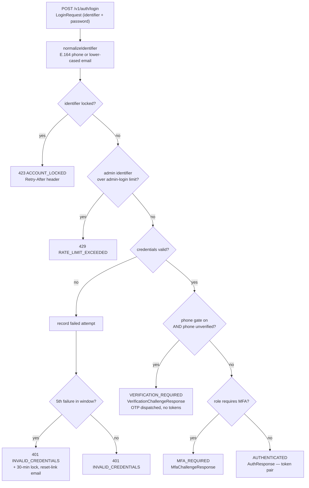
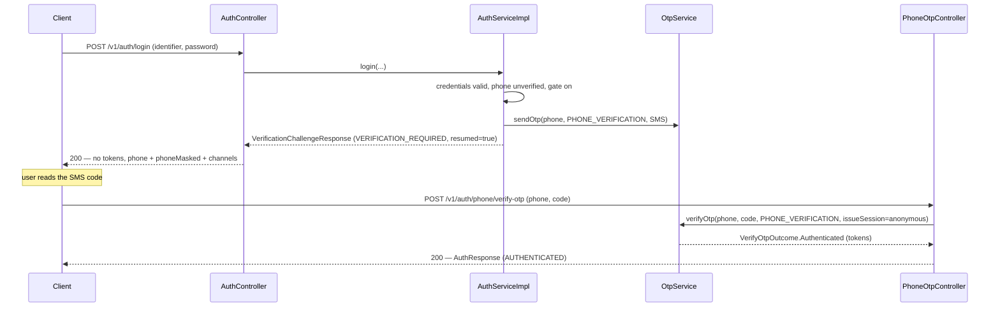

# Login & the phone-verification gate

Password login is the workhorse identity path: a caller presents an identifier and a password, and `POST /v1/auth/login` either mints a token pair or hands back a challenge. This page covers that flow end to end — how the identifier is normalized, the ordered set of gates a credential-validated request runs through, every failure branch and its HTTP shape, the Redis-backed account-lockout machinery, and the **phone-verification gate**: the arc where a user with valid credentials but an unverified phone is sent to verify by OTP before any token is issued.

Login is polymorphic. A single call returns one of three `LoginResponse` variants keyed by a stable `outcome` discriminator, so clients switch on one field instead of sniffing for `accessToken`. This page owns two of them — `AUTHENTICATED` (tokens) and `VERIFICATION_REQUIRED` (the phone gate). The third, `MFA_REQUIRED`, belongs to [Admin login & MFA](admin-login-and-mfa.md). OTP internals — generation, hashing, TTL, SMS/voice routing — are owned by [OTP & password recovery](otp-and-password-recovery.md); this page references OTP by its use.

## Password login end to end

`POST /v1/auth/login` takes a `LoginRequest` — an `identifier` (email or E.164 phone) and a `password`, both `@NotBlank`. `AuthController#login` extracts the `User-Agent` and client IP for session and audit context, delegates to `AuthServiceImpl#login`, and wraps the polymorphic result in the `ApiResponse<T>` envelope.

### Resolving the identifier

Before anything else, `normalizeIdentifier` folds the raw identifier into a single canonical form: a phone-shaped input is normalized to E.164 via `PhoneNumberNormalizer`; everything else is treated as an email and trimmed + lower-cased. This one canonical string is what every downstream store keys on — the lockout buckets, the admin-login rate-limit bucket, the audit log, and the `UserDetailsService` principal lookup (`findByEmailOrPhone`). Folding case everywhere is a hardening measure: without it an attacker could rotate the letter-case of an email (`Admin@Test.com` vs `ADMIN@test.com`) to reset a per-bucket counter such as the admin-login limit.

### The gate order

`AuthServiceImpl#login` runs an ordered sequence of gates. The order is load-bearing: lockout and rate-limit checks run **before** credentials are ever tested, and the phone-verification gate runs **before** the MFA check.



1. **Lockout** (`rejectIfLocked`). If the identifier is inside its temporary lockout window, login throws `AccountLockedException` immediately — no credential check runs. It audits `loginFailedAtGate` with reason `account_locked` and counts a `locked` login outcome.
2. **Admin-login rate limit** (`applyAdminLoginRateLimit`). Applied **only** when the identifier resolves to an existing `ADMIN` account (`looksLikeAdminIdentifier`). The bucket (`admin-login` scope, keyed by identifier) permits 5 attempts per 60 s; a breach throws `RateLimitExceededException`. The mechanics live on [Admin login & MFA](admin-login-and-mfa.md).
3. **Credentials** (`authenticatePrincipal`). Delegates to Spring's `AuthenticationManager`; the resolved principal must be a `CustomUserDetails`. A wrong password (or wrong principal type) throws `BadCredentialsException`, caught below.
4. **Context resolution** (`LoginContextResolver#resolve`). The `LoginContextResponse` is computed regardless of which terminal fires — admin, farm member, buyer member, or dormant.
5. **Phone gate.** If the gate is enabled **and** `user.isPhoneVerified()` is `false`, login short-circuits to a `VerificationChallengeResponse` (`VERIFICATION_REQUIRED`) — described in [The phone-verification gate](#the-phone-verification-gate).
6. **MFA.** If `PermissionResolutionService#mfaRequiredForUser` returns `true`, login returns an `MfaChallengeResponse` (`MFA_REQUIRED`). Owned by [Admin login & MFA](admin-login-and-mfa.md).
7. **Standard success** (`completeStandardLogin`). Clears the lockout counter, mints an access + refresh pair stamped with the resolved context, persists the refresh session, audits `loginSucceeded`, and returns an `AuthResponse` (`AUTHENTICATED`) carrying tokens, the `UserSummary`, the `context`, and the effective `permissions`.

## Failure branches

Failures split into two phases. **Gate-phase** failures fire before the password is ever checked; **post-credential** failures fire after authentication runs. All are audited (the audit shapes are owned by [Audit](../audit/index.md)) and increment the login-attempts meter with an outcome tag.

| Branch | When | Result | HTTP + `errorCode` | Audit event (reason) |
| --- | --- | --- | --- | --- |
| Account locked | Identifier is in its lockout window (checked first) | `AccountLockedException` (carries `Retry-After`) | `423` `ACCOUNT_LOCKED` | `loginFailedAtGate` (`account_locked`) |
| Admin-login rate limit | An admin identifier exceeds 5 attempts / 60 s | `RateLimitExceededException` | `429` `RATE_LIMIT_EXCEEDED` | `loginFailedAtGate` (`admin_login_rate_limited`) |
| Bad credentials | Password wrong, or principal not `CustomUserDetails` | re-thrown `BadCredentialsException` | `401` `INVALID_CREDENTIALS` | `loginFailedBadCredentials`, or `accountLocked` if this failure crosses the threshold |
| Admin phone missing | An MFA-required admin has no phone on file | `AdminPhoneNotConfiguredException` | `409` `ADMIN_PHONE_NOT_CONFIGURED` | `loginFailedWithUser` (`admin_phone_missing`) |

The service-thrown `BadCredentialsException` is a Spring Security type, so it is mapped to `401` `INVALID_CREDENTIALS` by a dedicated safety-net handler in `exception/GlobalExceptionHandler.java` rather than the generic `DomainException` path. The response message is deliberately the generic `"Invalid credentials"` — the same for a wrong password, an unknown identifier, and a wrong principal type — so the failure shape leaks nothing about which accounts exist. The admin-phone-missing branch sits on the MFA path; it appears here for a complete failure catalog and is detailed on [Admin login & MFA](admin-login-and-mfa.md).

### Account lockout

Lockout is Redis-backed and keyed by the **normalized identifier**, implemented in `service/auth/AccountLockoutServiceImpl.java`. Its constants:

| Knob | Value | Meaning |
| --- | --- | --- |
| Max attempts | `5` | Failures before the identifier is locked. |
| Attempt window | `900` s (15 min) | Fixed window; the counter (`auth:lockout:attempts:<identifier>`) TTL is set once on the first failure and not refreshed, so it expires 15 min after that first failure regardless of later attempts. |
| Lockout duration | `1800` s (30 min) | Lock key (`auth:lockout:locked:<identifier>`) TTL once tripped. |

Each bad-credentials attempt calls `recordFailedAttempt(identifier, resolvedUser)`, incrementing the attempt counter. When the count reaches 5 the service writes the lock key (30-min TTL), deletes the attempt counter, and — **only if the identifier resolved to a user with an email on file** — invalidates that user's active `PASSWORD_RESET` tokens, mints a fresh one, and publishes an `AccountLockedEvent` that emails the user a reset link. A successful login of any kind clears both keys via `resetAttempts`.

Two behaviours are worth calling out:

- **The lock takes effect on the *next* attempt.** The 5th failed login still returns `401` `INVALID_CREDENTIALS`; it is the 6th request — caught by `rejectIfLocked` at the top of `#login` — that returns `423` `ACCOUNT_LOCKED` with a `Retry-After` header computed from the lock key's remaining TTL (`AccountLockedException#getRetryAfterSeconds`).
- **`recordFailedAttempt` commits in a `REQUIRES_NEW` transaction.** After it returns, `#login` re-throws `BadCredentialsException` and the outer transaction rolls back. Without the independent inner transaction, the freshly-minted reset token — whose raw value is already inside the queued lockout email — would be erased by that rollback, leaving the user with a dead reset link.

Because the bucket is keyed by identifier, probing a non-existent identifier still trips a lock for that literal string, but no email is sent (the resolved user is `null`). Passwordless phone login checks the same phone-keyed lock bucket.

## The phone-verification gate

The phone gate is the arc where a credential-valid user whose phone is not yet verified must prove control of that phone by OTP before receiving any token. It gates on **phone**, never email — `emailVerified` is informational and never blocks login.

### When the gate fires

Inside `#login`, immediately after credentials pass and the context resolves:

```
if phone-gate enabled AND NOT user.phoneVerified
    -> issueLoginVerificationChallenge
```

`issueLoginVerificationChallenge` dispatches a fresh OTP to the user's phone (purpose `PHONE_VERIFICATION`, channel SMS), audits `loginVerificationRequired` (the `LOGIN_VERIFICATION_REQUIRED` action), and returns a `VerificationChallengeResponse` — **no tokens are minted here**. At login the user always has an existing account, so the challenge always carries `resumed = true` ("resume your unfinished verification"). The same DTO is emitted by `POST /v1/auth/register` with `resumed = false` for a brand-new signup — see [Registration & email verification](registration-and-email-verification.md).

### The challenge payload

`VerificationChallengeResponse` (`outcome = VERIFICATION_REQUIRED`) carries what the FE needs to run the verify screen without re-deriving anything:

| Field | Meaning |
| --- | --- |
| `outcome` | Always `VERIFICATION_REQUIRED`. |
| `phone` | The canonical E.164 phone the OTP was dispatched to — the FE posts this back verbatim to verify. |
| `phoneMasked` | Middle digits obscured (e.g. `+233 24 *** 4544`) for safe display in the screen header. |
| `expiresInSeconds` | TTL of the dispatched OTP. |
| `channelsAvailable` | Channels the FE may offer on a re-send — always includes SMS; adds VOICE only when the Arkesel voice feature is enabled (`resolveAvailableChannels`). |
| `resumed` | `true` at login (resuming an unverified account); `false` for a fresh registration challenge. |

Returning the canonical `phone` is not an enumeration leak: the response is emitted only *after* the password validates, so the caller has already proven they hold the account. The initial login-gate OTP always goes out by **SMS**; `channelsAvailable` merely advertises what a subsequent re-send (`POST /v1/auth/phone/send-otp`) may request.

### Redeeming the OTP into tokens

The challenge is redeemed at `POST /v1/auth/phone/verify-otp` (`PhoneOtpController#verifyOtp`), which is unauthenticated. Whether the redemption mints a session is derived from the Spring Security context, not a request field: an **anonymous** caller completing a first-time `PHONE_VERIFICATION` receives a freshly-minted token pair; any other case (an already-authenticated caller doing a phone-change, or an already-verified phone) returns a bare `{"outcome":"PHONE_VERIFIED"}` envelope with no tokens.



On the token-minting branch the controller maps `VerifyOtpOutcome.Authenticated` straight into the same unified `AuthResponse` (`outcome = AUTHENTICATED`), so a client that just navigated the gate lands on the exact payload it would have received from a clean password login. The OTP-side work — verifying the code against its hash, flipping `phoneVerified`, persisting the refresh session, and the `OTP_VERIFIED` + `LOGIN` audit pair that records the actual session mint — is owned by [OTP & password recovery](otp-and-password-recovery.md).

### The `enabled` flag

The gate is controlled by `cropdoor.auth.phone-gate.enabled`, bound by `service/auth/AuthProperties.java` (`PhoneGate`), and defaults to **`true`**. Setting it to `false` bypasses the gate entirely: a credential-valid user with an unverified phone is issued tokens directly (the pre-spec behaviour). It exists as an **emergency rollback** — a config flip that disables the gate across the fleet without a redeploy — not as a per-request or per-user toggle.

## Passwordless phone login

Distinct from the phone gate is passwordless login, where the OTP *is* the first factor — no password is involved. It lives on the same `PhoneOtpController`:

- `POST /v1/auth/phone/login/send-otp` → `AuthServiceImpl#sendPasswordlessLoginOtp`. Normalizes the phone and dispatches a `LOGIN`-purpose OTP, but **silently no-ops** — returning the same `OtpSentResponse` — when the phone is unknown, belongs to an `ADMIN`, or belongs to a non-`ACTIVE` user, so a caller cannot enumerate accounts.
- `POST /v1/auth/phone/login/verify-otp` → `AuthServiceImpl#loginByPhone`. Rejects `ADMIN` accounts (`PrivilegeEscalationException` — admins must use password + SMS step-up) and non-`ACTIVE` accounts, honours the phone-keyed lockout bucket, verifies the `LOGIN` OTP, resets the attempt counter, mints the token pair, and returns an `AuthResponse`.

This is a separate first-factor channel, not part of the verification gate — but it shares the same OTP dispatch and lockout machinery, and it converges on the same `AuthResponse`.

## Where it lives

| Concern | Source |
| --- | --- |
| Login orchestration + gate fan-out | `service/auth/AuthServiceImpl.java` (`login`, `completeStandardLogin`) |
| Identifier normalization | `AuthServiceImpl#normalizeIdentifier` |
| Lockout + rate-limit gates | `AuthServiceImpl#rejectIfLocked`, `#applyAdminLoginRateLimit`, `#handleBadCredentials` |
| Phone-gate branch | `AuthServiceImpl#issueLoginVerificationChallenge` |
| Passwordless phone login | `AuthServiceImpl#sendPasswordlessLoginOtp`, `#loginByPhone` |
| Login + OTP endpoints | `controller/auth/AuthController.java` (`login`), `controller/auth/PhoneOtpController.java` (`verifyOtp`, `sendOtp`) |
| Account lockout (Redis) | `service/auth/AccountLockoutServiceImpl.java` |
| Phone-gate config flag | `service/auth/AuthProperties.java` (`cropdoor.auth.phone-gate.enabled`) |
| Context resolution | `service/auth/LoginContextResolverImpl.java` |
| Request DTO | `dto/auth/request/LoginRequest.java` |
| Response DTOs + discriminator | `dto/auth/response/LoginResponse.java`, `LoginOutcome.java`, `VerificationChallengeResponse.java`, `OtpSentResponse.java` |
| First-time verify outcome | `service/auth/VerifyOtpOutcome.java` |
| Lockout exception → `423` | `exception/AccountLockedException.java` |
| `BadCredentials` → `401` mapping | `exception/GlobalExceptionHandler.java` |

## See also

- [Authentication overview](index.md) — the login-outcome state machine and the full endpoint surface.
- [Registration & email verification](registration-and-email-verification.md) — where the same `VerificationChallengeResponse` originates for fresh signups (`resumed = false`).
- [Admin login & MFA](admin-login-and-mfa.md) — the `MFA_REQUIRED` branch, the admin-login rate limit, and admin session hardening.
- [OTP & password recovery](otp-and-password-recovery.md) — OTP generation, hashing, TTL, SMS/voice routing, and the reset-link flow the lockout email uses.
- [JWT, sessions & refresh](jwt-sessions-and-refresh.md) — what the minted access + refresh pair carries and how sessions are tracked.
- [Principal model](principal-model.md) — `User` vs `PlatformAdmin` vs `Member`.
- [Audit](../audit/index.md) — where the login-success and login-failure events land.
