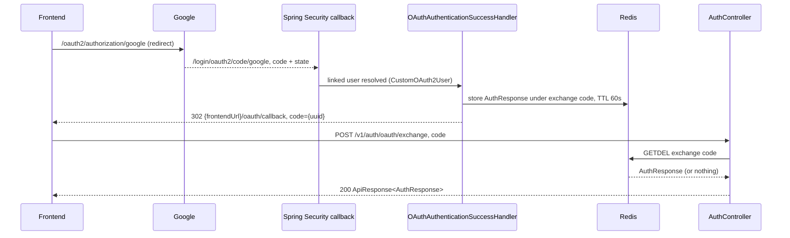
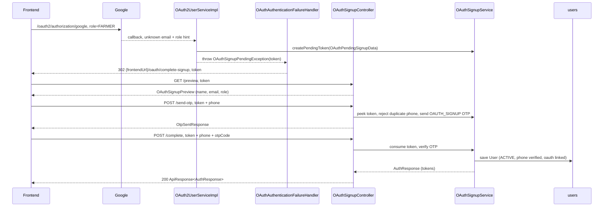

# OAuth (Google)

CropDoor lets a person sign in — or sign up — with their Google account. The heavy lifting rides on Spring Security's `oauth2Login`, but three CropDoor-specific concerns bolt onto it: a **role intent** (`FARMER` vs `BUYER`) has to survive the round trip to Google, a successful login has to converge on the same [`AuthResponse`](index.md) every other path returns, and a brand-new Google identity still has to **verify a phone number** before an account is minted — the same phone-verification discipline the [phone gate](login-and-the-phone-gate.md) enforces on password login, applied up front.

This page walks the whole Google surface: the single callback that fans out into login, signup, or refusal; how the role hint is pinned to the OAuth `state`; the one-time code exchange that hands the browser its tokens; and the phone-verified signup-completion flow driven by `OAuthSignupController`. OTP mechanics themselves live on [OTP & password recovery](otp-and-password-recovery.md); JWT and refresh-token issuance live on [JWT, sessions & refresh](jwt-sessions-and-refresh.md).

## The one callback, four outcomes

Every Google return lands on Spring Security's callback (`/login/oauth2/code/google` — derived from the configured `redirect-uri` template `{baseUrl}/login/oauth2/code/{registrationId}`), which invokes `OAuth2UserServiceImpl#loadUser` — the fork in the road. It loads the Google profile (needs `sub` + `email`, else `invalid_oauth_profile`), lowercases the email, reads any pinned role hint, and branches:

```mermaid
flowchart TD
    A["Google callback → OAuth2UserServiceImpl#loadUser"] --> B{"linked user?<br/>match on (oauth_provider, oauth_provider_id)"}
    B -->|yes| L["LOGIN: return CustomOAuth2User<br/>→ success handler mints tokens"]
    B -->|no| C{"email already on a<br/>local (non-OAuth) account?"}
    C -->|yes| E1["refuse: OAuthLocalAccountExistsException<br/>→ OAUTH_LOCAL_ACCOUNT_EXISTS"]
    C -->|no| D{"role hint present?<br/>(FARMER / BUYER pinned to state)"}
    D -->|no| E2["refuse: OAuthAccountNotRegisteredException<br/>→ OAUTH_ACCOUNT_NOT_REGISTERED"]
    D -->|yes| S["SIGNUP: mint pending-signup token<br/>→ OAuthSignupPendingException<br/>→ FE complete-signup page"]
```

The distinction that matters:

- **Login** is the only outcome where a `User` already exists and is returned. Existing linked account, matched on the `(oauth_provider, oauth_provider_id)` pair — never on email alone.
- **Signup** never creates the `User` here. It stages a snapshot and throws, handing the browser off to the phone-verification flow below. The account is minted only at `POST /v1/auth/oauth/signup/complete`.
- **Refusal** splits by intent so the FE can show accurate copy. An email that already belongs to a **local (password) account** is refused with `OAUTH_LOCAL_ACCOUNT_EXISTS` ("sign in with your password and link Google from settings") — CropDoor never silently auto-links, because an email collision could be an account-takeover attempt. An **unknown** email with **no role hint** (Google clicked from a plain `/login` button, not a role-scoped signup button) is refused with `OAUTH_ACCOUNT_NOT_REGISTERED` — there is nothing to log into and no signal of what kind of account to create. CropDoor never auto-creates a `User` from Google alone, because the `users` schema requires a phone number Google does not supply.

`OAuthService` / `OAuthServiceImpl` are vestigial: `processOAuthUser` throws `UnsupportedOperationException` and `getAuthorizationUrl` just returns the path string. All real resolution lives in `OAuth2UserServiceImpl`.

## Carrying the role intent through the handshake

Google's authorization request has no field for "the user clicked the *Sign up as a farmer* button." CropDoor threads that intent through the OAuth `state` parameter — the one value Spring generates per request and echoes back unchanged on the callback.

The FE starts the flow at `GET /oauth2/authorization/google?role=FARMER` (or `?role=BUYER`). `RoleAwareOAuth2AuthorizationRequestResolver` wraps Spring's default resolver (rooted at the default `/oauth2/authorization` base URI): it reads the `role` query parameter, and on the generated authorization request it stores the role under that request's `state` value in Redis via `OAuthRoleStateStore#store`. Two guardrails apply:

- **`ADMIN` is refused.** A `?role=ADMIN` is logged as a privilege-escalation attempt and dropped — you can never mint an admin through Google. (Belt and suspenders: signup completion re-checks and throws `PrivilegeEscalationException` if the role is `ADMIN`.)
- **Role never reaches Google.** It is stashed server-side keyed by `state`, *not* added to `getAdditionalParameters()` — Spring forwards those to the provider, and Google would reject an unrecognized parameter.

On the callback, `OAuth2UserServiceImpl#readRolePending` pulls the `state` parameter back off the request and calls `OAuthRoleStateStore#consume`, which does an atomic read-and-delete (`GETDEL`) — the hint is single-use. No hint means the sign-in flow (login), not sign-up. If the servlet request context is absent, it safely defaults to "no hint."

Three short-lived Redis stashes underpin the whole surface, each single-use:

| Redis key | Holds | TTL | Written by | Consumed by |
| --- | --- | --- | --- | --- |
| `oauth-pending-role:{state}` | `FARMER` / `BUYER` role hint | 10 min (`app.oauth.role-state-ttl-seconds`, default `600`) | `RoleAwareOAuth2AuthorizationRequestResolver` | `OAuth2UserServiceImpl#readRolePending` (read-and-delete) |
| `oauth-pending-signup:{token}` | `OAuthPendingSignupData` JSON (Google profile + role) | 10 min (`app.oauth.signup-pending-ttl-seconds`, default `600`) | `OAuth2UserServiceImpl` (on the signup branch) | preview / send-otp *peek*; complete *consumes* |
| `auth:oauth-exchange:{code}` | serialized `AuthResponse` | 60 s (`app.oauth.exchange-ttl-seconds`, default `60`) | `OAuthAuthenticationSuccessHandler` | `POST /v1/auth/oauth/exchange` (read-and-delete) |

## OAuth login: success handler and the code exchange

When `loadUser` returns a linked user, Spring wraps it in `CustomOAuth2User` (which carries the local `User` plus the raw Google attributes) and fires `OAuthAuthenticationSuccessHandler`. That handler cannot simply reply with JSON — it is terminating a browser redirect, so it hands the payload off through a one-time code:

1. Resolve the `LoginContextResponse` (`LoginContextResolver`), mint an access JWT + refresh token (`JwtProvider`), and persist the refresh token (`RefreshTokenService`) with the User-Agent + client IP.
2. Build the unified `AuthResponse` (`outcome = AUTHENTICATED`, tokens, `UserSummary`, context, effective permission codes).
3. Store that `AuthResponse` under a random UUID exchange code in Redis for 60 seconds (`OAuthExchangeService#storeCode`).
4. Emit the login audit and 302 the browser to `{app.frontend.url}/oauth/callback?code={uuid}`.

The frontend, now back on its own origin, swaps the opaque code for the real payload:

`POST /v1/auth/oauth/exchange` takes `OAuthExchangeRequest` (`{ "code": ... }`) and calls `OAuthExchangeService#exchange`, which does an atomic `GETDEL`. The code is **single-use and short-lived**: a missing, expired, or already-redeemed code throws `OAuthCodeInvalidException` → HTTP 401 `OAUTH_CODE_INVALID`. This keeps tokens out of the redirect URL (and out of browser history / referrer logs) while still delivering them to a pure-JSON client. The endpoint is unauthenticated — no session exists yet.

## OAuth signup: phone verification before the account exists

A Google identity is not enough to open a CropDoor account — the schema demands a verified phone. So the signup branch stages the Google profile and forces a phone-OTP round trip before any `User` row is written.

On the signup branch, `loadUser` builds an `OAuthPendingSignupData` snapshot (provider, provider `sub`, lowercased email, `given_name` / `family_name` / `name`, `picture`, whether Google reported `email_verified`, and the pinned role), stores it under a pending-signup token (`OAuthSignupService#createPendingToken`, 10-min TTL), and throws `OAuthSignupPendingException` carrying that token. `OAuthAuthenticationFailureHandler` recognizes this exception (by walking the cause chain) and 302s the browser to `{app.frontend.url}/oauth/complete-signup?token={pendingToken}` — a redirect that looks like a "failure" to Spring Security but is really the start of a second flow.

`OAuthSignupController` (`/v1/auth/oauth/signup`, all endpoints unauthenticated — no session exists yet) drives the rest:

| Method + path | Body | Effect |
| --- | --- | --- |
| `GET /preview` | `?token=` | Non-consuming *peek*; returns `OAuthSignupPreview` (`email`, `firstName`, `lastName`, `displayName`, `picture`, `role`) so the FE renders a "Hi {name}, finish setting up" header. |
| `POST /send-otp` | `OAuthSignupSendOtpRequest` (`token`, `phone`) | Peeks the token, normalizes the phone, rejects a phone already registered, dispatches an `OAUTH_SIGNUP` SMS OTP; returns `OtpSentResponse`. |
| `POST /complete` | `OAuthSignupCompleteRequest` (`token`, `phone`, `otpCode`) | Consumes the token, verifies the OTP, creates the `User`, mints tokens; returns `AuthResponse`. |

The `send-otp` and `preview` calls **peek** (read without delete) so they stay idempotent on retry; only `complete` **consumes** (atomic delete) the pending token, so a single Google signup can never mint two accounts even if `complete` is replayed. End to end:

`OAuthSignupService#complete` is `@Transactional` and does the work in a fixed order: consume the token, refuse an `ADMIN` role (`PrivilegeEscalationException`), reject a duplicate phone (`PhoneAlreadyRegisteredException`, 409 `PHONE_ALREADY_REGISTERED`), verify the OTP, then build the `User`. The new row is stamped `status = ACTIVE`, `oauthProvider` / `oauthProviderId` from Google, `avatarUrl` from the picture, `emailVerifiedAt = now` only if Google reported `email_verified`, and `markPhoneVerified(now)` — so the account lands **already phone-verified** and never trips the phone gate on its first login. Names come from Google's `given_name` / `family_name`, falling back to splitting the display `name`, and finally to `Friend` / `User` placeholders (`NameSplitter`). It then mints the token pair, persists the refresh token, audits, and returns the `AuthResponse` directly — no exchange-code detour is needed here because the FE is already inside a JSON request/response cycle.

A stale, expired, or already-consumed pending token throws `OAuthSignupTokenExpiredException` → HTTP 410 `OAUTH_SIGNUP_TOKEN_EXPIRED`, telling the FE to restart the Google flow.

## Failure redirects

Everything that is not a clean login or a pending signup ends in a redirect to `{app.frontend.url}/oauth-error?code=...`. `OAuthAuthenticationFailureHandler` resolves the code by walking the exception cause chain:

| Redirect `code` | Cause | Meaning for the user |
| --- | --- | --- |
| `OAUTH_LOCAL_ACCOUNT_EXISTS` | `OAuthLocalAccountExistsException` | Email already has a password account — sign in and link from settings. |
| `OAUTH_ACCOUNT_NOT_REGISTERED` | `OAuthAccountNotRegisteredException` | No account and no role intent — go register. |
| `OAUTH_SESSION_EXPIRED` | Spring `authorization_request_not_found` / `invalid_state_parameter` | Stale callback replay (browser back / refresh / prefetch after the `state` was already consumed). |
| `OAUTH_FAILED` | catch-all | Genuine network / provider failure, or an unexpected principal at the success handler. |

These are FE-routing hints carried on a redirect URL — distinct from the `ApiResponse` error codes returned by the JSON endpoints (`OAUTH_CODE_INVALID`, `OAUTH_SIGNUP_TOKEN_EXPIRED`, `PHONE_ALREADY_REGISTERED`).

## Audit

Both OAuth terminals emit through the typed [`AuditEmitter`](../audit/index.md):

- **Login** — `OAuthAuthenticationSuccessHandler` calls `oauthLoginSucceeded(OAuthLoginContext)`, which publishes the standard `LOGIN` action with the device + IP and a `source = "oauth"` discriminator key (an OAuth login is not a distinct action, just a differently-sourced login).
- **Signup** — `OAuthSignupService#complete` calls `oauthSignupCompleted(OAuthSignupContext)`, publishing the dedicated `OAUTH_SIGNUP` action with the `provider`, provider `sub`, and IP alongside the freshly-created user.

## Where it lives

| Concern | Source |
| --- | --- |
| Login-vs-signup-vs-refuse resolution | `service/auth/OAuth2UserServiceImpl.java` (`#loadUser`) |
| Local `User` + Google attributes adapter | `security/oauth/CustomOAuth2User.java` |
| Role hint pinned to OAuth `state` | `security/oauth/RoleAwareOAuth2AuthorizationRequestResolver.java`, `OAuthRoleStateStore.java` |
| Success → tokens → exchange code → FE redirect | `security/oauth/OAuthAuthenticationSuccessHandler.java` |
| Failure → error-code / pending-signup redirect | `security/oauth/OAuthAuthenticationFailureHandler.java` |
| One-time code exchange | `service/auth/OAuthExchangeService.java`, `controller/auth/AuthController.java` (`#exchangeOAuthCode`) |
| Signup completion endpoints | `controller/auth/OAuthSignupController.java` |
| Pending-signup token + user creation | `service/auth/OAuthSignupService.java`, `OAuthPendingSignupData.java` |
| Request / response DTOs | `dto/auth/request/OAuthExchangeRequest.java`, `OAuthSignupSendOtpRequest.java`, `OAuthSignupCompleteRequest.java`, `dto/auth/response/OAuthSignupPreview.java` |
| Vestigial service metadata | `service/auth/OAuthService.java`, `OAuthServiceImpl.java` |
| OAuth2 login wiring (resolver, user service, handlers) | `security/config/SecurityConfig.java` |
| Audit contexts | `service/platform/audit/context/OAuthLoginContext.java`, `OAuthSignupContext.java` |
| Google client + frontend URL config | `spring.security.oauth2.client.registration.google.*`, `app.frontend.url`, `app.oauth.*` (`application.properties`) |

## See also

- [Authentication overview](index.md) — the unified `AuthResponse` and the login-outcome state machine.
- [Login & the phone gate](login-and-the-phone-gate.md) — the phone-verification discipline OAuth signup applies up front.
- [OTP & password recovery](otp-and-password-recovery.md) — how the `OAUTH_SIGNUP` OTP is generated, hashed, and dispatched.
- [JWT, sessions & refresh](jwt-sessions-and-refresh.md) — the token pair the success handler and signup completion mint.
- [Principal model](principal-model.md) — the `User` that a Google identity resolves to or creates.
- [Audit logging](../audit/index.md) — the `LOGIN` (source `oauth`) and `OAUTH_SIGNUP` events.
