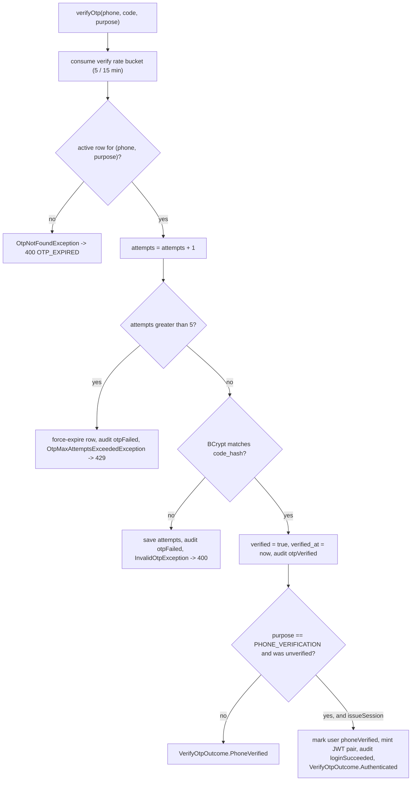
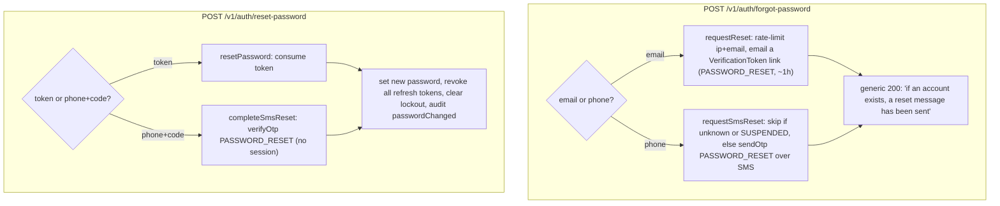

# OTP & password recovery

This page owns two related concerns. First, the **one-time-password (OTP) machinery** — how a six-digit code is generated, hashed, stored, delivered over SMS or voice, rate-limited, verified, and eventually purged. Every OTP-driven flow in the section — phone verification, passwordless login, OAuth signup, admin MFA, and SMS password reset — funnels through the same `OtpService`, so its internals are documented here once and referenced elsewhere by use. Second, **password recovery** — the forgot / reset / change-password endpoints, which share the same anti-enumeration and session-revocation discipline.

If you are looking for the *phone-verification gate* itself (when an unverified phone blocks a login), that arc lives on [Login & the phone gate](login-and-the-phone-gate.md); the *magic-login OTP* dev shortcut is on [Admin login & MFA](admin-login-and-mfa.md). This page explains the code underneath all of them.

## The OTP row: one active code per (phone, purpose)

An OTP is a row in `otp_codes` (`model/user/OtpCode.java`, table shaped by `V27__redesign_otp_codes.sql` and `V29__add_sms_delivery_status_to_otp_codes.sql`). The **raw code is never persisted** — only a BCrypt hash in `code_hash`, produced by the same `PasswordEncoder` bean used for account passwords. Each row is scoped by `purpose` (`model/user/OtpPurpose.java`) and `sent_via` (`model/user/OtpChannel.java`), and bounded by `attempts` and `expires_at`.

The invariant is **at most one active code per `(phone, purpose)`**. Before inserting a fresh code, `OtpServiceImpl#reserveOtpRow` calls `OtpCodeRepository#invalidateActiveCodes`, which sets `expires_at = now` on every prior unverified row for that phone and purpose. Lookups (`OtpCodeRepository#findActiveByPhoneAndPurpose`) then select the newest row where `verified = false` and `expires_at > now`, so a superseded or already-used code can never be presented for verification.

| Constant (`OtpServiceImpl`) | Value | Meaning |
| --- | --- | --- |
| `OTP_LENGTH` | 6 | Digits, drawn one at a time from `SecureRandom`. |
| `OTP_TTL` | 10 minutes | Sets `expires_at`; surfaced to clients as `expiresInSeconds`. |
| `MAX_VERIFY_ATTEMPTS` | 5 | Wrong guesses tolerated before the row is force-expired. |
| `SEND_PER_PHONE_MAX` / window | 5 / hour | Sends per phone number. |
| `SEND_PER_IP_MAX` / window | 10 / hour | Sends per client IP (skipped when IP is null). |
| `VERIFY_PER_PHONE_MAX` / window | 5 / 15 min | Verify attempts per phone number. |

All three buckets go through `ScopedRateLimiter` (`security/ratelimit/ScopedRateLimiter.java`), a Redis `INCR` + conditional `EXPIRE` keyed as `rl:{scope}:{identifier}`. On exhaustion it throws `RateLimitExceededException` (HTTP 429) carrying the key's remaining TTL as `Retry-After`.

## Sending a code: the two-phase dispatch

`OtpServiceImpl#sendOtp` itself runs outside any transaction and brackets the provider HTTP call with two independent committed transactions, invoked through a self-injected `@Lazy OtpService self` proxy so each `@Transactional` method (`reserveOtpRow`, then `recordDispatch`) commits on its own. The provider call sits *between* those two commits, so a delivery-status callback that races back before the send returns can still find a committed row. The source names this the "two-phase send": the two persistence steps are phase 1 and phase 3, with the provider call as the middle step.

```
phase 1  reserveOtpRow      (own tx)  invalidate prior codes, INSERT unverified row, no provider id
phase 2  smsSender.send /   (no tx)   provider HTTP call, returns providerMessageId
         voiceSender.send
phase 3  recordDispatch     (own tx)  attach providerMessageId, set delivery_status = QUEUED
```

Two branches short-circuit before dispatch, both preserving **anti-enumeration** (a caller cannot tell a real send from a no-op):

- **Unknown phone** — no `User` matches the normalized number: the method logs and returns `OtpSendResult.DISPATCHED` (`service/auth/OtpSendResult.java`) without touching the provider.
- **Already verified** — for `PHONE_VERIFICATION` when the resolved user's phone is already verified: returns `OtpSendResult.ALREADY_VERIFIED`, the one case the client is allowed to distinguish (it skips the OTP-entry screen).

There is also the **magic-login** branch: for a seeded phone on the dev allowlist the code becomes a fixed value and dispatch is suppressed. That is a test affordance owned by [Admin login & MFA](admin-login-and-mfa.md).

The controller (`controller/auth/PhoneOtpController.java`) maps the result to `OtpSentResponse` (`dto/auth/response/OtpSentResponse.java`) — `{ expiresInSeconds, alreadyVerified, channel }` — via its `dispatched(...)` or `phoneAlreadyVerified()` factory. `expiresInSeconds` is always derived from `OtpService#getOtpTtl`, so the client's countdown matches the server's `expires_at`.

## Verifying a code

`OtpServiceImpl#verifyOtp` (single `@Transactional`) increments `attempts` first, then decides:



The two outcomes are a sealed type, `service/auth/VerifyOtpOutcome.java`:

- **`Authenticated`** — only when an *anonymous* caller completes first-time `PHONE_VERIFICATION`. `OtpServiceImpl#mintSession` mirrors the normal login token-mint (access + refresh token, persisted refresh row, `LOGIN_SUCCEEDED` audit with `LoginVia.PHONE_VERIFICATION`), and the controller projects it to the section's standard `AuthResponse`.
- **`PhoneVerified`** — every other case (already-authenticated caller, non-`PHONE_VERIFICATION` purpose such as `PASSWORD_RESET`). No session is minted; the controller returns a `{ "outcome": "PHONE_VERIFIED" }` envelope.

Whether to issue a session is decided by the controller from the Spring Security context (`PhoneOtpController#isAnonymous`), never trusted from the request body. The audit actions this path emits (`OTP_SENT`, `OTP_VERIFIED`, `OTP_FAILED`, `PHONE_VERIFIED`) are covered in [Audit](../audit/index.md).

### Purposes and their callers

`OtpPurpose` scopes the rate-limit keys, the SMS template, and the lookup. This page owns the mechanics; each caller flow is documented on its own page.

| Purpose | Triggered by | Detailed on |
| --- | --- | --- |
| `PHONE_VERIFICATION` | `POST /v1/auth/phone/send-otp` → `.../verify-otp` | [Login & the phone gate](login-and-the-phone-gate.md) |
| `LOGIN` | passwordless login and admin-MFA step-up | [Login & the phone gate](login-and-the-phone-gate.md), [Admin login & MFA](admin-login-and-mfa.md) |
| `OAUTH_SIGNUP` | Google signup completion | [OAuth](oauth.md) |
| `PASSWORD_RESET` | `POST /v1/auth/forgot-password` (phone branch) | this page, below |
| `PHONE_CHANGE` | reserved, not wired | — |

## Channel routing: SMS vs voice

`sendOtp` switches on `OtpChannel` and delegates to one of two provider-agnostic senders. The active bean per channel is selected at boot by configuration property, so a deployment is either live or noop but never both.

| Channel | Interface | Live bean | Noop bean | Selector |
| --- | --- | --- | --- | --- |
| SMS | `SmsSender` | `ArkeselSmsSender` | `NoopSmsSender` | `cropdoor.sms.provider` (`arkesel` default, `noop` for dev/tests) |
| Voice | `VoiceSender` | `ArkeselVoiceSender` | `NoopVoiceSender` | `cropdoor.sms.arkesel.voice.enabled` (`false` default) |

**SMS.** `ArkeselSmsSender` (`service/notification/sms/ArkeselSmsSender.java`) posts to the Arkesel SMS v2 API with the recipient's MSISDN stripped of its leading `+`. The message body comes from `messages.properties` keyed by purpose (e.g. `sms.otp.password-reset`), so copy lives in one place. On any provider or transport failure it throws `SmsSendException`; on success it returns a `SendResult` carrying the provider message id (only when the delivery callback feature is enabled). `NoopSmsSender` logs a suffix-masked line at DEBUG and returns a random id — the recommended local/test setup so no Arkesel credits are spent. The `noop` kill switch is the real off-switch, not a credentials trick.

**Voice.** `voiceBodyFor` builds a TTS-friendly script that spaces each digit and repeats the code. The live `ArkeselVoiceSender` is **scaffolding that must not be enabled** — its class Javadoc is explicit that it was built against an inferred wire format that does not match Arkesel's real unified OTP endpoint (`/api/otp/generate`, which owns code generation and verification itself, a different model from the SMS "dumb pipe"). Because the default is `voice.enabled = false`, `NoopVoiceSender` is wired and no provider call is ever made; flipping the flag on in production would fail at runtime. Voice fallback is a deliberate follow-up. A live-path failure surfaces as `VoiceChannelUnavailableException`.

### Delivery-status callbacks (SMS)

When the Arkesel callback feature is enabled, each send includes a `callback_url` of `/v1/webhooks/arkesel/sms/<path-secret>` (`controller/webhook/ArkeselWebhookController.java`). Inbound status updates land in `SmsDeliveryService#recordCallback` (`service/notification/sms/SmsDeliveryService.java`), which performs a **terminal-protected update** (`OtpCodeRepository#updateDeliveryStatusIfNotTerminal`): once a row reaches `DELIVERED`, `NOT_DELIVERED`, `EXPIRED`, or `PROHIBITED`, later callbacks are ignored. Fresh callbacks emit a tagged counter and, for terminal states, a send-to-terminal latency timer. Unknown message ids (pre-commit races or adversarial guesses) are silently logged and dropped. The row's `delivery_status` / `delivery_status_updated_at` columns record the latest state.

## Retention & cleanup

`OtpServiceImpl#cleanupOtpCodes` runs daily at `03:30` (`@Scheduled(cron = "0 30 3 * * *")`). It **redacts** rows expired more than 7 days ago — nulling `phone`, `code_hash`, and the `user` association while keeping the row for analytics (`OtpCodeRepository#redactExpiredForRetention`) — and **hard-deletes** rows expired more than 90 days ago (`#deleteExpiredForRetention`). The 3:30 slot is intentionally before the 4:00 unverified-user purge described on [Principal model](principal-model.md).

## Password recovery

Three endpoints, all on `AuthController`. Forgot/reset are unauthenticated and dual-channel; change-password is authenticated. Every branch that could reveal whether an identifier exists runs a **dummy BCrypt** to equalise latency and returns the same generic message.



**Forgot password** — `POST /v1/auth/forgot-password`, body `ForgotPasswordRequest`. An `@AssertTrue` on the DTO enforces **exactly one** of `email` or `phone`. The email branch (`PasswordResetServiceImpl#requestReset`) applies per-IP and per-email limits (10/hour each), then issues a `VerificationToken` of purpose `PASSWORD_RESET` (`app.token.reset-expiry-hours`, default 1) and publishes a `PasswordResetRequestedEvent` that sends the reset-link email. The phone branch (`#requestSmsReset`) normalizes the number, silently skips unknown *and* `SUSPENDED` accounts, and otherwise delegates to `OtpService#sendOtp` (whose own per-phone/per-IP limits apply). Both branches always return 200 with the same message.

**Reset password** — `POST /v1/auth/reset-password`, body `ResetPasswordRequest`, which `@AssertTrue`-enforces **either** a `token` **or** a `phone + code` pair (plus a `@ValidPassword newPassword`). The token branch (`#resetPassword`) consumes the `VerificationToken`; the SMS branch (`#completeSmsReset`) re-normalizes the phone, rejects unknown/suspended accounts, and calls `OtpService#verifyOtp` with `issueSession = false` — a reset never mints a session, so the user must log in with the new password. Both branches set the new hash, clear `passwordResetRequired`, **revoke every active refresh token** ([JWT, sessions & refresh](jwt-sessions-and-refresh.md)), clear account-lockout state on all of the user's identifiers, and audit `passwordChanged`.

**Change password** — `POST /v1/auth/change-password`, authenticated, body `ChangePasswordRequest` (`currentPassword` + `@ValidPassword newPassword`). `AuthServiceImpl#changePassword` verifies the current password and throws `BadCredentialsException` (HTTP 401) on mismatch, then sets the new hash, clears `passwordResetRequired`, and revokes all refresh tokens so every other session is logged out. It is annotated `@Audited(PASSWORD_CHANGE)`.

Clearing the lockout on reset is deliberate: being locked out is the most common reason a user resets in the first place, so leaving the lockout in place would make the new password appear not to work until the TTL elapsed.

## Failure modes

Every client-reachable failure is a `DomainException` mapped from its `ErrorCode` (`dto/ErrorCode.java`); frontends branch on `errorCode`, never the message.

| Condition | Exception | `errorCode` | HTTP | Notes |
| --- | --- | --- | --- | --- |
| No active code for phone+purpose | `OtpNotFoundException` | `OTP_EXPIRED` | 400 | Covers expired, never-sent, or already-used. |
| Wrong code (within attempt cap) | `InvalidOtpException` | `INVALID_OTP` | 400 | Increments `attempts`. |
| 6th wrong attempt | `OtpMaxAttemptsExceededException` | `OTP_MAX_ATTEMPTS` | 429 | Force-expires the row. |
| Send / verify bucket exhausted | `RateLimitExceededException` | `RATE_LIMIT_EXCEEDED` | 429 | `Retry-After` = key TTL. |
| SMS provider failure | `SmsSendException` | `SMS_SEND_FAILED` | 503 | `Retry-After: 60`; provider detail logged, not echoed. |
| Voice provider failure | `VoiceChannelUnavailableException` | `VOICE_CHANNEL_UNAVAILABLE` | 503 | Scaffolding path only. |
| Bad/expired reset token, or bad SMS-reset phone/code | `InvalidVerificationTokenException` | `INVALID_VERIFICATION_TOKEN` | 400 | Uniform message avoids enumeration. |
| New password fails policy | (bean validation) | `WEAK_PASSWORD` | 400 | From `@ValidPassword`. |
| Wrong current password (change) | `BadCredentialsException` | — | 401 | Framework-handled. |

## Where it lives

| Concern | Source |
| --- | --- |
| OTP contract (send / verify / TTL / cleanup) | `service/auth/OtpService.java` |
| OTP implementation, generation, hashing, dispatch | `service/auth/OtpServiceImpl.java` |
| Send / verify result types | `service/auth/OtpSendResult.java`, `service/auth/VerifyOtpOutcome.java` |
| OTP entity + storage | `model/user/OtpCode.java`, `V27__redesign_otp_codes.sql`, `V29__add_sms_delivery_status_to_otp_codes.sql` |
| Purpose / channel enums | `model/user/OtpPurpose.java`, `model/user/OtpChannel.java` |
| One-active-code + retention queries | `repository/user/OtpCodeRepository.java` |
| Phone-OTP endpoints + response DTO | `controller/auth/PhoneOtpController.java`, `dto/auth/response/OtpSentResponse.java` |
| SMS dispatch (live / noop / config) | `service/notification/sms/ArkeselSmsSender.java`, `NoopSmsSender.java`, `SmsProperties.java` |
| SMS delivery callbacks | `service/notification/sms/SmsDeliveryService.java`, `controller/webhook/ArkeselWebhookController.java` |
| Voice dispatch (scaffolding / noop) | `service/notification/voice/ArkeselVoiceSender.java`, `NoopVoiceSender.java` |
| Rate limiting | `security/ratelimit/ScopedRateLimiter.java` |
| Password recovery contract + impl | `service/auth/PasswordResetService.java`, `PasswordResetServiceImpl.java` |
| Password endpoints | `controller/auth/AuthController.java` (`/forgot-password`, `/reset-password`, `/change-password`) |
| Change-password logic | `service/auth/AuthServiceImpl.java` (`#changePassword`) |
| Recovery / OTP DTOs | `dto/auth/request/` — `ForgotPasswordRequest`, `ResetPasswordRequest`, `ChangePasswordRequest`, `SendOtpRequest`, `VerifyOtpRequest` |
| Error codes | `dto/ErrorCode.java` |

## See also

- [Login & the phone gate](login-and-the-phone-gate.md) — the phone-verification gate and passwordless login that consume `PHONE_VERIFICATION` / `LOGIN` OTPs
- [Admin login & MFA](admin-login-and-mfa.md) — admin MFA step-up and the magic-login OTP dev shortcut
- [OAuth](oauth.md) — the `OAUTH_SIGNUP` OTP in the Google signup completion flow
- [JWT, sessions & refresh](jwt-sessions-and-refresh.md) — the refresh tokens that reset and change-password revoke
- [Registration & email verification](registration-and-email-verification.md) — the sibling email-token flow that reuses `VerificationToken`
- [Auth overview](index.md) — identity surfaces and the login-outcome state machine
- [Audit](../audit/index.md) — the `OTP_SENT` / `OTP_VERIFIED` / `PHONE_VERIFIED` / `PASSWORD_CHANGE` audit events
