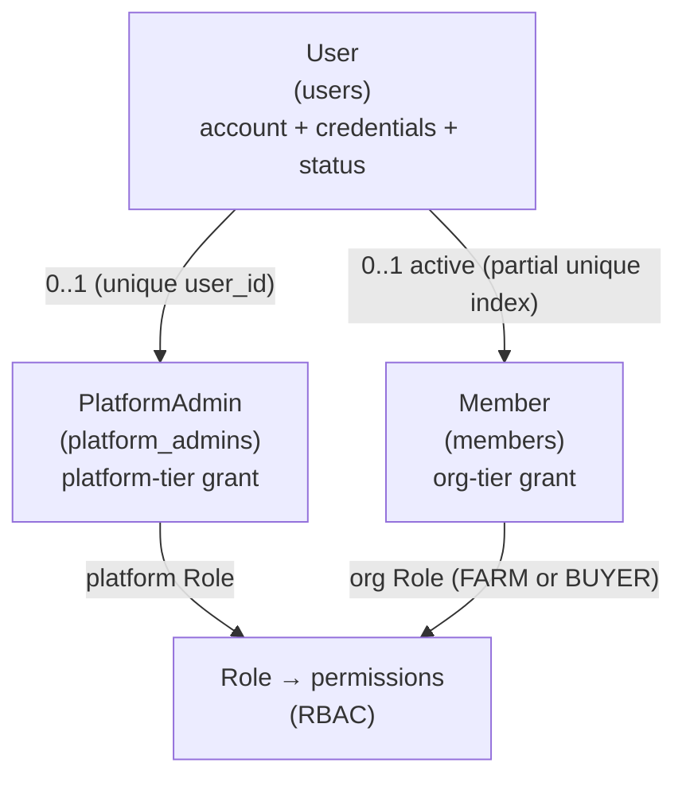
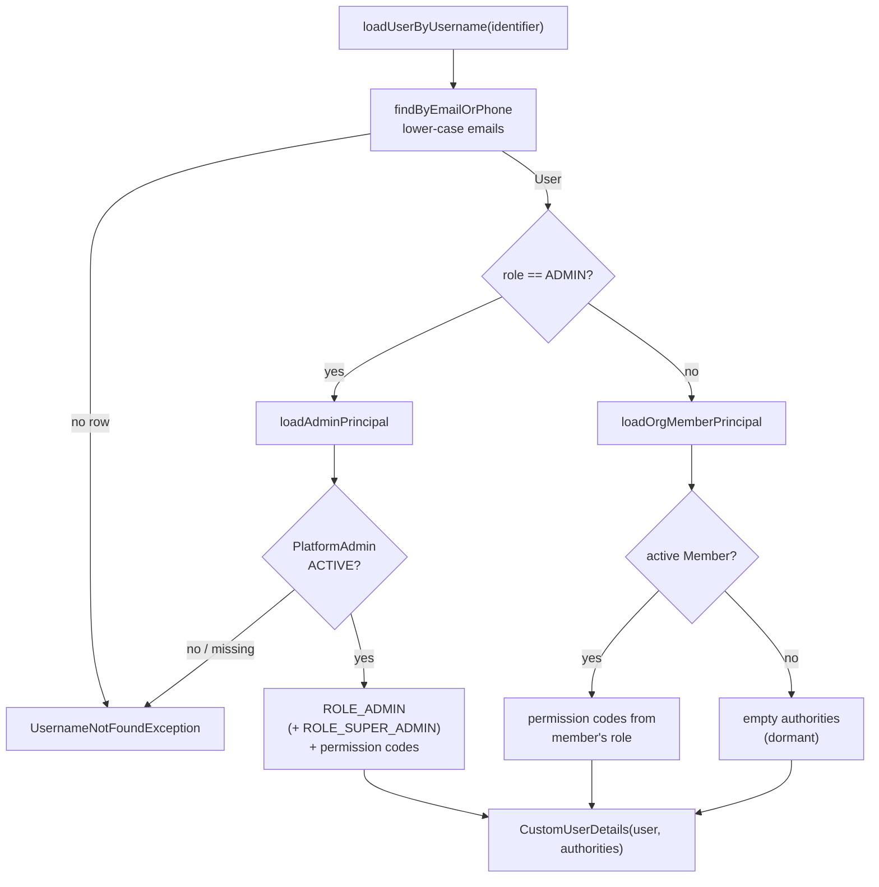

# The principal model

CropDoor represents "who is acting" with **three separate entities**, not one merged principal. A `User` is the account and credential holder. A `PlatformAdmin` is a grant that attaches a user to the platform-admin RBAC tier. A `Member` is a membership that attaches a user to one farm or buyer organization's RBAC tier. Every authenticated request carries exactly one `User`, and at request time that user resolves — through `CustomUserDetailsService` — into the authorities of whichever grant applies.

This page explains the three entities, why they stay distinct, the `User` status lifecycle, how a login identifier becomes a `CustomUserDetails` principal, and the scheduled purge that reclaims never-verified accounts. Authority *contents* (which permission codes each grant carries, how they gate endpoints) belong to [RBAC](../rbac/index.md); how those authorities ride inside a token belongs to [JWT & sessions](jwt-sessions-and-refresh.md). This page is about the identity shape underneath both.

## Three entities, three concepts

| Entity | Table | Models | Cardinality vs `User` |
| --- | --- | --- | --- |
| `User` (`model/user/User.java`) | `users` | The account: name, `phone`, optional `email`, `passwordHash`, `role` (`UserType`), `status`, verification flags | one row per person |
| `PlatformAdmin` (`model/rbac/PlatformAdmin.java`) | `platform_admins` | A platform-admin assignment: links the user to a platform `Role` and tracks the invite/accept/suspend lifecycle | at most one (`user_id` is `unique`) |
| `Member` (`model/rbac/Member.java`) | `members` | An org membership: links the user to a `Role` scoped to one `owner_type` + `owner_id` (a farm or buyer org) | at most one *active* (partial unique index) |

### Why not merge them

The three are deliberately kept apart because they answer different questions, and merging them would force one of the answers to lie:

- **`User` is an account; a grant is not.** A user exists and can authenticate the moment they register, before they are an admin of anything or a member of any org. Credentials, verification state, and the login lifecycle live on `User` and have nothing to do with any grant.
- **A platform-admin grant is not an org membership.** `PlatformAdmin` carries an invite lifecycle (`INVITED → ACTIVE ↔ SUSPENDED → REVOKED`, plus `EXPIRED`), an `invitedBy`, and a platform-scoped `Role`. `Member` carries a *different* lifecycle (`PENDING → ACTIVE`, `REVOKED`, `EXPIRED`, `ORG_DELETED`), an `ownerType`/`ownerId` pointing at a specific org, and an org-scoped `Role`. Squashing them would need a nullable `owner_type` that is meaningful for one kind of grant and meaningless for the other.
- **The cardinalities differ.** A user has at most one platform-admin row (enforced by a unique `user_id` column), but the *reason* a user has at most one active membership is a separate, org-tier rule (below). Different invariants, different tables.

These entities look duplicated but are not — the split is intentional and load-bearing. Do not propose collapsing them into a single `OrgMembership`-style principal.



### One org per user

A user may belong to at most one organization at a time. This is enforced in the database by a **partial unique index** on `members(user_id) WHERE status IN ('PENDING','ACTIVE')`, created in `V32__org_member_lifecycle.sql` as `uq_members_user_active`. `MemberRepository#findActiveByUser` reads exactly that window — it returns the single `PENDING`-or-`ACTIVE` `Member` for a user, if any. `REVOKED`, `EXPIRED`, and `ORG_DELETED` rows fall outside the index, so a user whose membership ended can be invited into a new org without colliding with the historical row. See [RBAC](../rbac/index.md) for how org roles and permissions are structured.

## `UserType` — the account's kind

`model/user/UserType.java` tags every account with one of:

| `UserType` | Meaning |
| --- | --- |
| `FARMER` | Lists and sells produce; owns a farm org |
| `BUYER` | Purchases produce; owns a buyer org |
| `DRIVER` | Handles order deliveries |
| `ADMIN` | A platform administrator — the *only* type resolved against `PlatformAdmin` |
| `STAFF` | A user whose whole platform identity is an org membership; has no farm or buyer profile of their own |

`UserType` is a coarse routing tag, not the authorization source. The only place it forks resolution is `ADMIN` (which sends the user down the platform-admin path); everyone else resolves as an org member. A `STAFF` user with no active `Member` is **dormant**: they can authenticate, but every org-scoped endpoint denies them (covered below).

## `UserStatus` — the account lifecycle

`model/user/UserStatus.java` has three states, and `CustomUserDetails#isEnabled()` returns `true` only for `ACTIVE` — so `PENDING` and `SUSPENDED` accounts fail Spring Security's enabled check.

```
PENDING  → ACTIVE      (invite accepted / registration completed)
ACTIVE   → SUSPENDED   (admin action)
```

| Status | How a user reaches it |
| --- | --- |
| `PENDING` | The entity default, and the state of a **placeholder account** minted by an invite — `AdminInviteServiceImpl` and `OrgMemberInviteService` create the invitee row as `PENDING` for someone who has not yet completed acceptance. |
| `ACTIVE` | The normal operational state. Self-registration writes `ACTIVE` directly (`AuthServiceImpl#createFreshUserAndChallenge`), as do OAuth signup, waitlist claim, and invite acceptance (`invitee.setStatus(ACTIVE)`). |
| `SUSPENDED` | Set by an admin via `AdminUserServiceImpl` (`PLATFORM::USER::SUSPEND`), which also revokes all of the target's refresh tokens. A suspended user cannot log in and `PasswordResetServiceImpl` refuses their reset/forgot flows. |

Two clarifications matter here:

- **Account status is not the verification gate.** Self-registration creates the row as `ACTIVE` with `phoneVerified = false`; the login-time restriction on unverified users comes from the phone flag, not from `status`. See [Login & the phone gate](login-and-the-phone-gate.md) for that arc. The `emailVerifiedAt` and `phoneVerifiedAt` timestamps track verification independently of `status`.
- **`PENDING` is mostly an invite placeholder.** Because the self-signup path skips straight to `ACTIVE`, the `PENDING` state you see in production is almost always an invited account that has not yet been claimed.

## Resolving a login to a principal

Spring Security calls `CustomUserDetailsService#loadUserByUsername(identifier)` on the login attempt *and again on every authenticated request* (the JWT filter re-loads by subject). It is the single source of truth for `@PreAuthorize` authorities. The identifier may be an email or a phone number; emails are lower-cased, and the user is fetched with `findByEmailOrPhone(identifier, identifier)` so either form round-trips.

Resolution forks on `UserType`:



- **Admin path (`loadAdminPrincipal`).** Loads the `PlatformAdmin` by `user_id`; if it is missing or not `ACTIVE`, resolution fails with `UsernameNotFoundException` (a suspended/revoked admin cannot authenticate). An active admin always gets `ROLE_ADMIN`; a `SUPER_ADMIN` additionally gets `ROLE_SUPER_ADMIN` and the *entire* `PLATFORM` permission catalog, while other admins get the permission codes granted to their specific role.
- **Org-member path (`loadOrgMemberPrincipal`).** Looks up the active `Member` via `findActiveByUser`. If present, the principal carries the bare permission codes from that membership's role. If absent — a dormant user — the principal is built with an **empty authorities list**.

The resulting `CustomUserDetails` (`security/CustomUserDetails.java`) wraps the `User` and the resolved authorities. Its `getUsername()` returns email when present, otherwise phone, so phone-only accounts still produce a non-null JWT subject. Note the one-arg `CustomUserDetails(User)` convenience constructor grants a single decorative `ROLE_<UserType>` authority and is used only at token-mint sites (login, refresh, OAuth callback) where authorities are not consulted — it is never the principal a request is authorized against. The specific permission codes and how `@PreAuthorize` reads them are documented in [RBAC](../rbac/index.md).

### Dormant staff

A `STAFF` user whose last membership was revoked, expired, or whose org was soft-deleted resolves through the org path to an **empty-authorities** principal. They can log in and read their own profile, but every `hasAuthority(...)` gate fails, so org-scoped endpoints return `403`. The intended client-facing signal is the `STAFF_DORMANT_NO_MEMBERSHIP` error code (`dto/ErrorCode.java`), and `exception/StaffDormantException.java` exists to carry it. The *structural* denial — the empty authority set — is what actually blocks the request today.

The same three entities also drive the post-login **login context**: `LoginContextResolverImpl` returns a `LoginContextType` of `PLATFORM_ADMIN`, `FARM_MEMBER`, `BUYER_MEMBER`, or `DORMANT` (an active `PlatformAdmin` outranks an active `Member`). That resolution and its response shape live on the [login](login-and-the-phone-gate.md) and [admin login](admin-login-and-mfa.md) pages.

## The unverified-user purge

Registration creates a row with `phoneVerified = false` and holds the `users.phone` unique slot. If the phone is never verified, that slot would be pinned forever — a problem when carriers reassign numbers. `job/UnverifiedUserCleanupService.java` reclaims it.

- **Schedule.** A daily cron at `04:00` (`@Scheduled(cron = "0 0 4 * * *")`), deliberately 30 minutes after OTP cleanup so cascade-deleted `otp_codes` are already redacted.
- **Eligibility.** `UserRepository#findPurgeableUnverifiedUsers` selects users with `phoneVerified = false` and `createdAt` older than a **7-day** TTL, excluding anyone with a `PlatformAdmin` row. The query is backed by the partial index `idx_users_unverified_created` from `V49__add_partial_index_unverified_users.sql`.
- **Per user.** The job emits a `UNVERIFIED_USER_PURGED` audit row (with a masked phone), NULLs the audit-log `user_id` references to preserve forensic value ([Audit](../audit/index.md)), defensively deletes any lingering `members` rows, then hard-deletes the `User`. The delete cascades to `refresh_tokens`, `otp_codes`, `verification_tokens`, and the profile tables via `ON DELETE CASCADE`.

Because the filter is the `phoneVerified` flag — not `UserStatus` — an `ACTIVE`-but-unverified account is still purgeable; conversely, once a user verifies their phone they are permanently out of the job's reach.

## Where it lives

| Concern | Source |
| --- | --- |
| Account entity, name/phone/email, verification flags | `model/user/User.java` |
| Account kinds | `model/user/UserType.java` |
| Account status lifecycle | `model/user/UserStatus.java` |
| Platform-admin grant + its lifecycle | `model/rbac/PlatformAdmin.java`, `model/rbac/PlatformAdminStatus.java` |
| Org membership + its lifecycle | `model/rbac/Member.java`, `model/rbac/MemberStatus.java` |
| Org scope discriminator | `model/common/OwnerType.java` |
| One-active-membership query | `MemberRepository#findActiveByUser` |
| One-org partial unique index | `V32__org_member_lifecycle.sql` (`uq_members_user_active`) |
| Identifier → principal resolution | `security/CustomUserDetailsService.java` (`#loadUserByUsername`) |
| The principal wrapper | `security/CustomUserDetails.java` |
| Login-context resolution | `service/auth/LoginContextResolverImpl.java`, `dto/auth/response/LoginContextType.java` |
| Dormant-staff signal | `exception/StaffDormantException.java`, `STAFF_DORMANT_NO_MEMBERSHIP` in `dto/ErrorCode.java` |
| Unverified purge job + query + index | `job/UnverifiedUserCleanupService.java`, `UserRepository#findPurgeableUnverifiedUsers`, `V49__add_partial_index_unverified_users.sql` |
| Admin suspend action | `service/admin/AdminUserServiceImpl.java` |

## See also

- [Auth overview](index.md) — identity surfaces and the login-outcome state machine
- [Login & the phone gate](login-and-the-phone-gate.md) — password login, lockout, phone-verification gate
- [Admin login & MFA](admin-login-and-mfa.md) — the two-phase admin path that consumes `PlatformAdmin`
- [Registration & email verification](registration-and-email-verification.md) — how `User` rows are created
- [JWT, sessions & refresh](jwt-sessions-and-refresh.md) — how the resolved principal becomes a token
- [RBAC](../rbac/index.md) — platform and org role/permission tiers
- [Audit](../audit/index.md) — the audit feed the purge and suspend actions write to
