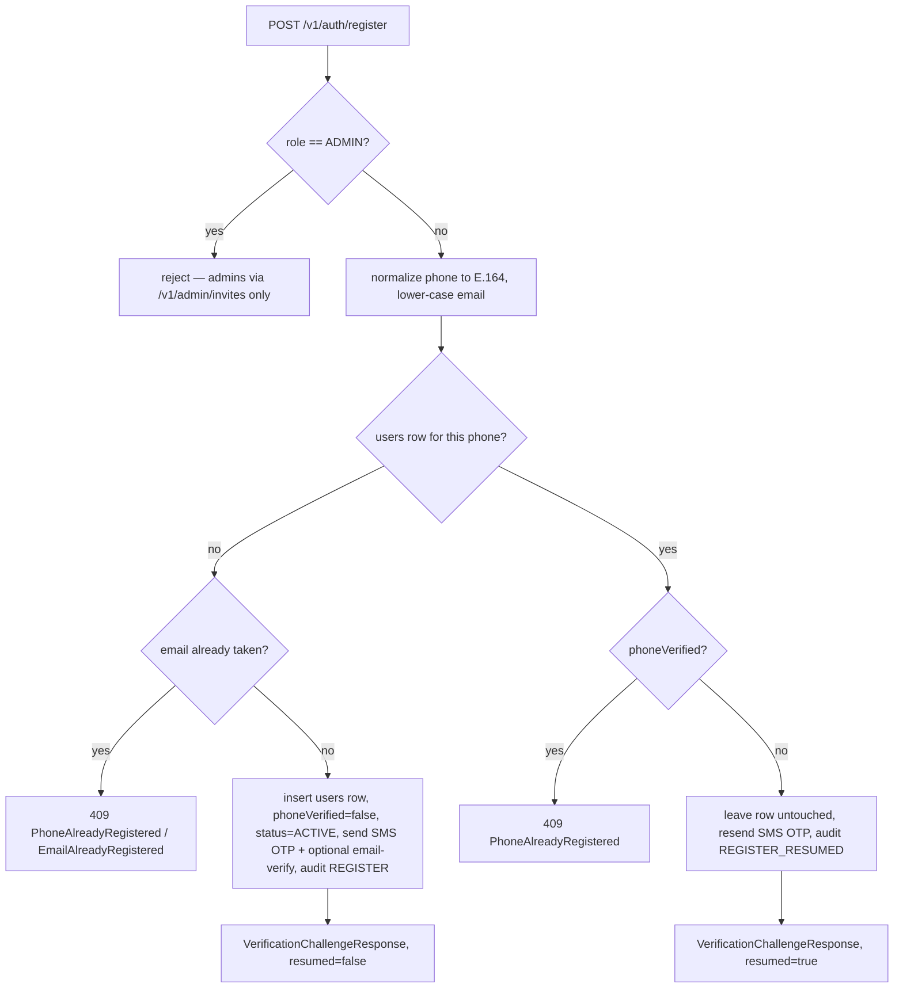
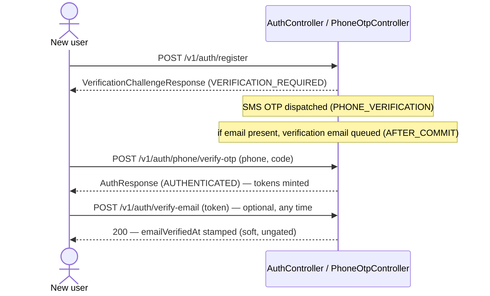

# Registration & email verification

This page covers the two ways a person becomes a `User` — standard self-service signup and waitlist-claim conversion — and the email-verification lifecycle that runs alongside both. It sits between the [principal model](principal-model.md) (which explains what a `User` is) and [login and the phone gate](login-and-the-phone-gate.md) (which explains how a `User` gets a session).

The single most important fact: **`POST /v1/auth/register` mints no tokens.** Phone is the canonical identifier, and a fresh account starts with `phoneVerified = false`. Registration only *starts* a phone-verification challenge — the SMS OTP is redeemed on a separate endpoint, and that redemption is what issues the JWT pair. Email verification is a parallel, *soft* track: it flips a flag and sends a welcome email, but nothing in the codebase gates on it. The waitlist-claim path is the one exception where account creation issues tokens directly, because the emailed claim link already proves control of the address.

All response payloads below are the `data` field of the `ApiResponse<T>` wrapper.

## Standard signup — `POST /v1/auth/register`

The endpoint lives on `AuthController#register` and delegates to `AuthServiceImpl#register`. It is unauthenticated and returns HTTP 200 with a `VerificationChallengeResponse` (never tokens).

### Request — `RegisterRequest`

| Field | Validation | Notes |
| --- | --- | --- |
| `phone` | `@NotBlank`, `@Size(max = 20)` | Normalized to E.164 server-side; the canonical identifier |
| `email` | `@ValidEmail` | Optional — no `@NotBlank`; lower-cased when present |
| `firstName` | `@NotBlank`, `@Size(max = 100)` | Trimmed |
| `middleName` | `@Size(max = 100)` | Optional; blank collapses to `null` |
| `lastName` | `@NotBlank`, `@Size(max = 100)` | Trimmed |
| `password` | `@NotBlank`, `@ValidPassword` | Hashed with the configured `PasswordEncoder` |
| `role` | `@NotNull` `UserType` | `ADMIN` is rejected in the service — admin accounts are created only via `POST /v1/admin/invites` |

`RegisterRequest.java` is the source of truth for these constraints. An `ADMIN` role value throws `PrivilegeEscalationException` before any row is touched.

### What the fresh branch creates

When the normalized phone matches no existing row and the email (if supplied) is free, `createFreshUserAndChallenge` persists exactly one `users` row:

- `status = ACTIVE` — note the account is `ACTIVE` immediately; the login gate is enforced on `phoneVerified`, not on `status` (see `User.java`).
- `phoneVerified = false`, `phoneVerifiedAt = null`, `emailVerifiedAt = null`.
- Name parts trimmed, password hashed, `role` copied from the request.

It then dispatches an SMS OTP with purpose `PHONE_VERIFICATION` (OTP internals live on [OTP & password recovery](otp-and-password-recovery.md)), and — only if an email was supplied — kicks off the email-verification track described below. Finally it audits `REGISTER` and returns a challenge with `resumed = false`.

### `REGISTER` vs `REGISTER_RESUMED`

The distinction is an **audit-action** one (`AuditAction.REGISTER` vs `AuditAction.REGISTER_RESUMED`), surfaced to the client as the boolean `resumed` flag on the challenge — not a `LoginOutcome`. The trigger is a prior, incomplete signup:

- **Fresh phone** → new row, audit `REGISTER`, `resumed = false`.
- **Existing unverified phone (resume)** → a `users` row already exists for this phone with `phoneVerified = false`. `resumeUnverifiedRegistration` leaves that row **completely untouched** — the original name, email, and password hash are preserved — re-dispatches the OTP, audits `REGISTER_RESUMED`, and returns `resumed = true`. Overwriting is deliberately avoided so that anyone who merely knows the phone number cannot clobber an in-flight signup (or wipe its audit trail).
- **Concurrent register race** → two requests for the same brand-new phone both pass the `findByPhone` pre-check; the second `save()` trips the phone unique constraint and throws `DataIntegrityViolationException`. `handleConcurrentRegisterRace` re-looks-up the row: if it is unverified, it falls through to the resume branch; if it is somehow already verified, it re-throws the original violation rather than resume into a verified account.

A phone that exists **and is already verified** is a hard conflict: `PhoneAlreadyRegisteredException` (HTTP 409). On the fresh branch, an email already in use throws `EmailAlreadyRegisteredException` (HTTP 409).

### The challenge, and how tokens actually issue

`VerificationChallengeResponse` (built via `VerificationChallengeResponse.of`) carries `outcome = VERIFICATION_REQUIRED`, the canonical E.164 `phone`, a masked `phoneMasked` for display, the OTP `expiresInSeconds`, the `channelsAvailable` (`SMS` always; `VOICE` when the Arkesel voice flag is on), and the `resumed` flag. Revealing the canonical phone leaks nothing — the caller has already proven they hold it by passing the uniqueness check.

To finish, the caller redeems the OTP at `POST /v1/auth/phone/verify-otp` (`PhoneOtpController#verifyOtp`). On a first-time `PHONE_VERIFICATION` from an anonymous caller, that endpoint marks the phone verified and mints the access/refresh pair (`AuthResponse`, `AUTHENTICATED`); the token-minting and gate semantics belong to [login and the phone gate](login-and-the-phone-gate.md).

## Waitlist-claim signup

A person who joined the pre-launch waitlist converts to a real account through a three-step flow on `WaitlistClaimServiceImpl`. Unlike standard signup, the final step mints tokens directly — there is no phone gate, because possession of the emailed claim link is the proof of identity.

1. **Send the link — `POST /v1/auth/waitlist/claim-link`** (`WaitlistClaimLinkRequest{email}`). Rate-limited per-IP (10/hour) and per-email (3/hour). Looks up an unconverted `WaitlistEntry` by email; if found and no `users` row already owns that email, it invalidates any prior claim token, issues a fresh `WAITLIST_CLAIM` token (TTL 30 days, `app.token.waitlist-claim-expiry-days`), stamps `claimEmailSentAt`, and publishes the claim email. **Always returns the same generic 200** regardless of whether the email matched, to prevent enumeration.
2. **Resolve the token — `POST /v1/auth/waitlist/resolve-claim`** (`WaitlistResolveClaimRequest{token}`). Inspects the token **without consuming it** and returns a `WaitlistClaimResolution` prefill payload (`firstName`, `middleName`, `lastName`, `email`, `phone`, `userType`, `location`) so the frontend can populate the signup form. Rejects a token that is missing, wrong-purpose, used, or expired (`InvalidVerificationTokenException`); rejects an already-converted entry (`WaitlistAlreadyClaimedException`, HTTP 409).
3. **Claim — `POST /v1/auth/waitlist/claim`** (`WaitlistClaimRequest{token, firstName, middleName, lastName, password}`, `@ValidPassword`). Atomically consumes the token, re-checks that the entry is unconverted and that no account already holds the email or phone, then creates the `users` row from the entry's `phoneNumber`/`email`/`userType` plus the user-edited name and chosen password. The row is created with **`emailVerifiedAt = now`** (pre-verified) and `status = ACTIVE`. It marks the entry converted (`convertedUser`, `claimedAt`), mints the JWT pair, audits `REGISTER` (via `userRegisteredFromWaitlist`), publishes the welcome email, and returns `AuthResponse` with `AUTHENTICATED`. Returns HTTP 201. The entry's `userType` may not be `ADMIN` (`PrivilegeEscalationException`).

## Email verification lifecycle

Email verification is orchestrated by `EmailVerificationServiceImpl` over the one-time tokens managed by `VerificationTokenServiceImpl`. These `EMAIL_VERIFY` tokens are distinct from SMS OTPs — different table, different service, different purpose enum.

### The verification token

`VerificationToken` rows live in `verification_tokens` (created in `V15__create_verification_tokens_and_claim_columns.sql`; `emailVerifiedAt` added in `V16`). Properties:

- The raw token is **32 random bytes, hex-encoded (64 chars)**. Only its **SHA-256 hash** is persisted in `token_hash` — a database leak cannot forge an unused token.
- Each row carries a `purpose` (`EMAIL_VERIFY`, `PASSWORD_RESET`, or `WAITLIST_CLAIM` — the same enum and `verification_tokens` table also serve `ADMIN_INVITE` and `ORG_MEMBER_INVITE` for the admin- and org-member-invite flows), an `expiresAt`, a nullable `usedAt`, and a FK to either a `User` or a `WaitlistEntry`.
- A partial unique index enforces **at most one active (unused) token per `(user, purpose)`** — so every issue path first invalidates prior active tokens.
- `EMAIL_VERIFY` TTL is **24 hours** (`app.token.verification-expiry-hours`, `TokenProperties`).

### Sending, verifying, resending

- **Send** — `sendVerificationEmail(user)` is a no-op when the user has no email. Otherwise it invalidates active `EMAIL_VERIFY` tokens, issues a fresh one, and publishes an `EmailVerificationRequestedEvent` (the actual email is dispatched AFTER_COMMIT by the email listener). The link points at the frontend `/verify-email?token=...` route. This is called automatically from the fresh registration branch when an email is present.
- **Verify** — `POST /v1/auth/verify-email` (`AuthController#verifyEmail`, `VerifyEmailRequest{token}`), unauthenticated, **idempotent**. If the token is already used and the user is already verified, it returns 200 with "already verified" and `false`. Otherwise it consumes the token (validating hash, purpose, unused, unexpired), stamps `emailVerifiedAt = now`, audits `EMAIL_VERIFIED`, and publishes the `WelcomeEmailEvent`. A missing/expired/used/wrong-purpose token yields HTTP 400 (`InvalidVerificationTokenException`).
- **Resend** — `POST /v1/auth/resend-verification` (`AuthController#resendVerification`), **authenticated**. Returns `false` (no email, no rate charge) when the caller is already verified. Otherwise it is rate-limited to **3 per hour per user** via a Redis counter; exceeding it throws `RateLimitExceededException` (HTTP 429 with `Retry-After`).

### What "verified" unlocks — nothing hard

Email verification is **soft**. Setting `emailVerifiedAt` only surfaces as the boolean `emailVerified` on the user summary (derived in `UserMapper#emailVerifiedFromTimestamp`) and triggers the welcome email. No login path or authorization gate reads it. The hard account gate is **phone** verification, enforced at login (`AuthProperties.PhoneGate`, default `enabled = true`) — see [login and the phone gate](login-and-the-phone-gate.md). Accounts created via waitlist claim, OAuth (with a provider-verified email), and the bootstrap/seed paths arrive with `emailVerifiedAt` already set.

### Cleanup crons

Two daily scheduled jobs keep the tables and unique columns tidy (both are runtime housekeeping, not backfills):

| Job | Schedule | Action |
| --- | --- | --- |
| `VerificationTokenServiceImpl#cleanupExpiredTokens` | 03:00 daily | Hard-deletes `verification_tokens` rows that expired more than 7 days ago |
| `UnverifiedUserCleanupService#cleanupUnverifiedUsers` | 04:00 daily | Batch-deletes (100 at a time) `users` rows with `phoneVerified = false` older than 7 days; NULLs their audit-log references, removes membership rows, then hard-deletes — cascading to `refresh_tokens`, `otp_codes`, `verification_tokens`, and profile tables. Emits `UNVERIFIED_USER_PURGED` (null principal — the cron is the actor) |

The unverified-user purge exists so a `users.phone` value abandoned mid-signup is freed for re-registration (relevant when carriers reassign numbers). It runs 30 minutes after OTP cleanup so cascade-deleted `otp_codes` are already gone.

## Where it lives

| Concern | Source |
| --- | --- |
| Register + verify-email + waitlist endpoints | `controller/auth/AuthController.java` |
| Phone OTP redemption (mints tokens) | `controller/auth/PhoneOtpController.java` |
| Register branches (fresh / resume / race) | `AuthServiceImpl#register` |
| Register request shape | `dto/auth/request/RegisterRequest.java` |
| Verification challenge response | `dto/auth/response/VerificationChallengeResponse.java` |
| Login-outcome discriminator | `dto/auth/response/LoginOutcome.java` |
| Waitlist claim flow | `service/auth/WaitlistClaimServiceImpl.java` |
| Waitlist DTOs | `dto/auth/request/WaitlistClaim*.java`, `dto/auth/response/WaitlistClaimResolution.java` |
| Email-verification orchestration | `service/auth/EmailVerificationServiceImpl.java` |
| Token generation / hashing / TTL | `service/auth/VerificationTokenServiceImpl.java` |
| Token entity + table | `model/user/VerificationToken.java` (`V15`, `V16`) |
| Token TTL knobs | `config/TokenProperties.java` |
| Phone-gate flag | `service/auth/AuthProperties.java` |
| Unverified-user purge cron | `job/UnverifiedUserCleanupService.java` |
| Audit actions | `model/platform/AuditAction.java` (`REGISTER`, `REGISTER_RESUMED`, `EMAIL_VERIFIED`, `UNVERIFIED_USER_PURGED`) |

## See also

- [Principal model](principal-model.md) — what a `User` is, and how it differs from `PlatformAdmin` and `Member`.
- [Login and the phone gate](login-and-the-phone-gate.md) — how the phone-verification gate turns a challenge into tokens.
- [OTP & password recovery](otp-and-password-recovery.md) — SMS OTP internals, TTL, and channel routing.
- [OAuth](oauth.md) — Google signup, where the email arrives provider-verified.
- [JWT, sessions & refresh](jwt-sessions-and-refresh.md) — what the minted token pair carries.
- [Audit](../audit/index.md) — where `REGISTER`, `EMAIL_VERIFIED`, and `UNVERIFIED_USER_PURGED` rows land.
