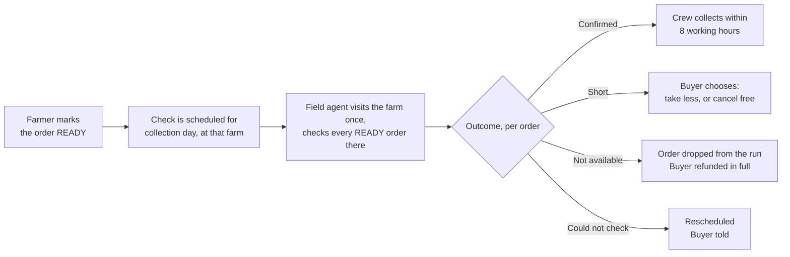

# The order availability check

*What the field agent does between the farmer marking READY and the crew collecting — proposed by engineering, corrected by Operations on 9 September. Part of finalising the [order → delivery flow](order-delivery-flow-v2-working-answers.md).*

## Two kinds of visit

Field agents visit farms for two different reasons, and they should stay two different things:

| Visit | When | Question it answers | Exists today |
| --- | --- | --- | --- |
| **Farm verification** | When a farm registers | Is this a real farm, run to our standards, reachable by a van? | Yes — the farm-verification visit, with photos, practice checks and van-access observation |
| **Order availability check** | On collection day, after the farmer has marked the order READY, before the crew collects | Does this farmer actually have *this* produce, in *this* quantity, at *this* quality — right now, hours before it is collected? | **No.** This page defines it |

This page is only about the second.

## What it is for, in one sentence

Before CropDoor's crew collects an order, someone from CropDoor has seen — on the same working day — that the produce exists in the quantity and quality the buyer ordered.

It is **not** the handoff count. The check happens hours before collection, across every READY order at the farm; what goes into the van is counted separately, at the gate, when the crew collects. So this check answers "is it there?", and the handoff answers "is that what we took?".

## When it happens and who does it

- **Triggered by the farmer marking READY.** The farmer declares the produce is ready; the check confirms it. Until READY there is nothing to verify.
- **On collection day.** A check is valid for **8 working hours**, so it is made the same working day the crew collects — typically the morning, with collection following.
- **One visit per farm per collection day.** The agent walks the farm once and submits one check for each READY order at that farm — not one trip per order.
- **By a field agent in the farm's zone. Where the zone has no field agent, the delivery agent makes the check on arrival, before collecting.** The two acts stay distinct — check form first, then the count at handoff — even when one person does both.
- **Before collection, not before crew assignment.** The crew is planned once orders are READY; the check gates whether the crew *collects* a given order, not whether the run exists. An order found Not available is dropped from that day's run and the run continues.

## What the agent checks

The check is a short form on the agent's phone, filled at the farm. It works offline and sends itself when there is signal. Two levels: things about the visit, and things about each line of the order.

### Once per visit

| Field | Type | Why |
| --- | --- | --- |
| Who was present | Farmer / a farm member (name) / nobody | If nobody, the check cannot be completed — it is rescheduled, not failed |
| Van can reach the gate | Yes / No / Only in dry weather | Already recorded at verification; re-confirmed because roads change. Decides whether this collection uses a collection point |
| Location | Recorded automatically by the phone | Light evidence the check was made at the farm, not from the road |
| Notes | Free text, optional | Anything the crew should know: "gate is the blue one", "farmer's brother will hand over" |

Readiness is **not** a field on the form. The farmer declares it by marking the order READY; the check confirms or contradicts that declaration.

### For every produce line on the order

Each line is one produce item the buyer ordered — for example *Tomatoes, 40 kg*. The agent sees the ordered quantity and unit and answers against it.

| Field | Type | Why |
| --- | --- | --- |
| Seen | Yes / No | Did the agent physically see this produce? "No" ends the line as not available |
| State | Harvested and packed / Harvested, not yet packed / Ready to harvest / Not ready yet (expected date) | Tells the crew what they will find at the gate. "Not ready yet" contradicts the farmer's READY — see the open point below |
| Quantity available for this order | A number, in the ordered unit | The platform compares it with the ordered quantity. Equal or more → fine. Less → the line is short |
| Quality against the listing | Matches / Below / Above | Judged against what the buyer saw when ordering: the listing's variety and description. **Above is recorded** — a farm that consistently exceeds its listing is worth knowing |
| If below — why | Size / Ripeness / Damage / Pests or disease / Mixed grade / Other | So the buyer can be told something specific, and so farms accumulate a record |
| Photos | **Required — three per line** | The buyer's evidence that we saw it, and ours if quality is disputed later. Taken on the spot, timestamped and located |
| Note | Free text, optional | |

The agent does **not** choose the outcome. The platform works it out from the answers, so two agents looking at the same farm produce the same result:

| Outcome | When |
| --- | --- |
| **Confirmed** | Every line seen, quantity at least what was ordered, quality matches or is above |
| **Short** | Every line seen and acceptable, but at least one has less than the ordered quantity |
| **Not available** | Any line not seen, not available, or quality below the listing |
| **Could not check** | Nobody present, or the farm could not be reached — nothing about the produce is recorded |

## What happens after each outcome

This is where the check earns its place: every outcome has a consequence and an owner, so no order sits waiting.

| Outcome | The order | The buyer | The farmer | Money |
| --- | --- | --- | --- | --- |
| **Confirmed** | Cleared for collection; the crew collects within 8 working hours | Told "confirmed available, collecting today" | Told the check passed | Nothing moves |
| **Short** | Paused until the buyer chooses | Offered a choice: **take the reduced quantity** (price adjusts down; for online payment the difference is refunded) or **cancel free** | Told the finding | Refund of the difference, or full refund — no penalty either way |
| **Not available** | Cancelled and dropped from the day's run | Refunded in full, no penalty, told why in plain words | Told; the finding is recorded against the farm — the farmer marked READY produce that was not there | Full refund |
| **Could not check** | Unchanged; not collected today | Told collection is rescheduled | Told when the agent will return | Nothing |

Two rules fall out of this that answer questions on the working-answers page:

- **The buyer's penalty window opens when the farmer marks READY — not at acceptance, and not at Confirmed.** An earlier draft of this page put it at Confirmed. With an 8-working-hour shelf life the check happens on collection morning, so opening the window there would let a buyer cancel free *after* the farmer has harvested and packed. READY is the moment the farmer commits produce; that is when the buyer's free window should close. Confirmed is our gate on collection, not the buyer's (question 34). While the order is merely accepted, the buyer may still cancel free.
- **A "Short" or "Not available" finding corrects the listing, not just the order.** If the agent finds 30 kg where the listing said 100 kg, the listing's available quantity is reduced so other buyers are not sold produce that isn't there, and every other open order on that listing is re-checked against the new number (question 5).

## The check has a shelf life: 8 working hours

A Confirmed check is good for eight working hours. In practice that means the check and the collection happen on the same working day — the agent's morning round, the crew's afternoon collection. If a crew is delayed past the window, the check is repeated before collecting, not waved through.

## What the handoff still checks

Because the agent may have seen standing crop, the crew at the gate still confirms *what went in the van*: the count per line, against the check's quantities, with the farmer's own code from the working answers (question 10) so both parties have a record. The availability check is the promise; the handoff is the delivery on it.

## What Operations sees

- **Checks due today**, by zone and agent — the agent's morning list.
- **Unchecked READY orders** — marked READY, collection day arrived, no check yet. This is the stall the old flow could not see.
- **Outcomes per farm over time** — a farm with repeated Short or Not-available findings is a supply-reliability signal before it becomes a buyer complaint.
- **Checks expiring** — Confirmed more than 8 working hours ago and still not collected.

## Messages

| Moment | Farmer | Buyer |
| --- | --- | --- |
| Farmer marks READY | — | "The farmer has your order ready. We'll check it and collect on *date*." |
| Check scheduled | "A CropDoor agent will visit on *date* to check and collect *ORD-…*." | — |
| Confirmed | "*ORD-…* is confirmed. The crew will collect today." | "Your order was checked this morning and is being collected today." |
| Short | "We found *N* of *M* available for *ORD-…*. The buyer has been asked whether to proceed." | "Only *N* of the *M* you ordered is available. Take *N* for GHS *X*, or cancel free?" |
| Not available | "We could not confirm *ORD-…*; it has been cancelled. Reason: *…*" | "Your order was cancelled because the produce was not available as listed. You've been refunded in full." |
| Could not check | "Our agent could not reach you on *date*. We'll return on *date*." | "Collection is delayed to *date*." |

Text messages, not email — farmers do not read email.

## Operations' answers (9 September)

The seven open points from the first draft, answered — and folded into the page above.

| Point | Answer | What it changed |
| --- | --- | --- |
| Batching | **One visit per farm per collection day** | The agent walks the farm once; one check per READY order there |
| No field agent in the zone | **The delivery agent makes the check on collection day**, before collecting | Check and handoff can be one visit by one person — still two acts, form then count |
| Shelf life | **8 working hours** | The check is a collection-day act; READY triggers it; the crew is planned before it and collects within the window. The buyer's penalty window moves to READY |
| Photos | **Three** per produce line | Required; timestamped and located |
| Location | **Yes**, record it | Captured automatically on submission |
| Who declares "ready by" | **The farmer, by marking READY** | The ready-by field leaves the agent's form; the check confirms the farmer's declaration rather than setting a date |
| Quality "above" | **Record it** | A farm consistently above its listing is a supply signal |

Two consequences of these answers, for Operations to confirm:

- **A wasted trip is now possible.** Because the check is on collection morning and the crew is already planned, a **Not available** finding means the crew has already driven to the zone. The cost of a farmer marking READY on produce that isn't there falls on us. That is what the "recorded against the farm" note in the outcomes table is for — and it is the strongest argument for question 18 (a farmer-side penalty).
- **"Not ready yet" needs an outcome.** The farmer marked READY; the agent finds the produce still a day or two from harvest. Cancelling and refunding treats a late farmer like an absent one. **Proposal:** treat it like Short — the buyer is told the new date and chooses to **wait** (the order is re-planned to that day, penalty window still open) or **cancel free**; the finding is recorded against the farm either way.

## For engineering

The check is an order-scoped visit, not a new concept: it fits the existing farm-visit record — agent, zone, date, observations, van access, photos, submitted-at, versioning — with a new purpose, a link to the order, one finding row per order line, and a **derived** outcome. Outcome is computed from the line findings and never stored as a chosen value, so it cannot disagree with them. The farmer's **READY** is the precondition for scheduling a check; a **Confirmed** outcome, no older than 8 working hours, is the precondition for the handoff. Crew assignment depends on READY, not on the check. Three photos per line and the submission location are part of the capture. The check is captured through the existing offline sync envelope as a new capture kind, because agents work on bad links. The permission is the field-agent one, not the delivery one — the two roles stay separable. Each outcome is an audit action in the farm's feed, and Short / Not-available write the corrected quantity to the listing in the same transaction as the finding.
