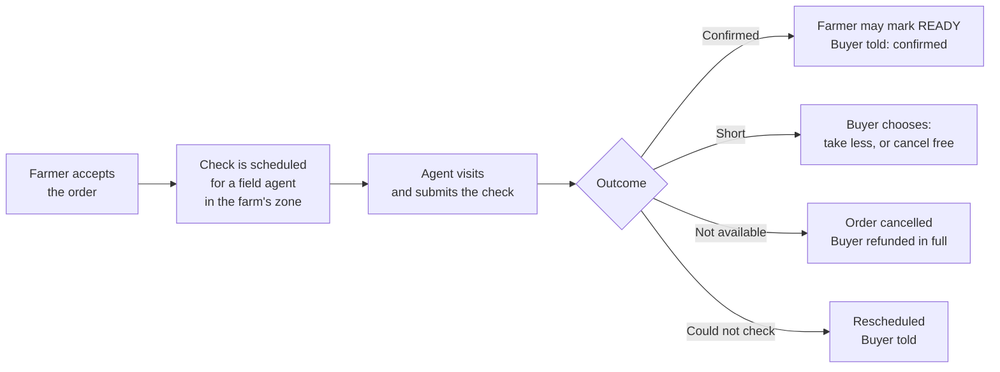

# The order availability check

*A proposal for what the field agent does between "farmer accepted" and "ready" — for Operations to correct. Part of finalising the [order → delivery flow](order-delivery-flow-v2-working-answers.md).*

## Two kinds of visit

Field agents visit farms for two different reasons, and they should stay two different things:

| Visit | When | Question it answers | Exists today |
| --- | --- | --- | --- |
| **Farm verification** | When a farm registers | Is this a real farm, run to our standards, reachable by a van? | Yes — the farm-verification visit, with photos, practice checks and van-access observation |
| **Order availability check** | After a farmer accepts an order, before we assign a crew | Does this farmer actually have *this* produce, in *this* quantity, at *this* quality — and when will it be ready? | **No.** This page defines it |

This page is only about the second.

## What it is for, in one sentence

Before CropDoor commits a driver, a delivery agent and a van to an order, someone from CropDoor has seen that the produce exists in the quantity and quality the buyer ordered, and knows when it will be ready for collection.

It is **not** the handoff inspection. Produce may still be in the ground when the agent checks it. What goes into the van is counted separately, at the gate, when the crew collects — so this check answers "is it there?", and the handoff answers "is that what we took?".

## When it happens and who does it

- **Triggered** by the farmer accepting. Until then there is nothing to verify.
- **Assigned** to a field agent in the farm's zone. One agent visit should cover **every accepted order at that farm for the same collection day** — the agent walks the farm once and submits one check per order, not one trip per order.
- **Before** a crew is assigned. A crew is never sent for produce nobody has seen.

## What the agent checks

The check is a short form on the agent's phone, filled at the farm. It works offline and sends itself when there is signal. Two levels: things about the visit, and things about each line of the order.

### Once per visit

| Field | Type | Why |
| --- | --- | --- |
| Who was present | Farmer / a farm member (name) / nobody | If nobody, the check cannot be completed — it is rescheduled, not failed |
| Van can reach the gate | Yes / No / Only in dry weather | Already recorded at verification; re-confirmed because roads change. Decides whether this collection uses a collection point |
| Ready for collection by | Date, and morning / afternoon | Agreed with the farmer on the spot. This is the date the crew is planned against |
| Notes | Free text, optional | Anything the crew should know: "gate is the blue one", "farmer's brother will hand over" |

### For every produce line on the order

Each line is one produce item the buyer ordered — for example *Tomatoes, 40 kg*. The agent sees the ordered quantity and unit and answers against it.

| Field | Type | Why |
| --- | --- | --- |
| Seen | Yes / No | Did the agent physically see this produce? "No" ends the line as not available |
| State | Harvested and packed / Harvested, not yet packed / Ready to harvest / Not ready yet (expected date) | Tells the crew and the buyer what "ready" will mean, and whether a second look at the gate matters |
| Quantity available for this order | A number, in the ordered unit | The platform compares it with the ordered quantity. Equal or more → fine. Less → the line is short |
| Quality against the listing | Matches / Below / Above | Judged against what the buyer saw when ordering: the listing's variety and description |
| If below — why | Size / Ripeness / Damage / Pests or disease / Mixed grade / Other | So the buyer can be told something specific, and so farms accumulate a record |
| Photo | **Required**, at least one per line | The buyer's evidence that we saw it, and ours if quality is disputed later. Taken on the spot, timestamped |
| Note | Free text, optional | |

The agent does **not** choose the outcome. The platform works it out from the answers, so two agents looking at the same farm produce the same result:

| Outcome | When |
| --- | --- |
| **Confirmed** | Every line seen, quantity at least what was ordered, quality matches or is above |
| **Short** | Every line seen and acceptable, but at least one has less than the ordered quantity |
| **Not available** | Any line not seen, not available, or quality below the listing |
| **Could not check** | Nobody present, or the farm could not be reached — nothing about the produce is recorded |

## What happens after each outcome

This is where the check earns its place: every outcome has a consequence and an owner, so no order sits waiting.

| Outcome | The order | The buyer | The farmer | Money |
| --- | --- | --- | --- | --- |
| **Confirmed** | May now be marked READY by the farmer; a crew may be assigned | Told "confirmed available, ready by *date*". **From this moment cancelling attracts the penalty** — the farmer has committed and we have verified | Told the check passed and the ready-by date | Nothing moves |
| **Short** | Paused until the buyer chooses | Offered a choice: **take the reduced quantity** (price adjusts down; for online payment the difference is refunded) or **cancel free** | Told the finding | Refund of the difference, or full refund — no penalty either way |
| **Not available** | Cancelled | Refunded in full, no penalty, told why in plain words | Told; the finding is recorded against the farm | Full refund |
| **Could not check** | Unchanged | Told the visit is rescheduled; the free-cancel window stays open | Told when the agent will return | Nothing |

Two rules fall out of this that answer questions on the working-answers page:

- **The buyer's penalty window opens at "Confirmed", not at acceptance.** While the order is waiting for the agent, the buyer may still cancel free. That closes the undefined window between "accepted" and "ready" (question 34).
- **A "Short" or "Not available" finding corrects the listing, not just the order.** If the agent finds 30 kg where the listing said 100 kg, the listing's available quantity is reduced so other buyers are not sold produce that isn't there, and every other open order on that listing is re-checked against the new number (question 5).

## The check has a shelf life

Produce checked on Monday is not the same on Friday. A confirmed check should be valid for a fixed number of days; if collection is planned later than that, the check is repeated or the crew counts more carefully at the gate. **Ops sets the number.**

## What the handoff still checks

Because the agent may have seen standing crop, the crew at the gate still confirms *what went in the van*: the count per line, against the check's quantities, with the farmer's own code from the working answers (question 10) so both parties have a record. The availability check is the promise; the handoff is the delivery on it.

## What Operations sees

- **Checks due today**, by zone and agent — the agent's morning list.
- **Overdue checks** — orders accepted more than *X* hours ago with no visit. This is the stall the old flow could not see.
- **Outcomes per farm over time** — a farm with repeated Short or Not-available findings is a supply-reliability signal before it becomes a buyer complaint.
- **Checks expiring** before their collection date.

## Messages

| Moment | Farmer | Buyer |
| --- | --- | --- |
| Check scheduled | "A CropDoor agent will visit on *date* to confirm your order *ORD-…*." | — |
| Confirmed | "Your order *ORD-…* is confirmed. Please have it ready by *date*." | "Your order is confirmed available and will be collected on *date*." |
| Short | "We found *N* of *M* available for *ORD-…*. The buyer has been asked whether to proceed." | "Only *N* of the *M* you ordered is available. Take *N* for GHS *X*, or cancel free?" |
| Not available | "We could not confirm *ORD-…*; it has been cancelled. Reason: *…*" | "Your order was cancelled because the produce was not available as listed. You've been refunded in full." |
| Could not check | "Our agent could not reach you on *date*. We'll return on *date*." | "Our check is delayed to *date*. You can still cancel free." |

Text messages, not email — farmers do not read email.

## Open points for Operations

1. **Batching.** Is one visit per farm per collection day right, or do you want the agent to go per order? (Working answers, question 2.)
2. **No agent in the zone.** Who does the check — the delivery agent on collection day, an admin by phone with the farmer's photos, or does the zone pause? (Question 4.)
3. **Shelf life.** How many days is a Confirmed check good for?
4. **Photos.** Required per line, as proposed — or is one photo per visit enough?
5. **Location.** Should the phone record where the check was submitted, as light evidence the agent was at the farm?
6. **Who declares "ready by".** The agent, having agreed it with the farmer on the spot — or the farmer, later, when they mark READY?
7. **Quality "above".** Does it matter to record, or is it just "matches"?

## For engineering

The check is an order-scoped visit, not a new concept: it fits the existing farm-visit record — agent, zone, date, observations, van access, photos, submitted-at, versioning — with a new purpose, a link to the order, one finding row per order line, and a **derived** outcome. Outcome is computed from the line findings and never stored as a chosen value, so it cannot disagree with them. A **Confirmed** outcome is the precondition for the farmer's READY; a crew cannot be assigned without one. The check is captured through the existing offline sync envelope as a new capture kind, because agents work on bad links. The permission is the field-agent one, not the delivery one — the two roles stay separable. Each outcome is an audit action in the farm's feed, and Short / Not-available write the corrected quantity to the listing in the same transaction as the finding.
