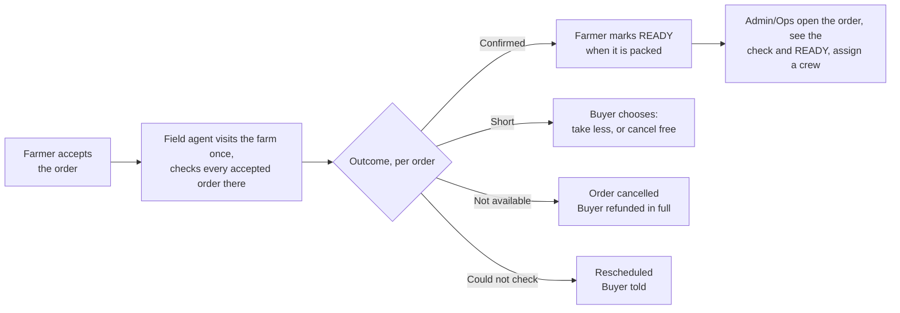

# The order availability check

*What the field agent does once the farmer has accepted an order, before Admin/Ops send a crew — proposed by engineering, corrected by Operations on 9 September. Part of finalising the [order → delivery flow](order-delivery-flow-v2-working-answers.md).*

## Two kinds of visit

Field agents visit farms for two different reasons, and they should stay two different things:

| Visit | When | Question it answers | Exists today |
| --- | --- | --- | --- |
| **Farm verification** | When a farm registers | Is this a real farm, run to our standards, reachable by a van? | Yes — the farm-verification visit, with photos, practice checks and van-access observation |
| **Order availability check** | As soon as the farmer accepts an order, before Admin/Ops send a crew | Does this farmer actually have *this* produce, in *this* quantity, at *this* quality? | **No.** This page defines it |

This page is only about the second.

## What it is for, in one sentence

Before Admin/Ops send a driver, a delivery agent and a van for an order, someone from CropDoor has seen that the produce exists in the quantity and quality the buyer ordered.

It is **not** the handoff count. Produce may still be in the ground when the agent checks it; what goes into the van is counted separately, at the gate, when the crew collects. So this check answers "is it there?", and the handoff answers "is that what we took?".

## When it happens and who does it

- **Triggered by the farmer accepting.** Until then there is nothing to verify. The agent has **8 working hours** from acceptance to make the check (see below).
- **One visit per farm per day.** The agent walks the farm once and submits one check for every accepted order waiting there — not one trip per order.
- **By a field agent in the farm's zone.** Where the zone has no field agent, the delivery agent makes the check at the gate on collection day, before collecting — the one case where a crew goes out without a check already on the order. The two acts stay distinct — check form first, then the count at handoff — even when one person does both.
- **Before the crew — and the crew is Admin/Ops' call.** When the farmer marks READY, Admin/Ops open the order on their dashboard, see the field agent's check there — who checked, when, the outcome, the photos — and assign a crew. **No check on the order, no crew.** READY is the farmer's signal; the check is what makes it safe to act on.

## What the agent checks

The check is a short form on the agent's phone, filled at the farm. It works offline and sends itself when there is signal. Two levels: things about the visit, and things about each line of the order.

### Once per visit

| Field | Type | Why |
| --- | --- | --- |
| Who was present | Farmer / a farm member (name) / nobody | If nobody, the check cannot be completed — it is rescheduled, not failed |
| Van can reach the gate | Yes / No / Only in dry weather | Already recorded at verification; re-confirmed because roads change. There are no collection points for now, so a farm the van cannot reach is something Admin/Ops must know before a crew is sent |
| Location | Recorded automatically by the phone | Light evidence the check was made at the farm, not from the road |
| Notes | Free text, optional | Anything the crew should know: "gate is the blue one", "farmer's brother will hand over" |

Readiness is **not** a field on the form. The farmer declares it, later, by marking the order READY.

### For every produce line on the order

Each line is one produce item the buyer ordered — for example *Tomatoes, 40 kg*. The agent sees the ordered quantity and unit and answers against it.

| Field | Type | Why |
| --- | --- | --- |
| Seen | Yes / No | Did the agent physically see this produce? "No" ends the line as not available |
| State | Harvested and packed / Harvested, not yet packed / Ready to harvest / Not ready yet (expected date) | Tells Admin/Ops and the buyer roughly when READY can be expected, and whether a second look at the gate matters |
| Quantity available for this order | A number, in the ordered unit | The platform compares it with the ordered quantity. Equal or more → fine. Less → the line is short |
| Quality against the listing | Matches / Below / Above | Judged against what the buyer saw when ordering: the listing's variety and description. **Above is recorded** — a farm that consistently exceeds its listing is worth knowing |
| If below — why | Size / Ripeness / Damage / Pests or disease / Mixed grade / Other | So the buyer can be told something specific, and so farms accumulate a record |
| Photos | **Required — three per line** | The buyer's evidence that we saw it, and ours if quality is disputed later. Taken on the spot, timestamped and located |
| Note | Free text, optional | |

The agent does **not** choose the outcome. The platform works it out from the answers, so two agents looking at the same farm produce the same result:

| Outcome | When |
| --- | --- |
| **Confirmed** | Every line seen, quantity at least what was ordered, quality matches or is above |
| **Short** | Every line seen and acceptable, but at least one has less than the ordered quantity |
| **Not available** | Any line not seen, not available, or quality below the listing |
| **Could not check** | Nobody present, or the farm could not be reached — nothing about the produce is recorded |

## What happens after each outcome

This is where the check earns its place: every outcome has a consequence and an owner, so no order sits waiting.

| Outcome | The order | The buyer | The farmer | Money |
| --- | --- | --- | --- | --- |
| **Confirmed** | May be marked READY by the farmer when packed; Admin/Ops then assign a crew | Told "confirmed available" | Told the check passed | Nothing moves |
| **Short** | Paused until the buyer chooses | Offered a choice: **take the reduced quantity** (price adjusts down; for online payment the difference is refunded) or **cancel free** | Told the finding | Refund of the difference, or full refund — no penalty either way |
| **Not available** | Cancelled | Refunded in full, no penalty, told why in plain words | Told; the finding is recorded against the farm | Full refund |
| **Could not check** | Unchanged | Told the visit is rescheduled; the free-cancel window stays open | Told when the agent will return | Nothing |

Two rules fall out of this that answer questions on the working-answers page:

- **The buyer's penalty window opens when the farmer marks READY — where the team's flow put it — not at acceptance.** The check sits inside the free window, so a buyer learns whether the produce is there before their free cancel closes. Whether acceptance alone should ever open the penalty is question 34.
- **A "Short" or "Not available" finding corrects the listing, not just the order.** If the agent finds 30 kg where the listing said 100 kg, the listing's available quantity is reduced so other buyers are not sold produce that isn't there, and every other open order on that listing is re-checked against the new number (question 5).

## The check has a deadline: 8 working hours

Operations' answer to "how long is a check good for" was **8 working hours**. Read together with "the check is made as soon as the farmer accepts", that cannot be an expiry — the farmer may mark READY days after the check. So this page takes it as the **field agent's deadline**: the check is made within eight working hours of acceptance, and an accepted order still unchecked after that is overdue on Admin/Ops' list. **To confirm.**

## What the handoff still checks

Because the agent may have seen standing crop, the crew at the gate still confirms *what went in the van*: the count per line, against the check's quantities, with the farmer's own code from the working answers (question 10) so both parties have a record. The availability check is the promise; the handoff is the delivery on it.

## What Operations sees

- **On every order's detail page, the check itself** — who checked, when, the outcome, the photos. This is what Admin/Ops look at before assigning a crew.
- **Accepted orders awaiting a check**, by zone — the field agent's list; past 8 working hours it is overdue. This is the stall the old flow could not see.
- **READY orders awaiting a crew**, with each one's check outcome beside it — so the ones that can be dispatched are obvious, and the ones that cannot say why.
- **Outcomes per farm over time** — a farm with repeated Short or Not-available findings is a supply-reliability signal before it becomes a buyer complaint.

## Messages

| Moment | Farmer | Buyer |
| --- | --- | --- |
| Check scheduled | "A CropDoor agent will visit on *date* to confirm your order *ORD-…*." | — |
| Confirmed | "*ORD-…* is confirmed. Mark it READY on the app when it is packed for collection." | "Your order has been checked and confirmed available." |
| Short | "We found *N* of *M* available for *ORD-…*. The buyer has been asked whether to proceed." | "Only *N* of the *M* you ordered is available. Take *N* for GHS *X*, or cancel free?" |
| Not available | "We could not confirm *ORD-…*; it has been cancelled. Reason: *…*" | "Your order was cancelled because the produce was not available as listed. You've been refunded in full." |
| Could not check | "Our agent could not reach you on *date*. We'll return on *date*." | "Our check is delayed to *date*. You can still cancel free." |

Text messages, not email — farmers do not read email.

## Operations' answers (9 September)

The seven open points from the first draft, answered — and folded into the page above.

| Point | Answer | What it changed |
| --- | --- | --- |
| Batching | **One visit per farm per day** | The agent walks the farm once; one check per accepted order waiting there |
| No field agent in the zone | **The delivery agent makes the check on collection day**, at the gate before collecting | The one case where a crew goes out without a check already on the order — still two acts, form then count |
| Shelf life | **8 working hours** | Taken as the field agent's **deadline** from acceptance, not an expiry — see above, to confirm |
| Photos | **Three** per produce line | Required; timestamped and located |
| Location | **Yes**, record it | Captured automatically on submission |
| Who declares "ready by" | **The farmer, by marking READY** | The ready-by field leaves the agent's form; READY is the farmer's signal to Admin/Ops, made after the check |
| Quality "above" | **Record it** | A farm consistently above its listing is a supply signal |

**And the sequence, clarified the same day.** The check is made **as soon as the farmer accepts** — not on collection morning, as an earlier draft of this page had it. When the farmer marks READY, **Admin/Ops assign a delivery crew**. Admin/Ops do **not** dispatch a crew unless the field agent's check is on the order; they see it when they open the order's details on their dashboard.

## For engineering

The check is an order-scoped visit, not a new concept: it fits the existing farm-visit record — agent, zone, date, observations, van access, photos, submitted-at, versioning — with a new purpose, a link to the order, one finding row per order line, and a **derived** outcome. Outcome is computed from the line findings and never stored as a chosen value, so it cannot disagree with them. Acceptance schedules the check. The order's detail view for Admin/Ops carries the check — agent, time, outcome, photos — and crew assignment is refused while the order has no Confirmed check (proposed), with the no-field-agent zone as the stated exception. Three photos per line and the submission location are part of the capture. The check is captured through the existing offline sync envelope as a new capture kind, because agents work on bad links. The permission is the field-agent one, not the delivery one — the two roles stay separable. Each outcome is an audit action in the farm's feed, and Short / Not-available write the corrected quantity to the listing in the same transaction as the finding.
