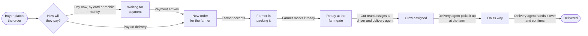
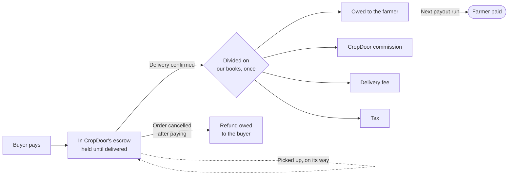
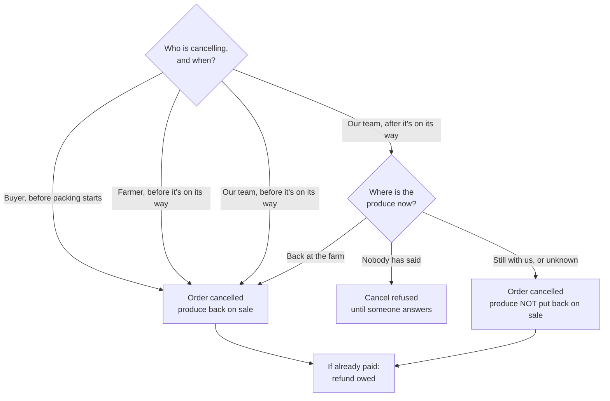

# From farm gate to front door

*For Operations and leadership. The [engineering version](order-delivery-flow.md) has the same content with the code attached.*

What happens to an order from the moment a buyer places it to the moment the produce is in their hands — who does each step, where the money is at each moment, and what we're proposing to change. Written so you can push back on any of it.

One thing to hold onto while reading: **CropDoor collects and delivers the produce. Farmers don't.** A farmer's job is to accept the order, pack it, and have it ready at the farm gate. From there it is our driver and our delivery agent who move it, and our team who record what happened. Most of what we're proposing to fix comes from the software not quite believing that.

## The journey of an order

Eight stops. An order can only move forward, one stop at a time, and each stop is moved by a specific person.

**The happy path.** Only the delivery agent can say "I've picked it up" and "I've delivered it" — they are the person physically holding the crate. Until recently the farmer was asked to press a "dispatched" button for produce they had already handed over; that is one of the things we want to remove.

## Who does what

Five roles. Each one can do a small, specific set of things, and nothing else.

| Who | Can | Cannot |
| --- | --- | --- |
| **Buyer** | Place an order, pay for it, cancel it while it's still new or just accepted, see their own orders. | Cancel once the farmer has started packing. |
| **Farmer** | Accept an order, mark it as being packed, mark it ready for collection, cancel it any time before it's on its way, see the farm's orders. | Say the produce is on its way — they didn't move it. |
| **Driver** | Drive the run. | Anything in the app. Drivers don't need an account to be put on a run, so today the app can't ask them anything. |
| **Delivery Agent** | Ride with the driver. Record the pickup at the farm and the hand-over at the buyer's door, for the runs they are assigned to. | Act on a run they aren't assigned to — except see the note below. |
| **Admin / Ops** | Put a driver and delivery agent on an order. Cancel any order — and if the produce has already left the farm, say where it ended up. Step in and record a pickup or hand-over when the agent can't; every step-in is logged as one. | Move money by hand. What the farmer is owed follows the delivery, and it's paid at the payout run, never by a button. |

!!! note "A question hiding in that table"
    Right now, any delivery agent can record a pickup or hand-over on *any* order — not just their own run — because the permission that lets them do their job is the same one that lets an admin step in. It hasn't caused a problem, but confirming a delivery is what decides the farmer is owed their share. See decision 3.

## Where the money is, at each moment

For an order paid by card or mobile money, the buyer pays **into CropDoor's escrow**, and the money stays with us. It is held there through packing, collection and the drive — nothing about moving the produce touches it. When the delivery agent confirms the hand-over, the money is **divided on our books**: the farmer's share becomes money we *owe* the farmer, and our commission, the delivery fee and tax become ours. The farmer is then **paid at the next payout run**, together with everything else we owe them — not on the doorstep.

**Two holds, not one.** The dotted loop is the first point: picking the produce up changes nothing about the money — it stays in escrow until the buyer has it. The second is the last arrow: confirming a delivery decides *who the money belongs to*, but the farmer receives theirs at the next payout run, with everything else owed to them. If an order is cancelled after payment, the money stays in escrow until the refund goes through; the farmer is never paid for produce that didn't arrive. Pay-on-delivery orders skip escrow — cash is collected at the door — but the same division and the same payout run apply.

## When things go wrong

Three people can cancel, each up to a different point. Cancelling normally puts the produce back on sale. The exception is the one that matters.

**Why we ask where the produce is.** If a crate is on a van and the order is cancelled, putting its quantity back on sale means the same crate can be sold twice. So when our team cancels an order that has already left the farm, the app insists on an answer: did it come back, is it still with us, or does nobody know? "Nobody knows" is treated like "still with us" — better to under-sell than to sell what we don't have — but it's recorded separately, because it's a different problem to chase.

### The order nobody collected

The gap that started all of this: an order can be packed, ready at the farm gate, paid for — and then nobody comes. Until recently the only way to move it forward was a button on the *farmer's* side, so an uncollected order simply sat there with the buyer's money held and no one alerted. The delivery agent can now record the pickup themselves, which closes the gap. What we don't yet have is a list Operations can look at that says "these orders were ready yesterday and still haven't been collected". See decision 4.

## What we want to change, and why

When we drew the current system out, the pattern was this: **the same fact was being written down in several places, and the copies disagreed.** Three examples, in plain terms:

- An order had two separate "status" labels — one for the order, one for its delivery — that had to be kept in step by hand. They drifted. A cancelled order could still show a delivery "on its way".
- Every change to an order was written into a history log that *nothing has ever read*. We already keep a proper, tamper-proof record of who did what; the second log was pure overhead.
- A "refund owed" flag was switched on and off by hand in two different places, and it could say "owed" while a refund was already going through.

The proposal is the boring one: **keep one record of each fact, and work everything else out from it.** Fewer places for the truth to drift; fewer bugs of the kind we've been fixing one at a time. Because we have no customers yet, this is the cheapest it will ever be — breaking changes to the apps cost nothing today and a great deal later.

!!! info "What this is not"
    It is not a rewrite of how orders work from the buyer's or farmer's point of view. The journey above stays the journey. This is about how we store it.

## What we need you to decide

Five questions. The engineering choices behind them are settled; these are the ones with a business or operations judgement in them. Each has our recommendation, and what it costs to go the other way.

**1. Should a farmer ever be able to mark an order as "on its way"?**

Today there's a button that lets them. It was meant as a fallback for handing produce to a driver with no phone — which is every driver right now, since drivers don't have accounts. Nobody has used it that way. Keeping it means two ways of doing one thing, and a farmer asserting something they didn't witness.

*We recommend removing it.* The delivery agent records the pickup. If a real case appears where no agent is present, we add it back deliberately.

**2. Do buyers need to see "the farmer is packing your order" as its own step?**

Between "farmer accepted" and "ready at the farm gate", there is a "packing" step the farmer marks by hand. It appears in the buyer's app. It drives no reminder, no payment, no deadline — it exists only to be shown.

*No recommendation from us — this is yours.* Keep it if that reassurance matters to buyers. Drop it and farmers have one fewer button to press.

**3. Who may act on a delivery that isn't theirs?**

Confirming a hand-over is what decides the farmer is owed their share. Today any delivery agent can do it on any order, and any admin can step in the same way. Every step-in is logged, so nothing is hidden — but the door is wider than it needs to be.

*Options:* leave it as is; require an admin to explicitly say "I'm overriding" when acting on someone else's run; or restrict agents strictly to their own runs and make every exception an admin action. This is a trust and operations call, not a technical one.

**4. What should Operations see about orders nobody has collected?**

Once the changes land, we will know for every order whether a crew was assigned and when it was actually picked up. That's enough to build a plain list: "ready at the farm and not collected by the planned day". We haven't built it because nobody has said what it should show or who watches it.

*We recommend a simple daily list in the ops dashboard*, with the farm, the buyer, how long it's been waiting, and the crew named on it. Tell us what else you'd need.

**5. When should the buyer get the "your delivery is tomorrow" message?**

Today it goes out the day before the scheduled date for any order the farmer has accepted — even if nobody has been assigned to collect it yet. That has promised deliveries we hadn't organised.

*We recommend sending it only once a driver and agent are assigned.* Then the message means what it says.

## What you'll notice once it's done

- **Farmer app:** the "Dispatch" button goes away. Farmers stop at "ready for collection".
- **Delivery agent app:** "I've collected this" is already there. Nothing new to learn.
- **Ops dashboard:** every order shows its crew and when it was actually picked up. Runs show as planned, in progress or finished based on what actually happened to the orders on them, not on a label someone set.
- **Behind the scenes:** two duplicate records and a hand-set flag are removed. You won't see this, but the bugs it prevents are the ones you would have.

### A few words we couldn't avoid

| Term | Meaning |
| --- | --- |
| **Run** | One van, one date, one area, one driver and one delivery agent — carrying several orders. |
| **Crew** | The driver and delivery agent assigned to a run. |
| **Escrow** | Where the buyer's payment sits — with CropDoor, untouched — until the delivery is confirmed. Then it's divided on our books. |
| **Owed to the farmer** | The farmer's share after the division. It's theirs, but it's paid at the next payout run, not at the door. |
| **Payout run** | The regular moment we transfer everything owed to each farmer in one go. |
| **Where is the produce?** | The question our team must answer to cancel an order that has already left the farm: back at the farm, still with us, or unknown. |
