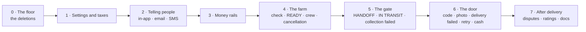

# Building the flow, v2 — the order of work

*What gets built first, what next, and what you can do end to end after each step. Engineering's proposal, 10 September, for the CTO to agree before the first PR. Builds [The order → delivery flow, v2](order-delivery-flow-v2.md).*

## The rules every step follows

- **Small, focused PRs.** One thing each. Nothing lands that cannot be shown working over real HTTP against a running app the same day.
- **Testable end to end after every step.** The whole flow — place, accept, ready, crew, collect, deliver, pay — keeps running on `develop` after every merge. A step replaces a piece of the old flow with a piece of the new one; it never leaves a gap.
- **Delete before add.** The first six PRs remove what the flow no longer needs, so everything after is built on a smaller surface.
- **Money last within each step, and never blind.** Any PR that posts to the ledger or decides who may act gets mutation tests: remove the guard, watch the pin fail. Anything that talks to Paystack is verified against Paystack's test keys, confirmed each time.
- **Merged in order.** Each step is a short stack of PRs merged one after another; `develop` stays green and bootable at every point.

## The sequence

| Step | PRs | What it builds | What you can do end to end after it | How it is verified |
| --- | --- | --- | --- | --- |
| **0 · The floor** | A drop the order-history table · B "refund due" gets a single writer · C1 orders carry their own crew and pickup time · C2 the duplicate delivery record and the farm's dispatch button go · C3 a trip's label and times worked out from its orders, with Cancelled for a trip called off before collection · D1 the day-before reminder goes · D2 the packing step goes | Nothing new. Four duplicates removed; two facts moved to the one place that owns them | The old flow, unchanged in behaviour: place, accept, ready, crew, pickup, confirm, cancel from every state, refund. The farm can no longer dispatch or mark "processing" | A: the parked branch's mutation check. B: mutations on every writer of the flag. C1 and C2: mutations on the four crew guards and on the pickup write, plus a drift check proving the two copies agreed before the record went. A live run after every PR, over every actor and state |
| **1 · Settings and taxes** | E1 the settings catalogue underneath — every setting declares what it holds and what is legal; the delivery fee moves onto it · E2a the settings screen — a tab per group, each tab saved all or nothing · E2b every save recorded — who, the old value, the new — and a save locks what it changes · F1 the three Ghanaian levies go; new orders carry no tax · F2 taxes become rows — name, description, percentage, and an on/off switch; a new tax starts off · F3 the platform commission rate on the Finance tab — a change adds a new rate from that moment, so an order already priced keeps its commission | The place later steps read their numbers from, and a tax list that starts empty. Two tabs: Delivery, and Finance for taxes and commission. Each number arrives with the step that uses it, not all at once | Admin changes the delivery fee on the settings screen and the next order uses it. A nonsense value is refused, and a tab holding one bad value saves nothing. Every save appears in the change history, with who made it. Finance adds a tax and the next order is unchanged; switches it on and the next order carries it; switches it off and the one after does not. Finance changes the commission rate and the next order uses it, while an order already placed keeps its own | Live after each PR. E2a: every refusal leaves the stored value and its stamp untouched. E2b: two saves at once, the second waiting for the first and recording its value as the old one. F1: an untaxed order's receipt and credit note. F2: the full add, switch-on, switch-off cycle, and a used tax refusing deletion. F3: a rate change that leaves placed orders alone |
| **2 · Telling people** | X the notification frame — in-app as a real channel beside email and SMS, the feed and its unread count, the category set the flow actually needs, and staff as recipients · Y the twelve messages the flow names and the six that exist, all moved onto it | The one place that decides who hears what, on which channel, and what a person may switch off | A buyer opens a feed and sees every message about their order; switching off SMS for one kind of message stops the text and keeps the record; a field agent is told an order is waiting for a check | Live: every message the flow names, to the right person, on the right channel, with the feed still holding it after both other channels are off |
| **3 · Money rails** | G refunds of a stated amount, with the credit-note line · H the payout run reads the ledger: pays what is owed, skips an order with an open dispute or one still inside its dispute window · I refund a cash buyer by mobile money | The three money moves every later step needs, each usable on its own | Admin refunds part of an order and the ledger and credit note agree. A disputed order is skipped by the payout run; it is paid once resolved. A cash order's refund reaches the buyer's phone | Mutations on all three. G and I against Paystack test keys |
| **4 · The farm** | J the availability check — the agent's form, three photos a line, the derived outcome, Short and Not-available handled, the overdue list · K READY and the crew gate — no check, no crew; the no-field-agent exception; the acceptance and READY deadlines; the crew-assigned text · L the cancellation windows — free until READY plus grace; the penalty from escrow to the farmer; strikes for cash buyers, cash switched off after the limit; farm strikes; Admin/Ops cancel with a fault | The farm side of the decided flow. **Ops can start operating on it:** field agents check, farmers mark READY, Admin/Ops assign crews from the order detail | Accept → check (all four outcomes) → READY → crew → pickup → confirm, online and cash. Cancel in each window and see the right refund and penalty. A buyer with too many strikes is refused cash on delivery | Mutations on L. Live run after L with every window and every check outcome, flows listed and reviewed first |
| **5 · The gate** | M HANDOFF by the farmer, IN TRANSIT by the delivery agent, the alert when one follows the other too slowly · N COLLECTION FAILED — the reasons, nothing taken, the check made void, retry through READY, free cancel while it lasts · O the farmer paid in full after HANDOFF whatever follows, funded by the penalty and by us | Custody as two people's words; the first failure state; the farmer's money settled | The farmer taps HANDOFF, the agent taps IN TRANSIT, the buyer sees "on its way". The crew records a failed collection and the order comes back through READY or is cancelled. An order cancelled after HANDOFF still pays the farmer | Mutations on O. Live run after O |
| **6 · The door** | P the handoff code — sent at placement, verified at the door with no signal · Q the delivery photo, required · R DELIVERY FAILED, the return to the farm, the alerts · S the second attempt — the buyer asks and pays the fee again, or the order is cancelled with a strike · T "cash received" text and the agent's daily cash remittance | The door as decided; every state now has an exit | The full flow, online and cash, with every failure branch: wrong code, no photo, not paid in full, nobody home, a second attempt, a cash day remitted | Mutations on S. **The big live run:** the whole flow end to end, both payment methods, every branch |
| **7 · After delivery** | U disputes — produce or delivery, the payout held, Admin/Ops name the amount and who bears it, the refund follows, the five-day clock · V two ratings · W the API document rewritten; the old flow pages retired | The flow complete | A buyer disputes, Admin/Ops resolve against the farm or against us, the buyer is refunded, the farmer is paid what is left at the next run. Two ratings on one order | Mutations on U. Live run of a dispute through to a mobile-money refund |

Thirty-three PRs. Steps 0 to 3 are deletions, plumbing and the message frame; step 4 is the first thing Operations can use; step 6 is the first time the whole decided flow exists.

## Where each PR stands

The one place that says what is finished. A PR is **Done** only once it is merged, and the number beside it is the evidence — open it and you see what was built, how it was tested and what was observed running. Updated twice per PR: when it opens, and when it merges.

| Step | PR | What it does | Status | Evidence |
| --- | --- | --- | --- | --- |
| 0 · The floor | A | the order-history table goes | **Done** | #224 |
| 0 · The floor | B | "refund due" gets a single writer and a guard | **Done** | #226 |
| 0 · The floor | C1 | orders carry their own crew and pickup time | **Done** | #227 |
| 0 · The floor | C2 | the duplicate delivery record and the farm's dispatch button go | **Done** | #228 |
| 0 · The floor | C3 | a trip's label and times are worked out from its orders | **Done** | #229 |
| 0 · The floor | D1 | the day-before reminder goes | **Done** | #230 |
| 0 · The floor | D2 | the packing step goes | **Done** | #231 |
| 1 · Settings and taxes | E1 | every setting declares what it holds and what is legal; the delivery fee moves onto it | **Done** | #233 |
| 1 · Settings and taxes | E2a | the settings screen — a tab per group, saved all or nothing | **Done** | #234 |
| 1 · Settings and taxes | E2b | every save recorded — who, the old value, the new — and a save locks what it changes | **Done** | #235 |
| 1 · Settings and taxes | F1 | the three Ghanaian levies go; new orders carry no tax | **Done** | #236 |
| 1 · Settings and taxes | F2a | a tax is a row, and an order is charged every active one; the catalogue starts empty | **Done** | #237 |
| 1 · Settings and taxes | F2b | finance maintains taxes — the list, adding one, switching it on and off, deleting one never used | **In review** | #238 |
| 1 · Settings and taxes | F3 | the platform commission rate on the Finance tab | Not started | — |
| 2 · Telling people | X | the notification frame — in-app beside email and SMS, the feed, the categories, staff as recipients | Not started | — |
| 2 · Telling people | Y | the eighteen messages the flow names, moved onto the frame | Not started | — |
| 3 · Money rails | G | refunds of a stated amount, with the credit-note line | Not started | — |
| 3 · Money rails | H | the payout run reads the ledger and skips a disputed order | Not started | — |
| 3 · Money rails | I | refund a cash buyer by mobile money | Not started | — |
| 4 · The farm | J | the availability check — the form, the photos, the outcomes, the overdue list | Not started | — |
| 4 · The farm | K | READY and the crew gate, with the acceptance and READY deadlines | Not started | — |
| 4 · The farm | L | the cancellation windows, the penalty, and strikes | Not started | — |
| 5 · The gate | M | HANDOFF by the farmer, IN TRANSIT by the delivery agent, and the alert between them | Not started | — |
| 5 · The gate | N | COLLECTION FAILED — reasons, the check made void, retry through READY | Not started | — |
| 5 · The gate | O | the farmer paid in full after HANDOFF, whatever follows | Not started | — |
| 6 · The door | P | the handoff code — sent at placement, verified at the door with no signal | Not started | — |
| 6 · The door | Q | the delivery photo, required | Not started | — |
| 6 · The door | R | DELIVERY FAILED, the return to the farm, the alerts | Not started | — |
| 6 · The door | S | the second attempt — the buyer asks and pays again, or the order is cancelled with a strike | Not started | — |
| 6 · The door | T | "cash received" and the agent's daily cash remittance | Not started | — |
| 7 · After delivery | U | disputes — the payout held, Admin/Ops name the amount and who bears it | Not started | — |
| 7 · After delivery | V | two ratings | Not started | — |
| 7 · After delivery | W | the API document rewritten; the old flow pages retired | Not started | — |

Twelve of thirty-three are merged. **#232 is not one of them:** it corrected a Javadoc about the buyer's cancellation window, found while building step 0.

## What changed since 10 September

This page is the living order of work, so it is corrected as the CTO decides and as the work lands. Six corrections so far, four to step 0 and two to step 1.

- **"Refund due" is stored with a single writer, not derived.** Decided by the CTO during B, 12 September. The flag now has exactly one writer called from every path that can change the answer, and a report-only check that names any order where the flag and the refund records disagree. The reason to store it stands on its own: an admin list that filters on it should not re-run a derivation per row, and one writer is easier to prove correct than a rule copied into every reader. Nothing is derived twice either way.
- **C became three PRs, and the run's status is still stored.** C1 put the crew and pickup time on the order and proved the copies agreed; C2 deleted the duplicate record and the farm's dispatch button. Deriving the run's status turned out not to be needed for either, so it is C3 and still to do. It is worth keeping inside step 0 rather than deferring: it is a deletion, the surface shrinks before everything after it, and the stranded-run problem Operations sees today comes from that stored status being the authority.
- **A trip called off before the van went reads Cancelled.** Decided by the CTO on 13 September, with two smaller answers alongside it: a finished trip that gets a new order reads In progress, and a trip's start and finish times are worked out from its orders rather than removed. All three are questions 44 to 46 on the [working-answers page](order-delivery-flow-v2-working-answers.md). They settle what C3 builds; they do not move it in the order.
- **D became two PRs.** The day-before reminder and the packing step shared nothing, so they shipped separately (#230, #231) rather than as one change carrying a farmer-visible button removal alongside a dormant job.
- **F2 became two PRs.** As specced it was a table, four permissions, five admin routes, an audit event, the pricing change and a test-isolation rule in one change — the size that was split once already, for E2. **F2a** makes a tax a row and prices every active one, with a catalogue that ships empty and that nothing can add to, so no price can move. **F2b** is the surface finance uses: the list, adding a tax, switching it on and off, and deleting one never used. Step 1 is seven PRs, and thirty-three in all.
- **Step 1 is six PRs, and the screen saves a whole tab.** The web app's settings screen is a tab per group with one Save button, so saving is per tab and all or nothing: one bad value and nothing on the tab is stored (E2a, #234). The record of each save and the lock that keeps it true became their own PR, E2b, so the screen could ship without them; today's fee save had neither, so nothing regresses in between. Asked by the CTO on 13 September to decide what else the screen should carry, engineering added **commission as F3**, because every order already reads it, on a Finance tab beside taxes. The other fields stay off: **minimum order** waits for launch and two answers only Operations can give (per farm or per basket; before or after the fee); **supported regions** are never a setting, because zones already decide where CropDoor operates; **maintenance mode** is not a switch inside the app, because it would have to keep payment webhooks and admin login working; **new registrations** waits for launch planning, because signup has several doors and a switch that misses one lies. **No Security tab:** multi-factor rules stay in role management, and token lifetimes and rate limits in deployment settings, so one compromised admin cannot weaken security for everyone. Two answers from the CTO the same day: the delivery fee has **no business ceiling** until Operations or finance want one, and **a save that changes nothing still appears in the history**, so it answers who saved a setting and when.
- **Step 1 is four PRs, not two, and does not register every number at once.** Decided by the CTO on 13 September (questions 49–55). A setting arrives with the step that reads it, because one Ops can change that nothing consults looks like it works. The settings catalogue and its screen split in two, and so do taxes: the three levies are deleted first, then the tax list is built — delete before add, as in step 0.

## Why this order

- **Deletions first** because every later PR is smaller and safer on the reduced surface, and because the four deletions were already audited on 2 September.
- **Settings before anything that reads a number**, so no step ships with a number hardcoded and moved later.
- **Telling people before anything that has something to tell them.** The decided flow names eighteen messages and **five** of them exist (eleven messages fire today, but five of those eleven — the two admin-cancellation notices and all three dispute notices — are not on the decided list at all, and step 2 has to decide whether each is kept, folded in, or dropped). Without a frame, each later step invents its own message, its own channel and its own opt-out, and the platform ends up with eighteen local decisions instead of one design. Money is the first step with something to say — a refund, cash received — so the frame goes before it. **In-app is new**: today a message exists only as a sent email or text, so if a person switches both off nothing survives and "what did we tell this buyer?" has no answer.
- **Money rails before the transitions that post** — but each rail is usable on its own the day it lands, through an admin action, so it is tested end to end and not "callable but unused".
- **The farm before the door** because it is where the old flow is weakest (no check, no gate on the crew) and where Ops can start operating soonest. Between steps 3 and 4 the old pickup button still moves an order to IN TRANSIT, so the flow never has a gap.
- **Disputes last** because they read everything before them: the delivery photo, the check photos, the farmer's payable, the refund rails.

## What has to be true before the first PR

- The [decided flow](order-delivery-flow-v2.md) stays as decided. Any change there reorders this page, not the other way round.
- The engineering spec behind this page has had its review round. It is the local design document engineering builds from; this page is the agreement on the order.
- A plan per step, listing each PR's tasks, files, tests, mutations and live-verify flows, written and reviewed before that step starts — step 0's is drafted.
