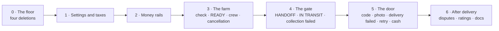

# Building the flow, v2 — the order of work

*What gets built first, what next, and what you can do end to end after each step. Engineering's proposal, 10 September, for the CTO to agree before the first PR. Builds [The order → delivery flow, v2](order-delivery-flow-v2.md).*

## The rules every step follows

- **Small, focused PRs.** One thing each. Nothing lands that cannot be shown working over real HTTP against a running app the same day.
- **Testable end to end after every step.** The whole flow — place, accept, ready, crew, collect, deliver, pay — keeps running on `develop` after every merge. A step replaces a piece of the old flow with a piece of the new one; it never leaves a gap.
- **Delete before add.** The first four PRs remove what the flow no longer needs, so everything after is built on a smaller surface.
- **Money last within each step, and never blind.** Any PR that posts to the ledger or decides who may act gets mutation tests: remove the guard, watch the pin fail. Anything that talks to Paystack is verified against Paystack's test keys, confirmed each time.
- **Merged in order.** Each step is a short stack of PRs merged one after another; `develop` stays green and bootable at every point.

## The sequence

| Step | PRs | What it builds | What you can do end to end after it | How it is verified |
| --- | --- | --- | --- | --- |
| **0 · The floor** | A drop the order-history table · B derive "refund due" · C orders own their crew and pickup time; the duplicate delivery record, the stored run status and the farm's dispatch button go · D drop the packing step and the day-before reminder | Nothing new. Four duplicates removed; two facts moved to the one place that owns them | The old flow, unchanged in behaviour: place, accept, ready, crew, pickup, confirm, cancel from every state, refund. The farm can no longer dispatch or mark "processing" | A: the parked branch's mutation check. B and C: mutations on refund derivation and on stock restore by disposition. One live run after C over every actor and state |
| **1 · Settings and taxes** | E the settings catalogue — every number Ops sets, grouped, with defaults, bounds and an audit trail · F the tax catalogue — name, description, percentage, on or off; shipped empty | The place every later step reads its numbers from. Produce tax switched off | Admin changes the delivery fee in the grouped settings screen and the next order uses it. Admin adds a tax and the next order carries it; removes it and the next order does not | Live: order totals before and after; a receipt for an order placed under the old levies still reads |
| **2 · Money rails** | G refunds of a stated amount, with the credit-note line · H the payout run reads the ledger: pays what is owed, skips an order with an open dispute or one still inside its dispute window · I refund a cash buyer by mobile money | The three money moves every later step needs, each usable on its own | Admin refunds part of an order and the ledger and credit note agree. A disputed order is skipped by the payout run; it is paid once resolved. A cash order's refund reaches the buyer's phone | Mutations on all three. G and I against Paystack test keys |
| **3 · The farm** | J the availability check — the agent's form, three photos a line, the derived outcome, Short and Not-available handled, the overdue list · K READY and the crew gate — no check, no crew; the no-field-agent exception; the acceptance and READY deadlines; the crew-assigned text · L the cancellation windows — free until READY plus grace; the penalty from escrow to the farmer; strikes for cash buyers, cash switched off after the limit; farm strikes; Admin/Ops cancel with a fault | The farm side of the decided flow. **Ops can start operating on it:** field agents check, farmers mark READY, Admin/Ops assign crews from the order detail | Accept → check (all four outcomes) → READY → crew → pickup → confirm, online and cash. Cancel in each window and see the right refund and penalty. A buyer with too many strikes is refused cash on delivery | Mutations on L. Live run after L with every window and every check outcome, flows listed and reviewed first |
| **4 · The gate** | M HANDOFF by the farmer, IN TRANSIT by the delivery agent, the alert when one follows the other too slowly · N COLLECTION FAILED — the reasons, nothing taken, the check made void, retry through READY, free cancel while it lasts · O the farmer paid in full after HANDOFF whatever follows, funded by the penalty and by us | Custody as two people's words; the first failure state; the farmer's money settled | The farmer taps HANDOFF, the agent taps IN TRANSIT, the buyer sees "on its way". The crew records a failed collection and the order comes back through READY or is cancelled. An order cancelled after HANDOFF still pays the farmer | Mutations on O. Live run after O |
| **5 · The door** | P the handoff code — sent at placement, verified at the door with no signal · Q the delivery photo, required · R DELIVERY FAILED, the return to the farm, the alerts · S the second attempt — the buyer asks and pays the fee again, or the order is cancelled with a strike · T "cash received" text and the agent's daily cash remittance | The door as decided; every state now has an exit | The full flow, online and cash, with every failure branch: wrong code, no photo, not paid in full, nobody home, a second attempt, a cash day remitted | Mutations on S. **The big live run:** the whole flow end to end, both payment methods, every branch |
| **6 · After delivery** | U disputes — produce or delivery, the payout held, Admin/Ops name the amount and who bears it, the refund follows, the five-day clock · V two ratings · W the API document rewritten; the old flow pages retired | The flow complete | A buyer disputes, Admin/Ops resolve against the farm or against us, the buyer is refunded, the farmer is paid what is left at the next run. Two ratings on one order | Mutations on U. Live run of a dispute through to a mobile-money refund |

Twenty-three PRs. Steps 0 to 2 are deletions and money plumbing with no new screen for anyone; step 3 is the first thing Operations can use; step 5 is the first time the whole decided flow exists.

## Why this order

- **Deletions first** because every later PR is smaller and safer on the reduced surface, and because the four deletions were already audited on 2 September.
- **Settings before anything that reads a number**, so no step ships with a number hardcoded and moved later.
- **Money rails before the transitions that post** — but each rail is usable on its own the day it lands, through an admin action, so it is tested end to end and not "callable but unused".
- **The farm before the door** because it is where the old flow is weakest (no check, no gate on the crew) and where Ops can start operating soonest. Between steps 3 and 4 the old pickup button still moves an order to IN TRANSIT, so the flow never has a gap.
- **Disputes last** because they read everything before them: the delivery photo, the check photos, the farmer's payable, the refund rails.

## What has to be true before the first PR

- The [decided flow](order-delivery-flow-v2.md) stays as decided. Any change there reorders this page, not the other way round.
- The engineering spec behind this page has had its review round. It is the local design document engineering builds from; this page is the agreement on the order.
- A plan per step, listing each PR's tasks, files, tests, mutations and live-verify flows, written and reviewed before that step starts — step 0's is drafted.
