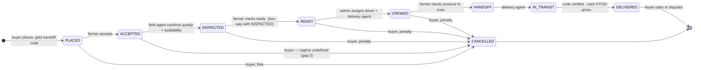

# The team's flow (v2) — gap analysis

*Engineering version. The [questions page](order-delivery-flow-v2-questions.md) carries the same findings in plain language for Operations and leadership; the questions themselves are identical.*

On 7 September the team came back with the flow they want. **That flow is the design, built from first principles; the current code is legacy that will be reworked to fit it.** This analysis treats the flow on its own terms and uses the code only for facts about the world it has had to learn — that Paystack refunds are asynchronous, that drivers may have no account, that agents work offline, that a delivery address can already name a representative. Where a file is cited, it is for one of those facts, never for "what the code does today".

Everything here supersedes the earlier [order → delivery flow](order-delivery-flow.md) page as a description of intent. That page stays as the record of what exists and what the deletion audit found.

## The flow, verbatim

1. Buyer makes an order, gets a **handoff code**.
2. Farmer accepts order. Buyer can cancel **without penalty** until step 2 is done.
3. **Field agent** goes to confirm produce quality and availability.
4. **Two-way sign-off**: field agent confirms order state/quality; farmer marks order as **READY**. Buyer cancelling at this step **attracts a penalty**.
5. Order is assigned to a delivery **crew** (delivery agent + driver) after farmer marks READY.
6. Farmer hands the order to the crew, marking **HANDOFF**. Buyer **cannot cancel after handoff**.
7. Delivery agent marks the order **IN TRANSIT**. Buyer sees it in transit.
8. Delivery agent marks the order **DELIVERED**, takes a **photo**. If POD, the agent **must take money before hand-over**.
9. Buyer can **rate** the farm or raise a **dispute**.

**Handoff code:** a two-way code verifying the order reached the right buyer. The agent asks the buyer for it and enters it before handing over.

*Drawn as stated. `INSPECTED` and `CREWED` are shown as states for legibility; whether they are states or facts about `ACCEPTED`/`READY` is one of the first-principles questions below. No admin cancellation, no rejection path, and no farmer-side cancellation appear because the flow does not mention them.*

## First principles — where the shape may be wrong

### 1. The inspection certifies the wrong thing at the wrong moment, and two farm-gate sign-offs are probably one event

Step 3 has the agent confirm "quality and availability"; step 4 opens the buyer's penalty window on the strength of it; step 6 has a *different* two-way sign-off hours or a day later when the crew arrives. Ask what the agent is looking at. If produce is harvested to order, the crate does not exist until the farmer packs it — an inspection before READY is of standing crop and certifies nothing about what goes in the van. If the inspection is of the packed crate, it happens *at* READY, and the agent at the gate is the natural person to receive it: steps 3, 4 and 6 collapse into one moment with one two-way sign-off. The flow currently sends a platform person to the farm twice per order and trusts that nothing changes between visits.

The one argument for a separate earlier visit is scale — one visit can cover many orders — but then the visit is per farm per day, and the flow draws it per order.

**A third geometry the flow omits:** the model already has aggregation points — "the shed or warehouse within a zone where farmers bring produce that a van cannot collect at the farm" (`AggregationPoint`). Farmer → shed → van. There the "farm gate" sign-off happens at the shed, possibly with no farmer present, and the field agent may *be* the shed.

### 2. Nobody owns the moment between DELIVERED and the farmer being paid

Step 8 turns escrow into "owed to farmer"; step 9 lets the buyer dispute. The flow never says what a dispute does to the money. Facts about the world as built: payouts are per delivered order, admin-triggered, behind a clearance window an admin may override (`PayoutTransactionalSteps`); the dispute window is 7 days (`cropdoor.disputes.window-days`); **nothing links the two**. A refund after payout becomes a clawback against the farmer's future payouts (`ChargebackServiceImpl`, `LedgerPostings`) — which a farmer with no next order never repays.

The flow's own additions change what a dispute *is*. With a code and a photo, "never received" is closed; what remains is quality and quantity — and quality was certified by the platform's own field agent at step 3. A buyer disputing quality is disputing a CropDoor employee's signature. The flow puts a certifier in the chain and gives the certification no consequence.

**Missing entirely: a rejection path.** No outcome exists for "the platform refused the crate at the gate" or "the buyer refused the crate at the door" — the two most common real exceptions.

### 3. HANDOFF and IN_TRANSIT are two states for one event, and the two-way handoff cannot be two-way as drawn

Between step 6 and step 7, what decision does anyone make? Custody changed once, at the gate — that is the fact that ends the buyer's cancel right, moves stock liability, and answers "where is the produce". "The van left" is a fact about the *run*; an order-level IN_TRANSIT tap can be forgotten, and if DELIVERED requires it, the forgotten tap blocks a real delivery. **HANDOFF is the order's custody fact; IN_TRANSIT is a view over the run.**

As for "two-way": the driver has no account (`driver_profiles.user_id` nullable since V100) and the farmer may have no smartphone. In practice the delivery agent taps both sides — one party's word. The team solved exactly this at the *buyer's* door with a code held by the receiving party and entered by the agent, and did not apply it at the *farm* gate, where "I gave ten" / "I received eight" is at least as likely and the farmer is the weaker party.

## Holes, ranked

| # | Scenario | What breaks | Step |
|---|---|---|---|
| 1 | Buyer refuses at the door / is absent | No state, outcome or owner. Buyer cannot cancel after HANDOFF, so cannot end it. Farmer did everything right — paid? | 8 |
| 2 | POD buyer short / partial / disputes price at the door | Payment is yes/no (`settlePodPaymentOnDelivery`); no partial, no balance owed, no shrink-at-door. Agent's only move is to walk away → hole 1 | 8c |
| 3 | Cancellation regime between ACCEPTED and READY undefined | The longest window, and the farmer may already have harvested. Each side assumes the rule that favours them | 2–4 |
| 4 | Penalties are one-sided | Farmer accepts, then cancels or fails to hand over — pays nothing. No farmer penalty, no buyer compensation, no failed-pickup state | 2, 4, 6 |
| 5 | Farmer without a smartphone | Three farmer taps; only an SMS rail exists. Either the farm cannot participate or an agent taps for them — every two-way becomes one-way | 2, 4, 6 |
| 6 | Door sequence unordered | Cash, code, hand-over, photo — when is DELIVERED written? Code-then-refuse = delivered unpaid. Cash-then-code-fails = cash held for an undelivered order. Photo is of the *delivered* order — a refusal has none | 8 |
| 7 | Buyer present, cannot show the code | Dead phone; SMS never arrived (Ghana deliverability is imperfect); sent five days ago at placement. No fallback named | 1b, 8b |
| 8 | Same buyer, same day, several farms | A basket fans into one order per farm (`Order` is single-farm). N codes, N photos, N POD amounts at one door | 1b, 8 |
| 9 | Same farm, several orders, one run | N READY + N HANDOFF sign-offs for one stack. The agent signs once; the system records six — the per-order sign-off is fiction | 4, 6 |
| 10 | No time budget after READY | A paid buyer whose order sits READY four days waiting for a van is in the *penalty* window, punished for the platform's delay. Produce ages | 4c, 5 |
| 11 | Van breaks down mid-run with orders handed off | Custody is the platform's; buyer cannot cancel; no re-crew step. Admin cancellation and disposition unmentioned | 6–8 |
| 12 | Buyer rates *the farm* for a delivery the platform performed | Ratings aggregate onto the farm; LATE_DELIVERY is a dispute type. Feedback points at the wrong party | 9 |
| 13 | Field-agent coverage | Agents are zone-based; visit is per order. A zone with no agent this week stalls every order at step 3 with buyers locked out of free cancel | 3 |
| 14 | "Availability" is per listing | Stock is deducted at placement from a number the farmer typed. A short farm is short for every open order on that listing | 3 |
| 15 | Dispute on a POD order | Buyer paid cash to a person; "refund" means the platform pays from float and claws back. Needs a pay-to-buyer rail and "has the cash been banked yet" | 9 |
| 16 | Cancel/accept race at the step-2 boundary | Buyer's screen said "pending"; response says "penalty". A hard edge on an event the buyer cannot see | 2b |

Deliberately not listed: rain (a quality dispute, already covered), gate guards (the representative case), photo-consent objections (unlikely to matter here).

## Adversarial — who cheats, and whether the flow stops it

| Party | Move | Stopped? |
|---|---|---|
| POD buyer | Orders with no intent to pay; refuses at the door | **No.** "Money before hand-over" protects the produce, not the harvest, the visit or the fuel. The penalty is unenforceable — nothing to deduct from. Cash buyers are penalty-immune; only after-the-fact suspension remains |
| Online buyer | Cancels at step 4 to hurt a farmer | Yes, if the penalty is priced to cover the harvest |
| Buyer | Gives the code, takes the produce, disputes | Relocated to adjudication, correctly. The code closes only "not received" |
| Buyer | Pays online, receives, charges back | Helped, not stopped — code + photo are defence evidence |
| Farmer | Accepts with no produce | Step 3 catches it — the flow's best new control. Costs the farmer nothing (hole 4) |
| Farmer | Substitutes after inspection | **No.** Nothing between step 4 and step 6 inspects (first-principles 1) |
| Farmer / agent | Short-weights at handoff | **No.** Only one party writes; the flow cannot tell who is lying |
| Delivery agent | Confirms without delivering | Stopped (cannot know the code) — except the phone-call version |
| Delivery agent | Delivers without confirming, or pockets POD cash and confirms "collected" | **No.** The agent enters the code; it proves the agent met the buyer, not that anything was submitted or remitted. Cash posts as platform cash on confirmation with no remittance step. The buyer has no action and no receipt |
| Field agent | Signs off bad produce for a consideration | **No.** The farmer bears the outcome of the platform's signature |
| Agent + buyer | Code given, produce split, "short" dispute | Code satisfied; only photo + adjudication remain |
| Agent + farmer | HANDOFF for produce that never existed | **Stopped** at step 8 unless the buyer colludes too — the code does its job |
| One person, three hats | Field agent + delivery agent + confirmer in a thin zone | **No.** One permission set may hold both roles today; that person controls three of four gates |

## Money — every question the flow raises and does not answer

**The penalty, by combination:**

| Payment | Escrow held | Recipient | What it forces |
|---|---|---|---|
| Online | yes | farmer | A **partial refund** (refunds are full-amount only; a mismatch parks as `NEEDS_ATTENTION` — `RefundServiceImpl`) and a farmer payable on an undelivered order (payouts are per *delivered* order). The farmer also keeps the produce — double compensation? |
| Online | yes | platform | Simplest to book; the farmer who harvested bears the loss. Is a cancellation fee taxable (VAT/levies)? |
| Online | yes | split | Two lines, two recipients, one partial refund, and a rule the buyer can see |
| Online | no | — | Only reachable on a `DISPUTED` payment; rare enough to park |
| POD | never | anyone | **A debt.** No buyer-receivable exists. Collect how — next order, mobile-money request, block ordering? A buyer with no next order never pays |

Also: does the penalty step up once a crew is assigned (fuel is sunk)? Is it waived when the platform missed its own timeline? What document does the buyer get for it? Is it refundable if the farmer then fails?

**POD at the door.** Short / partial / "tomorrow": refuse (hole 1), carry a debt, or shrink the order (farmer loses)? Who decides, on the doorstep? **Cash custody:** the flow says "take money" and never says when it is remitted, to whom, against what record — or what the book says between "collected" (posted immediately as platform cash) and "banked". Month-end cannot see that gap.

**Dispute vs payout.** Does a dispute freeze "owed to farmer"? Silent. The clearance and dispute windows are both 7 days, so an *undisputed* order becomes payable exactly as the window closes — but an admin may pay early. A dispute raised day 6, resolved day 12, spans the payout; the refund becomes a clawback the platform funds now and hopes to recover. Dispute outcomes are labels with no money attached (`DisputeOutcome`: `REFUND_PARTIAL`, `GOODWILL_CREDIT`, `REPLACEMENT` have no rail; there is no buyer credit balance).

**Farmer- and platform-side failure.** Farmer cancels after READY: buyer compensated? Fee refunded? Van breakdown: farmer paid for produce the platform lost? Buyer refuses at the door: who books the loss?

**The gateway fee.** Paystack does not return its fee on a refund (deliberately not reversed — `LedgerPostings`). Every "free" online cancellation after payment costs the platform ~2%. Free-until-acceptance is free for the buyer, not for CropDoor.

**Escrow duration.** Orders parked at READY or HANDOFF for weeks hold buyer money indefinitely. Is there a maximum?

## Stalls

| Order sits at | Because | Money | Produce | Who notices |
|---|---|---|---|---|
| Awaiting acceptance | Farmer never responds | escrow held | none | buyer, eventually; no expiry |
| Accepted, awaiting agent | no agent / backlog | escrow held; cancel regime undefined | may be harvested | nobody with a dashboard |
| READY, no crew | zone unstaffed | escrow held; buyer in penalty window | harvested, ageing | ops, if they look |
| Van at the gate, no handoff | farmer absent / produce short | escrow held | at the farm or nowhere | the agent — with no "failed pickup" action |
| HANDOFF, never IN_TRANSIT | forgotten tap | escrow held | in the van | buyer sees "handed off" forever |
| IN_TRANSIT, never DELIVERED | refused; or capture never synced (72h ceiling, `app.field-ops.capture.max-age-hours`); or agent left | escrow held; farmer unpaid | eaten or rotting | farmer eventually; buyer never |
| DELIVERED, dispute OPEN | farm never responds; SLA sweep off by default | payable sitting or already paid | gone | buyer only |
| DELIVERED, POD cash not remitted | agent holds it | books say platform has it | gone | **nobody — no state exists** |
| Refund parked | provider needs buyer details | buyer unpaid | — | admin queue; buyer not told |
| POD penalty owed | no collection rail | debt unrecorded | — | nobody |

## Assumptions the flow takes for granted

Handoff is at the farm gate (not a shed). One visit = one order. Field and delivery agent are different people. The farmer has a smartphone, data at the gate, and is present. The buyer who ordered opens the door with a working phone (the address already carries `contactName`/`contactPhone` — whose code does a representative give?). One order = one crate = one door = one code. Produce is inspectable before packing and does not change after. Cancelled stock can go back on the shelf (harvested perishables cannot). Payment is all-online or all-cash — no deposit, which is why a POD penalty has nothing to bite on. Only buyers dispute (a short-paid farmer, a refused crate, a robbed agent — no channel). Delivery agents are trusted employees, not gig workers. The platform meets the chosen date. SMS arrives. Someone is notified at each new step — today farmers hear of new orders and cancellations only (`OrderNotificationAssembler`); READY, crew assignment and handoff notify nobody; dispute updates are email-only.

## Strengths

Custody is named. Cancellation cost tracks real cost. Platform eyes on produce before a van is sent. The code closes "never received" and the worst insider fraud. The photo is free evidence. "Cash before hand-over" is said aloud. Crew after READY — no van for unready produce. The farmer's job ends at the gate. IN_TRANSIT is buyer-visible (even if it should be derived). The operation's own words.

## Questions for Operations and leadership

The full list, in plain language, is on the [questions page](order-delivery-flow-v2-questions.md#questions-for-the-next-meeting). It is the deliverable; this page exists so engineering can see where each question came from.

## Principles carried into the rebuild

Not "today's code" — lessons the code taught, which hold regardless of what the flow becomes:

- **One fact, stored once.** As many states as the flow needs; a status *and* a timestamp for the same event is the drift bug the deletion audit spent a week removing.
- **Money reads the ledger, not a flag.** Escrow, penalty, refund, payout — all postings.
- **Stock moves at most once per order.**
- **Every transition has a named actor, a stated precondition, its own side effects, and a test driving the real endpoint.** A two-way sign-off without a stated tie-break is a stall waiting to happen.
- **Delete before add.** The rebuild starts from the deletion audit's floor.
