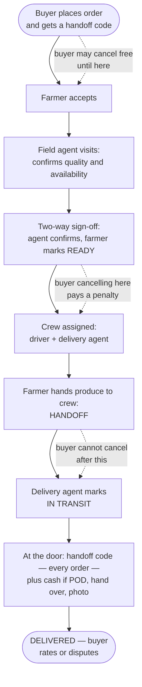

# The flow you described — and the questions it raises

*For Operations and leadership. Follows the meeting of 7 September. The [full gap analysis](order-delivery-flow-v2-gap-analysis.md) has the same findings with the engineering detail attached.*

We took the flow you described and put it through a hard review — thinking as the operations manager on the worst day, the fraud analyst, the farmer who gets cheated, the buyer who gets cheated, and the accountant closing the month. This page is what came out: first, what the flow gets right; then the questions we need answered before it can be built.

**Nothing here is a decision.** These are the gaps we found. Some will turn out to be non-issues once you tell us how things actually work on the ground. Some will change the flow.

## The flow, as you described it

## What this flow gets right

Before the questions — because this is a better flow than the one we had, and it's worth saying why.

- **It names the moment custody changes hands.** "Handoff" makes "the produce left the farm" an explicit act with a signer. Stock, cancellation and liability all hang on that moment; the old flow blurred it.
- **Cancellation cost tracks real cost.** Free while nothing has happened; a penalty once the farmer has committed; impossible once we hold the goods. Those are the right three windows.
- **We see the produce before a van is sent.** The field-agent visit turns "the farmer says" into "we saw". It is the only control in either flow against a farmer accepting an order they can't fill.
- **The handoff code closes a whole class of complaint** — "I never received it" — and the single most damaging insider fraud: an agent confirming a delivery that didn't happen. It applies to **every** order, paid online or cash on delivery; it verifies the *delivery*, not the payment.
- **The photo is evidence at zero cost**, taken by the person with the least reason to fake it in the buyer's favour.
- **The farmer's job ends at the gate.** Everything after is ours, which is how the operation actually runs.
- **It uses the operation's own words** — crew, field agent, handoff, READY — so ops and engineering will be arguing about the same thing.

## Three places the shape itself may be wrong

These are bigger than gaps. They're places where we think the flow might have a step in the wrong place, or two steps that are really one.

!!! question "1. Is the field agent inspecting the right thing, at the right time — and are two farm-gate visits really one?"
    The agent visits to confirm quality *before* the farmer marks READY. Then, later, the crew comes to collect. Two trips to the farm per order.

    Ask what the agent is looking at. If produce is harvested to order — most of what we move — the crate doesn't exist until the farmer packs it. An inspection before READY is of standing crop, and says nothing about what goes in the van. If the inspection is of the *packed* crate, then it happens at READY — and the agent standing at the gate is the natural person to receive it. Steps 3, 4 and 6 collapse into one moment: farmer hands over, we inspect and accept.

    Also: do farmers ever bring produce to a shed or collection point instead of the van coming to the farm? If so, the handoff happens at the shed, possibly with no farmer present — a geometry the flow doesn't mention.

!!! question "2. Nobody owns the moment between DELIVERED and the farmer being paid."
    The buyer can dispute after delivery. The farmer is paid at the next payout run. The flow never says what a dispute does to that money — does it pause the payout? For how long? If we've already paid, do we take it back from the farmer's next sale, knowing some farmers won't have one?

    And the flow's own additions change what a dispute *is*. With a code and a photo, "I never got it" is closed. What remains is quality and quantity — and **quality was certified by our own field agent**. A buyer disputing quality is now disputing a CropDoor employee's signature as much as the farmer's produce. If our agent was wrong, does the farmer still pay for it?

    Also missing entirely: **a rejection path.** The flow has no outcome for "we refused the crate at the gate" or "the buyer refused the crate at the door" — the two most common real exceptions — and no one owns what happens to produce and money when either occurs.

!!! question "3. HANDOFF and IN TRANSIT are two labels for one event, and the 'two-way' handoff may not be two-way."
    Between "farmer hands to crew" and "agent marks in transit", what decision does anyone make? Custody changed once, at the gate. "The van left" is a fact about the *run*, not the order — and a tap the agent can forget, which would block a real delivery if the next step requires it.

    As for two-way: the driver has no account, and the farmer may have no smartphone. In practice the delivery agent taps both sides — which is one party's word, not two. You solved exactly this problem at the *buyer's* door with the handoff code. The same idea isn't applied at the *farm* gate, where "I gave ten crates" / "I received eight" is at least as likely, and the farmer is the weaker party.

## The gaps, ranked by how soon they'd bite

| | What happens | What the flow doesn't say |
|---|---|---|
| 1 | **The buyer refuses at the door, or isn't home.** The van arrives; the buyer says no, or the gate is shut. Produce is in our hands, perishable, with nowhere to go. | Is the order delivered, cancelled, or re-attempted — and who pays the second trip? The buyer can't cancel after handoff, so *the buyer can't even end it*. The farmer did everything right — are they paid? |
| 2 | **A cash-on-delivery buyer is short, or offers part.** "Money before hand-over" gives the agent one move: walk away with the produce — which is gap 1. | Partial payment? A balance owed? Shrink the order at the door? Cash disputes at doorsteps are routine, not rare. |
| 3 | **Cancelling between "accepted" and "READY" is undefined.** Free "until accepted", penalty "at READY" — but the wait for the field agent, possibly days, is neither. It is the *longest* window, and the farmer may already have harvested. | Buyer and farmer will each assume the rule that favours them. |
| 4 | **Penalties are one-sided.** A farmer can accept (closing the buyer's free window), then cancel or fail to hand over — and pay nothing. The buyer waited days for nothing; our agent's time and fuel are spent. | No farmer penalty, no buyer compensation, no "failed pickup" outcome. |
| 5 | **The farmer has no smartphone.** The flow gives the farmer three taps: accept, READY, handoff. | Either that farm can't participate, or an agent taps for them — silently turning every "two-way" sign-off into one person's word. |
| 6 | **The door sequence is unordered.** Cash, code, hand over, photo — two are "before hand-over", but in what order? | Code first, then the buyer refuses to pay: the order is "delivered" with no cash. Cash first, code fails: the agent holds cash for an undelivered order. And the photo is of the *delivered* order — so a refused delivery has no photo. |
| 7 | **Buyer is present but can't show the code.** Dead phone; the text never arrived; it was sent five days ago at placement and is lost. | "No code, no hand-over" refuses a delivery to the right person at the right door with cash in hand. No fallback is named. |
| 8 | **One buyer, one day, three farms.** Three orders arrive on one van at one door. | Three codes, three photos, three cash amounts, three sign-offs — at the buyer's own gate. Every per-order control multiplies. |
| 9 | **One farm, six orders, one van.** | Six READY sign-offs and six handoff sign-offs for one stack of crates, on a bad connection. Realistically the agent signs once — which means the per-order sign-off is fiction. |
| 10 | **No time limit after READY.** The buyer chose a delivery date; produce is harvested; nothing says how long READY → crew → handoff → delivered may take. | A paid buyer whose order sits READY for four days waiting for a van is in the *penalty* window — punished for our delay — and the produce is ageing in a crate. |
| 11 | **The van breaks down with three orders on it.** Custody is ours; buyers can't cancel; there's no re-crew step. | Who moves the orders to another crew, who cancels, who's refunded, who's paid, where does the produce go? Admin cancellation isn't in the flow at all. |
| 12 | **The buyer rates "the farm" for a delivery we performed.** A rude agent, a late van, a crushed crate — all land on the farmer's score. | Under this flow we do most of the customer-visible work. The feedback points at the wrong party. |
| 13 | **Field-agent coverage.** Agents belong to zones; the visit is per order. | A zone with no agent this week, or one agent with forty orders across twelve farms, can't visit per order. Orders queue at step 3 with buyers locked out of free cancellation. |
| 14 | **"Availability" is per listing, not per order.** If the agent finds the farm short, every other open order on that listing is short too. | The flow treats it as one order's problem. It's a listing's problem, possibly a farm's. |
| 15 | **A dispute on a cash order.** The buyer paid cash to a person. "Refund" means we pay the buyer from our own money and recover it from the farmer. | Needs a way to pay a buyer — and to know whether the cash has even reached us yet. |

## How each party could cheat under this flow

Not because we expect it — because a flow that can't answer these will be gamed by the one person who tries.

**Buyer.** A cash-on-delivery buyer who never intends to pay: places, the farmer harvests, the agent visits, the van drives, the buyer refuses. "Money before hand-over" protects the produce — not the harvest, the visit or the fuel. And **the penalty can't touch them**: there's no money to deduct from. Cash buyers are penalty-immune under this flow. The only real control is suspending them afterwards.

**Farmer.** Accepts with no produce — the field visit catches this, and it's the flow's best new control. But it costs the farmer nothing, and the buyer is already out of the free window while waiting to find out. Substitutes after inspection — the agent sees a good crate; a worse one goes in the van next day. Nothing between inspection and handoff catches it.

**Delivery agent.** Confirms without delivering — the code stops the simple version. Delivers without confirming, or pockets the cash and confirms "collected" — the code does nothing, because **the agent is the one who enters it**. The code proves the agent met the buyer, not that the agent submitted anything or handed over the cash. The buyer has no action of their own at delivery, and no receipt saying "GHS X received".

**Field agent.** Signs off bad produce for a consideration. The buyer disputes; *we* certified it. The farmer bears the outcome of our employee's signature.

**One person wearing all the hats.** In a small zone, the same person may be the field agent who inspects, the delivery agent who collects, and the one who confirms delivery. That person controls three of the four gates. The flow names two roles but draws no line between them.

## What the flow silently assumes

- That handoff happens at the farm gate, not at a shed or collection point.
- That one visit is one order — realistically it's one visit per farm per day, covering many.
- That the field agent and the delivery agent are different people.
- That the farmer has a smartphone, data at the gate, and is personally present.
- That the buyer who ordered is the one who opens the door, with a working phone. (Our delivery addresses already let a buyer name someone else to receive — whose code does *that* person give?)
- That one order is one crate at one door with one code.
- That produce can be inspected before it's packed and won't change afterwards.
- That cancelled stock can go back on the shelf — harvested perishables can't.
- That payment is all-online or all-cash; no deposit. Which is exactly why a cash penalty has nothing to bite on.
- That only buyers raise disputes. A farmer who was short-paid or whose crate was refused, an agent who was robbed — none has a channel.
- That delivery agents are trusted employees, not gig workers. Cash handling rests on it; the code is our check *on* the agent, so it does not.
- That we meet the buyer's chosen date. No step accounts for missing it, and the penalty window doesn't care.
- That text messages arrive. The code, the reminders and every farmer message ride on one channel.
- That someone is told at each new step. Today farmers hear about new orders and cancellations only — nobody is told at READY, crew assignment or handoff.

## Where an order can sit forever, and who would notice

| Stuck at | Because | Who notices |
|---|---|---|
| Waiting for the farmer to accept | Farmer never responds | The buyer, eventually. No expiry. |
| Accepted, waiting for the field agent | No agent in the zone, or a backlog | Nobody with a dashboard. The farmer, if they harvested. |
| READY, no crew | No driver, zone unstaffed | Ops, if they look. The buyer is in the penalty window and can't leave free. |
| Van at the gate, no handoff | Farmer absent, produce not there | The agent — and the flow gives them no "failed pickup" action. |
| Handed off, never marked in transit | Agent forgot the tap | The buyer sees "handed off" forever. |
| In transit, never delivered | Buyer refused; or the confirmation never synced; or the agent left | The farmer (no payout), eventually. The buyer never will. |
| Delivered, cash never handed in | Agent holds it | Nobody — there is no state for it. |
| Penalty owed by a cash buyer | No way to collect | Nobody. |

## Questions for the next meeting

Grouped by theme. Numbered for reference only.

### The farm visit

1. When the field agent visits, are they looking at produce that is already picked and packed, or at what is still growing? If it's still growing, what stops the crate from being different from what they saw?
2. Is the visit once per order, or once per farm on a pickup day covering everything ready that day? How many farms can one agent realistically inspect in a day?
3. If the agent is at the farm anyway to inspect, why not have that same visit be the collection? What is gained by two separate trips?
4. If there's no field agent in a zone this week, does that zone stop selling, or does someone else sign off — and who?
5. If the agent finds the farm is short, that affects every other buyer who ordered from the same listing. Who tells them, and what are they offered?
6. When our agent has certified the quality and the buyer still complains about quality, who is responsible — the farmer, or us?

### The farm gate

7. Do farmers actually have smartphones and data at the gate? If a farmer doesn't, who taps "READY" and "handed over" for them — and are we comfortable that this makes it the agent's word alone?
8. What happens today when the van arrives and the produce isn't there, or is less than ordered, or the farmer is absent? Who decides on the spot, and what happens to the order?
9. Do farmers ever bring produce to a shed or collection point rather than the van coming to the farm? If yes, who signs for the handoff there?
10. Should the farmer have their own code — something they read out to the crew — so a disagreement about what was handed over has two records, not one?

### The door

11. In what order do things happen at the door: cash, code, hand over, photo? What does the agent do if the buyer gives the code and then won't pay?
12. What does the agent do when the buyer is standing there but can't show the code — dead phone, never got the text? Refuse the delivery?
13. How often does a cash buyer come up short or want to pay part? What do agents do today, and what do we want them to do?
14. What happens when nobody is home, or the buyer refuses the crate? Do we try again (who pays), give it to someone else, take it back to the farm, or write it off? Who decides — the agent, a supervisor, someone at the office?
15. If one buyer has ordered from three farms for the same day, do we want to ask them for three codes at their own gate?

### Money

16. Is the cancellation penalty meant to compensate the farmer for the harvest, to deter buyers, or to cover our van cost? The answer decides who receives it — and whether a farmer who keeps the produce should also get the money.
17. How do we collect a penalty from a cash-on-delivery buyer who has never paid us anything?
18. If a farmer accepts and then cancels or fails to hand over, does the farmer pay anything? Does the buyer get anything for the wait?
19. If our van breaks down with produce on it, or we miss the delivery date, is the farmer still paid? Is the buyer refunded the delivery fee? Is the buyer's penalty waived if they cancel because we were late?
20. When an agent collects cash, when and how does it reach us, and how do we know at month-end which cash is still in agents' pockets?
21. If a buyer raises a complaint after delivery, do we pause the farmer's payment until it's settled? For how long? And if we've already paid the farmer, do we take it back from their next sale — knowing some farmers won't have one?
22. When a complaint is settled with "partial refund", "replacement" or "goodwill credit", what actually happens — who moves what money, and who pays for a replacement delivery?
23. A buyer who paid cash and then wins a complaint — how do we pay them back?
24. Does a cancellation fee attract VAT or levies here? What document does the buyer receive for it?

### Time

25. How long may an order wait for the farmer to accept before we cancel it for them?
26. Once the farmer says READY, how quickly must the van collect — same day, next day? Is produce still saleable after that?
27. How long may an order sit "handed off" or "in transit" before someone at the office is alerted? Who is that someone?
28. A buyer taps cancel a moment after the farmer accepted and is told a penalty applies. Do we want a short grace period after acceptance, or a hard line?

### After delivery

29. The buyer rates "the farm" — but the van, the agent and the timing were ours. Should the rating separate the produce from the delivery? Should a farmer be answering a complaint about a late van?
30. Can a buyer both rate and dispute the same order? Should a complaint we uphold change or remove the rating?

### People

31. Will the same person ever be the field agent who inspects, the delivery agent who collects, and the one who confirms delivery? Are we comfortable with one person holding all three?
32. Are delivery agents employees or gig workers? Everything about cash handling and codes depends on the answer.
33. Which of these moments should produce a text message, and to whom: agent is coming; order READY; order handed over; van on the way; delivered; cash received; complaint raised? Farmers don't read email.
