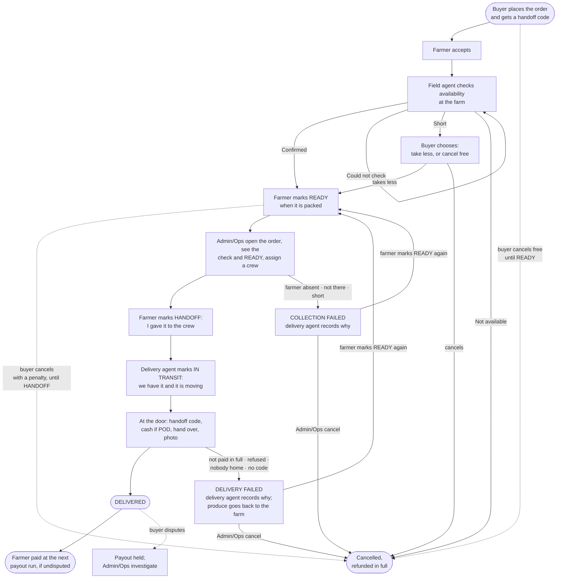
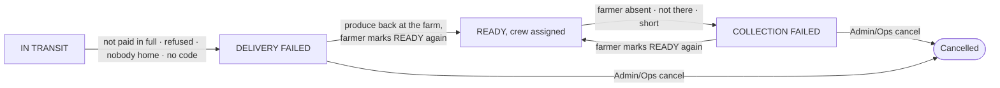

# The order → delivery flow, v2

*The flow as decided on 10 September — the team's 7 September flow plus every answer recorded on the [working-answers page](order-delivery-flow-v2-working-answers.md) since. Every question is decided. Nothing is built from it yet; the build plan comes next.*

## The flow in one picture

Not drawn, to keep the picture readable: the buyer rating the produce and the delivery after DELIVERED; Admin/Ops cancelling at any step; and the one exception to the check-before-crew order — a zone with no field agent, where the delivery agent makes the check at the gate before collecting.

Six actors: **Buyer**, **Farmer**, **Field Agent**, **Delivery Agent**, **Driver**, **Admin/Ops**. The driver is part of the crew and taps nothing. A farmer must have a smartphone: READY and HANDOFF are their own taps, and nobody taps for them.

## Who does what

| Step | Who | What they do | What it means |
| --- | --- | --- | --- |
| 1 | **Buyer** | Places the order. Pays into CropDoor's escrow, or chooses to pay on delivery | The buyer is sent a **handoff code** by text. The produce is set aside for them |
| 2 | **Farmer** | Accepts the order | The order is real. A field agent's check is now due |
| 3 | **Field Agent** | Visits the farm within **8 working hours** of acceptance — one visit per farm per day, covering every accepted order there — and submits the check | The platform works out the outcome: **Confirmed**, **Short**, **Not available**, or **Could not check**. The check sits on the order for Admin/Ops to see. Defined on [the check page](order-availability-check.md) |
| 4 | **Farmer** | Marks the order **READY** when it is packed | The farmer's signal to Admin/Ops that the crew can come. **The buyer's free cancellation ends here** |
| 5 | **Admin/Ops** | Open the order, see the field agent's check and the farmer's READY, and assign a crew — a delivery agent and a driver | **No check on the order, no crew.** The one exception: a zone with no field agent, where the delivery agent makes the check at the gate before collecting |
| 5a | **Delivery Agent** | If the crew arrives and cannot collect — farmer absent, produce not there, short — takes **nothing** and records **COLLECTION FAILED** with the reason | Admin/Ops see the reason and decide; the farmer fixes it and marks READY again, or Admin/Ops cancel. The buyer may cancel free meanwhile — the failure was not theirs |
| 6 | **Farmer** | Marks **HANDOFF** when the crew has the produce | The farmer's word that it left their hands. **The buyer can no longer cancel** |
| 7 | **Delivery Agent** | Marks **IN TRANSIT** | The crew's word that we have it. The buyer sees "on its way"; Admin/Ops see the goods are in our hands |
| 8 | **Delivery Agent** | At the door: asks the buyer for the handoff code, takes cash if paying on delivery — the buyer is texted "cash received, GHS X" — hands over, takes a photo, marks **DELIVERED** | The code is checked on **every** order, online or cash. In that order — code, cash, hand over, photo, confirm — and entering the code does not itself deliver. A buyer without the code gets it resent to their registered phone, or reads it back over a call to that number; whoever receives gives the buyer's code |
| 8a | **Delivery Agent** | If the order cannot be handed over — not paid in full, refused, nobody home, no code — does **not** hand over, records **DELIVERY FAILED** with the reason, and takes the produce back to the farm, recording it **returned** on arrival | No partial payment, no partial hand-over. Admin/Ops see the reason and decide: a second attempt (the farmer marks READY again) or cancel |
| 9 | **Buyer** | Rates the produce and the delivery separately, or raises a dispute | A dispute **holds the farmer's payout**. Admin/Ops receive it and investigate; quality and quantity go to the farm, late or damaged or the agent to us. It resolves to a partial or full refund — nothing else for now. Disputes are the buyer's only |
| 10 | **Admin/Ops** | The payout run pays farmers for delivered, undisputed orders, net of commission | Money leaves escrow only here |
| any | **Admin/Ops** | Cancel an order at any step, with a reason. After HANDOFF, say where the produce is: returned to the farm, delivered anyway, or disposed of | Full refund when the cancellation is our call; a buyer-fault reason follows the penalty rules |

## The three cancellation windows

| Window | From | To | What the buyer gets back |
| --- | --- | --- | --- |
| **Free** | Placing the order | The farmer marks **READY** *(settled 10 September)*. The check happens inside this window, so the buyer hears whether the produce is there before it closes | Everything |
| **With a penalty** | The farmer marks READY, after a few minutes' grace | The farmer marks HANDOFF | Online: everything minus the penalty — a fixed share of the produce value, which goes to the farmer, plus the delivery fee once a crew is assigned. Cash: nothing to deduct; the buyer gets a strike instead, and after a set number cash on delivery is switched off for them |
| **Not possible** | HANDOFF | — | The produce is on its way. Only Admin/Ops can cancel after this, and must say where the produce is |

Two moments inside the penalty window where the buyer may still cancel free, because the delay is not theirs: while the order sits in COLLECTION FAILED, and once READY has waited more than two working days for a crew.

## Money, in one line each

- **Online:** the buyer's money sits in CropDoor's escrow from placing until the payout run. Delivery turns it into money *owed* to the farmer; the payout run pays it, net of commission. A dispute holds it.
- **Cash on delivery:** the delivery agent takes the cash at the door, before handing over, and remits it at the end of the run day — to the office or by mobile money to CropDoor's account — recorded per agent per day. Admin/Ops see cash outstanding per agent.
- **A dispute** resolves to a partial or full refund. Online, it comes back out of escrow; on a cash order, by mobile money to the buyer's registered number. Who bears it is named in the resolution — the farm's payable, or our cost — never automatic. The payout run never pays an order until its dispute window has closed, so a farmer is never paid on an order that can still be disputed.
- **After HANDOFF the farmer is paid in full** whatever happens next — a failed delivery, a buyer's cancellation, our own failure. The buyer's penalty funds part of it on an online order; the rest is our cost. Before HANDOFF the farmer keeps the produce and is not paid.
- **Stock** goes back on the listing on any cancellation before HANDOFF — the produce never left the farm — and never after. The listing stays the farmer's to edit.
- **The gateway fee** on a free online cancellation is our cost. The penalty appears as a line on the refund's credit note.
- **Farmers pay nothing when they fail** after READY: the buyer gets everything back, fee included, and the farm gets a strike. After a set number its listings pause pending Admin/Ops review.
- **Refunds:** Short → the difference; Not available or a free-window cancellation → everything; a penalty-window cancellation → everything minus the penalty; a cancellation that is our fault → everything, fee included.
- **Tax:** none on farm produce in Ghana today, so none on the penalty. Taxes are configured by Admin/Ops (finance) — name, description, percentage — not fixed in code.
- **The penalty:** deducted from escrow, never chased. The farmer's share goes to what we owe the farmer; the fee, once a crew is assigned, is ours. Ops sets the share and the grace minutes. No deposit on cash orders for now — kept in reserve if failed cash deliveries turn out to be common.

## The numbers Ops sets

The flow names the rule; Ops sets the number, and can change it without a rebuild.

| Number | Starting value |
| --- | --- |
| Field agent's deadline for the check, from acceptance | 8 working hours |
| Grace after READY before the buyer's penalty applies | A few minutes |
| The buyer's penalty: share of the produce value to the farmer | Ops sets |
| Strikes before cash on delivery is switched off for a buyer | Ops sets |
| Strikes before a farm's listings pause | Ops sets |
| Waiting for acceptance before auto-cancel | 24 hours |
| READY without a crew before the buyer may cancel free | 2 working days |
| HANDOFF without IN TRANSIT before Admin/Ops are alerted | 1 hour |
| Accepted without READY before Admin/Ops call, then cancel | 3 working days |
| A Short check waiting for the buyer's choice | End of the next day |
| DELIVERY FAILED waiting for the buyer to ask for a second attempt | End of the next day |
| Dispute window after delivery, during which the payout waits | Ops sets |
| Admin/Ops resolve a dispute within | 5 working days |

The penalty share, the two strike counts and the grace minutes stay "Ops sets" until launch — they are chosen with the first real numbers, not before.

## What the buyer sees

Placed → Accepted → Confirmed available → Ready at the farm → On its way → Delivered. Then: rate, or raise a dispute. The buyer never sees the crew assignment or the handoff as separate steps.

## What Admin/Ops watch

Every state has a way of going quiet. These are the lists, in flow order:

| Quiet state | Who acts |
| --- | --- |
| Accepted, no check after 8 working hours | Field agent |
| Accepted, not READY after three working days | Admin/Ops call the farmer; then cancel with a full refund |
| Short, buyer has not chosen by the end of the next day | Nobody — cancelled automatically, full refund |
| Crew assigned for today, nothing recorded by the end of the day | Admin/Ops |
| READY, no crew assigned | Admin/Ops — their own queue. Past two working days the buyer may cancel free; the delay is ours |
| Placed, not accepted after 24 hours | Nobody — cancelled automatically, full refund |
| COLLECTION FAILED, with the agent's reason | Admin/Ops — call the farmer, or cancel |
| HANDOFF, no IN TRANSIT within an hour | The farmer says it left; the crew has not said they have it. A real signal, not a stale screen |
| IN TRANSIT, not DELIVERED by the end of the run day | Delivery agent; then Admin/Ops |
| DELIVERY FAILED, with the agent's reason | Admin/Ops — one second attempt if the buyer asks and pays the fee again; otherwise cancel with a strike |
| DELIVERY FAILED, not returned by the end of the next day | Delivery agent — the produce is still in a van |
| Delivered, dispute open past five working days | Admin/Ops' dispute queue, oldest first |
| DELIVERY FAILED, buyer has not asked for a second attempt by the end of the next day | Nobody — cancelled, strike on the buyer, penalty deducted on an online order |
| Cash collected, not remitted by the end of the run day | The agent; Admin/Ops see it per agent |

## When the crew cannot collect, or cannot deliver

*Settled 10 September. The facts behind it: the check exists to prevent a wasted trip, but when one happens anyway the delivery agent must tell Admin/Ops why (question 8); at the door, an agent who is not paid in full does not hand over, raises it, and takes the produce back to the farm (question 13).*

Two states, not one, because the produce is in different hands: at the gate it never left the farm; at the door it is in our van and has to go back.

| | **COLLECTION FAILED** | **DELIVERY FAILED** |
| --- | --- | --- |
| Where | At the farm gate | At the buyer's door |
| Who writes it | The delivery agent, on the spot | The delivery agent, on the spot |
| What they record | A reason — **farmer absent**, **produce not there**, **short** — and a note; a photo if there is something to photograph | A reason — **not paid in full**, **refused**, **nobody home**, **could not show the code** — and a note; a photo of the produce still in the van |
| Where the produce is | Still the farmer's. Nothing was taken | In our van. It goes back to the farm, and the delivery agent records it **returned** on arrival |
| Money | Nothing moves. Escrow stays held | Nothing moves. No cash is taken — there is no partial payment |
| Stock | Still set aside for this order until Admin/Ops cancel; then back on the listing | Went out and came back. Not put back on the listing automatically — the farmer decides whether it is still saleable |
| The buyer is told | "Collection was delayed at the farm. We'll update you." The buyer may cancel **free** while the order sits here — the failure was not theirs | They were there, or were not. "We could not complete your delivery: *reason*. Admin/Ops will contact you." |
| The farmer is told | The reason, in their words | "Your produce is coming back today." |
| Admin/Ops see | The order in their queue with the reason, the agent's note and photo | The same |
| Ways out | The farmer fixes it and marks **READY again** — the order re-enters Admin/Ops' queue for a crew. For *not there* or *short* the old check is void: the field agent checks again before a crew goes. For *farmer absent* the check stands. Or Admin/Ops **cancel** — buyer refunded in full, the failure recorded against the farm | Once returned to the farm: one second attempt if the buyer asks and pays the delivery fee again — the farmer marks **READY again**; otherwise Admin/Ops **cancel**, with a strike on the buyer and the penalty deducted on an online order |

Three rules the table relies on:

- **The crew takes nothing unless the order is complete.** A short order is not partly collected; it is COLLECTION FAILED with the reason *short*, and Admin/Ops offer the buyer the same choice as the check's Short outcome. This costs a second trip — but the check is meant to make it rare, and it is the farmer's failure after a Confirmed check.
- **Both states leave through doors that already exist.** The farmer marking READY, and Admin/Ops cancelling. No new Admin/Ops action is needed to resolve either.
- **One state each, with a reason inside it.** Not a state per reason. "Nobody home" and "would not pay" put the produce in the same place and give Admin/Ops the same decision, so they share a state; the reason is what differs.

Questions 12 and 14 — the buyer has no code; nobody home or the buyer refuses — no longer need their own states. They become reasons on DELIVERY FAILED; the policy — one second attempt at the buyer's cost, otherwise cancel with a strike — is decided (question 14).

## Not in this flow, for now

- **Collection points.** Every collection is at the farm gate, with the farmer or a farm member present. To be revisited once daily operations have taught us. A farm the van cannot reach cannot be served for now.
- **Tapping on a farmer's behalf.** A farmer must have a smartphone. A flow for farmers without one comes later, if it is ever needed.
- **A farmer code at the gate.** Engineering proposed one; not needed, because the farmer records the handoff on their own phone.

## Nothing still open

Every question on the [working-answers page](order-delivery-flow-v2-working-answers.md) is decided; that page keeps the reasoning behind each answer. The last to close: farm produce does not attract taxes in Ghana today, so neither does the cancellation fee. Taxes are not fixed in code — Admin/Ops (finance) configure them in the platform as a name, a description and a percentage.

**Texts** (decided). Buyer: placed with the code, accepted, check result, ready at the farm, on its way, delivered, dispute received — and, when they happen, collection delayed, delivery could not be completed, cancelled and refunded, cash received. Farmer: new order, agent coming, check result, crew assigned, collection failed with the reason, produce coming back, paid.

## For engineering

The order carries six live states and one terminal one: **placed → accepted → ready → handed off → in transit → delivered**, plus **cancelled**, plus two failure states written by the delivery agent, **collection failed** and **delivery failed**, each carrying a reason, each leaving only through READY or cancellation. The return of failed-delivery produce to the farm is a fact on the order — returned-at, by the delivery agent — not a state. Everything else is a fact on the order, not a state: the availability check (agent, time, outcome, photos), the crew assignment (the order's run), the handoff code, the delivery photo, the dispute. Each fact is written once by the actor who owns it — HANDOFF by the farmer, IN TRANSIT and DELIVERED by the delivery agent, the check by the field agent, the crew by Admin/Ops — and nothing is derived twice. Money reads the ledger: escrow, owed, paid, held, refunded, penalised are all postings. Stock moves at most once. The build plan starts from the deletion audit's floor, not from today's tables; the order of work is on [Building the flow, v2](order-delivery-flow-v2-build-order.md).
