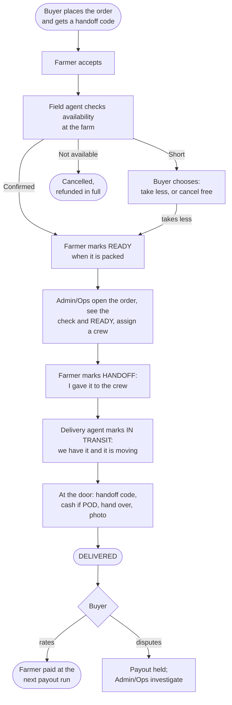

# The order → delivery flow, v2

*The flow as it stands on 10 September — the team's 7 September flow plus every answer recorded on the [working-answers page](order-delivery-flow-v2-working-answers.md) since. Settled parts are stated plainly. What is still open is listed under each step with its question number. This page is redrawn as answers land; nothing is built from it yet.*

## The flow in one picture

Six actors: **Buyer**, **Farmer**, **Field Agent**, **Delivery Agent**, **Driver**, **Admin/Ops**. The driver is part of the crew and taps nothing. A farmer must have a smartphone: READY and HANDOFF are their own taps, and nobody taps for them.

## Who does what

| Step | Who | What they do | What it means |
| --- | --- | --- | --- |
| 1 | **Buyer** | Places the order. Pays into CropDoor's escrow, or chooses to pay on delivery | The buyer is sent a **handoff code** by text. The produce is set aside for them |
| 2 | **Farmer** | Accepts the order | The order is real. A field agent's check is now due |
| 3 | **Field Agent** | Visits the farm within **8 working hours** of acceptance — one visit per farm per day, covering every accepted order there — and submits the check | The platform works out the outcome: **Confirmed**, **Short**, **Not available**, or **Could not check**. The check sits on the order for Admin/Ops to see. Defined on [the check page](order-availability-check.md) |
| 4 | **Farmer** | Marks the order **READY** when it is packed | The farmer's signal to Admin/Ops that the crew can come. **The buyer's free cancellation ends here** |
| 5 | **Admin/Ops** | Open the order, see the field agent's check and the farmer's READY, and assign a crew — a delivery agent and a driver | **No check on the order, no crew.** The one exception: a zone with no field agent, where the delivery agent makes the check at the gate before collecting |
| 6 | **Farmer** | Marks **HANDOFF** when the crew has the produce | The farmer's word that it left their hands. **The buyer can no longer cancel** |
| 7 | **Delivery Agent** | Marks **IN TRANSIT** | The crew's word that we have it. The buyer sees "on its way"; Admin/Ops see the goods are in our hands |
| 8 | **Delivery Agent** | At the door: asks the buyer for the handoff code, takes cash if paying on delivery, hands over, takes a photo, marks **DELIVERED** | The code is checked on **every** order, online or cash. The order of these acts is engineering's proposal, not yet confirmed (question 11) |
| 9 | **Buyer** | Rates the farm, or raises a dispute | A dispute **holds the farmer's payout**. Admin/Ops receive it and investigate |
| 10 | **Admin/Ops** | The payout run pays farmers for delivered, undisputed orders, net of commission | Money leaves escrow only here |

## The three cancellation windows

| Window | From | To | What the buyer gets back |
| --- | --- | --- | --- |
| **Free** | Placing the order | The farmer marks **READY** *(settled 10 September)*. The check happens inside this window, so the buyer hears whether the produce is there before it closes | Everything |
| **With a penalty** | End of the free window | The farmer marks HANDOFF | Everything minus the penalty. Amount, who receives it, and how it is collected on a cash order are open (16, 17, 36) |
| **Not possible** | HANDOFF | — | The produce is on its way. Only Admin/Ops can cancel after this, and must say where the produce is |

## Money, in one line each

- **Online:** the buyer's money sits in CropDoor's escrow from placing until the payout run. Delivery turns it into money *owed* to the farmer; the payout run pays it, net of commission. A dispute holds it.
- **Cash on delivery:** the delivery agent takes the cash at the door, before handing over. How and when it is banked is open (20).
- **Refunds:** Short → the difference; Not available or a free-window cancellation → everything; a penalty-window cancellation → everything minus the penalty.

## What the buyer sees

Placed → Accepted → Confirmed available → Ready at the farm → On its way → Delivered. Then: rate, or raise a dispute. The buyer never sees the crew assignment or the handoff as separate steps.

## What Admin/Ops watch

Every state has a way of going quiet. These are the lists, in flow order:

| Quiet state | Who acts |
| --- | --- |
| Accepted, no check after 8 working hours | Field agent |
| Confirmed, farmer not READY after *n* days *(n open — 26)* | Admin/Ops call the farmer |
| READY, no crew assigned | Admin/Ops — their own queue |
| COLLECTION FAILED, with the agent's reason | Admin/Ops — call the farmer, or cancel *(proposed state below)* |
| HANDOFF, no IN TRANSIT | The farmer says it left; the crew has not said they have it. A real signal, not a stale screen |
| IN TRANSIT, not DELIVERED by end of day | Delivery agent; then Admin/Ops (27) |
| DELIVERY FAILED, with the agent's reason | Admin/Ops — second attempt or cancel *(proposed state below; policy 14)* |
| Delivered, dispute open | Admin/Ops' dispute queue (21) |

## When the crew cannot collect, or cannot deliver (proposed)

*Engineering's proposal, 10 September, for Operations to decide. The facts behind it: the check exists to prevent a wasted trip, but when one happens anyway the delivery agent must tell Admin/Ops why (question 8); at the door, an agent who is not paid in full does not hand over, raises it, and takes the produce back to the farm (question 13).*

Two states, not one, because the produce is in different hands: at the gate it never left the farm; at the door it is in our van and has to go back.

| | **COLLECTION FAILED** | **DELIVERY FAILED** |
| --- | --- | --- |
| Where | At the farm gate | At the buyer's door |
| Who writes it | The delivery agent, on the spot | The delivery agent, on the spot |
| What they record | A reason — **farmer absent**, **produce not there**, **short** — and a note; a photo if there is something to photograph | A reason — **not paid in full**, **refused**, **nobody home**, **could not show the code** — and a note; a photo of the produce still in the van |
| Where the produce is | Still the farmer's. Nothing was taken | In our van. It goes back to the farm, and the farmer marks it **received** when it arrives — the mirror of HANDOFF |
| Money | Nothing moves. Escrow stays held | Nothing moves. No cash is taken — there is no partial payment |
| Stock | Still set aside for this order until Admin/Ops cancel; then back on the listing | Went out and came back. Not put back on the listing automatically — the farmer decides whether it is still saleable |
| The buyer is told | "Collection was delayed at the farm. We'll update you." Proposed: the buyer may cancel **free** while the order sits here — the failure was not theirs | They were there, or were not. "We could not complete your delivery: *reason*. Admin/Ops will contact you." |
| The farmer is told | The reason, in their words | "Your produce is coming back. Mark it received when it arrives." |
| Admin/Ops see | The order in their queue with the reason, the agent's note and photo | The same |
| Ways out | The farmer fixes it and marks **READY again** — the order re-enters Admin/Ops' queue for a crew; or Admin/Ops **cancel** — buyer refunded in full, the failure recorded against the farm | Once received back at the farm: the farmer marks **READY again** for a second attempt — whether the buyer gets one, and who pays for the trip, is question 14; or Admin/Ops **cancel** — refund (minus any penalty, question 14) |

Three rules the table relies on:

- **The crew takes nothing unless the order is complete.** A short order is not partly collected; it is COLLECTION FAILED with the reason *short*, and Admin/Ops offer the buyer the same choice as the check's Short outcome. This costs a second trip — but the check is meant to make it rare, and it is the farmer's failure after a Confirmed check. The alternative, collecting what is there and refunding the difference, is simpler for the crew and harder for money; say if you prefer it.
- **Both states leave through doors that already exist.** The farmer marking READY, and Admin/Ops cancelling. No new Admin/Ops action is needed to resolve either.
- **One state each, with a reason inside it.** Not a state per reason. "Nobody home" and "would not pay" put the produce in the same place and give Admin/Ops the same decision, so they share a state; the reason is what differs.

Questions 12 and 14 — the buyer has no code; nobody home or the buyer refuses — no longer need their own states. They become reasons on DELIVERY FAILED, and what stays open is only the policy: second attempt or not, at whose cost.

## Not in this flow, for now

- **Collection points.** Every collection is at the farm gate, with the farmer or a farm member present. To be revisited once daily operations have taught us. A farm the van cannot reach cannot be served for now.
- **Tapping on a farmer's behalf.** A farmer must have a smartphone. A flow for farmers without one comes later, if it is ever needed.
- **A farmer code at the gate.** Engineering proposed one; not needed, because the farmer records the handoff on their own phone.

## Still open, by step

Numbers refer to the [working-answers page](order-delivery-flow-v2-working-answers.md), where engineering's view is pre-filled for most of them.

**At the farm**

- **5.** If the agent finds the farm short, that affects every other buyer on the same listing. Who tells them, and what are they offered? *(engineering's proposal is on the working-answers page)*
- **6.** When our agent has certified the quality and the buyer still complains about quality, who is responsible — the farmer or us?

**At the door**

- **11.** In what order do things happen at the door: cash, code, hand over, photo? What if the buyer gives the code and then will not pay?
- **12.** What does the agent do when the buyer is present but cannot show the code — dead phone, text never arrived? And if a named representative receives, whose code do they give?
- **14.** Nobody home, or the buyer refuses the crate: retry (who pays), redirect, return to farm, write off? Who decides — agent, supervisor, office? *(mechanics settled by the proposal above; only the policy is open)*
- **15.** One buyer, three farms, same day: three codes at one gate?

**Money**

- **16.** Is the penalty to compensate the farmer, deter buyers, or cover our van cost? The answer decides who receives it.
- **17.** How do we collect a penalty from a cash-on-delivery buyer who has never paid us anything?
- **18.** If a farmer accepts and then cancels or fails to hand over, does the farmer pay anything? Does the buyer get anything for the wait?
- **19.** Van breaks down, or we miss the date: farmer still paid? Buyer refunded the fee? Buyer's penalty waived if they cancel because we were late?
- **20.** When an agent collects cash, when and how does it reach us? How do we know at month-end which cash is still in agents' pockets?
- **22.** "Partial refund", "replacement", "goodwill credit" — what actually happens, who moves what money, who pays for a replacement delivery?
- **23.** A cash buyer wins a complaint — how do we pay them back?
- **24.** Does a cancellation fee attract VAT or levies? What document does the buyer receive for it?
- **36.** Should cash-on-delivery orders require a deposit?

**Time**

- **25.** How long may an order wait for the farmer to accept before we cancel it for them?
- **26.** Once READY, how quickly must the van collect? Is produce saleable after that?
- **27.** How long may an order sit "handed off" or "in transit" before the office is alerted? Who is alerted?
- **28.** A buyer taps cancel a moment after the farmer accepted and is told a penalty applies. Grace period, or hard line?

**After delivery**

- **29.** The buyer rates "the farm" — but the van, the agent and the timing were ours. Split the rating? Should a farmer answer a complaint about a late van?
- **30.** Can a buyer both rate and dispute the same order? Should an upheld complaint change the rating?
- **35.** Should anyone other than the buyer be able to raise a dispute — a farmer short-paid or refused at the gate, an agent robbed?

**People and messages**

- **31.** Will the same person ever be the field agent, the delivery agent and the confirmer? Are we comfortable with one person holding all three?
- **33.** Which moments produce a text, to whom: agent coming; READY; handed over; van on the way; delivered; cash received; complaint raised?

**Not yet in the flow at all:** cancellation by Admin/Ops — at which steps, and what happens to produce already handed off; and who is told what, by text, at each step (33).

## For engineering

The order carries six live states and one terminal one: **placed → accepted → ready → handed off → in transit → delivered**, plus **cancelled** — and, if the proposal above is accepted, two failure states written by the delivery agent, **collection failed** and **delivery failed**, each carrying a reason, each leaving only through READY or cancellation. Everything else is a fact on the order, not a state: the availability check (agent, time, outcome, photos), the crew assignment (the order's run), the handoff code, the delivery photo, the dispute. Each fact is written once by the actor who owns it — HANDOFF by the farmer, IN TRANSIT and DELIVERED by the delivery agent, the check by the field agent, the crew by Admin/Ops — and nothing is derived twice. Money reads the ledger: escrow, owed, paid, held, refunded, penalised are all postings. Stock moves at most once. The build plan comes after the open questions above close; it starts from the deletion audit's floor, not from today's tables.
