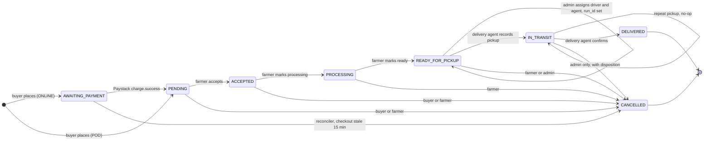
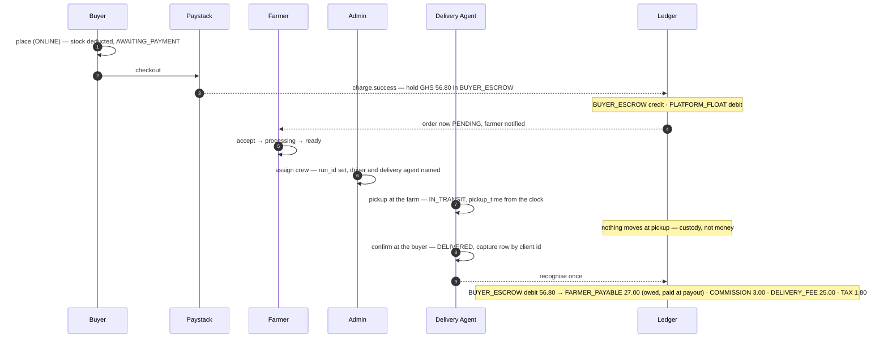
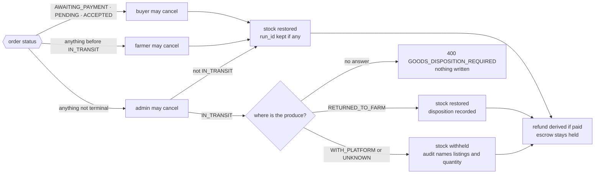
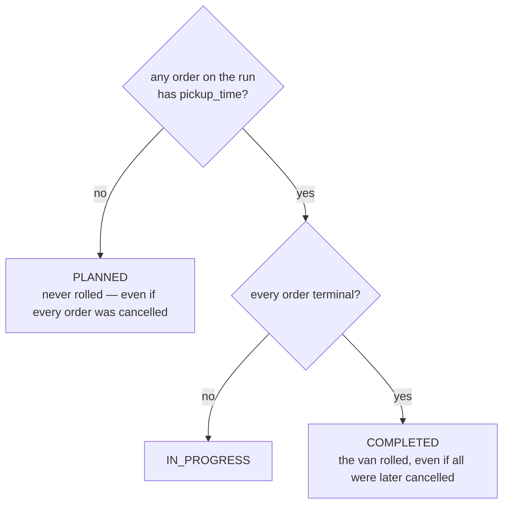

# The order → delivery flow

*Engineering version. The [operations version](order-delivery-flow-for-operations.md) tells the same story without identifiers, for people who run the business.*

The whole flow — who acts, what moves, where money attaches, what is stored — drawn once so the team can argue over the mechanism rather than the prose. Six decisions at the end. Nothing is built until they are settled.

Grounded against `develop` after #221 (cancellation disposition) and #222 (agent pickup), September 2026.

The platform runs deliveries; farms do not. That single fact is what the current code got backwards — the only way out of `READY_FOR_PICKUP` was the farmer's `dispatch`, so an order nobody collected sat paid-for with no exit, and we fixed it by adding a second route in (#222) instead of removing the first. The flow has accreted a second status field, a second history table, a flag beside its own derivation, and two routes into one transition. Each was locally reasonable. Together they are the source of every drift bug we have fixed one at a time.

!!! abstract "The rule this proposal was written against, before the evidence"
    Delete when nothing reads it or something already derives it; keep when a real consumer would lose a fact it cannot reconstruct. Nothing here is added for symmetry.

## Who

Five actors, in the product's own words. Every gate already exists in `Permissions`; the proposal removes one action from the farmer and adds none.

| Actor | Permission | May do |
| --- | --- | --- |
| **Buyer** | `BUYER::ORDER::CREATE`, `BUYER::ORDER::VIEW` | Place, pay, cancel while `AWAITING_PAYMENT` / `PENDING` / `ACCEPTED`, view own orders. |
| **Farmer** | `FARM::ORDER::FULFILL`, `FARM::ORDER::VIEW` | Accept, mark processing, mark ready, cancel before `IN_TRANSIT`, view the farm's orders. **No longer dispatches.** |
| **Driver** | *none — may have no account* | Drives the run. Named on it at crew assignment from `driver_profiles`, whose `user_id` is nullable since V100 so a roster driver can be added before they sign up. **Cannot act on the API today**, and is excluded from the trust rule for that reason, not by judgement. |
| **Delivery Agent** | `PLATFORM::DELIVERY::FULFILL` *and named on the run* | Rides with the driver. Records the pickup at the farm, confirms the delivery at the buyer, reads their own runs. |
| **Admin / Ops** | `PLATFORM::DELIVERY::UPDATE`, `PLATFORM::ORDER::CANCEL`; `PLATFORM::DELIVERY::FULFILL` for an override | Assign or unassign a crew; cancel any order — and if the produce has already left, say where it went. Holding `FULFILL` with an `ACTIVE` membership, may also pick up or confirm on a run they are not named on — audited as an override, not as the agent. |

One trust rule separates the delivery agent from an admin override — *the run's named agent, or an `ACTIVE` platform member holding `FULFILL`* — and it is asked in one place (`DeliveryActionRights`) by pickup, confirmation, its replay and lost-race paths, and run-detail reads. #222 folded the last of those in; a `PENDING` invitee could read a run before and cannot now.

## The lifecycle

Eight states, one enum, untouched — `OrderStatus` has 357 references across 76 test files and the decomposition into payment/fulfilment/custody machines was rejected on evidence. What changes is that **nothing else stores a lifecycle**. Every edge is labelled with who moves it.



**Proposed lifecycle.** The self-loop on `READY_FOR_PICKUP` is crew assignment — it changes `run_id`, not the status. The self-loop on `IN_TRANSIT` is a device retrying pickup on a bad link, answered and recorded as nothing. The one removed edge is the farmer's `dispatch` into `IN_TRANSIT`; it is not drawn because it will not exist.

## The happy path

An online-paid order from placement to recognised revenue. The ledger is a participant because the argument hinges on *when* it is written: at charge, and at confirmation — never at pickup. Note what confirmation does and does not do: it decides who the money belongs to; the farmer is *paid* later, at the payout run.



**Online order, placement to recognition.** The amounts are from the 2 September live run against a real signed Paystack webhook. Pay-on-delivery differs in two places only: the order starts at `PENDING` with no escrow, and confirmation records cash collected instead of recognising escrow — same accounts, same moment.

## Cancellation

Three routes, three windows, one question that only an admin is ever asked. Stock moves at most once per order; the audit row says how much was withheld when it does not move.



**Who may cancel, from where, and what happens to the crate.** The disposition question exists because once a driver has the produce, restoring its quantity sells the same crate twice (#214). `UNKNOWN` withholds like `WITH_PLATFORM` — understating stock loses a sale, overstating it sells produce that does not exist — but is recorded distinctly, because "nobody could say" is a different operational fact from "we have it".

## Money, at each moment

Verified live twice in the last two PRs and unchanged by this proposal. The one money-adjacent change is deleting the `refund_due` flag in favour of the derivation that already sits beside it — with a clause it was missing.

| Moment | Online | Pay on delivery |
| --- | --- | --- |
| place | `AWAITING_PAYMENT`; stock deducted; nothing moves | `PENDING`; stock deducted; a `PENDING` payment row |
| pay | webhook → escrow held | — |
| pickup | **nothing** | **nothing** |
| confirm | escrow *recognised* once — `BUYER_ESCROW` debit into `FARMER_PAYABLE` (a liability), commission, delivery fee, tax. **Cash does not move**; it stays in `PLATFORM_FLOAT` | cash recorded as collected; same accounts |
| next payout run | `FARMER_PAYABLE` settled by transfer to the farmer, on net terms, together with everything else owed to them. This is the only moment cash leaves CropDoor for a farmer | same |
| cancel after pay | refund owed — *derived*; escrow stays held until refunded; no farmer payable | nothing to refund |
| chargeback | defended from the capture row and audit; escrow reclassified | — |

Two invariants every row above must keep. **Money reads the ledger** — recognition reads `escrowHeldForOrder`, refund eligibility reads the payments and refunds tables, nothing reads a flag. **Stock moves at most once** — deducted at placement, restored at exactly one of: stale checkout, buyer cancel, farmer cancel, admin cancel with the crate returned or never left.

## Data — today, and proposed

This is the picture the decision turns on. Every line that disappears between the two is a fact that was stored twice.

=== "Today"

    ```mermaid
    erDiagram
        orders {
            enum status
            timestamp delivered_at
            bool refund_due
            bool stock_restored
        }
        deliveries {
            enum status
            timestamp pickup_time
            timestamp delivery_time
            text pickup_address
            uuid pickup_address_id
            text delivery_address
            uuid delivery_address_id
            text notes
            uuid pickup_farm_id
            uuid run_id
        }
        delivery_runs {
            enum status
            timestamp started_at
            timestamp completed_at
            date run_date
            uuid driver_id
            uuid delivery_agent_id
        }
        order_status_history {
            enum from_status
            enum to_status
            uuid changed_by
        }
        audit_log {
            text action
            jsonb details
            text actor_email
        }
        orders ||--o| deliveries : "1 to 1, UNIQUE order_id"
        deliveries }o--o| delivery_runs : "run_id"
        orders ||--o{ order_status_history : "7 writers, 0 readers"
        orders ||--o{ audit_log : "every actor transition"
    ```

=== "Proposed"

    ```mermaid
    erDiagram
        orders {
            enum status
            timestamp delivered_at
            uuid run_id "moved"
            timestamp pickup_time "moved"
            enum disposition "replaces stock_restored"
        }
        delivery_runs {
            date run_date
            uuid zone_id
            uuid driver_id
            uuid delivery_agent_id
        }
        audit_log {
            text action
            jsonb details
            text actor_email
        }
        delivery_confirmation_captures {
            uuid client_id
            text notes
            enum outcome
        }
        orders }o--o| delivery_runs : "run_id, kept through cancel"
        orders ||--o{ audit_log : "the only history"
        orders ||--o{ delivery_confirmation_captures : "confirm idempotency"
    ```

**Two tables, two status columns, one flag, three never-written enum values removed; two nullable columns added.** `deliveries` was one-to-one with `orders` — 25 rows for 25 orders — and of its ten data columns four duplicated the order, two were address snapshots beside `_id` columns that were declared and never written, one (`notes`) already lives on the capture row, and two are worth moving. `order_status_history` has seven writers and no reader anywhere; `audit_log` carries the same transitions with an actor snapshot.

## Derived, not stored

Everything the deleted columns answered is still answerable — from one place.

| Question | Today | Proposed |
| --- | --- | --- |
| Is this order crewed? | `deliveries.status = ASSIGNED` | `orders.run_id IS NOT NULL` |
| Delivery status | `deliveries.status` — 4 writers | `orders.status`, plus `run_id` for "assigned" — *derived* |
| Run status | `delivery_runs.status` — 4 writers | from the run's orders — see below — *derived* |
| Refund due | `orders.refund_due`, flipped by hand in two services | paid, cancelled, no `REFUNDED`/`REVERSED` payment, **and no refund row other than `FAILED`** — *derived* |
| Was stock restored? | `orders.stock_restored` | `orders.disposition` — the answer, not the boolean |

The refund clause in bold is the one the flag carried and the existing query did not: `RefundServiceImpl` clears the flag when a refund is *initiated*, while the payment only becomes `REFUNDED` when Paystack confirms it — minutes to days later. Without it, every in-flight refund would read as still owed.

### Run status, precisely



**Derived over `pickup_time`, not status ordinals** — `CANCELLED` sorts after `IN_TRANSIT` in the enum, so "any order past IN_TRANSIT" would call a run with one pre-pickup cancellation "in progress". Two consequences are behaviour changes and are listed as decisions below: a run re-opened by a new order after completion reads `IN_PROGRESS` rather than today's `PLANNED`, and `started_at` / `completed_at` go — they were a second stored copy of this same fact.

## Decisions for the team

Numbered because this is the agenda. Each has the evidence and a recommendation; none is made yet.

**1. Drop `deliveries` and `DeliveryStatus`; move `run_id` and `pickup_time` onto `orders`**

One-to-one with orders. Three of seven status values never written. The only filter reader is the admin list. Breaking for the FE: `OrderResponse.delivery` becomes `OrderResponse.run`, `DeliveryResponse.status` and `deliveryTime` go (`deliveredAt` survives), the flattened `driverId`/`driverName` go, four address fields become live reads of farm and order addresses.

*Recommend yes.* It is the source of the drift class. Cheapest with no users.

**2. Remove the farmer's `dispatch` route**

Two routes into one transition; kept in #222 as a fallback for a hand-off to a driver with no device — which is every driver today, and nobody has needed it. 3 references in main, 21 test files. The farmer's part ends at `READY_FOR_PICKUP`.

*Recommend yes.* If a real case appears, it returns as a call into the same `applyPickup` body.

**3. Keep or drop `PROCESSING`**

Two farmer clicks between `ACCEPTED` and `READY_FOR_PICKUP`. Nothing in the code gives it meaning — no notification copy, no SLA, no payout gate. Dropping it removes a state, an endpoint and a farmer action; keeping it gives buyers "the farm has started packing".

*Product call — no recommendation from the code.* Whichever way, it is one line in the design.

**4. #215 — should the admin override need more than `FULFILL`?**

Today any delivery agent may pick up or confirm *any* order through the override branch — the same permission an admin uses to step in — and confirmation decides the farmer is owed. The matrix IT pins this as "allowed — documents #215" rather than asserting a constraint the code does not impose.

*Not decided here.* Options: leave as-is, require an explicit override flag on the request, or a second permission. Security call.

**5. Derive run status; accept the reopen change**

Drops `delivery_runs.status`, `started_at`, `completed_at` and the `DELIVERY_RUN_COMPLETED` audit action. Keeps `?status=` on the admin run list as an `EXISTS` query. **Behaviour change:** a completed run re-opened by a new order reads `IN_PROGRESS`, not `PLANNED`. `run_id` stays on cancelled orders — it is the fact #212 (collection reliability) measures from.

*Recommend yes.* The early-return that stranded runs in #209 exists only because the status is stored.

**6. Derive refund-due, with the refunds clause**

Replaces a flag that two services flip by hand with a query that already half-existed. Money-adjacent, so it gets mutation tests. `OrderResponse.refundDue` comes from a batch lookup beside the existing ratings batch, not per row.

*Recommend yes.* This is the rule the backend's own guidelines already state: a transition that moves money reads the ledger, not a flag.

## Build order, once settled

Five PRs, each mergeable on its own and each leaving `develop` deployable. Lighter gate: one review round on the design (done), targeted tests plus a clean verify per PR, mutations only where money or authorization is touched, one live verify after the big PR and one at the end.

| PR | Does | Why here |
| --- | --- | --- |
| **A** | Drop `order_status_history`; give the stale-checkout reconciler the `ORDER_CANCELLED` audit it never had | Zero readers. Safest first cut. *Parked in a local commit pending this deliberation.* |
| **B** | Derive `refund_due`; drop the flag and its three manual writes | Money-adjacent; small; gets mutations |
| **C** | Orders own `run_id` and `pickup_time`; `disposition` replaces the boolean; delete `deliveries`, `DeliveryStatus`, farmer `dispatch`, run status columns; reshape DTOs; derive run status | The big one. Two migrations in one PR — add and backfill, then drop — because `ddl-auto=validate` means the entity and its table must leave together. Live verify after. |
| **D** | #210 — day-before reminder fires only when `run_id IS NOT NULL` | The platform has committed a crew; today it fires for merely accepted orders |
| **E** | #211 — rewrite the orders API doc | Last, so it documents what exists. It is a rewrite: wrong base paths, seven statuses, a fabricated dispatch body, `mark-delivered` in three places |

| | |
| --- | --- |
| **Unchanged** | `OrderStatus`, `payments`, the ledger, `delivery_confirmation_captures`, offline sync, every error code, every `/v1/delivery/**` route. |
| **Would change this** | A named reader of `deliveries.notes`; a reason a farmer must move produce with no delivery agent present; a third-party carrier landing first — then a custody table returns as a real aggregate with its own facts, and this design makes that easier by leaving no half-duplicate to reconcile. |
| **Grounding** | Every count is a grep of `src/main` at the commit named above, reviewed once against the code; two of the first draft's "zero readers" claims were wrong (`pickup_time` and `delivery_time` both reach the FE through MapStruct) and are corrected above. |
