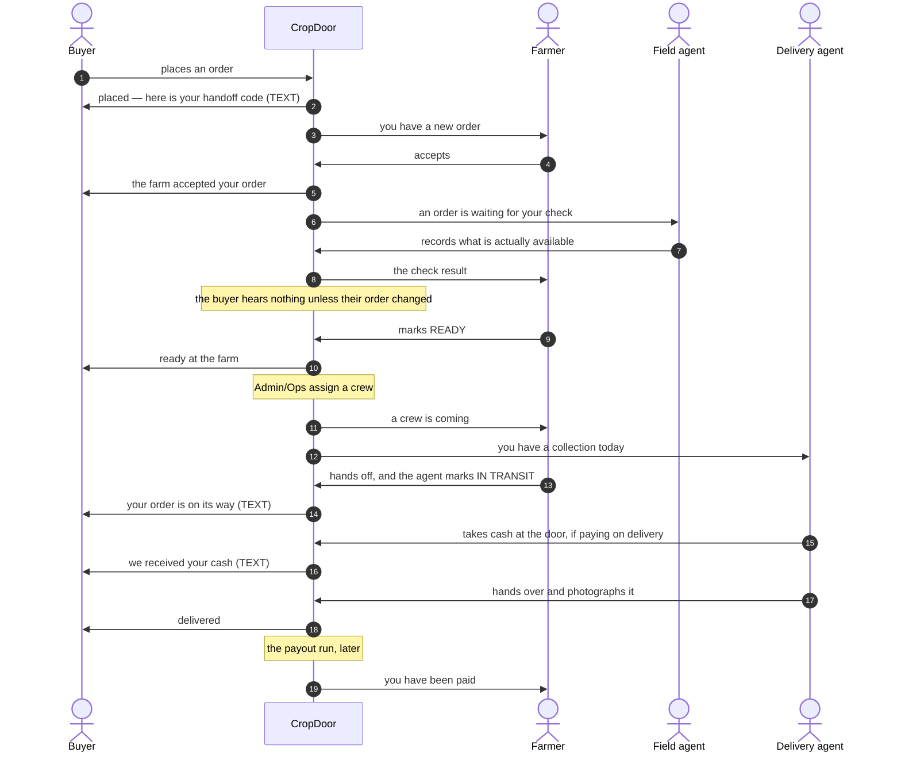
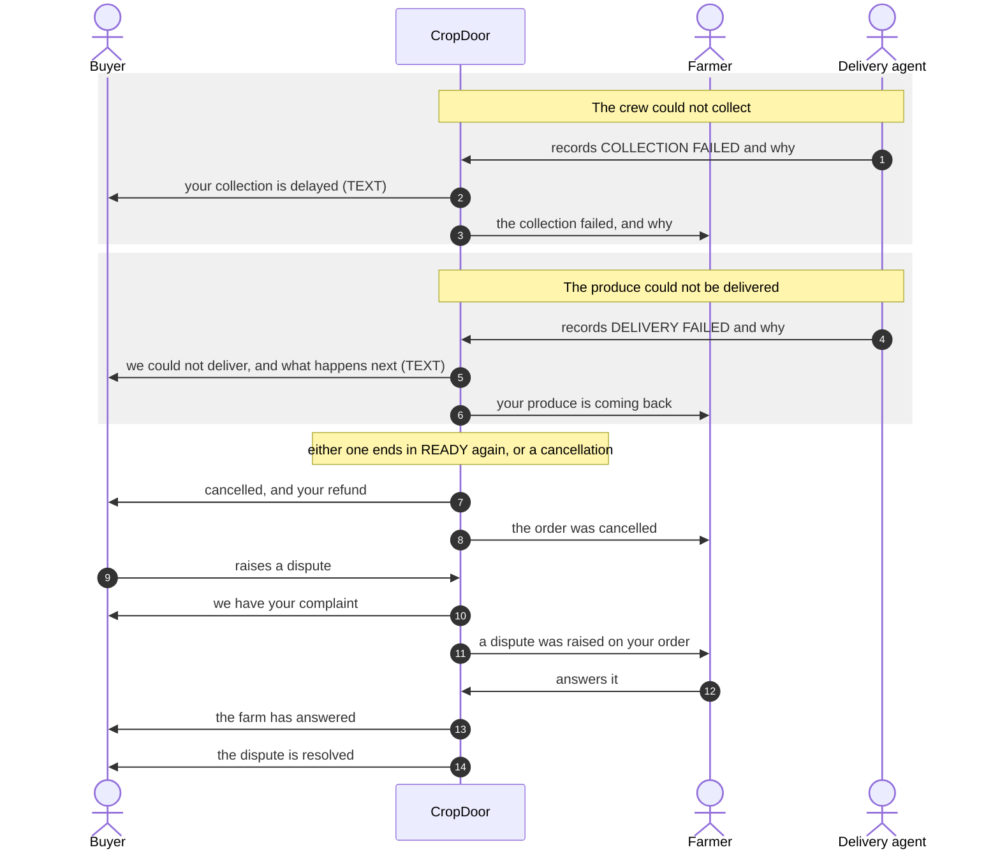

# Who we tell, and when

*The twenty-four messages the [decided flow](order-delivery-flow-v2.md) promises — thirteen to
buyers, nine to farmers, two to staff — drawn against the moment each one is sent. Settled
13 September; on 15 September four messages the platform already sends were written onto the list,
and what a person may switch off was decided. The count read "eighteen" until then, which added up
buyers and farmers and quietly left the two messages to staff out of its own total. This page is the frame step 2 of
[the order of work](order-delivery-flow-v2-build-order.md) builds; every later step hangs its
messages on it rather than inventing its own.*

## The rule, before the detail

**Everything is written in the app.** That feed is the record of what we told someone, it never
expires, and it cannot be switched off — the one exception we would make is a regulator requiring it,
and the system is built so that switch can be turned on without rebuilding anything.

**Email and text are amplifications of that record, not copies of it.** Email carries detail and
anything with a document. **A text costs money every time**, so it is reserved for the five moments
where someone has to act now. Both can be switched off per kind of message — with one exception, the
handoff code, which is a credential rather than an update. The record stays either way.

## The happy path

Time runs down. Every arrow out of CropDoor is a message; **TEXT** marks the five that also send an
SMS, and everything else is in-app, with email where the table below says so.

## When something goes wrong

## Every message, and how it travels

**Buyer — thirteen messages**

| When | What they hear | In-app | Email | Text |
| --- | --- | --- | --- | --- |
| They place the order | Placed, with the handoff code for the door | yes | yes | **yes** |
| The farm accepts | The farm has your order | yes | — | — |
| Their order cannot be filled in full | How much can be supplied — take it, or cancel free. **A question with a clock**: unanswered by the end of the next day, the order cancels with a full refund | yes | yes | — |
| The farmer marks it ready | Ready at the farm | yes | — | — |
| The crew collects it | On its way | yes | — | **yes** |
| Cash is taken at the door | We received your cash | yes | yes | **yes** |
| It is delivered | Delivered | yes | yes | — |
| The crew could not collect | Delayed, and what happens next | yes | yes | **yes** |
| We could not deliver | Not delivered, and what happens next | yes | yes | **yes** |
| The order is cancelled | Cancelled, and the refund | yes | yes | — |
| They raise a dispute | We have your complaint | yes | yes | — |
| The farm answers it | What the farm said | yes | yes | — |
| The dispute is resolved | The outcome, and any refund with it | yes | yes | — |

**Farmer — nine messages**

| When | What they hear | In-app | Email | Text |
| --- | --- | --- | --- | --- |
| A buyer orders | You have a new order | yes | yes | — |
| A check is scheduled | A field agent is coming | yes | — | — |
| The check is done | What the agent found | yes | yes | — |
| Ops assign a crew | A crew is coming, and when | yes | — | — |
| The crew could not collect | It failed, and why | yes | yes | — |
| A delivery comes back | Your produce is on its way back | yes | yes | — |
| The order is cancelled | It was cancelled, by whom, and why | yes | yes | — |
| A buyer disputes the order | A complaint was raised, what it says, and the answer they owe | yes | yes | — |
| The payout runs | You have been paid | yes | yes | — |

**Staff — their own work, in the same feed**

| Who | When | What they hear | In-app | Email | Text |
| --- | --- | --- | --- | --- | --- |
| Field agent | An order needs a check | This order is waiting for you | yes | — | — |
| Delivery agent | A crew is assigned | You have a collection today | yes | — | — |

**Admin and Ops work watch lists, with one exception.** The lists on
[the flow](order-delivery-flow-v2.md) are a queue they work through, and a notification for every
stalled order is a queue nobody reads. The exception is **a handoff with no IN TRANSIT within the
hour**, which is an alert: it is the only moment where produce has left the farmer's hands and nobody
has yet said they have it.

**When a farm or a buyer has several people, one person is told and everybody sees it.** The owner
gets the text and the email; the rest of the team sees the same message in the shared feed when they
open it. Five people on one farm should not mean five texts about one order.

**The buyer is never told about the check.** It is an internal supply measure: it grades a farm, it
accumulates against that farm, and it exists so Operations can decide whether to send a van. A buyer
hears only what changed about *their own order* — that less can be supplied, or that it cannot be
supplied at all — and never that an agent visited, what they saw, or how the farm scored.

**A check is offered to every field agent in that farm's zone.** Agents belong to zones, not to
orders, and Operations has no rule yet for picking one. With one agent to a zone today it is the same
message either way.

**The driver gets nothing — for now.** A driver taps nothing today and none of them has an account,
so the delivery agent riding with them is the one we tell. This is "not yet" rather than "never": the
door is left open deliberately, in case drivers are given the app later.

## The five texts, and why only those

A text costs money every time it is sent, and a single buyer could receive thirteen messages on one
order. These five are the ones where someone has to do something, now:

- **the handoff code**, because they need it at the door and may not have the app open — and at the
  door, an agent can have it **resent** to the buyer's registered phone;
- **on its way**, because someone has to be there to receive it;
- **cash received**, because it is a receipt for money that changed hands;
- **collection delayed** and **could not deliver**, because both need a decision from the buyer.

Everything else is in the app, with email where there is detail or a document to keep.

## What a person can switch off

**Four kinds of message, and a person switches off a kind, not a message.** Fewer kinds and
switching off "delivered" would also stop "we could not deliver"; one switch a message would be
twenty-two switches nobody reads.

| Kind | Who sees it | In-app | Email | Text |
| --- | --- | --- | --- | --- |
| **Order updates** — everything about an order's progress, failures included | buyer, farm | always on | on, can be switched off | on, can be switched off |
| **Money** — paid out, refunded, cash received | buyer, farm | always on | on, can be switched off | on, can be switched off |
| **Disputes** | buyer, farm | always on | on, can be switched off | never sent |
| **Your work** | field and delivery agents | always on | never sent | never sent |

**Nothing is lost by switching a text off.** The feed holds every message whatever else is off, so
what stops is the interruption, never the record. That is what the in-app feed being written first
buys us.

**Order texts arrive switched on — confirmed 18 September.** The code had them off, on the reasoning
that a text costs money and should be opted into; this table and the design both said on. Found while
building the channel table, and decided by the CTO: **on**, because a text nobody receives is a setting
pretending to be a message. The cost is now explicit — every buyer is texted when their order is
collected, and, as steps 4 to 6 arrive, when a collection or a delivery fails. Anyone who does not want
them switches them off and still sees everything in the app.

**One message cannot be switched off: the handoff code.** It is a credential, not an update. A buyer
who had switched off order texts would arrive at their own door without the thing that opens it — and
the agent's fallback is to resend that same text. It travels with the login code, outside the
switches, and the screen says so.

**Each kind is offered only to the people it applies to.** A buyer never sees a field agent's toggle,
and a field agent is never asked whether they want texts about work that only ever appears in the app.

**No quiet hours.** Each of the five texts is a message somebody must act on, and holding "we could
not deliver your produce" until morning is worse than a text at nine. A farm day starts before most
quiet windows would end.

**Which moments text is decided here, not on the settings screen.** A switch Ops could flip per kind
would silently stop "the collection failed" with nobody the wiser. If what texting costs ever becomes
a problem, the honest control is a spend cap with an alert.

## What is not here

Push notifications to a phone, which need a mobile app. Marketing. The buyer↔farm chat, which is a
conversation between two people and stays separate from this.
