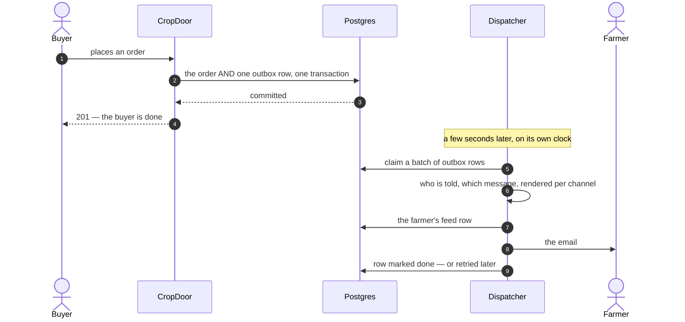

# How a message gets out — the industry, and what we chose

*The engineering half of notifications. [Who we tell, and when](../domain/order-delivery-notifications.md)
decides which messages exist and which channels each rides; this page decides how a message travels from
"something happened" to a person's phone without being lost on the way. Researched from first principles
on 16 September, decided by the CTO on 17 September. It is the design PR X2b of
[the order of work](../domain/order-delivery-flow-v2-build-order.md) builds.*

## The problem, stripped to first principles

Something happens — a buyer places an order. People must be told, on the channels they chose. Every
serious design has to satisfy five things at once:

1. **No lost messages.** If the thing happened, the message eventually goes.
2. **No phantom messages.** If the thing was rolled back, no message goes.
3. **No duplicates** — or, realistically, duplicates that are harmless.
4. **The business action never waits on, or fails because of, telling people.** A dead email provider
   must not stop an order or a payment.
5. **We can answer "what did we tell this person, and did it arrive?"**

The tension every architecture is really about: **the first two together are the dual-write problem.**
We want "save the order" and "queue the message" to happen as one, and we cannot make a database and an
email provider — or a message broker, or Redis — commit together. Every solution is a way of *pretending*
they are one, and they differ in how honest the pretence is.

## The restaurant

A waiter takes an order for the fish. The till records it and takes the money. The kitchen has to hear
about it, or no fish is cooked.

**The way most systems start** — and the way ours worked until now: the waiter rings the order into the
till, *then* walks to the kitchen. Usually fine. But pulled aside on the way, or their shift ends, or they
trip — the till says the customer paid and **the kitchen never heard**. Money taken, no fish, and
nothing anywhere says a fish was owed. In our system that gap was a second or two: the order committed,
and the message was sent from a background thread a moment later. A deploy restarts the application in
exactly that gap.

**The docket way**: ringing up the sale and writing the kitchen slip are **one motion, in one book**. You
cannot ring up a sale without the slip existing. A runner carries slips to the kitchen whenever they can;
if the runner trips, the slip is still on the spike and the next runner takes it. Nothing about *when*
the kitchen hears changes. What changes is that the slip cannot go missing.

Redis, in this picture, is a noticeboard in another room. Ringing up the sale and pinning a note in
another room are two acts, so the same gap is back — with a second room to walk to. The book works
precisely because it is the same book.

## Layer one: getting the trigger out safely

How the industry solves the dual write. The four ticks are the first four invariants above.

| Approach | How it works | Who does it | Lost · Phantom · Duplicate · Decoupled |
| --- | --- | --- | --- |
| **Fire-and-forget after commit** | an in-process event; a handler sends on a background thread | most small applications; us, until X2b | fails · ✓ · ✓ · ✓ — lost on any restart in the gap |
| **Transactional outbox, polled** | a row written in the same transaction; a worker polls and delivers | the textbook answer; the whole "Postgres is your queue" movement — Rails 8's Solid Queue, Oban, River, pg-boss, Graphile Worker | ✓ · ✓ · at-least-once · ✓ |
| **Outbox plus change-data-capture** | the same row, but Debezium tails the database log and publishes to Kafka; no polling | Shopify, WePay, most Kafka-era service estates | ✓ · ✓ · at-least-once · ✓ — and two new pieces of infrastructure |
| **Broker first** | publish straight to Kafka, RabbitMQ or SQS | many, often wrongly | **fails** · ✓ · at-least-once · ✓ — still the dual write; a broker gives fan-out and replay, not atomicity |
| **Event sourcing** | the event log *is* the truth; telling people is a projection of it | banking cores, some fintech | ✓ · ✓ · ✓ · ✓ — and a total change to how everything is modelled |
| **Durable workflows** | "notify the buyer" is a workflow step with retries and state of its own | Temporal (Uber, Netflix, Stripe, Coinbase), Inngest, Trigger.dev | ✓ · ✓ · ✓ · ✓ — but the *trigger* still needs an outbox; heavy infrastructure or a vendor |
| **A managed notification platform** | send a trigger; they do preferences, templates, channels, feed, digests, tracking | Knock, Courier, Novu, OneSignal, Braze, Customer.io | solves the **next layer**, not this one — the trigger call is itself a dual write unless it is sent from an outbox |

The honest reading: **fire-and-forget is what everyone starts with and what loses messages on every
deploy. The outbox is what everyone converges on.** Broker-first is fire-and-forget in a suit. Event
sourcing and durable workflows are correct and expensive. A managed platform is a different layer, and
people who buy one still need an outbox underneath — the platforms' own documentation tells you to send
triggers from a background job, not from the request.

The interesting movement of the last few years is the plain polled outbox **winning ground back** from
change-data-capture and brokers. Rails 8 shipped with the database as its default queue, cache and
pub/sub and dropped its Redis requirement, on the argument that one Postgres with `SKIP LOCKED` handles
thousands of jobs a second and every extra moving part is an on-call rotation. Oban and River made the
same bet in Elixir and Go. This is not "a small team cannot afford Kafka"; it is a considered position
that a broker is the wrong first tool.

## Layer two: what sits on top, everywhere

Whatever the transport, every mature system grows the same organs. They are where the *product*
decisions live, and where buying versus building is a real question.

| Organ | What it decides | Reference |
| --- | --- | --- |
| **Preference matrix** | person × kind of message × channel; what is locked, what defaults on | GitHub's per-repository watching; Slack's notorious "should we send a notification?" flowchart |
| **Router** | given an event and a person, which messages and which channels | Uber picks the channel by urgency and falls back — push, then text |
| **Renderer** | per-channel words from one message | copy in code with review; copy in a settings table is how a text ends up with a broken placeholder |
| **Channel adapters** | email, SMS, push, in-app — each with its own failure modes | thin, replaceable, one interface |
| **Delivery ledger** | one row per attempt, its outcome, the provider's reference | **Stripe's webhooks are the canonical version**: an events table, an attempts table, retries backing off over days, receipts webhooked back |
| **Idempotency at the edge** | never send the same email twice even when retried | provider idempotency keys — Resend, Postmark, Stripe. Most SMS providers offer none |
| **Batching and digests** | eleven events, one message | GitHub's email digests; Slack's "you have three new messages" |
| **Throttles and quiet hours** | per-person limits; local night | Slack's Do Not Disturb |
| **In-app inbox** | the record, its read state, an unread count | GitHub's notifications; the one channel that cannot fail to deliver |
| **Tracking back** | delivered, bounced, complained — from provider webhooks | Postmark and SES bounce handling; Twilio status callbacks |

We already have the matrix, the router, the renderer, three channel adapters and the inbox. What X2b
adds is the ledger and the idempotency; batching, throttles and tracking-back are later steps.

## Three systems worth knowing by name

**Stripe's webhooks** are the best-documented durable delivery system in the industry and the model for
at-least-once done honestly: every event is a row, every attempt is a row, retries back off over days,
consumers are *told* to be idempotent, and the dashboard shows every attempt. Nothing is exactly-once
and nobody pretends it is.

**Uber's notification platform** is the picture of scale: events on Kafka, a routing layer that owns
preferences and urgency, worker pools per channel, provider fallback, and a giant templating system.
Instructive mostly for how many teams it took.

**Rails 8 and Basecamp** are the picture of the opposite conviction: one database, `SKIP LOCKED`, a
polling worker, no Redis in production — and a public argument that this is *better* rather than merely
cheaper, because every subsystem shares one transaction boundary and one backup.

## What actually decides it

Not "how good is Kafka". Three things:

1. **Do several independent systems need the same events?** If so a broker earns its place eventually,
   because fan-out and replay are what brokers are for. If the only consumer is "tell people", a broker
   is a dependency with no customer.
2. **Where is the atomicity boundary?** Everything in one Postgres makes the outbox nearly free — one
   insert inside a transaction that already exists. State spread across services means an outbox per
   service, and change-data-capture starts paying for itself.
3. **Do we want to own the product decisions of layer two?** Buying them is legitimate — it is buying a
   workflow engine for messages — but it couples our copy and our users' preferences to a vendor, and it
   still needs the outbox underneath.

| Stage | Durability | Layer two |
| --- | --- | --- |
| One service, one database, one team — **us** | the outbox, polled | built in code; the inbox is the channel that cannot fail |
| Several services, one team | the same outbox, published by change-data-capture | built, or bought |
| Many teams, many consumers | a broker as the backbone, fed by outboxes | a platform team, or a vendor |
| A regulated, audit-first domain | event sourcing from day one | projections come free |

## What we chose

**A transactional outbox in Postgres, drained by a polling worker — decided 17 September 2026.**

| Piece | What it is |
| --- | --- |
| **`notification_outbox`** | one row per event, written **in the same transaction** as the order or dispute change: what happened, to which thing, when, a state and an attempt count. Named for `audit_log`'s precedent — a container, whose rows are entries |
| **The order's transaction** | gains **one insert**. No recipient lookup, no rendering. Nothing about telling people can fail or slow an order or a payment |
| **The dispatcher** | a scheduled job that claims a bounded batch with `SKIP LOCKED`, then does what the background listener did: resolves who is told, renders, writes the feed rows, sends the email and text, marks the row done. Failed sends retry with backoff; past a cap they are abandoned and **counted** |
| **Duplicates made harmless** | a unique key so a retry cannot write the same feed row twice; Resend's idempotency key so it cannot send the same email twice; SMS stays at-least-once, said plainly |
| **What is deleted** | the two background listeners that sent after commit — the dispatcher replaces them |
| **What is not added** | no Redis, no broker, no change-data-capture |

### The two consequences accepted with it

1. **The feed row appears a few seconds after the event, not at the instant of commit.** A buyer
   refreshing immediately may see "accepted" on the next refresh rather than this one. In exchange,
   nothing is ever lost.
2. **Delivery is at-least-once.** If the application dies in the moment between the SMS provider
   accepting a text and us marking it sent, that text goes twice after restart. Email will not, because
   Resend deduplicates on our key. Rare, and honest — Stripe's whole model rests on the same admission.

Both are the price of the property the CTO stated: **commit the order, then tell people; if telling
people fails, the order stands.**

### When to revisit

- **A second system wants these events** — then a broker has a customer, and the outbox is what feeds it.
- **Poll latency ever shows** — then a wake-up nudge (Postgres `LISTEN/NOTIFY`, or Redis where it
  exists) makes the dispatcher drain immediately, with the poll as the fallback that keeps the nudge
  optional.
- **One transaction fans out to many people** — the org feed in a later PR is the one to watch, since
  the dispatcher, not the order, does the fan-out.

## The principle worth keeping

**Durability and coupling are separable, and the outbox exists to separate them.** The first design of
X2b bought durability by writing the finished message inside the order's transaction — recipient lookups
and a template render inside a row lock — and a review found the consequence: a broken email template
would have stalled every online payment settlement with the buyer already charged. The moment a
notification bug can block a payment is the tell that the wrong problem has been solved. The outbox row
is deliberately small and dumb so that the business transaction stays thin and nothing in messaging can
ever fail it.

## Related

- [Who we tell, and when](../domain/order-delivery-notifications.md) — the messages and their channels.
- [Building v2 — the order of work](../domain/order-delivery-flow-v2-build-order.md) — X2b in the
  sequence.
- [Persistence and transactions](../architecture/persistence.md) — the transaction boundary this rests on.
