# Core flows: checkout, payouts, refunds, chargebacks & dispute-defense

This is the deep reference for the four money movements the payment subsystem actually performs. Each is a variation on the one mental model from the [payments overview](index.md) — **initiate synchronously, settle asynchronously, converge idempotently** — but each has its own state machine, its own ledger posting, and its own set of load-bearing invariants.

Read this page when you need the mechanics: the exact endpoints, the status transitions, which webhook settles what, the idempotency keys, and the gotchas that keep money from being charged twice, paid twice, or lost. The flows live under `service/payment/` (with `gateway/`, `ledger/`, and `dispute/` sub-packages); webhook ingress is `controller/webhook/PaystackWebhookController.java` + `PaystackEventDispatcher`. Every double-entry posting these flows make is detailed in [the ledger](ledger.md); the webhook authentication and settlement seam is in [gateway & webhooks](gateway-and-webhooks.md).

!!! info "Two unrelated things are both called 'dispute'"
    The `PLATFORM::DISPUTE::*` permissions and the [dispute-defense](#dispute-defense) flow operate on **live Paystack chargebacks** (`charge.dispute.*` webhooks). They have nothing to do with the in-app `model/dispute/Dispute` entity, which is unwired scaffolding — a table with no controller, service, or repository. When this page says "dispute," it means the Paystack chargeback.

---

## Checkout & charge

The money-**in** flow: how a buyer pays for an `AWAITING_PAYMENT` order, and how three independent confirmation paths — the synchronous buyer *verify*, the asynchronous webhook, and the reconciler backstop — all converge idempotently on a single locked settlement, so a charge can never double-settle, double-promote, double-receipt, or double-post.

### Preconditions and the single-active-payment guard

A buyer drives checkout against an existing order through two endpoints on `controller/buyer/BuyerCheckoutController.java`:

| Method | Path | Permission | Service entry |
| --- | --- | --- | --- |
| `POST` | `/v1/buyer/orders/{orderId}/checkout` | `BUYER::ORDER::CREATE` | `PaymentService#initiateCheckout` |
| `POST` | `/v1/buyer/payments/{reference}/verify` | `BUYER::ORDER::VIEW` | `PaymentService#verify` |

**Permission is not ownership.** Beyond the `@PreAuthorize` gate, the service enforces *caller-owns* via `PaymentServiceImpl#assertCallerOwns` — it resolves the caller's single active `BUYER` membership and asserts its `ownerId` equals the order's `buyerProfile.id`, else `PaymentNotOwnedByCallerException`.

`prepareCheckout` then requires the order to be `AWAITING_PAYMENT` (the status an `ONLINE`/escrow order lands in at placement); anything else raises `OrderAlreadyTerminalException`. POD orders skip checkout entirely (see [pay-on-delivery](#pay-on-delivery-pod-the-ledger-only-path)).

There is at most **one live payment per order**. `prepareCheckout` looks up the most-recent payment in `{PENDING, COMPLETED}`:

- a `COMPLETED` payment exists → `OrderAlreadyTerminalException("Order is already paid")` — an order can never be charged twice;
- a `PENDING` payment exists → it is **reused** (a fresh attempt is appended, not a new `Payment` row);
- otherwise → a new `PENDING` `Payment` is created, snapshotting the order's `totalAmount` and `currency` onto the payment row.

The `payments.idempotency_key` column is `UNIQUE` and the key is `"pay-" + orderId`, so the database itself guarantees one `Payment` per order regardless of any race in that guard.

### The three-step checkout pattern

Initializing a hosted checkout requires a slow HTTP round-trip to Paystack's `/transaction/initialize`. That call **must not run inside a transaction holding a row lock** — it would pin a connection and a lock for the whole external call. CropDoor splits `initiateCheckout` into three phases: two committed transactions with the gateway call sandwiched in the middle, holding no transaction at all.

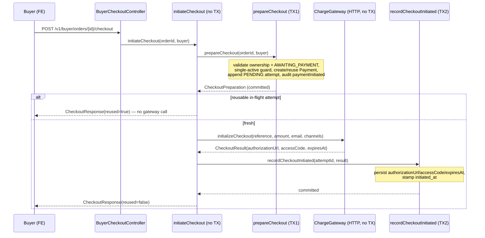

Because `initiateCheckout` itself is **not** `@Transactional`, it forces TX1 and TX2 through the Spring proxy by injecting itself as an `ObjectProvider<PaymentService>` — a plain `this.prepareCheckout(...)` self-call would bypass the proxy and collapse the phases into one (or no) transaction. The same self-proxy trick is used by the webhook listeners. And because the orchestrator runs outside any transaction under `open-in-view=false`, it reads only the payment's **own eager columns** (`getAmount()`, `getCurrency()`) — never the lazy `Order`, which would throw `LazyInitializationException`. The materialize-then-HTTP family of patterns is canonical in [resiliency, audit & ops](resiliency-audit-and-ops.md).

The intermediate state (a `PENDING` attempt with no `authorizationUrl`) is benign: if TX2 never runs (crash after the gateway call), the reconciler's stale-checkout scan expires it.

### Reusable in-flight attempt

If the buyer reloads or retries within the validity window, CropDoor returns the *existing* hosted-checkout session rather than paying Paystack to mint a new one. An attempt is reusable only when its `expiresAt` is more than **5 minutes** in the future (`REUSABLE_BUFFER`), guaranteeing the buyer has runway to finish. On a reusable hit, `initiateCheckout` short-circuits, never calls the gateway, and returns `CheckoutResponse(..., reused=true)` with the existing URL/access-code/expiry.

### The convergence model

Three independent triggers can confirm or fail a charge, and all three funnel through the **same** `findByProviderRefForUpdate` pessimistic lock (`SELECT … FOR UPDATE`) and the **same** `applyChargeOutcomeLocked` body:

1. **Buyer verify** — the FE polls `POST /v1/buyer/payments/{reference}/verify`, which re-fetches the charge (`verifyCharge`) and settles under the lock.
2. **Webhook** — Paystack delivers `charge.success` / `charge.failed`; the dispatcher normalizes it to a `ChargeSucceededEvent` / `ChargeFailedEvent`, and `PaymentServiceImpl` consumes it via `@TransactionalEventListener(phase = AFTER_COMMIT, fallbackExecution = true)`, re-acquiring the same lock.
3. **Reconciler** — `PaymentReconciler#verifyPendingCharges` delegates per charge to `verify`; `markAbandoned` delegates to `applyChargeFailure` with reason `"abandoned"` after `abandonAfter` (default `PT24H`).

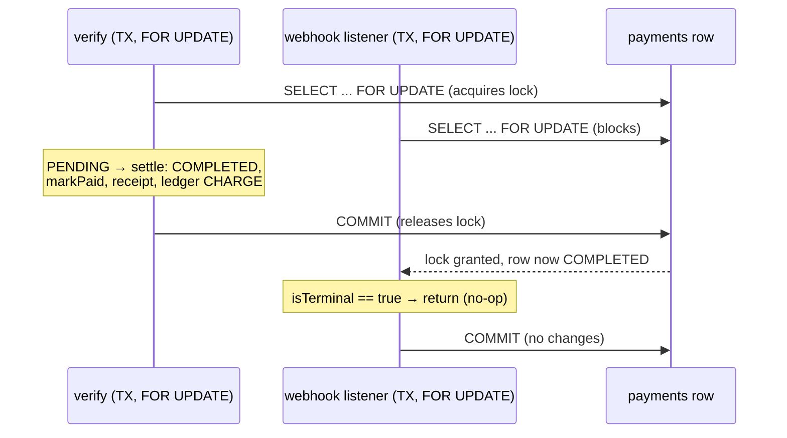

Whichever trigger arrives first settles; whichever arrives second blocks on the lock, sees a terminal state via the `isTerminal` gate, and no-ops. `isTerminal` treats `{COMPLETED, FAILED, REFUNDED}` as terminal. Because the *only* mutation entry point is `applyChargeOutcomeLocked`, the order is promoted exactly once, the receipt issued exactly once, and the `CHARGE` ledger posted exactly once — with the ledger posting itself idempotent on `"charge:" + providerRef` as a second line of defence.

`verify` carries one subtlety: it is annotated `@Transactional(noRollbackFor = PaymentAmountMismatchException.class)` (see the next section).

### Amount / currency mismatch as a fraud signal

A successful gateway verification whose amount or currency does **not** match the order is treated as a fraud/tamper signal, not a success. `amountMatches` requires a non-null verified amount, a currency-code match against `order.getCurrency()`, and an exact `BigDecimal.compareTo == 0`. On mismatch the payment is forced `FAILED` with reason `"amount_mismatch"` and a `paymentAmountMismatch` audit (expected vs reported) is emitted — and inventory is deliberately **not** restored.

The two paths then diverge in how they surface it:

- **Webhook path** never throws — the `FAILED` write commits silently, honouring the always-200 webhook contract.
- **Verify path** detects the just-written `FAILED` and **throws** `PaymentAmountMismatchException` (HTTP **500**, `errorCode=PAYMENT_VERIFICATION_FAILED`). The exception's `getClientMessage()` returns only a generic message — the expected-vs-reported amounts stay in `getMessage()` for logs, never disclosed. This is exactly why `verify` is `noRollbackFor` that exception: the throw must surface the fraud signal *without* rolling back the committed `FAILED` write (which would leave the payment stuck `PENDING`).

### The settlement money-core and the CHARGE posting

The confirmed-money tail — mark `COMPLETED`, stamp `paidAt`/`gatewayFee`, issue the receipt, post the `CHARGE` ledger — lives in `PaymentSettlementServiceImpl#settleConfirmedPayment`, so the **ONLINE charge path and the POD path share one money-core**. It injects only leaf dependencies (`ReceiptService`, `LedgerService`, `LedgerPostings`, the three snapshot repositories) — deliberately not `OrderService`/`PaymentService` — to stay out of their bidirectional cycle. It validates nothing and promotes nothing: charge validation and order promotion stay with the callers; the money-core only books a *confirmed* payment.

`commission` and `tax` come from the order's snapshot rows (`order_commissions` / `order_taxes`), never recomputed; `farmerNet = subtotal − commission` (tax is held by the platform, not paid to the farmer). `LedgerPostings#forChargeSucceeded` builds a balanced five-line posting:

| Account | Direction | Amount | Meaning |
| --- | --- | --- | --- |
| `PLATFORM_FLOAT` | DEBIT | `gross − gatewayFee` | net cash that landed in the platform's gateway balance |
| `GATEWAY_FEES` | DEBIT | `gatewayFee` | Paystack's charge fee, booked as platform expense |
| `FARMER_PAYABLE` | CREDIT | `farmerNet` (`subtotal − commission`), farmer-dimensioned | escrow obligation owed to the farmer |
| `COMMISSION_REVENUE` | CREDIT | `commission` | platform commission recognised |
| `TAX_PAYABLE` | CREDIT | `tax` | tax held on behalf of the authority |

Debits `(gross − fee) + fee = gross`; credits `farmerNet + commission + tax = gross`. Transaction type `CHARGE`, entity type `"PAYMENT"`, idempotency key `"charge:" + providerRef`.

!!! warning "The gateway fee is never reversed"
    Only the float/payable/commission/tax obligations are unwound on a refund or chargeback — the `GATEWAY_FEES` debit stays, so the platform absorbs the charge fee on refunded/charged-back orders. This asymmetry is canonical in [the ledger](ledger.md).

### Order promotion and the escrow gate

On a matched success (ONLINE only), `applyChargeOutcomeLocked` calls `orderService.markPaid(orderId)` **before** settling money. `markPaid` re-loads the order `FOR UPDATE`, requires `AWAITING_PAYMENT`, transitions it to `PENDING`, and records a status-history row. **`AWAITING_PAYMENT → PENDING` is the escrow visibility gate**: the farm only sees the order (and can begin fulfilling) once the buyer's money is confirmed and held in escrow. The `OrderStatus` machine past `PENDING` is the order domain's concern — see [domain](../domain/index.md).

### Charge failure and abandonment

A failed or abandoned charge marks the payment `FAILED` and restores reserved stock, via `applyChargeFailure` (a no-op on an unknown/terminal payment):

- **Webhook** → `applyChargeFailure(reference, failureReason)` with the gateway's reason.
- **Reconciler** → `applyChargeFailure(reference, "abandoned")` after the charge sat `PENDING` past `abandonAfter` (default `PT24H`). The order stays `AWAITING_PAYMENT` throughout, so the abandonment scan keys on payment status, not order status.

### Payment state machine

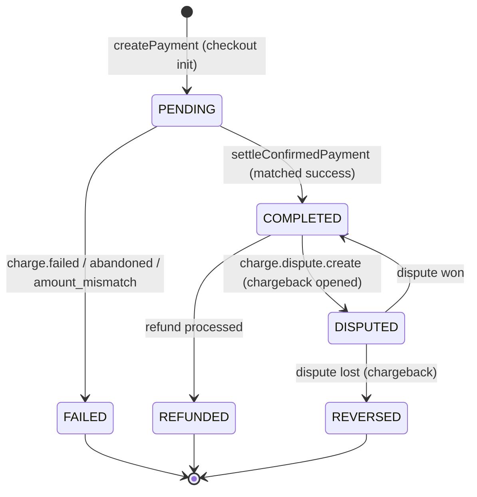

Only `PENDING → {COMPLETED, FAILED}` belongs to checkout. `REFUNDED`/`DISPUTED`/`REVERSED` are driven by the [refund and chargeback](#refunds-chargebacks) flows.

### Pay-on-delivery (POD): the ledger-only path

POD orders never touch checkout. At placement, a POD order is created directly with a `PENDING` cash `Payment` (`provider = "cash"`, idempotency key `"pod-" + orderId`). It settles at **delivery**, gated on the rider's cash-collected acknowledgement: `markDelivered(..., paymentCollected)` calls `settleConfirmedPayment(order, payment, BigDecimal.ZERO, deliveredAt, "pod:" + orderId)` — throwing `PodPaymentNotCollectedException` if cash wasn't collected.

| Aspect | ONLINE (escrow) | POD (cash) |
| --- | --- | --- |
| Checkout | three-step + hosted page | none |
| `Payment.provider` | `"paystack"` | `"cash"` |
| Settlement trigger | verify / webhook / reconciler convergence | `markDelivered` with `paymentCollected=true` |
| `gatewayFee` | `verification.fee()` | `BigDecimal.ZERO` |
| `occurredAt` | `verification.paidAt()` (or now) | `deliveredAt` |
| Ledger reference | `"charge:" + providerRef` | `"pod:" + orderId` |
| Order promotion | `markPaid` (`AWAITING_PAYMENT → PENDING`) before settle | straight to `DELIVERED` |

Both paths call the **same** `settleConfirmedPayment` — same `COMPLETED` write, same receipt, same `CHARGE` ledger shape (POD just has `gatewayFee = 0`, so `PLATFORM_FLOAT` debit equals the gross and `GATEWAY_FEES` is zero). POD proceeds never reach the platform float and so can't fund payouts (see [T+1 settlement](#t1-settlement-lag-and-how-the-float-is-funded)).

### Reference & idempotency keys

| Identifier | Format | Purpose |
| --- | --- | --- |
| Charge reference / `payments.provider_ref` | `cdr-chr-<UUID>` | gateway reference, the `{reference}` verify segment, the lock key |
| `payments.idempotency_key` (ONLINE) | `pay-<orderId>` | DB-unique → one `Payment` per order |
| `payments.idempotency_key` (POD) | `pod-<orderId>` | DB-unique → one cash payment per POD order |
| `payment_attempts.idempotency_key` | `attempt-<UUID>` | unique per checkout attempt |
| `CHARGE` ledger key (ONLINE) | `charge:<providerRef>` | idempotent ledger post |
| `CHARGE` ledger key (POD) | `pod:<orderId>` | idempotent ledger post |

### Response shapes & accepted channels

Checkout returns a `CheckoutResponse` carrying `reference`, `authorizationUrl`, `accessCode`, `expiresAt`, and the boolean `reused`. A status read returns a `PaymentStatusResponse` carrying `reference`, `status` (a `PaymentStatus`), `amount`, `currency`, `channel` (a `PaymentChannel`), and `paidAt`.

`reused = true` tells the FE an existing in-flight session was returned (redirect to the *same* `authorizationUrl`). On `PaymentStatusResponse`, `channel` is null until the gateway reports it and `paidAt` is null unless `COMPLETED`. Checkout passes `cropdoor.payments.accepted-channels` — the default is **MoMo + bank transfer only, no cards** (`MOBILE_MONEY`, `BANK_TRANSFER`).

---

## Payouts

The money-**out** leg: how a delivered, paid order's net proceeds are disbursed to the farmer. Payouts are **admin-triggered, not automatic** — a transfer moves real money off the platform's Paystack balance and is irreversible from our side, so disbursement is an explicit admin action that keeps a person in the loop, gives finance a chokepoint, and lets the platform hold funds through a clearance window as a buffer against post-delivery refunds and chargebacks.

There is **no initiate-eligible scheduled job** for payouts. The only scheduled payout work is re-verifying `PROCESSING` payouts and *flagging* stranded `PENDING` ones (detection only) — neither initiates a transfer. The sole creation path is `POST /v1/admin/payouts` (`PLATFORM::FINANCIAL::MANAGE`).

### Net amount

The farmer is paid their **net = subtotal − Σ commission** (`PayoutTransactionalSteps#netAmount`). **Tax and commission are deliberately not in the payout**: tax is the platform's liability to remit (`TAX_PAYABLE`), commission is the platform's revenue (`COMMISSION_REVENUE`). The charge posting recognised all three at order time; the payout discharges only the `FARMER_PAYABLE` portion. `quoteNet` exposes the same computation as a read-only transaction so the funding guard can be sized *before* opening the write transaction. See [money model](money-model.md) for how the snapshot is taken at placement.

### The funding guard and the low-float warning

`PayoutServiceImpl#disburse` runs two distinct float checks against the live gateway balance (`transferGateway.fetchBalance(GHANA_CEDI)`) before any side effect:

- **Low-float warning (non-blocking).** If `available < lowFloatThreshold`, log WARN + increment `cropdoor.payout.low_float`. It fires *even when the disburse is then rejected* — a critically low balance is exactly when the ops signal matters. No-op unless the threshold is `> 0` (default `0`, disabled).
- **Funding guard (hard block, fail-fast).** The balance must cover **`net + payoutFeeBuffer`** (the buffer is headroom for the still-unknown provider transfer fee). If short, throw `InsufficientPlatformFloatException` → **HTTP 409 `INSUFFICIENT_PLATFORM_FLOAT`** before any payout row, recipient, or transfer exists. Nothing to roll back.

| Config key | Default | Purpose |
| --- | --- | --- |
| `cropdoor.payments.payout.payout-fee-buffer` | `1.00` | headroom above `net` the balance must cover |
| `cropdoor.payments.payout.low-float-threshold` | `0` (disabled) | level at/below which a disburse logs WARN + emits the low-float metric; never blocks |

### The three-step disburse

As with checkout, the provider HTTP must never run inside a transaction. `disburse` brackets the HTTP leg between two short transactions carried by `PayoutTransactionalSteps`:

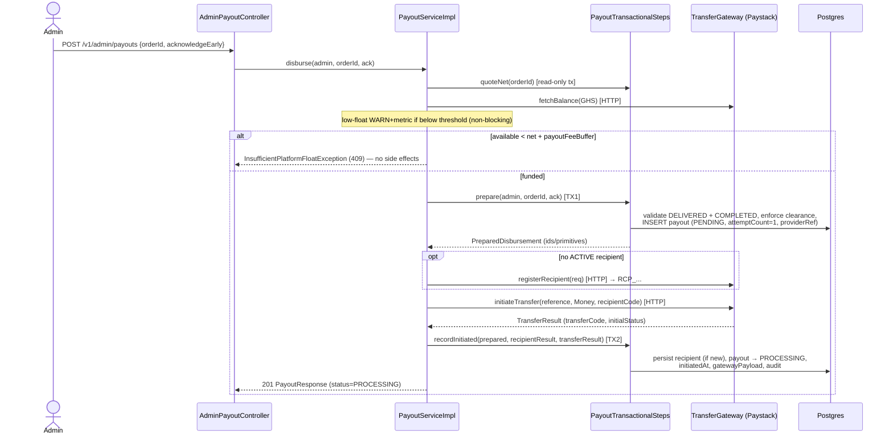

The object handed across the transaction boundary is `PreparedDisbursement` — a flat record of **ids and primitives**, never a detached JPA entity; TX2 re-loads what it needs by id.

!!! warning "A PENDING payout is never auto-retried"
    Failure between TX1 and TX2 (the HTTP transfer throws) leaves a `PENDING` payout whose reference may or may not have reached Paystack. The reconciler re-verifies only `PROCESSING` payouts, so a `PENDING`-stranded payout is **never blindly re-initiated** — that could double-pay the farmer. It is instead **flagged**: `PayoutReconciler#flagStalePendingPayouts` WARN-logs each `PENDING` payout older than the stuck threshold and increments `cropdoor.payout.stale_pending` for human investigation. Detection, not recovery.

### Clearance window and the early-disbursement override

A delivered order is not disbursable the instant it's marked delivered. The clearance window holds funds for a configured duration after delivery (`clearsAt = deliveredAt + clearanceWindow`):

- **Past the window** → disburses normally (`disbursedEarly=false`), audit `PAYOUT_DISBURSED`.
- **Within the window, not acknowledged** → `PayoutClearanceNotMetException` → **HTTP 409 `PAYOUT_CLEARANCE_NOT_MET`**, message naming the exact `clearsAt`.
- **Within the window, acknowledged** (`acknowledgeEarlyDisbursement=true`) → stamped `disbursedEarly=true`, audit `PAYOUT_DISBURSED_EARLY`. The flag surfaces on `PayoutResponse`/`PayoutSummary` so the override is auditable.

| Profile | `cropdoor.payments.payout.clearance-window` | Rationale |
| --- | --- | --- |
| Production | `P7D` (7 days) | buffer against refunds/chargebacks before money leaves |
| Local | `PT5M` (5 minutes) | so the happy path is reachable in a live-test session |

### Transfer recipient lifecycle and last-4 masking

A `TransferRecipient` (`transfer_recipients`) is CropDoor's record of a registered Paystack payout destination for a farm; `providerRef` holds the Paystack `recipient_code` (`RCP_...`). Recipients are registered **on demand** during the first disburse for a farm (or the first after a destination change), never up front. If the farm has no active recipient, `prepare` loads its `FarmPayoutDetails`; if missing, `TransferRecipientUnavailableException` (HTTP 422, "set payout details first").

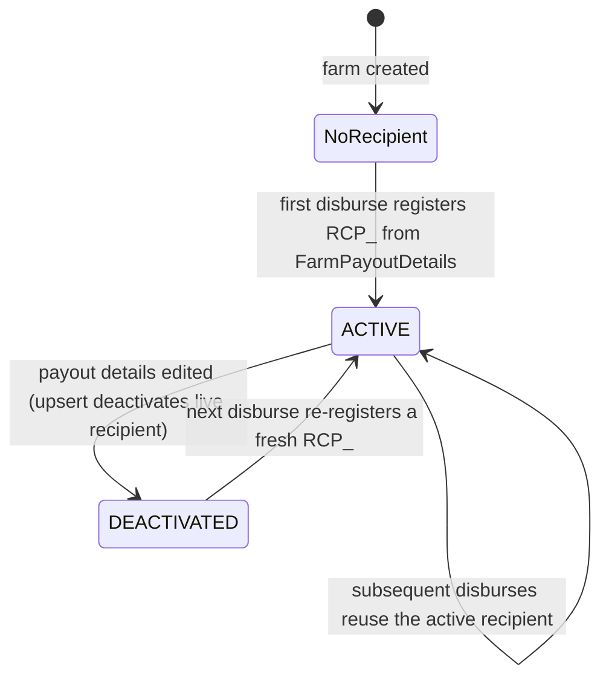

A **partial unique index** (`uq_transfer_recipients_active … WHERE status = 'ACTIVE'`) enforces one active recipient per `(farm, provider, channel)` while keeping `DEACTIVATED` history rows — recipients are never deleted. `TransferRecipientStatus` has exactly two values: `ACTIVE`, `DEACTIVATED`.

`FarmPayoutDetails` (`farm_payout_details`, one row per farm) is the farmer-owned source of truth for *where* money lands. `PayoutChannel` is `MOBILE_MONEY` or `BANK` (cards are not a payout channel); exactly one channel's fields are populated, enforced both by a DB CHECK and service-side `validateChannelFields` (→ `IncompletePayoutDetailsException`, 400). On read, `FarmPayoutDetailsResponse` **never returns a full number** — `maskTail` reduces it to the last four behind a fixed mask (`****6789`), returning `null` for values shorter than four chars; `channel`, `momoProvider`, `bankCode`, `accountName`, and `verifiedAt` come back verbatim. `verifiedAt` is stamped when a recipient is first registered for the current details and cleared on any details edit, so a non-null value means "these exact details have an active recipient registered."

| `PayoutChannel` | Paystack `type` | Identifier sent |
| --- | --- | --- |
| `MOBILE_MONEY` | `mobile_money` | `momoNumber` + `momoProvider` (in the `bank_code` slot), name = farm name |
| `BANK` | `ghipss` | `accountNumber` + `bankCode`, name = `accountName` |

### Payout state machine and webhook settlement

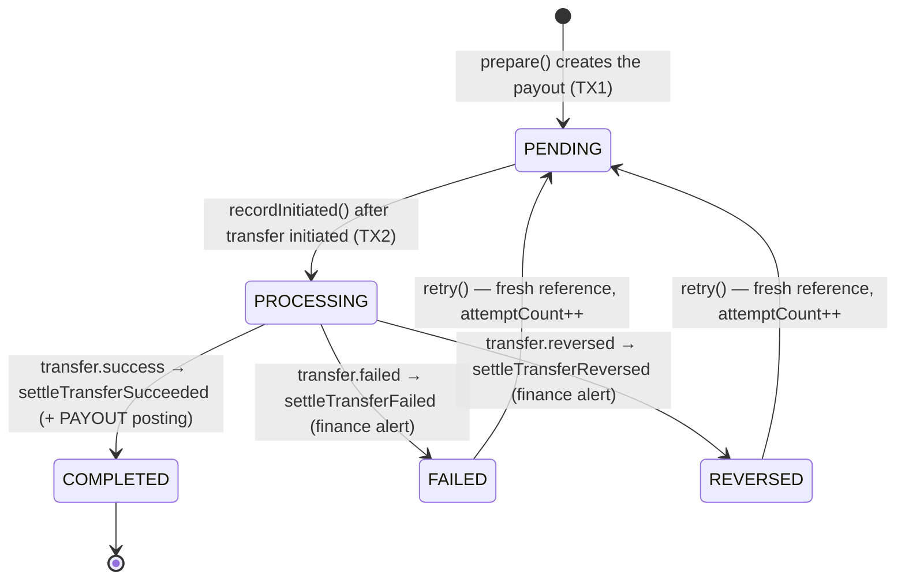

Paystack delivers `transfer.success` / `transfer.failed` / `transfer.reversed`; the dispatcher normalizes them and `PayoutServiceImpl` consumes via `@TransactionalEventListener(phase = AFTER_COMMIT, fallbackExecution = true)`, routing through the self-proxy so the settle method's `@Transactional` actually opens. The settle methods are **idempotent** via a `FOR UPDATE` lock (`lockOrSkip`) plus a terminal-state check:

- **success** → `COMPLETED`, stamp `completedAt`, post the `PAYOUT` ledger, audit `PAYOUT_SUCCEEDED`.
- **failed** → `FAILED`, stamp `failedAt` + `failureReason`, log `ERROR` ("finance attention required"), audit `PAYOUT_FAILED`. **No ledger posting.**
- **reversed** → `REVERSED`, store `failureReason`, log `ERROR`, audit `PAYOUT_REVERSED`. **No ledger posting.** (Its terminal guard is `status == REVERSED`.)

`COMPLETED` is terminal; `FAILED`/`REVERSED` are non-terminal and admin-retryable.

### The PAYOUT ledger posting

Posted **only on success**, inside `settleTransferSucceeded`, via `LedgerPostings#forPayoutSucceeded` (no posting at initiation — the money is in flight, not yet gone):

| Account | Direction | Amount | Meaning |
| --- | --- | --- | --- |
| `FARMER_PAYABLE` | DEBIT | `net` (farmer-dimensioned) | discharge what the platform owed the farmer |
| `GATEWAY_FEES` | DEBIT | `transferFee` | the provider's transfer fee, platform expense |
| `PLATFORM_FLOAT` | CREDIT | `net + transferFee` | cash that left the float |

The farmer receives the full `net`; the transfer fee is the platform's expense, **not** deducted from the farmer. Type `PAYOUT`, idempotency key `"payout-success-" + payoutId`. Symmetry with the charge: the charge *credited* `FARMER_PAYABLE` when the buyer paid; the payout *debits* it back — over a clean order the farmer's payable dimension nets to zero.

The transfer fee is **unknown at initiation** (Paystack returns it only on settlement), which is why the funding guard reserves `net + payoutFeeBuffer` as a proxy. The real fee arrives on `transfer.success` (`event.transferFee()`) or via the reconciler's `verifyTransfer`; both null-coalesce to zero, so a null fee posts a zero `GATEWAY_FEES` debit and a `floatOut == net` credit — still balanced.

### Retry semantics and the late-webhook no-op

A `FAILED`/`REVERSED` payout can be retried by an admin via `POST /v1/admin/payouts/{payoutId}/retry` (`PLATFORM::FINANCIAL::MANAGE`). Retry reuses the same three-step shape with the **same recipient** but a **fresh transfer reference**, resetting status to `PENDING`, clearing `failureReason`/`failedAt`, and incrementing `attemptCount`.

The fresh reference *is* the safety net: if `transfer.failed` was delivered late (or redelivered) for the *old* reference after the admin already retried, `lockOrSkip(oldReference)` finds no payout with that `providerRef` (it now carries the new one) and the settle no-ops via the "unknown reference; ignoring" branch. The retry's own settlement converges only on the new reference.

`attemptCount` starts at `1` and is capped by `cropdoor.payments.reconciler.max-payout-attempts` (default `5`): `prepareRetry` throws `InvalidPayoutStateException` once `attemptCount >= maxPayoutAttempts`.

`PayoutReconciler` (gated by `cropdoor.payments.reconciler.enabled`, default on; off in test) periodically re-verifies payouts stuck in `PROCESSING` whose `lastAttemptedAt` is older than the threshold, routing the provider's reported status through the *same* locked `settleTransfer*` methods.

| Config key | Default | Purpose |
| --- | --- | --- |
| `cropdoor.payments.reconciler.enabled` | `true` | master switch for all reconcilers |
| `cropdoor.payments.reconciler.verify-stuck-processing-fixed-delay` | `PT2M` | cadence of the stuck-`PROCESSING` scan |
| `cropdoor.payments.reconciler.stuck-processing-threshold` | `PT10M` | when a `PROCESSING` payout counts as "stuck" since `lastAttemptedAt` |
| `cropdoor.payments.reconciler.batch-size` | `50` | max payouts re-verified per run |
| `cropdoor.payments.reconciler.max-payout-attempts` | `5` | max total attempts; `prepareRetry` rejects once reached |

Transfer gateway calls have **no `@Retryable`** — recovery is the reconciler plus Paystack's webhook redelivery. The deferred gateway circuit breaker is discussed in [resiliency, audit & ops](resiliency-audit-and-ops.md).

### Ops prerequisite and float funding

**Paystack Transfer OTP must be disabled** in the dashboard, or the automated `initiateTransfer` would sit awaiting OTP instead of dispatching. This is an off-code go-live step (no code toggle).

#### T+1 settlement lag and how the float is funded

Payouts draw down the platform's Paystack **balance** (the float), funded by buyer charges. But charge proceeds settle to the balance on a **T+1** schedule, so the balance available at any moment reflects already-settled charges, not today's checkouts. The funding guard reads the *current* balance, so it inherently respects what has actually settled. ONLINE/escrow charges feed the float (T+1); POD/cash never touches Paystack and so cannot fund other payouts. The clearance window and the T+1 lag together mean disbursable funds are always "older" settled money — exactly the buffer the guard protects. The settlement seam is detailed in [gateway & webhooks](gateway-and-webhooks.md) and [reconciliation](reconciliation.md).

### Endpoints and error codes

| Method | Path | Permission | Returns |
| --- | --- | --- | --- |
| `POST` | `/v1/admin/payouts` | `PLATFORM::FINANCIAL::MANAGE` | 201 `PayoutResponse` |
| `POST` | `/v1/admin/payouts/{payoutId}/retry` | `PLATFORM::FINANCIAL::MANAGE` | 200 `PayoutResponse` |
| `GET` | `/v1/admin/payouts` | `PLATFORM::FINANCIAL::VIEW` | 200 `Page<PayoutSummary>` (size ≤ 100, newest first) |
| `PUT` | `/v1/farms/{farmId}/payout-details` | `FARM::FINANCIAL::UPDATE` (+ active member) | 200 `FarmPayoutDetailsResponse` (masked) |
| `GET` | `/v1/farms/{farmId}/payout-details` | `FARM::FINANCIAL::VIEW` (+ active member) | 200 `FarmPayoutDetailsResponse` (masked) |

| Exception | ErrorCode | HTTP | When |
| --- | --- | --- | --- |
| `InsufficientPlatformFloatException` | `INSUFFICIENT_PLATFORM_FLOAT` | 409 | balance < `net + payoutFeeBuffer` (before any side effect) |
| `PayoutClearanceNotMetException` | `PAYOUT_CLEARANCE_NOT_MET` | 409 | within clearance window, no early ack |
| `InvalidPayoutStateException` | `INVALID_PAYOUT_STATE` | 409 | order not `DELIVERED`/payment not `COMPLETED`, not found, retry of a non-`FAILED`/`REVERSED` payout, or attempt cap reached |
| `TransferRecipientUnavailableException` | `TRANSFER_RECIPIENT_UNAVAILABLE` | 422 | no payout details to register, or retry payout has no recipient |
| `IncompletePayoutDetailsException` | `INCOMPLETE_PAYOUT_DETAILS` | 400 | upsert omits a field the chosen channel requires |
| `FarmPayoutDetailsNotFoundException` | `FARM_PAYOUT_DETAILS_NOT_FOUND` | 404 | `GET` payout details for a farm that has none |

---

## Refunds & chargebacks

Two "money leaves the platform after a successful charge" flows. The **admin refund** is a deliberate, asynchronous, webhook-settled, credit-note-issuing reversal of a completed charge. The **buyer chargeback** is a card-network dispute that arrives unsolicited as a Paystack webhook, freezes the order, then resolves won or lost. They reverse the same kind of charge but differ in almost everything else.

| Dimension | Admin refund | Buyer chargeback |
| --- | --- | --- |
| Trigger | `POST /v1/admin/payments/{paymentId}/refund` | `charge.dispute.create` webhook |
| Actor / audit principal | the acting admin | none — `user_id` is null |
| Service | `RefundServiceImpl#initiateRefund` | `ChargebackServiceImpl#openChargeback` |
| Settlement | `refund.processed` / `refund.failed` webhooks | `charge.dispute.resolve` webhook |
| Payment path | `COMPLETED → REFUNDED` (or back to `COMPLETED`) | `COMPLETED → DISPUTED → COMPLETED` (won) / `→ REVERSED` (lost) |
| Concurrency | unique `idempotency_key` + `PENDING` guard (no lock) | `SELECT … FOR UPDATE` |
| Ledger type | `REFUND` | `CHARGEBACK_REVERSAL` (lost); `CHARGEBACK_WRITEOFF` on write-off |
| Amounts from | the `Receipt` snapshot | the **live `Order`** + summed `OrderCommission` |
| Missing receipt | **hard-fail** (rolls back, retried) | **soft-skip** (WARN, reversal still posts) |
| Credit note | `CreditNoteOrigin.REFUND` (links the `Refund`) | `CreditNoteOrigin.CHARGEBACK` (no refund linked) |
| Clawback risk | none | yes — drives `FARMER_PAYABLE` negative if already paid out |
| Eligibility | only ONLINE/escrow `COMPLETED` payments | only ONLINE card charges |

Both flows' `mark*`/resolve methods are idempotent, because both Paystack redelivery (up to 72h) and the reconciler backstop can replay the same terminal event.

### Refund: the three-step no-lock pattern

A provider refund call is slow HTTP. Holding a row lock across it would serialize unrelated work, so `initiateRefund` splits into two committed transactions with the gateway call between, through the self-proxy:

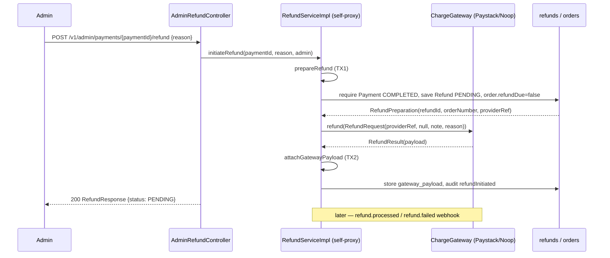

- **TX1 `prepareRefund`** loads the `Payment` (404 if absent), requires `COMPLETED` (else `InvalidRefundStateException`, 409), runs the idempotency check, saves a `PENDING` `Refund` at the **full** `payment.getAmount()` with `providerRef = payment.getProviderRef()` (the *original charge* reference), and clears `order.refundDue`. It captures the order number and provider reference while the session is open so the gateway leg never dereferences a lazy association.
- **Gateway call** builds a `RefundRequest` with a `null` amount (= **full** refund). The refund is **not** advanced past `PENDING` here — the provider returns "queued"; actual movement is confirmed by a `refund.*` webhook.
- **TX2 `attachGatewayPayload`** stores the raw provider payload into `gateway_payload` (JSONB) and emits the `refundInitiated` audit.

**Idempotency is keyed on the payment, not the request:** `idempotencyKey = "refund-" + paymentId`, and `refunds.idempotency_key` is unique. If a refund already exists, TX1 returns `alreadyInitiated = true`, `initiateRefund` skips the gateway entirely, and returns the existing refund — a double-click never fires a second provider refund. Because CropDoor supports **full refunds only**, there is at most one refund per payment, which is what makes the single unique key sufficient.

### The refund.* webhook taxonomy

Settling webhooks are normalized at `PaystackEventDispatcher#dispatch` and consumed via `@TransactionalEventListener(AFTER_COMMIT, fallbackExecution = true)` through the self-proxy. Webhooks reference the **original charge's transaction reference** (not the refund's own id), which CropDoor stored as `refunds.provider_ref`, so `findByProviderRef` resolves straight to the refund row.

| Paystack event | `mark*` method | Effect |
| --- | --- | --- |
| `refund.processed` | `markProcessed` | refund → `PROCESSED`, payment → `REFUNDED`, ledger reversal, credit note |
| `refund.failed` | `markFailed` | refund → `FAILED`, payment → back to `COMPLETED` (provider credited the deduction back) |
| `refund.pending`, `refund.processing` | `markPending` | informational — stores latest payload, **no state change** |
| `refund.needs-attention` | `markNeedsAttention` | bank details not captured; logs WARN, refund **stays `PENDING`** |

`refund.needs-attention` is the important non-terminal case: Paystack couldn't credit the buyer (no captured bank account). The refund deliberately stays `PENDING` — an admin must supply bank details; the platform does not auto-fail it. The persisted `model/payment/RefundStatus` enum has only `PENDING / PROCESSED / FAILED` (the provider's `NEEDS_ATTENTION` / `UNKNOWN` are gateway-only states that map back onto `PENDING`).

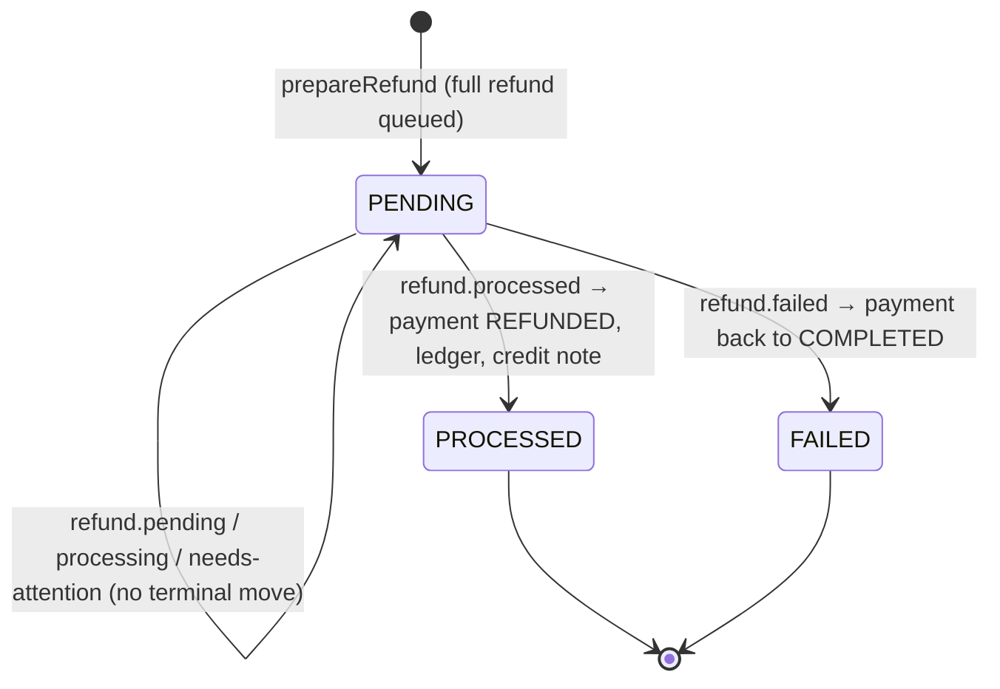

Every `mark*` method is idempotent through the shared `pendingRefundFor` guard (an unknown reference or already-terminal refund is a logged no-op). When a terminal webhook is lost, `RefundReconciler` re-polls via `verifyRefund` (which resolves the reference to Paystack's numeric transaction id, then queries `GET /refund?transaction=<id>`) and routes a `PROCESSED`/`FAILED` result through the same idempotent path — so a refund can never double-settle. The reconciler fires on `cropdoor.payments.reconciler.verify-pending-refunds-fixed-delay` (default `PT5M`), re-polling `PENDING` refunds older than `refundVerifyMinAge` (default 30 minutes), one batch of `batchSize` (default 50), oldest first.

### The REFUND posting, credit note, and refund_due

On `refund.processed`, `markProcessed` sources the breakdown from the order's `Receipt` snapshot (`farmerNet = subtotal − commission`) and posts `LedgerPostings#forRefundProcessed`:

| Account | Direction | Amount |
| --- | --- | --- |
| `FARMER_PAYABLE` | DEBIT | `farmerNet` (farmer, order) |
| `COMMISSION_REVENUE` | DEBIT | `commission` |
| `TAX_PAYABLE` | DEBIT | `tax` |
| `PLATFORM_FLOAT` | CREDIT | `refundedTotal` (= `farmerNet + commission + tax`) |

Type `REFUND`, idempotency key `"refund-processed-" + refundId`. The original charge debited `PLATFORM_FLOAT (gross − gatewayFee)` and `GATEWAY_FEES (gatewayFee)`; the refund credits the **gross** back but does **not** touch `GATEWAY_FEES` — Paystack keeps the fee, so the platform absorbs it. That's why the float credit equals the refunded total, not the original net debit.

After posting, `markProcessed` sets `receipt.refunded = true`, refund `PROCESSED`, payment `REFUNDED`, emits the `refundProcessed` audit, and issues a **credit note** via `CreditNoteService#issueForRefund` (numbered `"CN-" + orderNumber`, `CreditNoteOrigin.REFUND`, links the `Refund`). Issuance is idempotent per receipt; PDF generation is an after-commit side effect (an S3/render failure never disrupts the reversal). See [receipts & credit notes](receipts-and-credit-notes.md).

**Only ONLINE/escrow payments are refundable** — a POD/cash order never produces a `COMPLETED` escrow payment, so there is nothing to credit back. CropDoor **never auto-refunds on cancellation**: `OrderServiceImpl#cancel` sets `order.refundDue = true` only if a `COMPLETED` payment exists. `refund_due` is a pure work-queue marker for admin/ops ("this cancelled order took real money — decide whether to refund"); it is cleared inside `prepareRefund` the moment a refund is initiated.

### Chargeback: why there is no charge.reversed

Paystack has **no `charge.reversed` event**. A post-success buyer chargeback arrives as a two-step dispute lifecycle: `charge.dispute.create` (opened — CropDoor freezes the money) then `charge.dispute.resolve` (won → unfreeze; lost → reverse). The dispatcher maps these to `ChargebackOpenedEvent` / `ChargebackResolvedEvent` (`charge.dispute.remind` is only logged). The finance alert is the `CHARGEBACK_OPENED` audit row plus a WARN — there's no separate push/email channel.

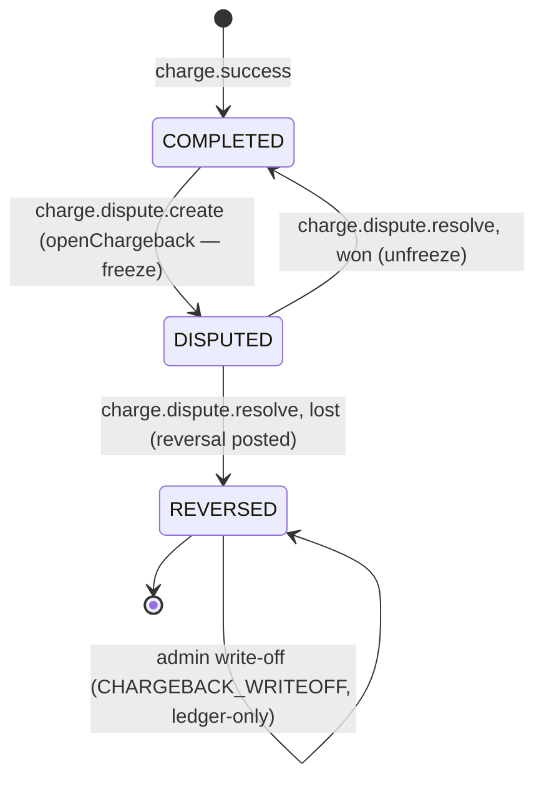

Both `openChargeback` and `resolveChargeback` load the payment with a **pessimistic lock** (`findByProviderRefForUpdate`) — a chargeback's open and resolve webhooks (and a reconciler poll) can race on the *same* `Payment` row, so the lock serializes them and the state-machine guards (`status != COMPLETED` / `status != DISPUTED` → no-op) are evaluated under exclusivity. `openChargeback`'s freeze is load-bearing: disbursement admits **only `COMPLETED`** payments, so a `DISPUTED` payment cannot be paid out while the dispute is open.

### Won / lost — the losing-safe rule

The won/lost decision (`PaystackEventDispatcher#isMerchantWin`) is **losing-safe**. The Paystack Disputes API has no `won` value — `resolution` is `merchant-accepted` (a loss) or `declined`, and the real outcome is whether money went back (`refund_amount`). WON requires the unambiguous winning triple; **anything else** defaults to LOST.

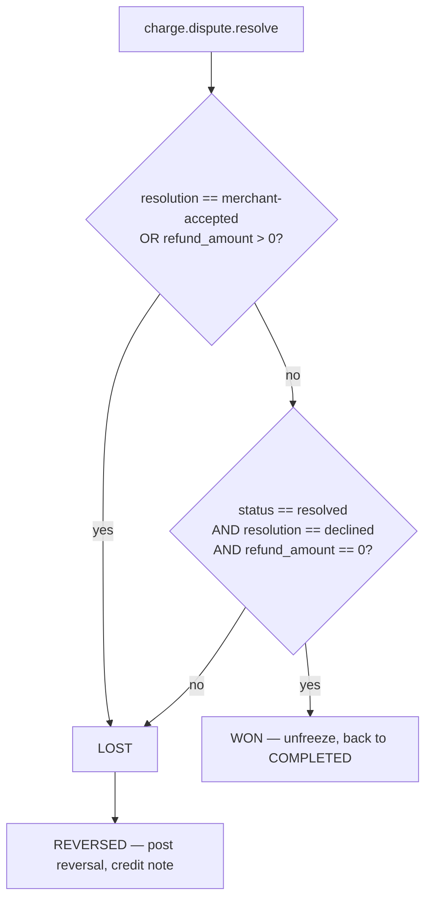

The platform never unfreezes on an unresolved or ambiguous dispute: a false-LOST is a recoverable ledger reversal, whereas a false-WON would release money the bank already clawed back.

### CHARGEBACK_REVERSAL and the implicit clawback

On a lost chargeback, `resolveChargeback` recomputes the breakdown from the **live `Order`** (not the receipt — see the asymmetry below) and posts `LedgerPostings#forChargebackReversal`:

| Account | Direction | Amount |
| --- | --- | --- |
| `FARMER_PAYABLE` | DEBIT | `farmerNet` (farmer, order) |
| `COMMISSION_REVENUE` | DEBIT | `commission` |
| `TAX_PAYABLE` | DEBIT | `tax` |
| `PLATFORM_FLOAT` | CREDIT | `grossAmount` |

Type `CHARGEBACK_REVERSAL`, idempotency key `"chargeback-reversal-" + disputeReference`. As with a refund, the charge gateway fee is never reversed.

**The implicit clawback** falls out of double-entry on the per-farmer `FARMER_PAYABLE` dimension, with no special branch:

- farmer **not yet disbursed** → this debit cancels the charge's original `FARMER_PAYABLE` credit → the dimension nets to zero;
- farmer **already disbursed** (a prior `transfer.success` debited it to zero) → this second debit drives the dimension **negative** — that negative balance *is* the clawback, a claim against the farmer's next payout.

### Admin clawback write-off

A negative `FARMER_PAYABLE` is a recovery claim. If ops decides it's unrecoverable, an admin writes it off via `POST /v1/admin/chargebacks/{paymentId}/write-off` → `writeOffClawback`: it requires the payment be `REVERSED`, computes the outstanding payable (`creditMinusDebitForOrderFarmerPayable`), and if negative posts `LedgerPostings#forChargebackWriteoff`:

| Account | Direction | Amount |
| --- | --- | --- |
| `CHARGEBACK_LOSS` | DEBIT | `writeOffAmount` (= `orderPayable.abs()`) |
| `FARMER_PAYABLE` | CREDIT | `writeOffAmount` (farmer, order) |

Type `CHARGEBACK_WRITEOFF`, idempotency key `"chargeback-writeoff-" + paymentId`. The write-off is **ledger-only**: it credits the negative payable back to zero and books the loss to `CHARGEBACK_LOSS` (a platform expense). The `Payment` status stays `REVERSED`. This is the only admin-driven mutation in the chargeback flow.

### Missing-receipt asymmetry

Both flows want the order's `Receipt` to flip `refunded = true` and seed a credit note, but they react to a *missing* receipt oppositely:

- **Refund — hard-fail.** `markProcessed` throws `InvalidRefundStateException` if no receipt — it also sources its ledger breakdown from the receipt, so without it the reversal can't post correctly. Throwing rolls back, the refund stays `PENDING`, and the webhook (72h retries) or reconciler re-drives it once the receipt exists.
- **Chargeback — soft-skip.** `resolveChargeback` posts the reversal first (its amounts come from the **live `Order`**, precisely so it never depends on the receipt), then treats the receipt as best-effort: present → flip `refunded` + issue the `CHARGEBACK` credit note; absent → WARN and skip. A lost chargeback is the bank's decision and must always move the money regardless of document state.

### Audit attribution and error codes

Every refund/chargeback audit is **buyer-scoped** (it reverses a buyer's charge) and carries `KEY_OWNER_TYPE = BUYER` + `KEY_OWNER_ID = <buyer profile id>` for the per-org audit feed. The acting admin is the principal on `refundInitiated`; the webhook-driven outcomes (`refundProcessed`, `refundFailed`, `chargebackOpened`, `paymentReversed`) carry a **null** principal — the webhook is the actor.

| Endpoint | Permission | Body |
| --- | --- | --- |
| `POST /v1/admin/payments/{paymentId}/refund` | `PLATFORM::FINANCIAL::MANAGE` | `RefundInitiateRequest{reason}` |
| `GET /v1/admin/refunds` | `PLATFORM::FINANCIAL::VIEW` | `?status`, `?page`, `?size` (≤ 100, newest first) |
| `POST /v1/admin/chargebacks/{paymentId}/write-off` | `PLATFORM::FINANCIAL::MANAGE` | `ChargebackWriteOffRequest{reason}` |

| ErrorCode | HTTP | Raised when |
| --- | --- | --- |
| `INVALID_REFUND_STATE` | 409 | payment not `COMPLETED` at initiate; refund already initiated; refunded order has no receipt |
| `INVALID_CHARGEBACK_STATE` | 409 | write-off target not `REVERSED`; no outstanding negative payable |
| `PAYMENT_NOT_FOUND` | 404 | refund/write-off references an unknown payment |
| `CREDIT_NOTE_NOT_FOUND` | 404 | credit-note read for an unknown/foreign credit note |

`RefundResponse` exposes `id, paymentId, orderId, amount, currency, provider, providerRef, status, reason, initiatedBy, createdAt`.

---

## Dispute-defense

When a buyer's bank reverses a charge, Paystack opens a *dispute* and gives the merchant a short window (**~16h before auto-accept**) to push back with evidence. Silence costs money. CropDoor automates the response: a scheduled job lists the disputes awaiting our feedback, **auto-contests** the ones whose order was delivered (re-rendering the receipt as evidence), and **routes the undelivered/unmappable ones to a human review queue** — never an auto-refund.

This is the **outbound** defense layer: it moves no money in our ledger, it only sends instructions to Paystack. The **inbound** money state machine that books the eventual settlement is the [chargeback](#refunds-chargebacks) flow above, driven by `charge.dispute.*` webhooks. Defense decides *what we want* (declined vs merchant-accepted) and submits it; the webhook arm later observes *what actually happened* and books it.

### The two-track design

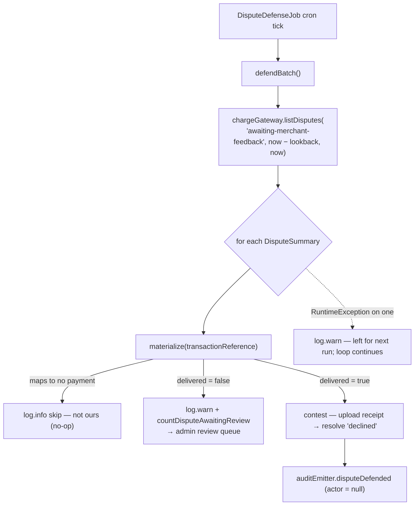

| Track | Order state | Action | Actor |
| --- | --- | --- | --- |
| **Auto-defend** | delivered | contest (`declined`) with the receipt as evidence | system (null) |
| **Admin review queue** | undelivered | metric + WARN; a human decides contest vs concede | admin |
| **Admin review queue** | un-mappable (no `Payment` for the reference) | `log.info` skip; surfaces as a `REVIEW` row | admin |

The asymmetry is the whole point. A *delivered* order is a strong, mechanical case — we have a receipt proving fulfilment, so contesting is safe to automate. An *undelivered* order might genuinely be the buyer's money to reclaim; auto-contesting there would defend fraud against our own buyers, so the job **never auto-concedes and never auto-contests the undelivered**.

`DisputeDefenseJob` is gated by `@ConditionalOnProperty("cropdoor.payments.dispute-defense.enabled", havingValue = "true")` — **off by default**, opt-in per env, so the feature is inert anywhere (including prod) that doesn't set it. Under `provider=noop`, `listDisputes(...)` returns an empty list, so the batch is a clean no-op in dev/test. Each dispute is handled inside its own `try/catch (RuntimeException)`: one bad dispute (missing receipt, gateway hiccup) is logged and skipped, and is retried next tick while it stays `awaiting-merchant-feedback`.

### The materialize / HTTP split

Every action runs in two phases, mirroring the rest of payments under `open-in-view=false`:

1. **Materialize** (`DisputeDefenseTransactionalSteps.materialize`, `@Transactional(readOnly = true)`): loads the dispute's order graph inside an open session and flattens everything the gateway leg needs — delivery state, the **re-rendered receipt PDF bytes**, and the structured fraud evidence — into a detached `MaterializedDispute` (primitives + `byte[]`, no entities, no proxies).
2. **Gateway HTTP** (`contest` / `concede`): the `ChargeGateway` calls run **entirely outside** that transaction, against the materialized values.

The mapping key is `paymentRepository.findByProviderRef(transactionReference)` — the dispute's `transactionReference` (our charge reference) matched against `Payment.providerRef`. No match ⇒ `Optional.empty()` ⇒ the dispute isn't ours. The receipt PDF is **re-rendered on demand** via `receiptDocumentService.renderPdf`, not fetched from a stored copy. A separate, lighter `reviewContext(transactionReference)` returns `(orderNumber, delivered, receiptPresent)` **without rendering the PDF** — listing dozens of disputes shouldn't render dozens of PDFs; the render is paid only on an actual contest.

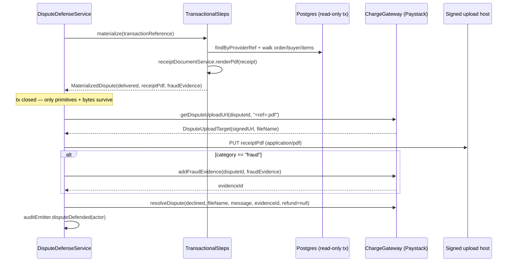

### Contest and concede

**Contest** (`declined`), the delivered-order auto-path: guard on `receiptPresent` (a delivered order with no receipt → WARN and return, never resolve with no evidence); fetch a short-lived signed upload URL *immediately before* the upload (it's time-limited, never cached); PUT the receipt bytes to that signed host (a dedicated `RestClient`, since the shared `PaystackHttpClient` is pinned to the API base and only parses `PaystackResponse` envelopes); for `fraud`-category disputes also POST structured `DisputeFraudEvidence` and echo back the provider's `evidenceId`; then `resolveDispute(... "declined" ..., refundAmount = null)` (a decline refunds nothing); audit `DISPUTE_DEFENDED`.

**Concede** (`merchant-accepted`) accepts the chargeback and refunds the buyer the full disputed amount. **The job never auto-concedes** — it's reachable only through `POST /v1/admin/disputes/{disputeId}/concede`. It submits no upload and no evidence, sends `refundAmount = dispute.amount()` (the full amount), and audits `DISPUTE_CONCEDED`. Materialize is best-effort here (it captures `orderId` for the audit, but a null result doesn't block the concession). The resulting refund's ledger movements live in the [chargeback](#refunds-chargebacks) money state machine — this layer stops at "the resolve call was sent."

The single routing input is `order.getDeliveredAt() != null`:

| Materialized state | Job (`defendBatch`) | Queue `suggestedAction` |
| --- | --- | --- |
| Delivered, receipt present | auto-contest | `CONTEST` |
| Delivered, **no receipt** | skip + WARN | `CONTEST` (with `receiptAvailable=false`) |
| Undelivered | queue (metric + WARN) | `CONCEDE` |
| Un-mappable | skip (`log.info`, "not ours") | `REVIEW` |

The no-receipt-on-delivered edge is the one place the job and queue disagree: the automation refuses to fabricate a contest with no evidence (skip + WARN), but it also won't silently auto-concede a *delivered* order — it escalates to a human, surfacing in the queue as a `CONTEST` row flagged `receiptAvailable=false`.

For `fraud` disputes, `DisputeFraudEvidence` is built from the order graph during materialize: `customerEmail`/`customerName`/`customerPhone` from the buyer, `serviceDetails` templated from the order, `deliveryAddress` joined from the `DeliveryAddressSnapshot`, `deliveryDate` from `deliveredAt`.

### Idempotency without persistence

There is **no dispute table, no "processed" flag, no dedup key persisted**. The idempotency mechanism is the gateway filter itself:

> The `awaiting-merchant-feedback` status filter **is** the idempotency key.

Once resolved, Paystack moves a dispute out of `awaiting-merchant-feedback`, so the next `listDisputes(...)` doesn't return it and a re-run can't double-contest. This is why both the job and the admin actions **re-list live** every time: `contestById` / `concedeById` call `findPendingDispute(disputeId, …)`, which re-lists and finds this id — if it's no longer pending (already resolved, or raced with the job or another admin), the action is a clean no-op. If the cron job and an admin both act at once, one resolves it and the other's re-list (or Paystack's own state check) makes the second a no-op — the worst case is a redundant resolve attempt, never a double refund, because Paystack is the single source of truth. There is **no `@Retryable`** on these calls: a failed dispute is retried on the next tick while it stays pending, and Paystack's ~72h webhook redelivery covers the inbound side.

### The admin review queue

`AdminDisputeController` (`/v1/admin/disputes`) is the human surface — and, in practice, for *any* live pending dispute, since the list reads straight from the gateway:

| Method & path | Permission | Service |
| --- | --- | --- |
| `GET /v1/admin/disputes` | `PLATFORM::DISPUTE::VIEW` | `listForReview()` → `List<AdminDisputeRow>` |
| `POST /v1/admin/disputes/{disputeId}/contest` | `PLATFORM::DISPUTE::RESOLVE` | `contestById(disputeId, admin)` |
| `POST /v1/admin/disputes/{disputeId}/concede` | `PLATFORM::DISPUTE::RESOLVE` | `concedeById(disputeId, admin)` |

The contest/concede handlers thread `admin.getUser()` as the actor, distinguishing manual admin actions from the system job in the audit trail. `AdminDisputeRow` carries `disputeId, transactionReference, category, status, amount` (major units), `orderNumber` (null when unmappable), `delivered`, `receiptAvailable`, and `suggestedAction` (`CONTEST | CONCEDE | REVIEW`). **Listing is cheap by design** — it goes through the PDF-free `reviewContext`, deferring any render to an actual contest; mutations re-list live and materialize on demand, so the queue holds no state between requests.

### Metric, lookback, and audit

The **only** signal that an undelivered dispute needs a human is the counter `cropdoor_dispute_awaiting_review_total{currency}` (meter `cropdoor.dispute.awaiting_review`) — there is no persisted "needs review" row, so ops must alert on it (and watch the WARN logs); the live queue is where the disputes are then worked. Paystack auto-accepts after ~16h, so the cron must run comfortably more often:

| Config key | Default | Purpose |
| --- | --- | --- |
| `cropdoor.payments.dispute-defense.enabled` | `false` | master switch; off ⇒ `DisputeDefenseJob` bean not created |
| `cropdoor.payments.dispute-defense.cron` | `0 0 * * * *` (hourly) | scan frequency — must beat the 16h auto-accept |
| `cropdoor.payments.dispute-defense.lookback` | `P7D` | window: `from = now − lookback`, `to = now` |
| `cropdoor.payments.dispute-defense.message` | `"Order delivered; receipt attached as evidence."` | decline message on resolve |

The 7-day lookback is generous relative to the 16h SLA: even after a job outage, every dispute opened in the past week is re-examined on the next run, so a missed tick self-heals.

Two **platform-scoped** audit actions (no owner pair) with a **nullable actor**: `DISPUTE_DEFENDED` (a contest — admin or `null` for the job) and `DISPUTE_CONCEDED` (always an admin — the job never concedes). Both go through `AuditEmitter.disputeDefended` / `disputeConceded` with a `DisputeContext(disputeId, transactionReference, orderId, resolution, actor)`. See [audit logging](../audit/index.md).

---

## See also

- [Payments overview](index.md) — the mental model and the front-door map of the subsystem.
- [The ledger](ledger.md) — every posting these flows make, the account model, and the gateway-fee-never-reversed asymmetry in full.
- [Gateway & webhooks](gateway-and-webhooks.md) — the `provider=live|noop` kill switch, raw-byte HMAC, the always-200 contract, and the `AFTER_COMMIT` settlement seam.
- [Reconciliation](reconciliation.md) — the reconciler framework, T+1 settlement lag, and the float-reconciliation report.
- [Receipts & credit notes](receipts-and-credit-notes.md) — the documents the charge and refund/chargeback flows issue.
- [Money model](money-model.md) — `Money`, cedis vs pesewas, and how subtotal/commission/tax are snapshotted at placement.
- [Resiliency, audit & ops](resiliency-audit-and-ops.md) — the `open-in-view=false` pattern catalog, the idempotency-key catalog, and the deferred circuit breaker.
