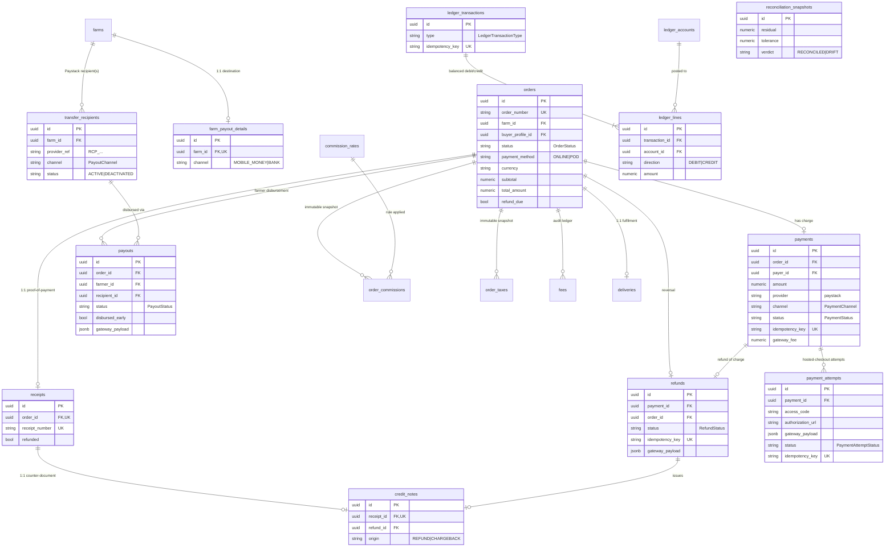
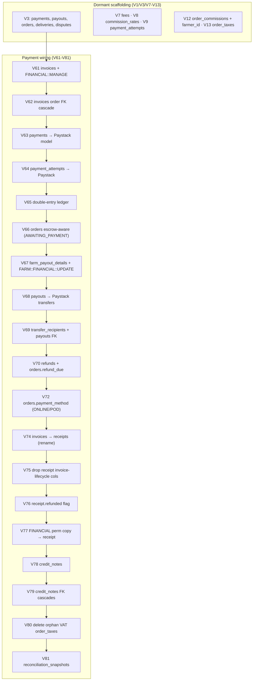
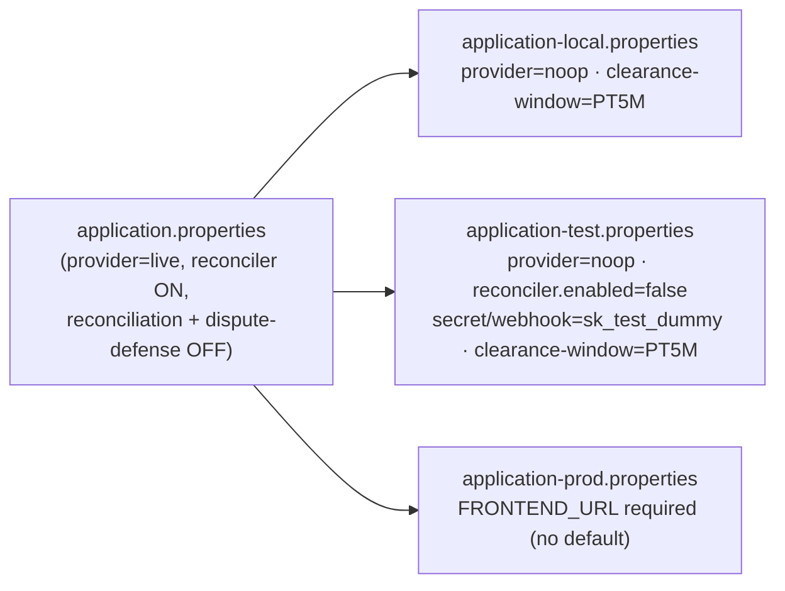

# Data model, migrations & configuration

This page is the persistence-and-knobs reference for the payment subsystem: every payment-domain table and how it relates to the rest, the Flyway migration history that turned dormant scaffolding into a working escrow engine, and the full `cropdoor.payments.*` configuration tree with its per-profile overrides. It exists so a backend engineer can trace where a column came from, a DBA can read the schema invariants the runtime leans on, and an operator can find the exact tuning a deployment knob controls.

Two things are load-bearing throughout. First, every enum-typed column in this domain is mapped `@Enumerated(EnumType.STRING)` against a `VARCHAR` — there are no ordinal mappings anywhere — which makes removing an enum constant a *data migration*, not just a code change (see [The V80 VAT-decode hazard](#the-v80-vat-decode-hazard)). Second, the order-side money records are immutable snapshots taken at placement and never recomputed, which is what makes both filing-correct historical orders and safe data cleanups possible.

For how money is shaped and rounded see [Money model](money-model.md); for the postings that hang off these tables see [The ledger](ledger.md); for the flows that write them see [Core flows](core-flows.md); for the float report behind `reconciliation_snapshots` see [Reconciliation](reconciliation.md).

---

## Entity-relationship overview

The payment domain is a constellation around `orders`. Every money record either hangs off an order — payments, payouts, refunds, receipts, the per-order commission/tax/fee snapshots — or is a global catalog/ledger structure (`commission_rates`, the `ledger_*` trio, `reconciliation_snapshots`).

!!! note "Scope boundary"
    This page documents the *payment-side* shape of `orders`, `deliveries`, and the order snapshots. The `OrderStatus` fulfilment state machine, cancellation windows, and the full `Delivery` lifecycle live in the order domain — here we carry only the columns and enums money flows touch (`currency`, `payment_method`, `refund_due`, `total_amount`, the `DeliveryStatus` row).

All amounts are `NUMERIC(12,2)` in cedis unless noted; `reconciliation_snapshots` uses `NUMERIC(19,2)`. Pesewas↔cedis conversion is a gateway concern, not a column concern — see [Money model](money-model.md).

---

## Per-entity reference

### `payments` — the buyer charge (1 per `ONLINE` order)

`model/payment/Payment.java`, table `payments`. One charge per order; born `PENDING`, moved to `COMPLETED`/`FAILED` by the charge webhook arms.

| Column | Type | Notes |
| --- | --- | --- |
| `id` | UUID PK | |
| `order_id` | UUID FK → `orders` | `@ManyToOne(LAZY)` |
| `payer_id` | UUID FK → `users` | the buyer user |
| `amount` | `NUMERIC(12,2)` | gross charged |
| `provider` | `VARCHAR(32)` NOT NULL DEFAULT `'paystack'` | |
| `currency` | `VARCHAR(3)` NOT NULL DEFAULT `'GHS'` | |
| `channel` | `VARCHAR(20)` | `PaymentChannel`; CHECK-constrained |
| `gateway_fee` | `NUMERIC(12,2)` | Paystack fee; **never reversed on refund** — the platform absorbs it ([ledger](ledger.md)) |
| `provider_ref` | `VARCHAR(255)` | Paystack transaction reference |
| `idempotency_key` | `VARCHAR(100)` NOT NULL **UNIQUE** | replay guard |
| `paid_at` / `last_attempted_at` | `TIMESTAMP` | |
| `attempt_count` | `INT` NOT NULL DEFAULT 0 | |
| `status` | `VARCHAR(20)` NOT NULL DEFAULT `'PENDING'` | `PaymentStatus` |

- `PaymentStatus` (`model/payment/PaymentStatus.java`): `PENDING · COMPLETED · FAILED · REFUNDED · DISPUTED · REVERSED`.
- `PaymentChannel` (`service/payment/gateway/model/PaymentChannel.java`, shared with the gateway layer): `CARD · MOBILE_MONEY · BANK_TRANSFER · USSD · QR · OTHER`. The CHECK `ck_payments_channel` allows exactly these six or NULL.

### `payment_attempts` — one row per hosted-checkout initiation

`model/payment/PaymentAttempt.java`. Carries the Paystack hosted-checkout artefacts (`access_code`, `authorization_url`) and the forensic `gateway_payload` JSONB. Cascades from `payments` (`ON DELETE CASCADE`).

Notable columns: `attempt_number`, per-attempt `amount`, `channel` (CHECK `ck_payment_attempts_channel`), `expires_at`/`initiated_at`/`paid_at`/`failed_at` timing, `gateway_payload` JSONB, `idempotency_key` **UNIQUE**, `failure_reason VARCHAR(500)`, and `status VARCHAR(20)` defaulting to `'PENDING'`. `PaymentAttemptStatus` (`model/payment/PaymentAttemptStatus.java`) is a distinct three-value enum: `PENDING · SUCCESS · FAILED`.

### `payouts` — farmer disbursement (transfer)

`model/payment/Payout.java`. The V3 scaffold (`amount`, `momo_number`, `momo_provider`, `provider_ref`) was wired to the Paystack transfer model in V68.

| Column | Notes |
| --- | --- |
| `order_id` FK / `farmer_id` FK | the order and farmer user |
| `amount` | net farmer amount |
| `momo_number` / `momo_provider` | legacy V3 destination columns; the real destination now lives in `transfer_recipients` |
| `provider_ref` | our generated transfer reference — the 16–50 char idempotency key Paystack echoes on the webhook and accepts at `/transfer/verify/:reference` |
| `recipient_id` FK → `transfer_recipients` | added plain in V68, FK added in V69 |
| `gateway_payload` JSONB | `Map<String, Object>`, `columnDefinition = "jsonb"` |
| `initiated_at` / `completed_at` / `failed_at` | transfer lifecycle |
| `attempt_count` / `last_attempted_at` | retry bookkeeping |
| `disbursed_by` FK → `users` | admin who triggered it |
| `disbursed_early` BOOLEAN DEFAULT FALSE | early disbursement before the clearance window closes |
| `status` | `PayoutStatus` |

`PayoutStatus` (`model/payment/PayoutStatus.java`): `PENDING · PROCESSING · COMPLETED · FAILED · REVERSED`. The clearance window that gates eligibility (`cropdoor.payments.payout.clearance-window`) is documented in [Configuration reference](#configuration-reference) below and [Reconciliation](reconciliation.md).

### `transfer_recipients` — Paystack payout destination per farm

`model/payment/TransferRecipient.java`. Derived on demand from `farm_payout_details`; `provider_ref` holds the Paystack recipient code (`RCP_...`). The partial-unique ACTIVE index keeps at most one live recipient per `(farm, provider, channel)` while preserving `DEACTIVATED` history rows. `channel` is a `PayoutChannel` (`model/farm/PayoutChannel.java`): `MOBILE_MONEY · BANK`; `status` is `TransferRecipientStatus`: `ACTIVE · DEACTIVATED`. Channel-dependent identifier columns (`bank_code`/`account_number` vs `momo_provider`/`momo_number`) are enforced by CHECK `transfer_recipients_channel_fields`.

### `farm_payout_details` — 1:1 destination of record per farm

`model/farm/FarmPayoutDetails.java`, created in V67. `farm_id` is **UNIQUE** (one row per farm). The CHECK `farm_payout_details_channel_fields` enforces that the active channel's required identifiers are present (momo: `momo_number` + `momo_provider`; bank: `bank_code` + `account_number` + `account_name`), so a half-filled row cannot persist. Writing it is gated on `FARM::FINANCIAL::UPDATE` (seeded in V67).

### `refunds` — admin-initiated async charge reversal

`model/payment/Refund.java`. One refund per payment (full refunds only); the service keys `idempotency_key` on the payment id so a re-initiation is a no-op. Born `PENDING`; the `refund.*` webhooks settle it to `PROCESSED` or `FAILED`. Columns of note: `payment_id`/`order_id` FKs, `provider_ref VARCHAR(120)`, `idempotency_key` **UNIQUE**, `reason VARCHAR(500)`, `initiated_by` FK → `users`, `gateway_payload` JSONB, and `status` (`RefundStatus`: `PENDING · PROCESSED · FAILED`; CHECK `ck_refunds_status`).

!!! warning "Two unrelated 'dispute' concepts"
    The V3 `disputes` table (`model/dispute/*`) is the **unwired in-app** order-dispute scaffold — a [roadmap surface](../architecture/roadmap.md). It is **not** the live Paystack chargeback that the `PLATFORM::DISPUTE` endpoints operate on; chargebacks flow through `payments.status = DISPUTED`/`REVERSED` and the ledger, not this table. See [Core flows](core-flows.md).

### `reconciliation_snapshots` — float-vs-Paystack drift record

`model/payment/ReconciliationSnapshot.java`, table `reconciliation_snapshots` (V81). Each row is one run of the PLATFORM_FLOAT↔Paystack reconciliation report. All money columns are `NUMERIC(19,2)`.

| Column | Notes |
| --- | --- |
| `created_at` TIMESTAMPTZ | indexed `DESC` (`idx_reconciliation_snapshots_created_at`) |
| `currency` VARCHAR(3) | single reconciliation currency |
| `internal_float` | our `PLATFORM_FLOAT` balance |
| `paystack_available` | Paystack-reported available balance |
| `pending_settlements` | charges captured but not yet settled (T+1 lag) |
| `in_flight_payouts` | transfers initiated, not yet completed |
| `residual` | the computed drift |
| `tolerance` | acceptable drift band (default `1.00` GHS; `cropdoor.payments.reconciliation.tolerance`) |
| `verdict` VARCHAR(12) | `ReconciliationVerdict`: `RECONCILED · DRIFT` |

The settlement-lag math is canonical in [Reconciliation](reconciliation.md).

### `ledger_accounts` / `ledger_transactions` / `ledger_lines` — double-entry ledger

`model/ledger/*`. A fixed chart of accounts, append-only idempotency-keyed transactions, and balanced debit/credit lines carrying optional farmer/order dimensions. Posting semantics are canonical in [The ledger](ledger.md); here is the shape.

`ledger_accounts` (`model/ledger/LedgerAccount.java`) is seeded once in V65 and never written at runtime:

| code | type (`LedgerAccountType`) | normal_balance (`LedgerDirection`) |
| --- | --- | --- |
| `PLATFORM_FLOAT` | ASSET | DEBIT |
| `FARMER_PAYABLE` | LIABILITY | CREDIT |
| `COMMISSION_REVENUE` | REVENUE | CREDIT |
| `TAX_PAYABLE` | LIABILITY | CREDIT |
| `GATEWAY_FEES` | EXPENSE | DEBIT |
| `CHARGEBACK_LOSS` | EXPENSE | DEBIT |

`LedgerAccountType`: `ASSET · LIABILITY · REVENUE · EXPENSE`. `LedgerDirection`: `DEBIT · CREDIT`.

- `ledger_transactions` (`model/ledger/LedgerTransaction.java`): `type` (`LedgerTransactionType`: `CHARGE · PAYOUT · REFUND · CHARGEBACK_REVERSAL · CHARGEBACK_WRITEOFF · MANUAL`), `source_type`/`source_id` (polymorphic origin), `occurred_at`, `idempotency_key VARCHAR(120)` **UNIQUE**, `currency`.
- `ledger_lines` (`model/ledger/LedgerLine.java`): `transaction_id` FK (`ON DELETE CASCADE`), `account_id` FK, `direction` (CHECK `DEBIT|CREDIT`), `amount NUMERIC(12,2)` CHECK `amount >= 0`, optional `farmer_id`/`order_id` dimensions (partial index on `farmer_id WHERE NOT NULL`).

### `receipts` — proof-of-payment (1:1 with order)

`model/receipt/Receipt.java`, table `receipts` (originally `invoices` in V61; renamed in V74). Issued already-PAID at settlement — there is no ISSUED/OVERDUE state (dropped in V75). Notable columns: `receipt_number VARCHAR(40)` **UNIQUE** (`RCP-` prefix, rebranded from `INV-` in V74), `order_id` FK **UNIQUE** (one receipt per order), the money snapshot (`subtotal_amount`/`tax_amount`/`commission_amount`/`total_amount`), `payment_method` (`ReceiptPaymentMethod`: `CARD · MOBILE_MONEY · BANK_TRANSFER · CASH · OTHER`), `pdf_s3_key`, and `refunded BOOLEAN NOT NULL DEFAULT false` — a denormalized cache set when a refund processes (V76), indexed for the `?refunded=` filter. The document flow is in [Receipts & credit notes](receipts-and-credit-notes.md).

### `credit_notes` — counter-document to a receipt (1:1)

`model/creditnote/CreditNote.java`, table `credit_notes` (V78). Issued when a payment is reversed. The **UNIQUE `receipt_id`** is the idempotency + concurrency guard — a webhook replay or the refund reconciler hitting the same receipt cannot create a second row. Carries `credit_note_number VARCHAR(40)` **UNIQUE**, `receipt_id` FK **UNIQUE**, `refund_id` FK → `refunds` (NULL for chargeback-origin notes), `origin VARCHAR(20)` (`CreditNoteOrigin`: `REFUND · CHARGEBACK`; CHECK `ck_credit_notes_origin`), a money snapshot mirroring the receipt, `reason`, `issued_at`, and `pdf_s3_key`. All five parent FKs cascade on delete (V79).

### Order-side money snapshots: `orders`, `order_commissions`, `order_taxes`, `fees`

These are the per-order **immutable** records computed at order time (see [Immutable financial snapshots](#immutable-financial-snapshots)).

- **`orders`** (`model/order/Order.java`) — payment-relevant columns only: `status` (`OrderStatus`), `payment_method` (`PaymentMethod`: `ONLINE · POD`, V72), `currency` (V66), `subtotal`, `total_amount`, `refund_due` (BOOLEAN, V70), `cancelled_by` (`CancellationSide`: `BUYER · FARMER · ADMIN`). `OrderStatus` carries the pre-payment `AWAITING_PAYMENT` state (V66) ahead of `PENDING · ACCEPTED · PROCESSING · READY_FOR_PICKUP · IN_TRANSIT · DELIVERED · CANCELLED`. The V3 columns `commission_rate`/`commission_amount`/`net_farmer_amount` were dropped in V12 (moved to `order_commissions`); the legacy `delivery_fee`/`tax_amount` columns left by V47 are no longer mapped by the entity.
- **`order_commissions`** (`model/order/OrderCommission.java`, V12): immutable per-order commission snapshot — `rule_id` (FK → `commission_rates`, nullable), `rule_code`, `rate NUMERIC(5,4)`, `base_amount`, `commission_amount`, `applied_at`. Never recomputed from `commission_rates`.
- **`order_taxes`** (`model/order/OrderTax.java`, V13): one row per `(tax_type × basis)` — `tax_type` (`TaxType`), `basis` (`TaxBasis`: `COMMISSION · DELIVERY · ITEMS`), `tax_code` (free-string snapshot; the calculator emits the bare levy name, e.g. `NHIL`), `rate NUMERIC(5,4)`, `base_amount`, `tax_amount`, `applied_at`. **`TaxType` is now `NHIL · GETFUND · COVID_LEVY` — `VAT` was removed** (see below).
- **`fees`** (`model/fee/Fee.java`, V7): per-order fee audit ledger — `fee_type` (`FeeType`: `COMMISSION · DELIVERY · PROCESSING`), `amount`, `rate`, `description`.

### `commission_rates` — the global/per-farm rate catalog

`model/commission/CommissionRate.java` (V8). `farm_id` nullable (NULL = platform default), `rate NUMERIC(5,2)`, `effective_from`/`effective_to` (`LocalDate`), `set_by` FK → `users`. V8 seeds the platform default: `rate = 10.00`, `farm_id = NULL`. This is mutable catalog data; orders snapshot the applied value into `order_commissions` at placement time.

### `deliveries` (payment-side note only)

`model/delivery/Delivery.java` (V3), 1:1 with order. Relevant to payments only because `mark-delivered` flips `DeliveryStatus`/`Order.deliveredAt`, which enables payout eligibility. `DeliveryStatus`: `PENDING · ASSIGNED · PICKED_UP · IN_TRANSIT · DELIVERED · FAILED`. The full lifecycle is out of scope here.

---

## The Flyway migration map (V61–V81)

The payment tables were **not greenfield**. V3 created `payments`/`payouts`/`orders`/`deliveries`/`disputes` as dormant placeholders, and V7–V13 layered the financial children. None of it was wired to a real gateway. The V61–V81 series turned that scaffold into a working escrow subsystem by deliberately mutating the dormant tables forward rather than rewriting them.

| Table | Created by | Subsequent payment migrations |
| --- | --- | --- |
| `payments` | V3 + V9 (idempotency key) | **V63** (provider/currency/channel/gateway_fee/timing, drop `payment_method`, pending index) |
| `payment_attempts` | V9 | **V64** (provider/currency/channel, access_code/authorization_url, timing, gateway_payload JSONB, drop `payment_method`) |
| `payouts` | V3 | **V68** (provider/currency/recipient_id/gateway_payload/timing/disbursed_by/disbursed_early), **V69** (recipient FK) |
| `transfer_recipients` | **V69** | — |
| `farm_payout_details` | **V67** (+ `FARM::FINANCIAL::UPDATE`) | — |
| `refunds` | **V70** (+ `orders.refund_due`) | — |
| `ledger_accounts` / `ledger_transactions` / `ledger_lines` | **V65** | — |
| `invoices` → `receipts` | **V61** (as `invoices`, + `PLATFORM::FINANCIAL::MANAGE`) | **V62** (order FK cascade), **V74** (rename → receipts), **V75** (drop lifecycle cols), **V76** (`refunded` flag), **V77** (perm description copy) |
| `credit_notes` | **V78** | **V79** (parent FK cascades) |
| `order_taxes` | V13 | **V80** (delete orphan VAT rows) |
| `order_commissions` | V12 | — |
| `commission_rates` | V8 | — |
| `fees` | V7 | — |
| `orders` | V3 | **V66** (currency + `AWAITING_PAYMENT` index), **V70** (`refund_due`), **V72** (`payment_method`) |
| `reconciliation_snapshots` | **V81** | — |

Permission-grant migrations in this range: **V60** (`PLATFORM::ORG::VIEW`), **V61** (`PLATFORM::FINANCIAL::MANAGE`), **V67** (`FARM::FINANCIAL::UPDATE`), **V73** (`PLATFORM::ORDER::CANCEL`), **V77** (description copy fixes). The permission convention itself is in [RBAC](../rbac/index.md).

---

## Notable schema constraints

These structural guarantees let the runtime stay idempotent and concurrency-safe without application-level locking.

| Constraint | Where | What it protects |
| --- | --- | --- |
| `uq_payments_idempotency_key` UNIQUE | `payments` (V9) | one charge per idempotency key — replay-safe |
| `payment_attempts.idempotency_key` UNIQUE | V9 | one attempt per key |
| `ledger_transactions.idempotency_key` UNIQUE | V65 | one posting per money event — replay-safe |
| `refunds.idempotency_key` UNIQUE | V70 | keyed on payment id → re-initiation is a no-op |
| `uq_transfer_recipients_active` PARTIAL UNIQUE `(farm_id, provider, channel) WHERE status='ACTIVE'` | V69 | at most one live recipient per farm/channel, but allows `DEACTIVATED` history (editing payout details deactivates the old recipient; a full UNIQUE would reject the next registration) |
| `receipts.order_id` UNIQUE | V61 | one receipt per order |
| `credit_notes.receipt_id` UNIQUE | V78 | one credit note per receipt — concurrency guard against double-issue on webhook replay |
| `ck_payments_channel` / `ck_payment_attempts_channel` | V63/V64 | `channel` ∈ the 6 `PaymentChannel` values or NULL |
| `farm_payout_details_channel_fields` / `transfer_recipients_channel_fields` | V67/V69 | the active channel's required identifier columns are non-NULL |
| `ledger_lines.amount >= 0` | V65 | sign carried by `direction`, never a negative amount |
| `ck_refunds_status` / `ck_credit_notes_origin` | V70/V78 | enum-value integrity at the DB layer |
| partial index `payments(status, created_at) WHERE status='PENDING'`; `orders ... WHERE status='AWAITING_PAYMENT'` | V63/V66 | cheap scans for the charge/order reconcilers |

---

## The V80 VAT-decode hazard

The most instructive incident in the schema history — and it generalizes to every enum-typed column in the domain.

**What happened.** PR #115 removed the `VAT` constant from `TaxType` (agricultural goods are VAT-exempt; the calculator now emits only `NHIL`, `GETFUND`, `COVID_LEVY`). But pre-removal `order_taxes` rows still carried `tax_type = 'VAT'`. Because `OrderTax.taxType` maps with `@Enumerated(EnumType.STRING)`, **any read that materializes those rows** runs `TaxType.valueOf("VAT")` and throws `No enum constant ...TaxType.VAT` → HTTP 500.

**Where it surfaced — and where it didn't.** The 500 only fired on **detail-read** surfaces that load tax lines: `GET /v1/orders/{orderId}`, the receipt detail read, and the receipt/credit-note PDF render. The list/summary paths never read tax lines, which is exactly why the bug stayed hidden until someone opened an order detail.

**The fix (V80).** A targeted `DELETE FROM order_taxes WHERE tax_type = 'VAT';` — deleting by the exact dead value, not a `NOT IN (...)` sweep, so the statement names precisely what PR #115 left behind.

**Why it's non-destructive.** Order totals are immutable snapshots taken at order time and never recomputed from `order_taxes`. The orphan VAT rows were not reflected in any stored total, so removing them changes no order or receipt figure — it merely restores the invariant that `order_taxes` holds only rows the current `TaxType` enum can decode.

!!! warning "The general lesson"
    With `@Enumerated(STRING)`, removing or renaming an enum constant is a **data migration, not just a code change** — every persisted row carrying the old name becomes an unreadable land mine that detonates on the first lazy read. Either keep the constant, or ship a forward migration that removes/rewrites the stored rows in the same release. (Renaming permission codes has the same hazard.)

---

## Immutable financial snapshots

The order-side money records — `orders.subtotal`/`total_amount`, `order_commissions`, `order_taxes`, and the `receipts` amounts — are **write-once snapshots captured at order placement and never recomputed**. The rationale is filing correctness and dispute defensibility: commission rules (`commission_rates`) and tax rates change over time, but a historical order must always show the figures that were actually applied to it. `order_commissions` pins the `rule_id`/`rule_code`/`rate`/`commission_amount` as of placement; `order_taxes` pins one row per `(tax_type, basis)` with a `tax_code` snapshot. This immutability is the same property [Money model](money-model.md) relies on when computing totals and the property [the ledger](ledger.md) posts against — and it's *why* the V80 cleanup was safe.

---

## Migration-authoring rules specific to payments

The payment migrations follow the project-wide Flyway discipline with a few money-specific patterns worth pinning. See [persistence](../architecture/persistence.md) for the broader migration posture.

1. **Forward-only FK re-creation, never edit an applied migration.** When a FK needs a delete action it wasn't created with, drop-and-recreate it in a *new* migration — the applied file's checksum must stay byte-stable (`spring.flyway.validate-on-migrate=true` blocks a mismatch). Examples: **V62** re-creates `invoices_order_id_fkey` with `ON DELETE CASCADE`; **V79** re-creates all five `credit_notes` parent FKs with `ON DELETE CASCADE`.
2. **Targeted data cleanup.** **V80** deletes by the exact dead value (`WHERE tax_type = 'VAT'`), not a broad `NOT IN` sweep — the statement documents precisely what it removes and cannot over-delete if the enum grows later.
3. **Permission grants are additive + idempotent.** New permissions `INSERT` the row and grant it with `INSERT ... SELECT ... WHERE NOT EXISTS`. Scope matters: **V61** grants `PLATFORM::FINANCIAL::MANAGE` to `SUPER_ADMIN`; **V67** grants the sensitive `FARM::FINANCIAL::UPDATE` onto existing system **Owner** FARM roles only (new farms pick it up automatically — `FarmServiceImpl` mints the Owner role from `permissionRepository.findByScope(FARM)`).
4. **No `${...}` placeholders.** Flyway's `PlaceholderReplacingReader` scans the whole file (comments included) and aborts on an unregistered `${TOKEN}`. Avoid placeholder-shaped strings in payment migrations entirely.
5. **Enum-column changes are data migrations.** Removing/renaming a value behind an `@Enumerated(STRING)` column requires a same-release forward migration to clean the persisted rows.

**The single-farmer-per-order invariant (V12).** The per-order commission model depends on a structural invariant: every order has exactly one seller. V12 added `orders.farmer_id NOT NULL` (FK to `users`) and backfilled it; V47 renamed it `farmer_id → farm_id` and re-pointed it at `farms`. The order is now scoped to one farm org rather than one farmer user, but the one-seller-per-order rule is unchanged — it's what makes a single `order_commissions` row and a single `payouts` row well-defined.

---

## Configuration reference

Payment configuration is split across **five** `@ConfigurationProperties` binders — the nested root tree plus four standalone, flat blocks. A sixth class, `PaystackProperties`, binds as a nested POJO under the root via `@NestedConfigurationProperty` (it carries only `@Data`, not its own prefix).

| Binder | Prefix | Default posture |
| --- | --- | --- |
| `service/payment/gateway/PaymentGatewaysProperties.java` | `cropdoor.payments` | Root tree — gateways/payout/order/reconciler |
| `service/payment/gateway/paystack/PaystackProperties.java` | `cropdoor.payments.gateways.paystack` | Provider adapter config (nested) |
| `service/payment/ReconciliationProperties.java` | `cropdoor.payments.reconciliation` | **off by default** |
| `service/payment/DisputeDefenseProperties.java` | `cropdoor.payments.dispute-defense` | **off by default** |
| `config/GhanaTaxProperties.java` | `cropdoor.tax` | always on (defaults baked in) |
| `config/ReceiptStorageProperties.java` | `cropdoor.receipts` | required (blank bucket crashes boot) |

`reconciliation.*` and `dispute-defense.*` are deliberately **not** nested under the root: they are separate beans so a `@ConditionalOnProperty(havingValue = "true")` can gate the whole scheduled job — the bean and its `@Scheduled` method don't even instantiate when the feature is off. The root `reconciler` block, by contrast, is on by default (`matchIfMissing = true`).

!!! info "Duration formats"
    Most `Duration` keys use **ISO-8601** (`PT15M`, `P7D`, `PT5M`); the gateway connect/read timeouts use Spring's **short form** (`5s`, `15s`) — both bind to `Duration` identically. Lists bind from a comma string (`MOBILE_MONEY,BANK_TRANSFER`). `BigDecimal` levy rates are fractions (`0.0250` = 2.5%). Cron uses the 6-field Spring expression (`0 0 2 * * *`).

### Gateway block — routing, channels, keys

| Key | Default | Env var | Purpose |
| --- | --- | --- | --- |
| `cropdoor.payments.default-charge-gateway` | `paystack` | — | provider code routing **new charges** |
| `cropdoor.payments.default-transfer-gateway` | `paystack` | — | provider code routing **new payouts/transfers** |
| `cropdoor.payments.accepted-channels` | `MOBILE_MONEY,BANK_TRANSFER` | — | channels offered at checkout (binds `List<PaymentChannel>`; **excludes `CARD`** — add it to enable cards) |
| `cropdoor.payments.gateways.paystack.provider` | `live` | `PAYSTACK_MODE` | **kill switch**: `live` adapters vs `noop` fake |
| `cropdoor.payments.gateways.paystack.base-url` | `https://api.paystack.co` | — | Paystack API root |
| `cropdoor.payments.gateways.paystack.secret-key` | _(blank)_ | `PAYSTACK_SECRET_KEY` | API auth **and** webhook HMAC fallback |
| `cropdoor.payments.gateways.paystack.public-key` | _(blank)_ | `PAYSTACK_PUBLIC_KEY` | client-side init key |
| `cropdoor.payments.gateways.paystack.webhook-signing-secret` | _(blank → secret-key)_ | `PAYSTACK_WEBHOOK_SECRET` | optional HMAC override |
| `cropdoor.payments.gateways.paystack.connect-timeout` | `5s` | — | TCP connect timeout |
| `cropdoor.payments.gateways.paystack.read-timeout` | `15s` | — | socket read timeout (all calls, incl. verify) |

!!! warning "`provider=live`, never `provider=paystack`"
    The real `PaystackChargeGateway`/`PaystackTransferGateway` beans gate on `havingValue = "live"` (`matchIfMissing = true`); the `Noop*` beans gate on `havingValue = "noop"`. `paystack` matches **neither** and the context fails to start. See [Gateway & webhooks](gateway-and-webhooks.md).

**Webhook signing secret fallback.** Paystack signs every webhook with the *secret key* — there is no separate webhook secret. `PaystackProperties#effectiveWebhookSigningSecret()` returns the explicit `webhook-signing-secret` when non-blank, else falls back to `secret-key`. So production sets only `PAYSTACK_SECRET_KEY` + `PAYSTACK_PUBLIC_KEY`; the HMAC key comes along for free. The explicit slot exists for local self-signed testing (boot with a known secret so you can sign synthetic webhooks) and for provider symmetry. `PaystackWebhookController` reads the effective secret at verify time; the raw-byte HMAC contract is in [Gateway & webhooks](gateway-and-webhooks.md).

!!! note "No `@Retryable` on gateway calls"
    None of the Paystack calls retry in-process; the timeouts above fail fast and recovery is left to the reconcilers + Paystack's ~72h webhook redelivery. The gateway circuit breaker is intentionally not built. See [Resiliency, audit & ops](resiliency-audit-and-ops.md).

### Payout block — `cropdoor.payments.payout.*`

| Key | Default | Local override | Purpose |
| --- | --- | --- | --- |
| `clearance-window` | `P7D` | `PT5M` | post-delivery hold before a payout clears; `clearsAt = order.deliveredAt + clearanceWindow`. Injected via `@Value` in `PayoutTransactionalSteps`, **not** a getter — so it has **no inline default** and must be present in `application.properties` (it is: `P7D`) |
| `payout-fee-buffer` | `1.00` | — | required GHS headroom above farmer net on the gateway balance before a disburse is allowed (`required = net.add(buffer)`) |
| `low-float-threshold` | `0` (disabled) | — | balance strictly below which a disburse logs WARN + emits a low-float metric; `0` disables the warning |

Local dev shortens the clearance window to 5 minutes so a tester can watch a payout clear without waiting a week. The hard funding guard that rejects an under-funded disburse, and the T+1 settlement-lag context that makes the float matter, are in [Reconciliation](reconciliation.md).

### Order block — `cropdoor.payments.order.*`

| Key | Default | Purpose |
| --- | --- | --- |
| `uninitiated-checkout-ttl` | `PT15M` | age after which a checkout that never reached the gateway (no access code) is expired by `PaymentReconciler`/`OrderReconciler` |

### Reconciler block — `cropdoor.payments.reconciler.*`

The **on-by-default** self-healing scheduler block. `enabled = true` (`matchIfMissing = true`) gates four beans: `PaymentReconciler`, `PayoutReconciler`, `RefundReconciler`, `job/OrderReconciler`. The test profile sets `enabled = false` to keep schedulers out of integration tests.

| Key | Default | Consumption | Purpose |
| --- | --- | --- | --- |
| `enabled` | `true` | `@ConditionalOnProperty(matchIfMissing=true)` | master on/off for scheduled reconcilers |
| `batch-size` | `50` | getter | max rows scanned per run |
| `verify-pending-fixed-delay` | `PT2M` | `@Scheduled` SpEL | cadence: verify pending charges |
| `abandon-fixed-delay` | `PT1H` | `@Scheduled` SpEL | cadence: abandon stale payments |
| `expire-stale-checkouts-fixed-delay` | `PT5M` | `@Scheduled` SpEL | cadence: expire uninitiated checkouts |
| `verify-stuck-processing-fixed-delay` | `PT2M` | `@Scheduled` SpEL | cadence: re-verify stuck payout transfers |
| `verify-pending-refunds-fixed-delay` | `PT5M` | `@Scheduled` SpEL | cadence: verify pending refunds |
| `verify-min-age` | `PT5M` | getter | don't verify a charge younger than this |
| `refund-verify-min-age` | `PT30M` | getter | don't verify a refund younger than this |
| `abandon-after` | `PT24H` | getter | age past which an unpaid payment is abandoned |
| `stuck-processing-threshold` | `PT10M` | getter | age past which a `PROCESSING` payout is re-verified |
| `max-payout-attempts` | `5` | `@Value` on `PayoutTransactionalSteps` | retry cap; `prepareRetry` rejects a retry once `attemptCount` reaches it |

!!! note "Two consumption styles — read before tuning a `*-fixed-delay`"
    The five `*-fixed-delay` keys are read by Spring **directly from the `@Scheduled` SpEL placeholder** (e.g. `fixedDelayString = "${cropdoor.payments.reconciler.verify-pending-fixed-delay:PT2M}"`). The matching POJO fields are never read via their getters — they exist as documentation only. Setting the property **does** take effect, but the default lives **inline in the annotation**, and `application.properties` lists only `enabled` and `batch-size`. The `*-min-age`/`*-threshold` keys are the opposite — read through the bean getter, so they bind the POJO default. Both reach the same value; the distinction matters only when you grep for where a default comes from.

`max-payout-attempts = 5` backstops the admin-gated retry path: `prepareRetry` throws `InvalidPayoutStateException` once `payout.getAttemptCount() >= maxPayoutAttempts`. What each reconciler actually does is in [Reconciliation](reconciliation.md).

### Reconciliation block — `cropdoor.payments.reconciliation.*`

The scheduled **PLATFORM_FLOAT reconciliation** job. **Off by default** — `ReconciliationJob` is gated `@ConditionalOnProperty(havingValue = "true")`, so neither the bean nor its `@Scheduled(cron = ...)` exists until an env opts in.

| Key | Default | Purpose |
| --- | --- | --- |
| `enabled` | `false` | master on/off (opt-in per env) |
| `cron` | `0 0 2 * * *` (daily 02:00) | run cadence |
| `settlement-lookback` | `P14D` | window: each run lists settlements from `now − lookback` |
| `tolerance` | `1.00` (GHS) | max absolute residual treated as reconciled; above it the run is **DRIFT** |
| `currency` | `GHS` | single reconciliation currency |

The algorithm, the `listSettlements` pagination guard, and the T+1 settlement-lag premise are canonical in [Reconciliation](reconciliation.md).

### Dispute-defense block — `cropdoor.payments.dispute-defense.*`

The scheduled **chargeback dispute-defense** job. **Off by default** — `DisputeDefenseJob` is gated `@ConditionalOnProperty(havingValue = "true")`; kept dead in any env that doesn't enable it.

| Key | Default | Purpose |
| --- | --- | --- |
| `enabled` | `false` | master on/off (opt-in per env) |
| `cron` | `0 0 * * * *` (hourly) | scan cadence — **must beat Paystack's ~16h auto-accept** |
| `lookback` | `P7D` | window: list disputes from `now − lookback` |
| `message` | `Order delivered; receipt attached as evidence.` | decline message attached to the gateway resolve call |

!!! warning "Cron is load-bearing for revenue"
    Paystack auto-accepts a chargeback against the merchant if you don't respond within ~16 hours, so the hourly default leaves comfortable headroom. Do not loosen the cron past that window. See [Core flows](core-flows.md).

### Tax config — `cropdoor.tax.*`

`config/GhanaTaxProperties.java` is a `record` with `@DefaultValue` fractions, consumed by `service/order/GhanaTaxCalculator.java`. These three levy rates have **no override in any `application*.properties`** — they ship entirely from the record defaults, configurable purely so a statutory rate change is a property edit, not a code change. VAT is not configured here (agric goods are VAT-exempt).

| Key | Default | Rate | Notes |
| --- | --- | --- | --- |
| `cropdoor.tax.nhil` | `0.0250` | 2.5% | National Health Insurance Levy |
| `cropdoor.tax.getfund` | `0.0250` | 2.5% | Ghana Education Trust Fund Levy |
| `cropdoor.tax.covid-levy` | `0.0100` | 1.0% | COVID-19 Health Recovery Levy |

### Receipt storage config — `cropdoor.receipts.*`

`config/ReceiptStorageProperties.java` is a fail-fast `record`, consumed by `ReceiptDocumentServiceImpl` and `CreditNoteDocumentServiceImpl` (credit-note PDFs reuse the same bucket under a `credit-notes/` prefix).

| Key | Default | Env var | Purpose |
| --- | --- | --- | --- |
| `cropdoor.receipts.bucket` | _(none — required)_ | `CROPDOOR_RECEIPTS_BUCKET` | private S3 bucket for receipt/credit-note PDFs |
| `cropdoor.receipts.download-ttl-seconds` | `300` | `CROPDOOR_RECEIPTS_DOWNLOAD_TTL_SECONDS` | presigned GET URL lifetime (≤0 coerced to `300`) |
| `cropdoor.receipts.region` | falls back to `cropdoor.s3.region` | `CROPDOOR_RECEIPTS_REGION` | receipts bucket region |
| `cropdoor.receipts.access-key-id` | _(blank → default chain)_ | `CROPDOOR_RECEIPTS_ACCESS_KEY_ID` | isolated IAM access key |
| `cropdoor.receipts.secret-access-key` | _(blank → default chain)_ | `CROPDOOR_RECEIPTS_SECRET_ACCESS_KEY` | isolated IAM secret |

The record's compact constructor throws `IllegalStateException` on a blank bucket, so a missing `CROPDOOR_RECEIPTS_BUCKET` crashes boot with a clear message. The bucket is **private** (no CloudFront, no public read) — PDFs are served only via short-lived presigned GETs through a **dedicated** S3 client (`receiptsS3Client`/`receiptsS3Presigner` in `S3Config`), separate from the public listings client, so receipt keys land where a narrowly-scoped IAM user reads/writes them. See [Receipts & credit notes](receipts-and-credit-notes.md).

### Cross-cutting keys

| Key | Default | Env var | Payment relevance |
| --- | --- | --- | --- |
| `spring.jpa.open-in-view` | `false` | — | global, but acute for payments: every webhook handler and gateway round-trip runs **outside** an open Hibernate session, forcing the materialize-then-HTTP discipline so no lazy load runs inside a webhook or gateway call ([Resiliency, audit & ops](resiliency-audit-and-ops.md)) |
| `app.frontend.url` | `${FRONTEND_URL}` (local `…:http://localhost:3000/`) | `FRONTEND_URL` | FE base the receipt/credit-note PDF renderers resolve links against (`CreditNotePdfRenderer` reads it via `@Value`). Production sets `FRONTEND_URL` with no default → a missing value fails boot |

---

## Per-profile overrides

`application.properties` holds prod-leaning defaults; the profiles layer over it.

- **Local (`local`).** `provider=noop` (the in-memory gateway — no real Paystack) and `clearance-window=PT5M` so payouts clear in minutes. To live-test real webhooks against the noop gateway, boot with a known `--cropdoor.payments.gateways.paystack.webhook-signing-secret=<known>` and self-POST HMAC-signed webhooks.
- **Test (`test`).** `provider=noop`, `reconciler.enabled=false` (no schedulers in integration tests), `clearance-window=PT5M`, and dummy `secret-key=sk_test_dummy`/`webhook-signing-secret=sk_test_dummy` so HMAC verification has a deterministic key.
- **Production.** Keep the base defaults: `provider=live`, `reconciler.enabled=true`. Supply secrets via env (`PAYSTACK_SECRET_KEY`, `PAYSTACK_PUBLIC_KEY` — the webhook secret derives automatically — `CROPDOOR_RECEIPTS_BUCKET` + scoped creds, `FRONTEND_URL`). To enable the two off-by-default schedulers, set `cropdoor.payments.reconciliation.enabled=true` and/or `cropdoor.payments.dispute-defense.enabled=true`.

### Feature-flag posture

| Flag | Posture | Default | Gating |
| --- | --- | --- | --- |
| `payments.gateways.paystack.provider` | operational kill switch | `live` | bean `@ConditionalOnProperty(havingValue live/noop)` — `paystack` ⇒ boot crash |
| `payments.reconciler.enabled` | **ON by default** | `true` | `@ConditionalOnProperty(matchIfMissing=true)` (test profile sets `false`) |
| `payments.reconciliation.enabled` | **opt-in per env** | `false` | `@ConditionalOnProperty(havingValue=true)` |
| `payments.dispute-defense.enabled` | **opt-in per env** | `false` | `@ConditionalOnProperty(havingValue=true)` (must beat 16h auto-accept) |
| `payments.reconciler.max-payout-attempts` | live | `5` | `@Value` on `PayoutTransactionalSteps` |
| `payments.reconciler.*-fixed-delay` (×5) | live, via `@Scheduled` SpEL | per-key | inline annotation default (POJO getters unread) |
| `cropdoor.tax.*` | always on | baked defaults | `@DefaultValue` (no properties override) |
| `cropdoor.receipts.bucket` | required (fail-fast) | _(none)_ | record ctor throws on blank |

---

*See also: [Payments overview](index.md) · [The ledger](ledger.md) · [Reconciliation](reconciliation.md) · [Gateway & webhooks](gateway-and-webhooks.md) · [Core flows](core-flows.md) · [Receipts & credit notes](receipts-and-credit-notes.md) · [Resiliency, audit & ops](resiliency-audit-and-ops.md).*
