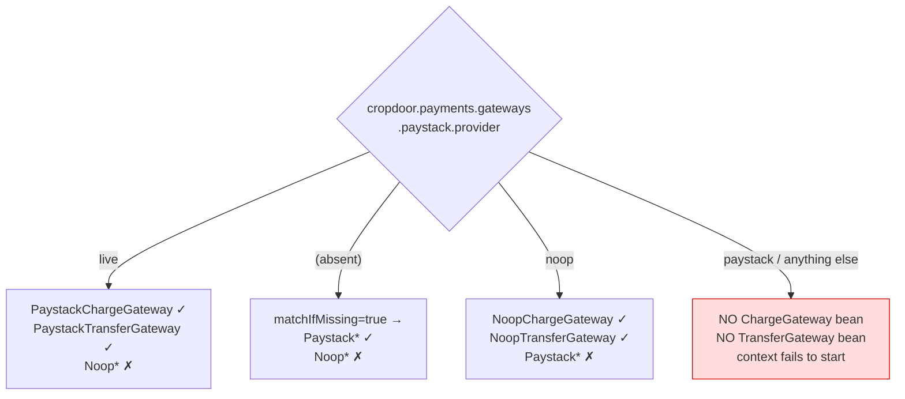
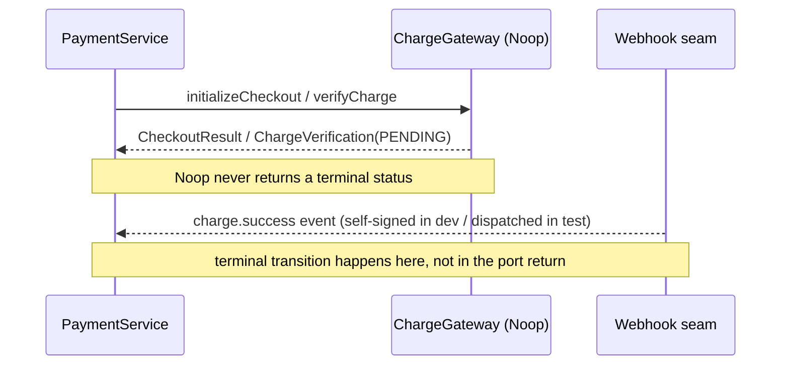
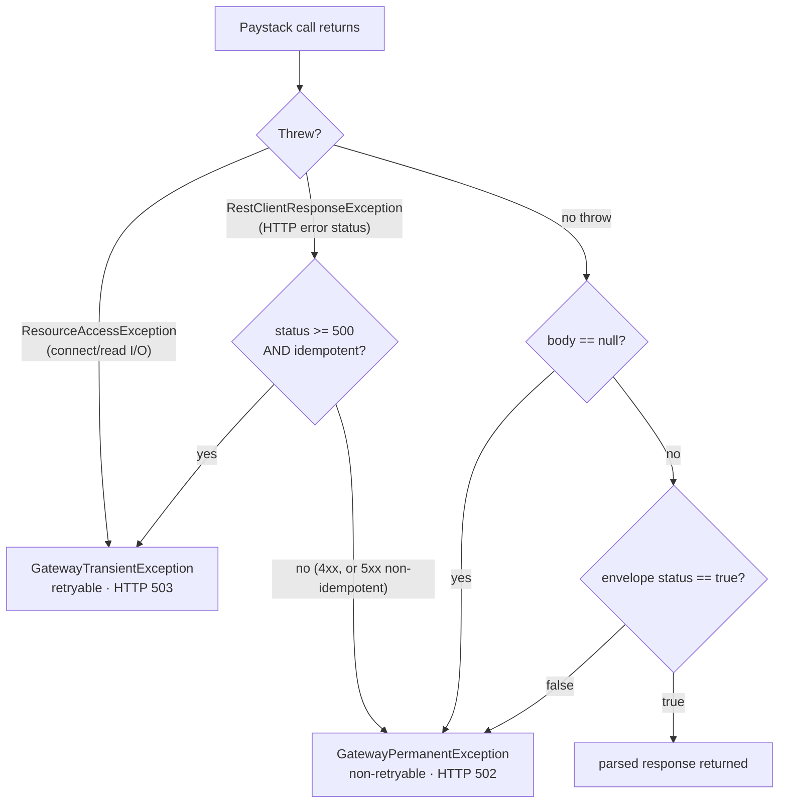
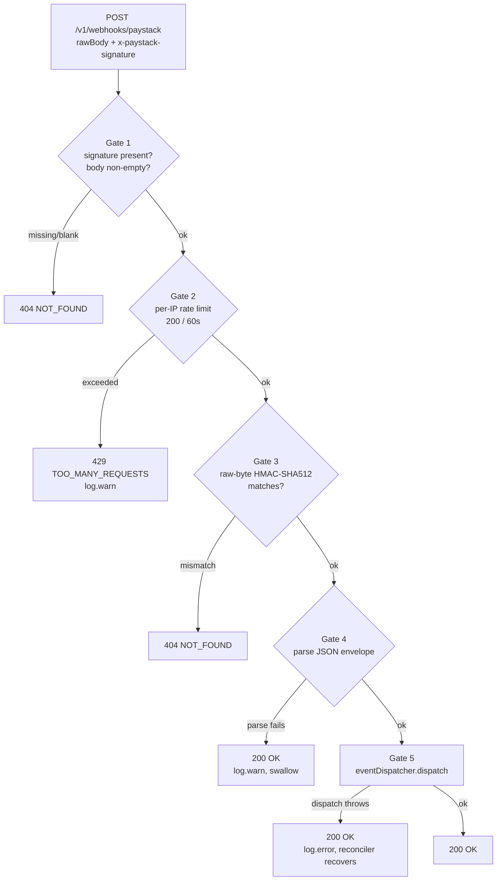
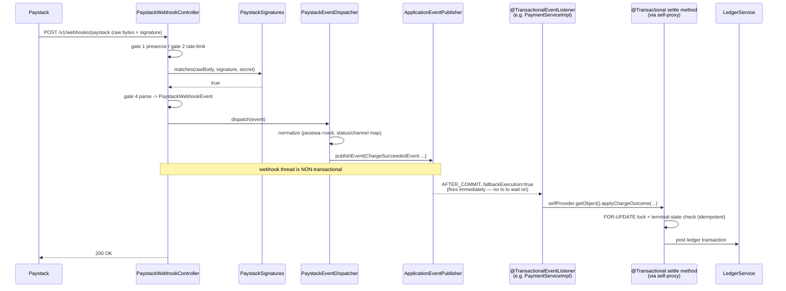

# Gateway seam, Paystack integration & webhooks

Every real cash movement in CropDoor — collecting from a buyer, paying a farmer, refunding, contesting a chargeback — eventually crosses the boundary to **Paystack**, the GHS payment provider. This page documents that boundary: the provider-agnostic ports the rest of the codebase speaks to, the concrete Paystack adapter that turns those calls into bytes on the wire, and the webhook ingress through which every *terminal* money outcome actually arrives.

The whole subsystem is built so the rest of CropDoor never imports a Paystack type. Services depend on two narrow interfaces; one adapter package and one webhook package are the *only* places that know Paystack exists; and a single config property switches the live adapter for deterministic in-memory stubs. That seam is pinned by ArchUnit so it cannot silently rot, and it is what makes "swap the provider" or "turn the provider off in an incident" a one-line change rather than a rewrite.

This is a deeper sibling of the [payments overview](index.md). Read that first for the mental model (initiate sync, settle async, converge idempotent) and the money model. Here we go down to the wire.

---

## Part 1 — The provider-agnostic gateway seam

### Why two ports, not one

CropDoor moves money in two directions, and the two directions have almost nothing in common. They are modelled as two separate ports under `service/payment/gateway/`:

- **Money in** — a buyer pays for an order (escrow). This is `ChargeGateway`: hosted checkout, charge verification, refunds, and — because Paystack folds bank chargebacks into the same merchant surface — the dispute-defense calls.
- **Money out** — the platform pays a farmer after delivery (payout). This is `TransferGateway`: recipient registration, transfers, transfer verification, plus two read-only treasury calls (`fetchBalance`, `listSettlements`) used to guard and reconcile the float.

Keeping them as separate interfaces with separate beans is deliberate:

1. **Test isolation.** A test that mocks the charge port must not displace the transfer port, and vice versa. Each adapter and each stub is its own `@Component`, so swapping one leaves the other intact.
2. **Independent capability surfaces.** A future provider could handle charges but not transfers (or only one currency on one leg). Two ports let the registry resolve each leg independently.
3. **Minimal blast radius.** Charge-side and transfer-side dependencies (endpoints, credentials, scopes) differ; a single fat port would force every implementation to stub methods it never uses.

```mermaid
flowchart LR
    subgraph services["Payment services (provider-agnostic)"]
        chargeSide["PaymentServiceImpl<br/>RefundServiceImpl<br/>RefundReconciler<br/>DisputeDefenseService"]
        transferSide["PayoutServiceImpl<br/>PayoutReconciler<br/>PlatformFloatReconciliationServiceImpl"]
    end
    registry["PaymentGatewayRegistry"]
    chargePort["«interface»<br/>ChargeGateway"]
    transferPort["«interface»<br/>TransferGateway"]
    chargeSide -->|chargeGateway()| registry
    registry --> chargePort
    transferSide -->|injects directly| transferPort
    registry --> transferPort
    chargePort -. live .-> paystackCharge["PaystackChargeGateway"]
    chargePort -. noop .-> noopCharge["NoopChargeGateway"]
    transferPort -. live .-> paystackTransfer["PaystackTransferGateway"]
    transferPort -. noop .-> noopTransfer["NoopTransferGateway"]
```

### `ChargeGateway` port reference

`service/payment/gateway/ChargeGateway.java`. Every method, its contract, and its primary caller:

| Method | Returns | Contract / idempotency | Primary caller |
| --- | --- | --- | --- |
| `providerCode()` | `String` | The provider code this gateway handles (e.g. `"paystack"`). The registry matches on it. | `PaymentGatewayRegistry` |
| `supportedCurrencies()` | `Set<Currency>` | Currencies the adapter can charge. Paystack and Noop both return `{GHS}`. | capability checks |
| `supportedChannels()` | `Set<PaymentChannel>` | Channels offerable at checkout. Paystack and Noop both return `{MOBILE_MONEY, BANK_TRANSFER}`. | capability checks |
| `initializeCheckout(CheckoutRequest)` | `CheckoutResult` | Opens hosted checkout; returns the authorization URL + access code + provider reference. **Not** idempotent on its own — de-duplication is the caller's job via our `reference`. | `PaymentServiceImpl` |
| `verifyCharge(String providerReference)` | `ChargeVerification` | Looks up the current charge state by our reference. **Idempotent** — safe to re-poll; recovers a lost `charge.success` webhook. | `PaymentServiceImpl` |
| `refund(RefundRequest)` | `RefundResult` | Initiates a refund against a completed charge. **Asynchronous** — the terminal state arrives by webhook (`refund.processed` / `refund.failed`). | `RefundServiceImpl` |
| `verifyRefund(String transactionReference)` | `RefundVerification` | Re-polls a refund by the **original charge's** transaction reference. **Idempotent**; recovers a lost refund webhook. | `RefundReconciler` |
| `listDisputes(String status, Instant from, Instant to)` | `List<DisputeSummary>` | Lists provider disputes (bank chargebacks) in a status window. Empty list when none. | `DisputeDefenseService` |
| `getDisputeUploadUrl(String disputeId, String filename)` | `DisputeUploadTarget` | Short-lived signed URL to upload evidence; fetched immediately before each upload because it expires quickly. | `DisputeDefenseService` |
| `uploadEvidence(String signedUrl, byte[] bytes, String contentType)` | `void` | PUTs evidence bytes to the provider's **storage host**, not the API base URL. | `DisputeDefenseService` |
| `addFraudEvidence(String disputeId, DisputeFraudEvidence)` | `String` | Submits structured fraud evidence; returns the evidence id to echo on resolve. | `DisputeDefenseService` |
| `resolveDispute(DisputeResolution)` | `void` | Resolves a dispute: a decline attaches uploaded evidence, a concede carries the refund amount. | `DisputeDefenseService` |

The three "verify/re-poll" methods (`verifyCharge`, `verifyRefund`, and on the transfer side `verifyTransfer`) are the recovery mechanism for lost webhooks: they read provider truth without mutating it, so a reconciler can call them as often as needed. There is **no `@Retryable`** on any gateway method — retry is delegated to the reconcilers plus Paystack's ~72-hour webhook redelivery (see [resiliency, audit & ops](resiliency-audit-and-ops.md)).

!!! note "Two unrelated "disputes""
    The dispute-defense methods here operate on **live Paystack bank chargebacks** — distinct from the unwired in-app `model/dispute/*` entity (a planned buyer/farmer feature). See [core flows](core-flows.md) for the chargeback flow.

### `TransferGateway` port reference

`service/payment/gateway/TransferGateway.java`:

| Method | Returns | Contract | Primary caller |
| --- | --- | --- | --- |
| `providerCode()` | `String` | Provider code for registry matching. | `PaymentGatewayRegistry` |
| `supportedCurrencies()` | `Set<Currency>` | `{GHS}` for Paystack/Noop. | capability checks |
| `registerRecipient(TransferRecipientRequest)` | `TransferRecipientResult` | Registers a payout recipient (bank → Paystack `ghipss`, MoMo → `mobile_money`); returns the recipient reference + active flag. | `PayoutServiceImpl` |
| `initiateTransfer(TransferRequest)` | `TransferResult` | Initiates a transfer to a registered recipient from the `balance` source; returns the transfer reference + initial status. | `PayoutServiceImpl` |
| `verifyTransfer(String providerReference)` | `TransferVerification` | Verifies a transfer's current state. **Idempotent**; recovers a lost `transfer.*` webhook. | `PayoutReconciler` |
| `fetchBalance(Currency)` | `Money` | **Read-only** available balance; returns zero when the provider reports no balance. Used as the **payout funding guard**. | `PayoutServiceImpl`, `PlatformFloatReconciliationServiceImpl` |
| `listSettlements(SettlementStatus, Instant from, Instant to)` | `List<SettlementSummary>` | **Read-only**; lists settlement batches of a status in `[from, to]`. Sizes funds captured-but-not-yet-settled (the T+1 lag). Empty list when none. | `PlatformFloatReconciliationServiceImpl` |

**The funding guard.** `PayoutServiceImpl` calls `fetchBalance(GHANA_CEDI)` *before* any transfer and refuses to proceed when the float cannot cover the farmer net plus a buffer (`cropdoor.payments.payout.payout-fee-buffer`, default `1.00` GHS), throwing `InsufficientPlatformFloatException`. See [data model & configuration](data-model-and-configuration.md) for the config block.

### `PaymentGatewayRegistry` — resolving the active provider

`service/payment/gateway/PaymentGatewayRegistry.java` is a `@Component` that receives **all** `ChargeGateway` and `TransferGateway` beans plus `PaymentGatewaysProperties`, and resolves the active one by matching `providerCode()` against the configured default. `chargeGateway()` reads `default-charge-gateway`, streams the registered `ChargeGateway` beans, returns the first whose `providerCode()` matches, and throws `GatewayConfigurationException` ("No ChargeGateway registered for provider: …") when none does. `transferGateway()` is symmetric against `default-transfer-gateway`.

- **Defaults.** `cropdoor.payments.default-charge-gateway` and `cropdoor.payments.default-transfer-gateway` both default to `paystack`.
- **No match → `GatewayConfigurationException`** (carries `ErrorCode.INTERNAL_ERROR` — a config/wiring fault, not a client-reachable payment error). This is distinct from the boot-crash trap below: the registry only throws when a bean exists for a *different* provider code than the default.
- **Charge vs transfer resolve independently.** Two default keys, two lists, two resolution paths — the seam already supports a charge-only or transfer-only second provider.
- **Why a registry and not a `@Primary` bean.** Per-currency or per-channel routing belongs *inside* the registry as an additive change, not scattered across callers.

!!! info "An asymmetry worth knowing"
    Transfer-side services inject `TransferGateway` **directly** (e.g. `PayoutServiceImpl` holds a `private final TransferGateway transferGateway`), relying on a single active bean; charge-side services go through `paymentGatewayRegistry.chargeGateway()`. This is why the boot-crash trap below manifests as a context-startup failure on the transfer side.

### The kill switch: `provider=live | noop`

Each adapter bean is gated by `@ConditionalOnProperty` on **`cropdoor.payments.gateways.paystack.provider`**. The asymmetry between the two values is the whole trick:

- **Paystack adapters** (`PaystackChargeGateway`, `PaystackTransferGateway`) match `havingValue = "live"` with `matchIfMissing = true` — so **live is the default** when the property is absent; production fails safe to the real adapter.
- **Noop stubs** (`NoopChargeGateway`, `NoopTransferGateway`) match `havingValue = "noop"` with **no** `matchIfMissing` — active **only** when the value is exactly `noop`.

The property is wired `cropdoor.payments.gateways.paystack.provider=${PAYSTACK_MODE:live}` in `application.properties` and overridden to `noop` in `application-local.properties`. It is the **single source of truth** for provider mode across the subsystem.



| `provider` value | Paystack adapters? | Noop stubs? | Result |
| --- | --- | --- | --- |
| `live` | yes (explicit match) | no | Real Paystack HTTP adapter |
| *(absent)* | yes (`matchIfMissing`) | no | Real adapter (fail-safe default) |
| `noop` | no | yes (explicit match) | Deterministic in-memory stand-in |
| `paystack` *(or any other string)* | no — value ≠ `live` but property **is** present, so `matchIfMissing` does not apply | no — value ≠ `noop` | **No gateway beans at all** |

!!! warning "The `provider=paystack` boot-crash trap"
    The natural-looking value `provider=paystack` matches **neither** condition. With no `ChargeGateway`/`TransferGateway` beans, every bean that injects a port directly — e.g. `PayoutServiceImpl`'s `private final TransferGateway transferGateway` under `@RequiredArgsConstructor` — has an unsatisfied dependency and the **application context fails to start**. It is a hard boot failure, not a lazy runtime error, so it surfaces immediately on deploy. The mnemonic: the *provider code* is `paystack`, but the *mode value* is `live` (or `noop`) — never `paystack`.

There is **no separate `enabled` flag.** `provider` is the only knob that turns the live adapter on or off — do not go looking for a `cropdoor.payments.gateways.paystack.enabled` key, it does not exist. To disable the real adapter, set `provider=noop`.

### The Noop gateways

When `provider=noop`, `NoopChargeGateway` and `NoopTransferGateway` (both under `service/payment/gateway/paystack/`) answer every port method with **deterministic in-memory values and zero HTTP**, so the app boots and the charge-in / payout flows run without any Paystack credentials. Both report `providerCode() == "paystack"` and `supportedCurrencies() == {GHS}`, so the registry resolves them exactly as it would the live adapter.

Every Noop charge/transfer/refund returns a non-terminal `PENDING` status. This is by design: a stand-in that returns deterministic values **cannot, on its own, drive the domain to a terminal state.** In production the terminal transition arrives **out of band by webhook**, never as the synchronous return of an initiate/verify call. So in Noop mode, terminal outcomes are produced by **publishing the corresponding webhook event** — in tests via the dispatcher seam, and in local manual runs via a self-signed HMAC-SHA512 webhook POST (the `PaystackWebhookSimulator` scheme; see Part 3).



`NoopTransferGateway#fetchBalance` returns a fixed `Money.of(1000000.00, currency)` — always richly funded, so the funding guard never trips a local payout.

### The provider-agnostic model vocabulary

The records and enums under `service/payment/gateway/model/` are the **lingua franca of the seam**: services and adapters exchange *only* these types, never a provider's wire DTOs. There are 24 types — 18 records + 6 enums (the 6th, `TransferRecipientRequest.RecipientChannel`, is nested in the request record).

| Record | Role |
| --- | --- |
| `Money` | Major-unit money (`BigDecimal amount, Currency currency`); canonical ctor normalises to scale 2 (`HALF_UP`), rejects null/negative; `equals` compares by `compareTo`. |
| `CheckoutRequest` / `CheckoutResult` | Normalised charge-init input / output (`authorizationUrl`, `accessCode`, `providerReference`). |
| `ChargeVerification` | Verified charge state (`status`, `channel`, `amount`, `fee`, `paidAt`, `failureReason`, `payload`). |
| `RefundRequest` / `RefundResult` / `RefundVerification` | Refund initiation input (`amount` null ⇒ full refund) / output / re-polled state. |
| `TransferRecipientRequest` / `TransferRecipientResult` | Payout recipient registration input / output. |
| `TransferRequest` / `TransferResult` / `TransferVerification` | Transfer initiation input / output / verified state. |
| `SettlementSummary` | One settlement batch (`grossAmount`, `fee`, `effectiveAmount`, `settlementDate`). |
| `DisputeSummary` / `DisputeUploadTarget` / `DisputeFraudEvidence` / `DisputeResolution` | The bank-chargeback dispute records. |
| `GatewayPayload` | Forensic JSONB wrapper — see below. |

**Enums** — `ChargeStatus` (`SUCCEEDED, FAILED, PENDING, UNKNOWN`), `RefundStatus` (`PROCESSED, FAILED, PENDING, NEEDS_ATTENTION, UNKNOWN`), `TransferStatus` (`SUCCEEDED, FAILED, REVERSED, PENDING, UNKNOWN`), `PaymentChannel` (`CARD, MOBILE_MONEY, BANK_TRANSFER, USSD, QR, OTHER`), `SettlementStatus` (`PENDING, PROCESSING, SUCCESS` — each carrying a `wireValue()` for the provider query string), and the nested `RecipientChannel` (`MOBILE_MONEY, BANK`).

**`GatewayPayload` — the forensic wrapper and the `of(null)` invariant.** `GatewayPayload` wraps a raw provider JSON payload so services pass a typed value rather than a bare `Map`, destined for forensic JSONB persistence. Its factory `of(Map)` copies defensively with `Map.copyOf` and substitutes an empty `Map.of()` for a null argument, so it never holds a null map. So `of(null)` yields an empty immutable map — callers persist `payload.raw()` unconditionally without a null check, and the JSONB column is never null. Today both adapters construct synchronous results with `GatewayPayload.of(null)`; the rich raw JSON is captured on the **webhook** path, not the synchronous verify/initiate path.

### Adding a second provider — the recipe

The seam is built so a new provider (say Stripe) is an **addition**, not a rewrite:

1. Create `service/payment/gateway/stripe/` and implement **both ports** as separate `@Component` beans, each returning `providerCode() == "stripe"` (implement only one port if the provider serves only one leg).
2. Speak wire DTOs ↔ the port model only — never touch domain entities.
3. Add a `StatusMapping` equivalent to `PaystackStatusMapping`.
4. Add an `Amounts` helper for the provider's minor-unit conversion.
5. Gate the beans on a `@ConditionalOnProperty` mirroring the kill switch, plus a `StripeProperties` nested config block.
6. Point the default keys at it when ready (`default-charge-gateway=stripe` and/or `default-transfer-gateway=stripe`).
7. Wire its webhook seam in `controller/webhook/` — the only non-adapter place allowed to know provider specifics.

The seam is pinned by `src/test/java/com/cropdoor/backend/architecture/PaymentGatewayArchitectureTest.java`. A second provider must keep all of these green:

| Rule | Forbids |
| --- | --- |
| `paymentServicesDependOnPortsNotTheAdapter` | any `service.payment` class outside `gateway` depending on `gateway.paystack` — services use the **ports** |
| `portModelHasNoProviderKnowledge` | the shared `gateway.model` depending on any provider adapter package |
| `portLayerDoesNotDependOnDomain` | the whole `gateway` layer depending on `model.payment` / `model.order` / `model.ledger` |
| `paystackAdapterDoesNotDependOnDomain` | the Paystack adapter touching domain entities — it speaks wire DTOs + the port model only |
| `webhookControllersDoNotTouchPersistence` | `controller.webhook` depending on `repository` — webhooks normalise to domain events |
| `onlyTheAdapterAndTheWebhookSeamMayDependOnPaystack` | any class outside the adapter, the webhook seam, and the gateway config root depending on `gateway.paystack` |

The two carve-outs in the last rule are `controller.webhook` (the controller / dispatcher legitimately reference Paystack signatures + event names) and the gateway config root (`PaymentGatewaysProperties` composes the provider's nested config block — Spring binding, not a logic-seam coupling). **If a new provider tempts you to relax one of these rules, that is the signal the abstraction is leaking — fix the leak, don't widen the rule.**

---

## Part 2 — The Paystack adapter internals

All Paystack-specific code lives under `service/payment/gateway/paystack/`. The package splits into four roles:

| Role | Class(es) | Responsibility |
| --- | --- | --- |
| Port implementations | `PaystackChargeGateway`, `PaystackTransferGateway` | Translate model records → Paystack DTOs, call the HTTP client, translate DTOs → normalized model records. |
| HTTP plumbing | `PaystackHttpClient`, `PaystackResponse`, `PaystackRestClientConfig`, `PaystackProperties` | One shared secret-pinned `RestClient`; the envelope contract; timeouts; bound config. |
| Pure helpers | `PaystackAmounts`, `PaystackStatusMapping`, `PaystackSignatures` | Stateless: cedi↔pesewa conversion, wire-string→enum mapping, HMAC verification. |
| DTOs | `paystack/dto/*` (19 records) | The exact snake_case request/response shapes per endpoint. |

### `PaystackHttpClient` — the one secret-pinned client

`PaystackHttpClient` is the single choke point for every API call to `https://api.paystack.co`. It pins the bearer secret and base URL **once at construction**, then exposes typed `get` / `post` / `put` methods returning a parsed, success-checked `PaystackResponse`.

- The `Authorization: Bearer <secret key>` header is a **default header**, so every call carries it; no call site ever sets auth.
- A blank/missing secret key throws `GatewayConfigurationException` at bean-creation time — a live-mode boot without the secret fails fast rather than 500ing on the first charge.
- The builder is injected via the explicit `@Qualifier("paystackRestClientBuilder")` (see timeouts below).

The three verbs: `get` is **hard-coded idempotent** (a GET is always safe to retry); `post` / `put` take an explicit `idempotent` flag that drives 5xx classification. In practice the live adapters pass `false` to every mutating call.

**Envelope unwrapping — `status:false` on HTTP 200 is an app-level failure.** Every Paystack body is an envelope with a boolean `status` and a human `message`, modelled by the `PaystackResponse` marker interface that every response DTO implements. The shared `execute` routine treats a syntactically-OK HTTP 200 whose envelope says `"status": false` as a **permanent** failure — Paystack accepted the request and rejected it on its merits. The provider's `message()` is carried into the exception's diagnostic (logged, never echoed to the client).

### The failure-classification matrix

`PaystackHttpClient` reduces every possible outcome to one of three exception types:



| Outcome | Trigger | Exception |
| --- | --- | --- |
| **Transient** | Connection refused / socket timeout (`ResourceAccessException`); HTTP **5xx on an idempotent** call | `GatewayTransientException` |
| **Permanent** | HTTP **4xx**; HTTP **5xx on a non-idempotent** call; empty body; envelope `status:false` | `GatewayPermanentException` |
| **Configuration** | Missing/blank secret key at construction | `GatewayConfigurationException` |

The crucial subtlety is the **5xx-on-non-idempotent** branch: a 502/503/504 returned mid-`POST /transfer` might mean the transfer was created at Paystack but the response was lost. Re-POSTing could double-pay a farmer. So for non-idempotent calls a 5xx is treated as **permanent** (no retry) — recovery goes through verify/reconcile instead.

**Why every mutating call passes `idempotent=false`.** Every `post`/`put` call site in the two live gateways passes `false`: `initializeCheckout`, `refund`, `addFraudEvidence`, `resolveDispute`, `registerRecipient`, `initiateTransfer`. The deliberate policy is that a mutating call is **never auto-retried inside the request thread** — a double-charge or double-payout is far worse than a slow failure. When a mutating call 5xxs it becomes a `GatewayPermanentException` and the operation fails loudly; the correct state is recovered out of band by *verify*, the *reconcilers*, or Paystack's *webhook redelivery* (~72h). This is why the integration uses **no `@Retryable`** and why the gateway **circuit breaker was intentionally not built** (see [resiliency, audit & ops](resiliency-audit-and-ops.md)).

### `PaystackAmounts` — cedis ↔ pesewas

Domain code works exclusively in major-unit `Money` (cedis, scale 2); Paystack works in minor units (pesewas, integer). `PaystackAmounts` is the only place that crosses that boundary, so **domain code never sees pesewas**. `toMinorUnits(Money)` shifts the amount two places right (×100) and `fromMinorUnits(long, Currency)` shifts two places left (÷100) back to a scale-2 `Money`.

- `toMinorUnits` uses `longValueExact()` — if a `Money` somehow carried more than two decimals it throws `ArithmeticException`, a hard guard against silently truncating sub-pesewa fractions onto the wire. In practice `Money`'s constructor already normalises to scale 2, so this is a belt-and-braces assertion.
- `fromMinorUnits` uses `RoundingMode.UNNECESSARY`: dividing an integer pesewa count by 100 can never need rounding at scale 2, so anything that would round signals a bug and throws.

### `PaystackStatusMapping` — the single wire-string → enum seam

Every Paystack status string is translated to a CropDoor normalized enum in exactly one place, `PaystackStatusMapping` (a `@Component`). Every mapper is **total, null-safe, and never throws** — unrecognised values fall through to an `UNKNOWN`/`OTHER` sentinel, and a non-empty-but-unmapped value emits a `WARN`. A `null`/blank status normalizes to `""`, which falls through to the sentinel **without** a WARN (absence is expected); a *present* but unrecognised value warns so a new Paystack token shows up in logs without crashing a flow.

| Mapper | Wire string(s) → normalized enum |
| --- | --- |
| `toChargeStatus` | `success`→`SUCCEEDED`; `failed`,`abandoned`→`FAILED`; `pending`,`ongoing`,`queued`→`PENDING`; else `UNKNOWN` |
| `toTransferStatus` | `success`→`SUCCEEDED`; `failed`,`abandoned`,`blocked`,`rejected`→`FAILED`; `reversed`→`REVERSED`; `pending`,`otp`,`received`,`processing`→`PENDING`; else `UNKNOWN` |
| `toRefundStatus` | `processed`→`PROCESSED`; `failed`→`FAILED`; `pending`,`processing`→`PENDING`; `needs-attention`→`NEEDS_ATTENTION`; else `UNKNOWN` |
| `toChannel` | `card`→`CARD`; `mobile_money`→`MOBILE_MONEY`; `bank`,`bank_transfer`,`eft`→`BANK_TRANSFER`; `ussd`→`USSD`; `qr`→`QR`; else `OTHER` |

`toChannel` is the one mapper whose sentinel is `OTHER` (not `UNKNOWN`) and which **never WARNs** — a channel is informational metadata, not a lifecycle state. The reverse direction (CropDoor `PaymentChannel` → Paystack string, used to restrict checkout channels) lives inline in `PaystackChargeGateway#toPaystackChannel` and maps `OTHER → "card"` as a safe default.

### Normalized status enums and their deliberate asymmetries

The four normalized enums are intentionally **not symmetric** — each shape encodes a real fact about Paystack:

- **`ChargeStatus` has no `REVERSED`.** Paystack has no charge-reversal event. Once a charge succeeds, a post-success reversal is either a *refund* (we initiated it) or a *chargeback* (the bank initiated it) — both handled by entirely separate flows.
- **`TransferStatus` *has* `REVERSED`.** A payout can be reversed: `transfer.reversed` is a real webhook (a disbursed payout bounced back, e.g. a closed recipient account).
- **`RefundStatus` has `NEEDS_ATTENTION`.** Maps Paystack's `needs-attention` — a refund Paystack could not auto-complete (typically the customer's bank account was not captured), distinct from `FAILED` (terminal) and `PENDING` (in-flight): "stuck, human needed."
- **`SettlementStatus` carries a `wireValue()`.** Unlike the other three (outputs of the mapping class), `SettlementStatus` is an *input* to a query — it carries the lowercase token Paystack expects in `GET /settlement?status=<wireValue>`, so the enum owns its own wire string.

### Two `RestClient`s in the charge gateway

`PaystackChargeGateway` deliberately holds **two** clients with different jobs — a base-URL-pinned, envelope-parsing `httpClient` (a `PaystackHttpClient`) and a bare, absolute-URL `uploadRestClient` (a field-initialised `RestClient.create()`):

- **`httpClient`** is pinned to `https://api.paystack.co`, carries the bearer header, and only parses `PaystackResponse` envelopes — right for every Paystack *API* call.
- **`uploadRestClient`** is a bare `RestClient.create()` used by `uploadEvidence` to PUT dispute evidence **bytes** to a short-lived **signed URL on a different host**. That host must *not* receive the Paystack bearer header, the body is raw bytes (not JSON), and there is no envelope to unwrap.

`uploadRestClient` is field-initialised at declaration specifically so it stays **out of the Lombok-generated constructor** — `@RequiredArgsConstructor` only includes `final` fields *without* an initializer, so only `httpClient` and `statusMapping` are constructor-injected. `uploadEvidence` does its own inline failure classification, mirroring the HTTP client's taxonomy.

### The DTO catalog

The 19 records under `paystack/dto/` are the exact wire shapes. Conventions across all of them:

- **Response records implement `PaystackResponse`** and expose the envelope's `status` / `message` plus a nested `Data` (or list). Every response record (and its nested `Data`) is `@JsonIgnoreProperties(ignoreUnknown = true)` so Paystack adding fields never breaks deserialization.
- **Field names differing from camelCase** carry an explicit `@JsonProperty("snake_case")` (e.g. `@JsonProperty("authorization_url")`).
- **Request records that must omit nulls** carry `@JsonInclude(JsonInclude.Include.NON_NULL)` so an optional field (e.g. a `null` refund `amount` meaning "full refund") is dropped rather than sent as `"amount": null`.

The endpoint → adapter-method map:

| Paystack endpoint | Verb | Adapter method | Returns |
| --- | --- | --- | --- |
| `/transaction/initialize` | POST | `PaystackChargeGateway#initializeCheckout` | `CheckoutResult` |
| `/transaction/verify/{ref}` | GET | `PaystackChargeGateway#verifyCharge` | `ChargeVerification` |
| `/refund` | POST | `PaystackChargeGateway#refund` | `RefundResult` |
| `/refund?transaction={id}` | GET | `PaystackChargeGateway#verifyRefund` | `RefundVerification` |
| `/dispute?status=&from=&to=` | GET | `PaystackChargeGateway#listDisputes` | `List<DisputeSummary>` |
| `/dispute/{id}/upload_url` | GET | `PaystackChargeGateway#getDisputeUploadUrl` | `DisputeUploadTarget` |
| *(signed URL on upload host)* | PUT | `PaystackChargeGateway#uploadEvidence` | void |
| `/dispute/{id}/evidence` | POST | `PaystackChargeGateway#addFraudEvidence` | evidence id (`String`) |
| `/dispute/{id}/resolve` | PUT | `PaystackChargeGateway#resolveDispute` | void |
| `/transferrecipient` | POST | `PaystackTransferGateway#registerRecipient` | `TransferRecipientResult` |
| `/transfer` | POST | `PaystackTransferGateway#initiateTransfer` | `TransferResult` |
| `/transfer/verify/{ref}` | GET | `PaystackTransferGateway#verifyTransfer` | `TransferVerification` |
| `/balance` | GET | `PaystackTransferGateway#fetchBalance` | `Money` |
| `/settlement` | GET | `PaystackTransferGateway#listSettlements` | `List<SettlementSummary>` |

Dispute resolve is the one verb that is **PUT**, not POST. And `verifyRefund` makes **two** GETs: first `/transaction/verify/{ref}` to resolve the CropDoor charge reference to the numeric Paystack transaction `id`, then `/refund?transaction={id}` — because List Refunds filters by the numeric id, not the reference. It then takes the **latest** refund by timestamp (`refundedAt`, falling back to `createdAt`, then `Instant.MIN`).

### Recipient channel mapping

`registerRecipient` translates the agnostic `RecipientChannel` to Paystack's recipient `type`, and the same two `String` fields are **overloaded by channel**:

| `RecipientChannel` | Paystack `type` | `accountNumber` holds | `bankCode` holds |
| --- | --- | --- | --- |
| `BANK` | `ghipss` (Ghana's interbank settlement rail) | bank account number | bank code (from Paystack List Banks) |
| `MOBILE_MONEY` | `mobile_money` | mobile-money phone number | provider/telco code |

The record's compact constructor enforces all five fields non-null/non-blank, so the adapter never sends a partial recipient.

### Settlement listing — the pagination guard and T+1

`listSettlements` walks Paystack's paged `GET /settlement` (page size fixed at `SETTLEMENT_PAGE_SIZE = 50`) and accumulates `SettlementSummary` rows. The loop **cannot spin forever**, guarded three ways:

1. **Empty rows** (`null` or empty) terminate immediately.
2. **`page >= pageCount`** terminates once the last page is consumed.
3. **A missing `meta`/`pageCount`** defaults `pageCount` to the *current* page, which makes `page >= pageCount` true on the next check — so a response omitting paging metadata stops after the current page rather than looping.

Each row is normalized by `toSettlementSummary`, which null-coalesces every minor-unit amount to `0` and defaults a missing currency to `GHS`; an unparseable settlement date returns `null` rather than failing the page.

**T+1 settlement lag.** Paystack settles a successful charge into the merchant's available balance roughly one business day later — which is why this listing exists at all: it lets [reconciliation](reconciliation.md) account for money that has been charged but not yet settled. This adapter only supplies the raw batches.

### Timeouts and the test seam

`PaystackRestClientConfig` builds the `RestClient.Builder` the HTTP client consumes, with connect/read timeouts pre-applied from config. Three deliberate design points:

- **`defaultCandidate = false`** on the builder bean — it is injectable *only* via its explicit qualifier (`@Qualifier("paystackRestClientBuilder")`), hidden from default autowiring so it cannot make any other unqualified `RestClient.Builder` injection ambiguous (the config Javadoc names the SMS sender).
- **Timeouts live in the config, not the client** — the request factory is wired here so unit tests can hand `PaystackHttpClient` a *plain* `RestClient.Builder` bound to `MockRestServiceServer` (a request factory on the builder would clobber the mock's interception).
- A second bean (`paystackProperties(...)`) exposes the nested block so the HTTP client injects `PaystackProperties` directly rather than the whole root.

The bound config keys (under `cropdoor.payments.gateways.paystack`; full list in [data model & configuration](data-model-and-configuration.md)):

| Config key | Default | Purpose |
| --- | --- | --- |
| `provider` | `${PAYSTACK_MODE:live}` | `live` / `noop` kill switch |
| `base-url` | `https://api.paystack.co` | Pinned onto the `RestClient` |
| `secret-key` | `${PAYSTACK_SECRET_KEY:}` | Bearer auth **and** webhook-HMAC key; blank in live mode → boot fails |
| `public-key` | `${PAYSTACK_PUBLIC_KEY:}` | Client-side init; not used by the HTTP client |
| `webhook-signing-secret` | `${PAYSTACK_WEBHOOK_SECRET:}` | Optional HMAC-key override; unset in practice |
| `connect-timeout` | `5s` | TCP connect timeout |
| `read-timeout` | `15s` | Socket read timeout |

**Why `webhook-signing-secret` is normally unset.** Paystack does not issue a separate webhook secret — it signs every webhook with the account **secret key**. So `effectiveWebhookSigningSecret()` falls back to `secretKey`; the override slot exists only for symmetry with providers (e.g. Stripe) that *do* mint a distinct signing secret.

### Gateway exception taxonomy → `ErrorCode`

The three gateway exceptions all carry a `DomainException` `ErrorCode`, so a single `GlobalExceptionHandler.handleDomain` maps them. The provider diagnostic stays in `getMessage()` for logs; `getClientMessage()` returns only the code's curated default, so **provider internals never reach the client**:

| Exception | `ErrorCode` | HTTP | Extra |
| --- | --- | --- | --- |
| `GatewayTransientException` | `PAYMENT_GATEWAY_UNAVAILABLE` | **503** | `getRetryAfterSeconds()` → 30 (`Retry-After` header) |
| `GatewayPermanentException` | `PAYMENT_GATEWAY_ERROR` | **502** | — |
| `GatewayConfigurationException` | `INTERNAL_ERROR` | **500** | Extends `DomainException` directly — a boot/config fault, not a provider fault |

---

## Part 3 — Webhook ingress, verification & the event seam

Webhooks are the **single front door** through which every *terminal* money outcome reaches the ledger — a charge succeeding/failing, a payout settling, a refund clearing, a chargeback opening/resolving. The initiating HTTP request only *starts* a movement; the real outcome arrives here, later, asynchronously.

### The endpoint contract

| Property | Value |
| --- | --- |
| Method + path | `POST /v1/webhooks/paystack` |
| Controller | `controller/webhook/PaystackWebhookController.java` |
| OpenAPI | `@Hidden` — kept out of the published Swagger surface |
| Security | `permitAll()` in `security/config/SecurityConfig.java` — **no bearer token**; the HMAC signature *is* the authentication |
| Request body | `@RequestBody(required = false) byte[] rawBody` — read as **raw bytes**, never a parsed DTO |
| Auth header | `x-paystack-signature` (hex HMAC-SHA512) |
| Returns | `ResponseEntity<Void>` — `404`, `429`, or `200` (never a body) |

The endpoint is a *thin authenticated ingress*. It performs no business logic: once authenticated it hands the parsed envelope to `PaystackEventDispatcher`, which publishes a normalized domain event; the owning service settles it `AFTER_COMMIT`. **`permitAll` + HMAC-as-auth** is necessary because Paystack cannot present a CropDoor bearer token; the route is excluded from the JWT filter chain and authenticity is proven cryptographically. **`@Hidden`** keeps the route out of Swagger so it stays invisible to scanners.

### The five ordered gates

`PaystackWebhookController#handle` runs five gates in a fixed order. Order matters: cheap structural checks run before the expensive HMAC, and the rate limit sits *before* the cryptographic work so a flood cannot exhaust CPU on HMAC computation.



| # | Gate | Condition | Status | Rationale |
| --- | --- | --- | --- | --- |
| 1 | Structural presence | `rawBody` null/empty or `signature` null/blank | **404** | Nothing to verify; behave as if the route does not exist. |
| 2 | Per-IP rate limit | `> 200` requests / `60s` for the source IP | **429** | Bound an unauthenticated flood *before* HMAC work. |
| 3 | Signature | `PaystackSignatures#matches(...)` false | **404** | Failed authentication; same status as gate 1 — an attacker cannot distinguish "no such endpoint" from "wrong signature." |
| 4 | Parse | `objectMapper.readValue(...)` throws | **200** | The request is *authenticated*; a shape we can't parse is logged and swallowed — non-200 would only trigger pointless retries. |
| 5 | Dispatch | `eventDispatcher.dispatch(event)` throws | **200** | Authenticated and parsed; a downstream failure is logged and swallowed; the reconciler is the durable backstop. |

The pivotal line: gates 1–3 (pre-authentication) return `404`/`429` and refuse the work; gates 4–5 (post-authentication) *always* return `200` and swallow the failure. That boundary is the whole webhook contract.

### Signature verification deep-dive

Verification lives in `service/payment/gateway/paystack/PaystackSignatures.java`. The `x-paystack-signature` header is a lowercase-hex HMAC-SHA512 of the request body, keyed with the Paystack secret key. `PaystackSignatures#matches(byte[] rawBody, String headerValue, String secretKey)` recomputes that HMAC over the raw bytes and compares it to the header constant-time. Four load-bearing properties:

1. **Raw bytes, not a re-serialization.** The HMAC is computed over the *exact* `byte[]` Paystack signed. A Jackson round-trip (`readValue` → re-serialize) would reorder map keys, change whitespace, or renormalize numbers — producing a different digest and a guaranteed mismatch. So the controller verifies the body *before* it is ever parsed (gate 3 precedes gate 4). The DTO `PaystackWebhookEvent` keeps `data` as a raw `JsonNode` precisely so the dispatcher can read fields off the already-verified bytes without a second serialization pass.
2. **Constant-time comparison.** `MessageDigest.isEqual` does not short-circuit on the first differing byte, defeating timing attacks.
3. **HMAC-SHA512, lowercase hex** — what Paystack sends.
4. **Null-safe / fail-closed.** Any null argument or any `GeneralSecurityException` returns `false`. There is no path where a verification *error* is mistaken for a verification *pass*.

The key comes from `effectiveWebhookSigningSecret()`, which falls back to the account `secret-key` (Part 2). The verifier runs **regardless of `provider`** — it depends only on the secret key, not on which charge/transfer bean is active.

### The always-200 contract

Once a request is authenticated (gate 3 passes), the controller **always returns `200`** — even if parsing or dispatch fails. This rests on two backstops:

- **Paystack retries non-2xx for up to ~72h.** If we returned `5xx` on a transient downstream failure, Paystack would redeliver. But our settlements are idempotent (FOR-UPDATE lock + terminal-state check on every convergence path), so redelivery is *safe but not required*. Swallowing-and-200 avoids amplifying our own incident into a retry storm while the system is already degraded.
- **The reconciler is the durable backstop.** Even if a webhook is permanently lost, the periodic [reconcilers](reconciliation.md) re-poll Paystack and converge each pending payment/payout/refund. The webhook is the *fast path*; the reconciler is the *correctness guarantee*.

The `log.error("... — reconciler will recover", ...)` on a dispatch failure encodes exactly this: surface the failure to operators, but not to Paystack.

**404-not-401 for authentication failures.** Gates 1 and 3 return `404`, not `401`/`403`. A `401` would confirm "this endpoint exists, you just signed it wrong" — useful reconnaissance for an attacker probing for an unauthenticated money endpoint. A `404` is indistinguishable from "no such route." Combined with `@Hidden`, the endpoint is invisible to anyone without the secret. (See [resiliency, audit & ops](resiliency-audit-and-ops.md) for the full security framing.)

### The event-seam contract

`PaystackEventDispatcher` (`controller/webhook/PaystackEventDispatcher.java`) is the **single Paystack-to-domain normalization seam**. It converts a verified webhook envelope into a *normalized, gateway-agnostic domain event* and publishes it via `ApplicationEventPublisher#publishEvent`. **It never calls `PaymentService` / `PayoutService` / `RefundService` / `ChargebackService` directly.** It holds only an `ApplicationEventPublisher`, the `PaystackStatusMapping`, and a private `ObjectMapper` (to convert the `data` node to a forensic map) — no repositories, no `@Transactional` methods.

Why this seam exists:

- **Decoupling.** Settlement services consume a `ChargeSucceededEvent` or `RefundProcessedEvent` — never a Paystack `JsonNode`, a pesewa amount, or an `x-paystack-signature`. A second provider means a second dispatcher publishing the *same* domain events; the consumers don't change.
- **Transaction boundary.** Publishing an event lets the consumer settle in its *own* transaction via `@TransactionalEventListener`, opened lazily — instead of the non-transactional webhook thread reaching into a service mid-request. This keeps `open-in-view=false` honest.
- **Extensibility.** New event families are new `case` branches publishing their own events; the controller and other listeners are untouched.



The `200 OK` is returned to Paystack *as soon as dispatch returns* — the listener and its settlement run on the same thread but the HTTP response does not depend on the ledger posting succeeding (and if it throws, gate 5 still 200s).

### Event → handler routing table

The dispatcher's `switch` on `event.event()` is the complete routing surface. It publishes one of **11 normalized domain event records** under `service/payment/event/` (refund and transfer events additionally carry a `gatewayPayload` map for forensic JSONB persistence):

| Paystack event name | Domain event | Listener (`Class#method`) | Service action | Ledger effect |
| --- | --- | --- | --- | --- |
| `charge.success` | `ChargeSucceededEvent` | `PaymentServiceImpl#onChargeSucceeded` | `applyChargeOutcome` | escrow capture into `PLATFORM_FLOAT` / `FARMER_PAYABLE` |
| `charge.failed` | `ChargeFailedEvent` | `PaymentServiceImpl#onChargeFailed` | `applyChargeFailure` | none; mark `FAILED`, restore inventory |
| `transfer.success` | `TransferSucceededEvent` | `PayoutServiceImpl#onTransferSucceeded` | `settleTransferSucceeded` | payout debits `FARMER_PAYABLE` / `PLATFORM_FLOAT` |
| `transfer.failed` | `TransferFailedEvent` | `PayoutServiceImpl#onTransferFailed` | `settleTransferFailed` | reverse the pending payout hold |
| `transfer.reversed` | `TransferReversedEvent` | `PayoutServiceImpl#onTransferReversed` | `settleTransferReversed` | restore the payable; finance attention |
| `refund.processed` | `RefundProcessedEvent` | `RefundServiceImpl#onRefundProcessed` | `markProcessed` | post the refund; issue credit note |
| `refund.failed` | `RefundFailedEvent` | `RefundServiceImpl#onRefundFailed` | `markFailed` | return payment to `COMPLETED` |
| `refund.pending` | `RefundPendingEvent` | `RefundServiceImpl#onRefundPending` | `markPending` | informational; no state change |
| `refund.processing` | `RefundPendingEvent` *(same event)* | `RefundServiceImpl#onRefundPending` | `markPending` | informational; no state change |
| `refund.needs-attention` | `RefundNeedsAttentionEvent` | `RefundServiceImpl#onRefundNeedsAttention` | `markNeedsAttention` | alert; refund stays `PENDING` |
| `charge.dispute.create` | `ChargebackOpenedEvent` | `ChargebackServiceImpl#onChargebackOpened` | `openChargeback` | freeze the order's money |
| `charge.dispute.resolve` | `ChargebackResolvedEvent` | `ChargebackServiceImpl#onChargebackResolved` | `resolveChargeback` | unfreeze (won) or post reversal (lost) |
| `charge.dispute.remind` | *(none)* | — | — | **WARN-only**; logs the dispute id + transaction ref, publishes nothing |
| *(any other)* | *(none)* | — | — | `default ->` `log.warn("Unhandled Paystack webhook event: ...")` |

Behaviors that bite in production:

- **`refund.pending` and `refund.processing` collapse to one event.** Both map to `RefundPendingEvent` / `markPending` — neither changes the refund's lifecycle state, so distinguishing them buys nothing.
- **There is no `charge.reversed` event.** Paystack has none. A post-success chargeback arrives as `charge.dispute.create`; the dispatcher's Javadoc calls this out so nobody adds a dead `case`.
- **`charge.dispute.remind` is WARN-only by design** — a deadline reminder ("evidence due"), not a money event. The dispute-defense automation that *acts* on chargebacks is in [core flows](core-flows.md).
- **Unknown events never throw.** The `default` branch logs at WARN and returns normally — an unrecognized event must not error the dispatch.

### The listener trio: `AFTER_COMMIT` + `fallbackExecution=true` + self-proxy

Every payment-settlement listener uses the **same three-part wiring**, and omitting any one breaks settlement in a different way. Each is a `@TransactionalEventListener(phase = AFTER_COMMIT, fallbackExecution = true)` whose body routes the call back through the Spring proxy via `selfProvider.getObject()` before invoking the `@Transactional` settle method (e.g. `onChargeSucceeded` calls `selfProvider.getObject().applyChargeOutcome(...)`).

| Piece | What it does | What breaks if omitted |
| --- | --- | --- |
| `phase = AFTER_COMMIT` | Listener runs only after the *publishing* transaction commits, so a settlement never acts on data that later rolls back. | A rolled-back publisher would still trigger settlement against state that never persisted. |
| `fallbackExecution = true` | If there is **no** transaction in progress when the event is published, the listener fires *immediately* instead of being silently dropped. | **The webhook controller is non-transactional.** Without this flag, `AFTER_COMMIT` finds no transaction to hang off and the event is **discarded** — *no settlement ever runs from a webhook.* The single most important flag in the whole flow. |
| Self-proxy (`ObjectProvider<T> selfProvider` → `selfProvider.getObject().settleX(...)`) | Routes the call through the Spring proxy so the target method's `@Transactional` (and its FOR-UPDATE lock) actually open a new transaction. | A direct `this.settleX(...)` self-invocation bypasses the proxy; `@Transactional` is a no-op, no transaction opens, the lock is meaningless, and the settlement **never commits**. |

The `ObjectProvider<T>` (rather than injecting the bean into itself) avoids the circular dependency a direct self-reference would create at construction; `getObject()` resolves the proxy lazily at call time. The settlement listeners across the four services:

- `PaymentServiceImpl`: `onChargeSucceeded`, `onChargeFailed`
- `PayoutServiceImpl`: `onTransferSucceeded`, `onTransferFailed`, `onTransferReversed`
- `RefundServiceImpl`: `onRefundProcessed`, `onRefundFailed`, `onRefundPending`, `onRefundNeedsAttention`
- `ChargebackServiceImpl`: `onChargebackOpened`, `onChargebackResolved`

### Pesewa → cedi normalization at the dispatcher boundary

The dispatcher is the boundary where minor units (pesewas) become major units (cedis), so no domain code ever sees a pesewa. All conversions go through `PaystackAmounts.fromMinorUnits(long, Currency)`:

- **Charge amount/fee** — `data.amount` and `data.fees` → `Money` in cedis inside the `ChargeVerification`.
- **Transfer fee** — `feeInCedis(data)` reads `data.fee_charged`; absent/null → `BigDecimal.ZERO`.
- **Disputed amount** — `disputedAmount(data)` reads `data.amount` for `ChargebackOpenedEvent`; absent/null → `BigDecimal.ZERO`.
- **Currency** — `currency(data)` reads `data.currency`, defaulting to `GHS` when absent/blank.

The win/loss signal on a chargeback resolution stays in *minor units* deliberately: `isMerchantWin` compares `data.refund_amount` (pesewas) against `0` as a raw long — it never needs the cedi value, only whether money went back to the customer.

### Webhook-vs-verify convergence race

A terminal outcome can reach us **twice**: once via this webhook, once via a synchronous verify/poll (the checkout return path, or a reconciler re-polling). Both funnel into the *same* idempotent convergence method — for a charge, `PaymentService#applyChargeOutcome`. It loads the row via `findByProviderRefForUpdate` (throwing `UnknownPaymentReferenceException` when the reference is unknown) and delegates to `applyChargeOutcomeLocked`. `findByProviderRefForUpdate` takes a pessimistic FOR-UPDATE row lock, and `applyChargeOutcomeLocked` no-ops immediately if the status is already terminal. So whichever path arrives first wins and settles; the loser blocks on the lock, re-reads a now-terminal row, and returns without double-posting. The same lock-then-check shape guards `applyChargeFailure`, the payout `settleTransfer*` methods, and the refund `mark*` methods. **This is why the always-200 contract is safe**: an unnecessary Paystack retry is absorbed by idempotency rather than producing a duplicate ledger posting.

### Operational note: per-IP rate limit & `X-Forwarded-For`

Gate 2 calls `ScopedRateLimiter#tryConsume("webhook-paystack:ip", sourceIp, 200, 60)`. The limiter (`security/ratelimit/ScopedRateLimiter.java`) is Redis-backed, keyed `rl:webhook-paystack:ip:<sourceIp>`, using INCR + a conditional EXPIRE on the first hit in the window. Exceeding 200 requests in 60s for a single IP throws `RateLimitExceededException`, which the controller turns into `429`.

The IP is `request.getRemoteAddr()`. Behind a reverse proxy this is the *proxy's* IP unless the app honours forwarded headers. Two consequences for ops:

- **All webhook traffic may share one source IP** (the proxy), so the 200/60s budget is effectively a *global* webhook budget. 200/60s is comfortably above Paystack's real delivery rate, so this is fine in normal operation.
- For `getRemoteAddr()` to reflect the true client, the deployment must run Spring's `ForwardedHeaderFilter` / `server.forward-headers-strategy` so `X-Forwarded-For` is unwrapped. Verify this matches the actual proxy topology before relying on the per-IP semantics.

Whatever the resolved IP, the rate limit is a *pre-authentication* guard (it runs before the HMAC), so its job is DoS-dampening, not authorization.

### Simulating a webhook (QA / local)

QA and integration tests drive terminal outcomes by POSTing a Paystack-shaped, correctly-signed body — no real Paystack required. The test helper `PaystackWebhookSimulator` signs the *exact* JSON bytes with the test-profile secret using the identical HMAC-SHA512 scheme the production verifier checks: it HMACs the raw body, sets the hex digest as the `x-paystack-signature` header, and POSTs the body to `/v1/webhooks/paystack`. Because the signature is computed over the literal `rawBody` the test sends, the bytes the verifier hashes are byte-identical. The same scheme works for a hand-rolled local self-signed webhook: boot with a known `--cropdoor.payments.gateways.paystack.webhook-signing-secret=<secret>` and self-POST the signed body. The end-to-end procedure — local self-signed *and* real-Paystack-via-ngrok with `provider=live` — lives in `docs/runbooks/ngrok-paystack-live-testing.md`.

---

## Where to next

- **The flows that consume these events** — checkout, payouts, refunds, chargebacks → [core flows](core-flows.md)
- **The postings each settlement emits** → [the ledger](ledger.md)
- **The durable backstop for a dropped webhook** → [reconciliation](reconciliation.md)
- **Every `cropdoor.payments.*` config key** → [data model & configuration](data-model-and-configuration.md)
- **Idempotency keys, the no-circuit-breaker decision, `open-in-view=false`** → [resiliency, audit & ops](resiliency-audit-and-ops.md)
- **The subsystem front door** → [payments overview](index.md)
