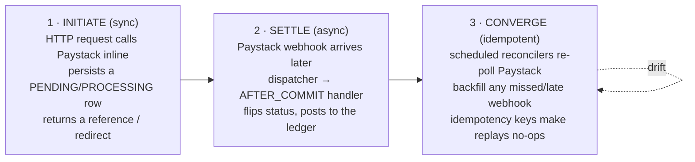
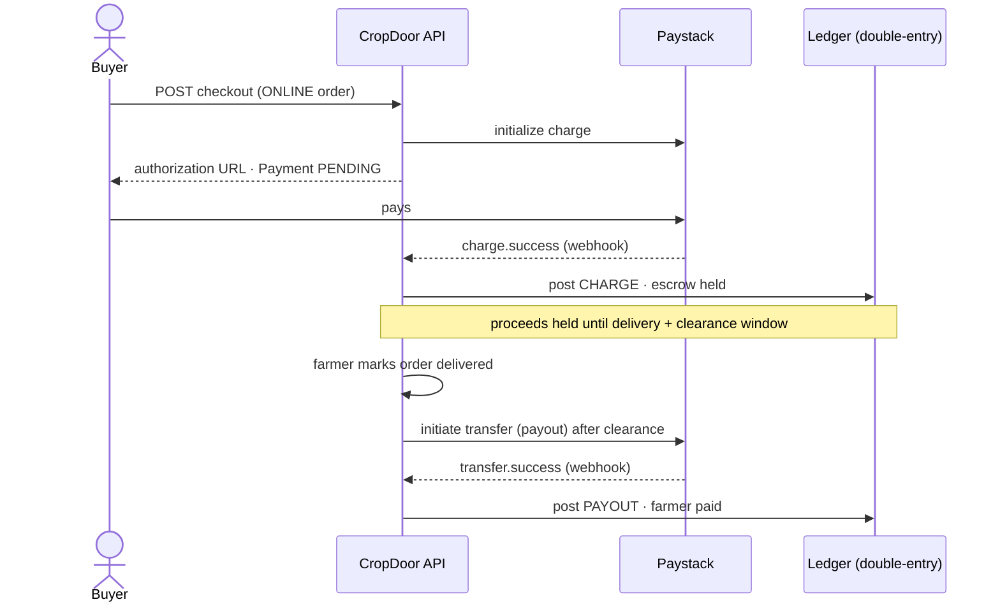

# Payments

The financial layer underneath the order lifecycle: money **in** from buyers, money **out** to farmers, and the double-entry ledger that is the platform's financial source of truth in between. It is built on **Paystack** (the GHS payment provider) for the two real cash movements — collecting from buyers (a *charge*) and paying farmers (a *transfer/payout*) — behind a provider-agnostic gateway seam so the rest of the codebase never imports a Paystack type.

This page is the **front door** for the subsystem: the mental model, the core flows, the ledger, and the load-bearing invariants. For the full reference, the pages in this section go deep — [Money model](money-model.md), [Gateway, Paystack & webhooks](gateway-and-webhooks.md), [Core flows](core-flows.md), [The ledger](ledger.md), [Reconciliation](reconciliation.md), [Receipts & credit notes](receipts-and-credit-notes.md), [Data model & configuration](data-model-and-configuration.md), and [Resiliency, audit & ops](resiliency-audit-and-ops.md). The implementation lives under `service/payment/` (with `gateway/` and `ledger/` sub-packages), `controller/webhook/`, and `model/{payment,commission,fee}`.

## Payment methods

Every order carries a `PaymentMethod` (`model/order/PaymentMethod.java`):

- **`ONLINE`** — the buyer pays upfront through Paystack; the platform holds the proceeds in **escrow** until the order is delivered, then disburses the farmer's net. This is the path that exercises the full subsystem.
- **`POD`** (pay-on-delivery) — the farmer collects cash at the door. No Paystack charge, no escrow, **not refundable online**. POD orders settle at delivery with ledger postings only.

GHS is the only currency. Money is represented in **cedis** (major units, scale 2) by `service/payment/gateway/model/Money.java`; Paystack speaks **pesewas** (minor units), and the conversion happens only at the provider boundary.

## The one mental model: initiate synchronously, settle asynchronously, converge idempotently

Every money movement follows the same three beats. Internalise it once and the rest of the subsystem reads as variations on this theme.



1. **Initiate synchronously.** An HTTP request (checkout, disburse-payout, initiate-refund) calls Paystack *inline*, persists a row in a non-terminal state, and returns a reference or redirect. Its job is only to *start* the movement — it never blocks waiting for the money to actually move.
2. **Settle asynchronously.** The real outcome arrives later as a **Paystack webhook** (`charge.success`, `transfer.success`, `refund.processed`, `charge.dispute.create`, …). `PaystackWebhookController` authenticates it, `PaystackEventDispatcher` normalises it into a domain event, and the owning service handles that event **after the inbound transaction commits** — the *only* place a status is allowed to settle.
3. **Converge idempotently.** Webhooks can be missed, delayed, or delivered out of order. Scheduled **reconcilers** re-poll Paystack for any row stuck non-terminal and drive it to its true outcome. Because every settling action is keyed by an **idempotency key**, a webhook and a reconciler racing to settle the same event converge to the same result — whichever lands first wins, the second is a no-op.

The payoff: the request path stays fast, the system is correct even when webhooks are lost (Paystack retries non-200 for ~72h, and our reconcilers re-poll on top), and replays are safe by construction — we can retry aggressively without double-charging, double-paying, or double-posting.

## The escrow lifecycle end to end



## Core flows

| Flow | Direction | Settles on | Status type | Ledger type |
| --- | --- | --- | --- | --- |
| **Charge** | buyer → platform | `charge.success` | `PaymentStatus` | `CHARGE` |
| **Payout** | platform → farmer | `transfer.success` | `PayoutStatus` (`PENDING → PROCESSING → COMPLETED`, else `FAILED`/`REVERSED`) | `PAYOUT` |
| **Refund** | platform → buyer | `refund.processed` | `RefundStatus` (`PENDING → PROCESSED`/`FAILED`) | `REFUND` |
| **Chargeback** | buyer disputes a settled charge | `charge.dispute.create` → resolution | `PaymentStatus.DISPUTED` → `COMPLETED` (won) / `REVERSED` (lost) | `CHARGEBACK_REVERSAL` (+ optional `CHARGEBACK_WRITEOFF`) |

A few rules that fall out of this table:

- **Only `ONLINE` payments are refundable.** POD never touched Paystack, so there is nothing to refund online.
- **Payouts wait for a clearance window.** After delivery, a farmer's proceeds are held for `cropdoor.payments.payout.clearance-window` (default `P7D`; `PT5M` locally) before they become disbursable — and for the cash itself to settle to the platform balance (Paystack settles a charge T+1, roughly one business day later).
- **Chargebacks freeze, then resolve.** A dispute moves the payment to `DISPUTED`; winning returns it to `COMPLETED`, losing drives it to `REVERSED` and posts the loss. **Dispute-defense** (`service/payment/ChargebackDefense*`) auto-submits the order's delivery evidence to Paystack to contest chargebacks, gated by the `PLATFORM::CHARGEBACK` permission domain.

## The double-entry ledger

The append-only **double-entry ledger** is the financial source of truth — never updated or deleted in place; corrections are new balanced postings. Every confirmed money event posts a balanced set of lines built by `service/payment/ledger/LedgerPostings.java`.

| Account | Kind | Moves on |
| --- | --- | --- |
| `PLATFORM_FLOAT` | asset (cash held at Paystack) | charge debits it; payout / refund / chargeback credit it |
| `FARMER_PAYABLE` | liability (owed to farmers, per-farmer dimension) | charge credits it; payout debits it |
| `COMMISSION_REVENUE` | revenue | charge credits the platform's commission |
| `TAX_PAYABLE` | liability | charge credits the order's tax snapshot |
| `GATEWAY_FEES` | expense | charge debits Paystack's processing fee |
| `CHARGEBACK_LOSS` | expense | a lost chargeback's write-off |

A single `CHARGE` posting, drawn as a T-account:

| Account | Direction | Amount |
| --- | --- | --- |
| `PLATFORM_FLOAT` | DEBIT | order total − gateway fee |
| `GATEWAY_FEES` | DEBIT | gateway fee |
| `FARMER_PAYABLE` | CREDIT | farmer net |
| `COMMISSION_REVENUE` | CREDIT | platform commission |
| `TAX_PAYABLE` | CREDIT | order tax |

**The gateway fee is never reversed.** Paystack keeps its processing fee on a refund or a lost chargeback, so those reversals deliberately do *not* reverse the `GATEWAY_FEES` line — the platform absorbs the fee on refunded/charged-back orders. A chargeback can drive a farmer's `FARMER_PAYABLE` dimension negative, a clawback against their next payout.

## The gateway seam

`ChargeGateway` and `TransferGateway` are provider-agnostic ports; `PaymentGatewayRegistry` resolves the active implementation. The Paystack adapters and no-op stubs are selected by a single kill switch:

- `cropdoor.payments.gateways.paystack.provider=live` — wires the real Paystack adapters.
- `cropdoor.payments.gateways.paystack.provider=noop` — wires no-op stubs (the local profile default), so the whole subsystem runs offline with deterministic fakes.

Nothing outside `service/payment/gateway/` imports a Paystack type — swapping providers, or turning the real provider off in an incident, is a one-property change.

## Reconcilers and the float report

Webhooks are the fast path; **reconcilers are the durable backstop.** Scheduled jobs (`PaymentReconciler`, `PayoutReconciler`, `RefundReconciler`) re-poll Paystack for rows stuck in a non-terminal state and settle them through the same idempotent path the webhook uses.

On top of per-row convergence, the **PLATFORM_FLOAT ↔ Paystack reconciliation report** checks the whole-of-platform identity, settlement-aware:

```
residual = paystackAvailable − internalFloat + pendingSettlements + inFlightPayouts
```

Each run persists a `reconciliation_snapshots` row with a `ReconciliationVerdict`: `RECONCILED` when the residual is within `cropdoor.payments.reconciliation.tolerance` (default `1.00` GHS), or `DRIFT` when it exceeds it. **Drift never gates payouts** — it raises a metric, a WARN log, and a `RECONCILIATION_DRIFT` audit for an operator to investigate. Admins read the latest snapshot, the history, and trigger a run from `AdminLedgerController`, all gated on `PLATFORM::FINANCIAL::VIEW`.

## Receipts and credit notes

Settled charges produce buyer-facing **receipt** PDFs; refunds and lost chargebacks produce **credit-note** PDFs. Both are rendered and stored in S3 (under the `receipts/` and `credit-notes/` prefixes) and are accessible to the buyer, the order's farm, and admins.

## Load-bearing invariants

These hold across the whole subsystem. Changing any of them without understanding why is how money goes missing.

- **Settle only via the async seam.** A non-terminal status (`PENDING`/`PROCESSING`/`DISPUTED`) is flipped to a terminal one **only** by a webhook or reconciler handler running *after* the inbound transaction commits — never inside the initiating synchronous request. This is the structural enforcement of the mental model above.
- **Raw-byte HMAC, always-200 webhook.** The Paystack signature is verified over the *exact raw request bytes* — re-serialising the JSON would reorder keys and break the HMAC-SHA512. Once authenticated, the endpoint always returns 200; downstream failures are logged, not surfaced, because Paystack retries non-200 for ~72h and the reconciler is the backstop.
- **Append-only ledger.** The double-entry ledger is never mutated in place. Corrections are new balanced postings. Every money event posts a balanced set of lines.
- **Money is never negative.** `Money`'s constructor throws on a negative amount and normalises to scale 2 (`HALF_UP`). Signed movement is expressed by ledger *direction* (DEBIT/CREDIT), not by a negative amount.
- **The gateway fee is never reversed.** Refunds and lost chargebacks do not reverse the `GATEWAY_FEES` line; the platform absorbs the fee.
- **`open-in-view=false`.** Spring's open-session-in-view is disabled, so lazy associations cannot be traversed outside a transaction. The flows deliberately call Paystack *outside* the DB transaction (three-step, self-proxy, materialize-then-HTTP patterns) while still holding the data they need.

## Permissions

Financial endpoints gate on a small set of platform permissions (all funnel through `Permissions.*` constants, per the [RBAC convention](../rbac/index.md)):

| Permission | Guards |
| --- | --- |
| `PLATFORM::FINANCIAL::VIEW` | ledger inspection, the reconciliation report, admin receipt/credit-note detail |
| `PLATFORM::FINANCIAL::MANAGE` | the money-mutating admin endpoints — disbursing payouts, initiating refunds, and chargeback write-offs |
| `PLATFORM::CHARGEBACK::VIEW` | the chargeback-defense admin queue |
| `PLATFORM::CHARGEBACK::RESOLVE` | contesting or conceding a chargeback (manual override of the auto-defense) |

## In this section

| Page | Covers |
| --- | --- |
| [Money, pricing, tax & commission](money-model.md) | `Money` semantics, order-total decomposition, the Ghana statutory levies, commission rates + snapshot-at-placement, escrow vs POD |
| [Gateway, Paystack & webhooks](gateway-and-webhooks.md) | The `ChargeGateway`/`TransferGateway` seam, the `provider=live\|noop` kill switch, the Paystack adapters, and the raw-byte-HMAC always-200 webhook ingress |
| [Core flows](core-flows.md) | Checkout & charge, payouts, refunds & chargebacks, and dispute-defense — each with its sequence diagram, status lifecycle, and ledger postings |
| [The double-entry ledger](ledger.md) | The chart of accounts, the per-event T-account postings, the idempotency-key catalog, and the fee-never-reversed asymmetry |
| [Reconciliation](reconciliation.md) | The per-row reconcilers, T+1 settlement lag, and the PLATFORM_FLOAT ↔ Paystack float-reconciliation report |
| [Receipts & credit notes](receipts-and-credit-notes.md) | Receipt and credit-note PDF generation, S3 storage, and the buyer/farm/admin access model |
| [Data model & configuration](data-model-and-configuration.md) | The payment-table ER diagram, the Flyway migration history, and every `cropdoor.payments.*` key per profile |
| [Resiliency, audit & ops](resiliency-audit-and-ops.md) | The `open-in-view=false` patterns, the error-code catalog, audit/metrics, and the live-testing runbook |

## Where it lives

| Concern | Source |
| --- | --- |
| Checkout, payouts, refunds, dispute-defense, reconcilers | `service/payment/` |
| Gateway ports, registry, `Money`, gateway model records | `service/payment/gateway/` |
| Double-entry ledger | `service/payment/ledger/` (`LedgerService`, `LedgerPostings`) |
| Webhook ingress | `controller/webhook/PaystackWebhookController.java` + `PaystackEventDispatcher` |
| Financial admin endpoints (ledger, reconciliation, receipts, credit notes) | `controller/admin/` |
| Entities | `model/{payment,commission,fee}`, `model/order/OrderCommission.java`, `OrderTax.java` |
| Schema | Flyway migrations under `src/main/resources/db/migration/` (incl. `V80` leftover-VAT cleanup, `V81` `reconciliation_snapshots`) |
| Configuration | `cropdoor.payments.*` in `application.properties` and profiles |

!!! info "Status"
    **Shipped.** Online escrow checkout, payouts, refunds, chargeback dispute-defense, the double-entry ledger, the reconcilers, the float-reconciliation report, and receipts/credit notes are all wired through service + controller + audit + migrations + tests and run against Paystack. The local profile runs the subsystem fully offline via `provider=noop`. The unrelated *in-app* `model/dispute/*` entity (a planned buyer/farmer dispute feature) is **not** part of this subsystem and remains a [roadmap surface](../architecture/roadmap.md).
