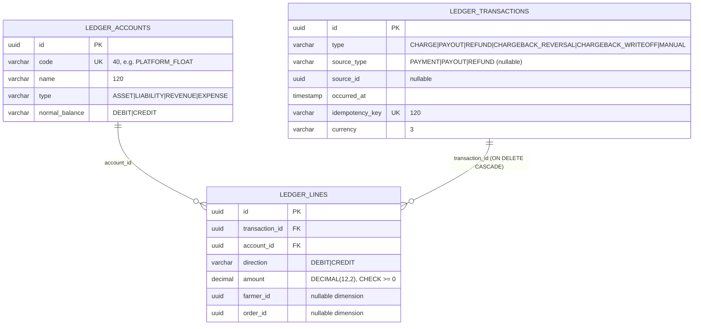
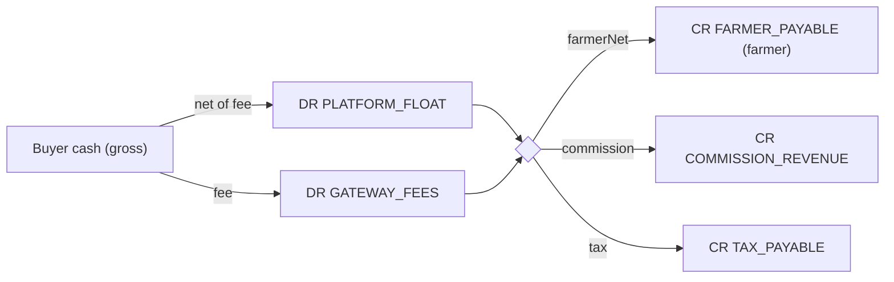
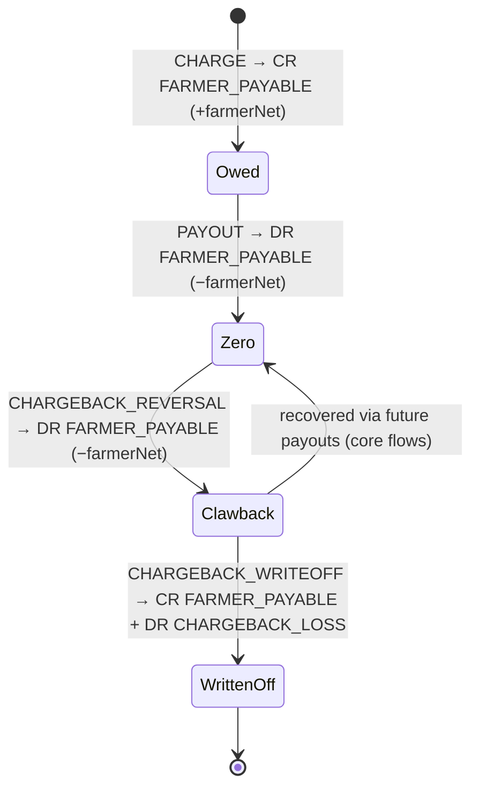

# The double-entry ledger

The ledger is CropDoor's authoritative record of money. It is a small, fixed double-entry book: a seeded six-account chart, append-only balanced transactions (one per confirmed money event), and debit/credit lines that carry optional farmer and order dimensions. Every money event — charge, payout, refund, chargeback reversal, chargeback write-off, plus pay-on-delivery settlement — lands here as a balanced posting keyed by an idempotency key, so a redelivered webhook never double-posts.

This page is the canonical reference for the chart of accounts, the posting model, the balance invariant, the exact debit/credit lines of every event, the sign conventions and balance queries, the gateway-fee-never-reversed asymmetry, the chargeback clawback, and the admin ledger API. It is a deeper sibling of the [Payments overview](index.md); the numbers that *feed* every posting (farmer-net, commission, tax, gross) are computed and snapshotted upstream in the [money model](money-model.md), and the flows that *trigger* postings live in [core flows](core-flows.md).

## The ledger is authoritative and append-only

The ledger is the single source of truth for money movement. Two properties make it trustworthy.

- **Append-only.** A `LedgerTransaction` and its `LedgerLine`s are written once and never updated or deleted. `LedgerServiceImpl#post` only ever saves a freshly built transaction — there is no update or delete path, and the schema grants no such operation. The rule, stated in the class Javadoc: *"Never updates or deletes — corrections are reversing transactions."*
- **Corrections are reversing transactions.** A money event that undoes an earlier one — a refund undoing a charge, a chargeback reversal undoing a charge, a write-off clearing a clawback — is itself a *new* balanced posting that moves the affected balances back. It is never an edit of the original lines. This keeps the book a faithful, immutable history: every state the money was ever in is still legible.

The ledger does **not** own the order, payment, payout, or refund lifecycles — those live in their own tables and state machines (see [core flows](core-flows.md)). The ledger is strictly downstream: when one of those flows *confirms* a money event, it asks the ledger to record it. The ledger never initiates anything.

## Chart of accounts

Six accounts are seeded by `V65__create_ledger.sql` and never created at runtime (`LedgerAccount`'s Javadoc: *"Reference data; never created at runtime."*). The chart is deliberately fixed and small — it models the platform's role as an **escrow custodian** that holds buyer cash, owes farmers, recognises its commission, holds collected tax, and expenses gateway fees and chargeback losses.

| Code | `LedgerAccountType` | Normal balance | What it represents · what moves it |
|------|---------------------|----------------|------------------------------------|
| `PLATFORM_FLOAT` | `ASSET` | `DEBIT` | Cash the platform holds, net of gateway fees — the escrowed money in transit. A charge debits it; payout, refund, and chargeback reversal credit it. |
| `FARMER_PAYABLE` | `LIABILITY` | `CREDIT` | Money the platform owes farmers, dimensioned per farmer + per order. A charge credits it; a payout debits it; a lost chargeback debits it (possibly negative); a write-off credits it back to zero. |
| `COMMISSION_REVENUE` | `REVENUE` | `CREDIT` | The platform's recognised commission. A charge credits it; a refund / lost chargeback debits it back. |
| `TAX_PAYABLE` | `LIABILITY` | `CREDIT` | Collected tax the platform holds and will remit. A charge credits it; a refund / lost chargeback debits it back. |
| `GATEWAY_FEES` | `EXPENSE` | `DEBIT` | Paystack charge fees and transfer fees the platform absorbs. A charge debits the charge fee; a payout debits the transfer fee. **Never reversed** (see below). |
| `CHARGEBACK_LOSS` | `EXPENSE` | `DEBIT` | Unrecoverable clawbacks written off after a lost dispute. A write-off debits it. |

The seed inserts each account with its `code`, display `name`, `type`, and `normal_balance`: `PLATFORM_FLOAT` ("Platform float", `ASSET`/`DEBIT`), `FARMER_PAYABLE` ("Farmer payable", `LIABILITY`/`CREDIT`), `COMMISSION_REVENUE` ("Commission revenue", `REVENUE`/`CREDIT`), `TAX_PAYABLE` ("Tax payable", `LIABILITY`/`CREDIT`), `GATEWAY_FEES` ("Gateway fees", `EXPENSE`/`DEBIT`), and `CHARGEBACK_LOSS` ("Chargeback loss", `EXPENSE`/`DEBIT`).

### The data model



Two indexes support balance queries: `idx_ledger_lines_account` on `account_id`, and a partial `idx_ledger_lines_farmer` on `farmer_id WHERE farmer_id IS NOT NULL` (most lines carry no farmer dimension, so the partial index stays small). The full schema lives in [data model & configuration](data-model-and-configuration.md).

## The posting model

A money event is recorded as one `LedgerTransaction` holding a list of `LedgerLine`s. The posting is built as an immutable command, validated, and persisted.

- **`LedgerPostingCommand`** (`service/payment/ledger/LedgerPostingCommand.java`) — a record carrying `type`, `idempotencyKey`, `sourceType`, `sourceId`, `occurredAt`, `currency`, and a `List<Line>`. Each `Line` is `(accountCode, direction, amount, farmerId, orderId)` with a **non-negative amount** and an explicit `LedgerDirection` (`DEBIT`/`CREDIT`). There are no signed amounts — sign is carried entirely by `direction`, and the DB enforces `CHECK (amount >= 0)`.
- **`LedgerPostings`** (`service/payment/ledger/LedgerPostings.java`) — a `@Component` whose only job is to build the correct, balanced command for each event (`forChargeSucceeded`, `forPayoutSucceeded`, `forRefundProcessed`, `forChargebackReversal`, `forChargebackWriteoff`). Pure construction: no persistence, no I/O.
- **`LedgerService#post`** (`LedgerServiceImpl`) — a `@Transactional` method that first checks idempotency: if a transaction with the command's `idempotencyKey` already exists (`existsByIdempotencyKey`), it logs at debug and returns without posting. Otherwise it asserts balance, builds the `LedgerTransaction`, resolves each line's `accountCode` to a seeded `LedgerAccount`, appends each `LedgerLine`, and saves the transaction with its cascaded lines.

### Dimensions: farmer + order

A `LedgerLine` carries two optional, foreign-key-shaped columns — `farmer_id` and `order_id` — with no DB-level FK constraint. They are reporting dimensions, not relational links, and let the ledger answer *per-farmer* and *per-order* questions without a separate sub-ledger.

- **`farmer_id`** is set only on `FARMER_PAYABLE` lines, identifying which farmer the obligation belongs to. It is the dimension behind `farmerPayableBalance` and the clawback machinery.
- **`order_id`** is set on every line of every order-scoped posting, so a whole order's money story — charge, payout, refund/chargeback — can be traced by `order_id`.

`source_type` / `source_id` are coarser provenance fields on the transaction. In current code `sourceType` is one of the literals `"PAYMENT"`, `"PAYOUT"`, `"REFUND"`, and **`sourceId` is always `null`** — `LedgerPostings` passes `null` for the source id on every builder. The fine-grained linkage is carried by the dimensions and the idempotency key, not by `source_id`.

## The balance invariant and the sign convention

### `assertBalanced`

Before persisting, `post` calls `assertBalanced`, which sums the `DEBIT` lines and the `CREDIT` lines and, if the two totals are not equal, throws `LedgerImbalanceException` carrying the offending `idempotencyKey` and the mismatched debit/credit totals.

`LedgerImbalanceException` (`exception/payment/LedgerImbalanceException.java`) is a `DomainException` mapped to `INTERNAL_ERROR` / **HTTP 500**. An imbalance is a *programming error that must never reach the database* — the builders in `LedgerPostings` are constructed so debits always equal credits by arithmetic, so this firing means a code bug, not a user condition. It overrides `getClientMessage()` so the imbalance diagnostic (`debits=… credits=…`) is logged but never echoed to the client. The same exception is thrown when a line references an account code that isn't in the seeded chart (`"Unknown ledger account: …"`).

### Sign convention

There are no negative amounts in the table. Every `amount` is `>= 0`; the *meaning* of a line is the pair `(direction, account.normal_balance)`:

- A line in the account's **normal direction** increases that account (a `DEBIT` on an `ASSET`/`EXPENSE`, a `CREDIT` on a `LIABILITY`/`REVENUE`).
- A line in the **opposite** direction decreases it.

Balance queries (below) collapse direction into a signed sum, so a *balance* can be negative — most importantly a negative `FARMER_PAYABLE`, which means the farmer owes the platform (a clawback).

## Postings per event

Each builder in `LedgerPostings` produces one balanced transaction. The amounts feeding them are computed upstream (see the [money model](money-model.md)); the ledger only records them. In all tables below, **DR** = debit, **CR** = credit; the farmer dimension is noted where set, and every line also carries the `order_id` dimension.

### CHARGE — `forChargeSucceeded`

Triggered from `PaymentSettlementServiceImpl#settleConfirmedPayment` — the shared money-core for both online-escrow and pay-on-delivery settlement. On the **online-escrow** path the platform receives the **net cash** (gross minus the Paystack charge fee), owes the farmer their net, recognises commission, and holds the tax. The gateway fee is booked as the platform's expense in the same transaction (`netFloat = grossAmount − gatewayFee`).

| Account | Direction | Amount | Dimension |
|---------|-----------|--------|-----------|
| `PLATFORM_FLOAT` | DR | `gross − gatewayFee` | order |
| `GATEWAY_FEES` | DR | `gatewayFee` | order |
| `FARMER_PAYABLE` | CR | `farmerNet` | farmer + order |
| `COMMISSION_REVENUE` | CR | `commission` | order |
| `TAX_PAYABLE` | CR | `tax` | order |

`grossAmount = farmerNet + commission + tax` (equivalently `order.totalAmount`); the DR side (`net + fee`) equals the CR side (`gross`). `sourceType = "PAYMENT"`, `type = CHARGE`.



### POD settlement — same builder, zero fee

The pay-on-delivery path reuses `forChargeSucceeded`. The farmer collects cash at the door, so the caller (`OrderServiceImpl#settlePodPaymentOnDelivery`) passes `gatewayFee = BigDecimal.ZERO` — cash carries no Paystack charge fee. The `GATEWAY_FEES` line therefore posts `0.00` and `PLATFORM_FLOAT` is debited the **full gross**:

| Account | Direction | Amount | Dimension |
|---------|-----------|--------|-----------|
| `PLATFORM_FLOAT` | DR | `gross` | order |
| `GATEWAY_FEES` | DR | `0.00` | order |
| `FARMER_PAYABLE` | CR | `farmerNet` | farmer + order |
| `COMMISSION_REVENUE` | CR | `commission` | order |
| `TAX_PAYABLE` | CR | `tax` | order |

POD is keyed `pod:<orderId>` (online charges are keyed on the gateway reference); see the [idempotency catalog](#idempotency-keys).

### PAYOUT — `forPayoutSucceeded`

Triggered from `PayoutServiceImpl#settleTransferSucceeded` when a `transfer.success` is confirmed. It discharges the farmer's payable, expenses the provider's **transfer fee**, and credits the float the cash that actually left (`floatOut = netAmount + transferFee`). The farmer receives the full `net`; the transfer fee is the platform's expense.

| Account | Direction | Amount | Dimension |
|---------|-----------|--------|-----------|
| `FARMER_PAYABLE` | DR | `netAmount` | farmer + order |
| `GATEWAY_FEES` | DR | `transferFee` | order |
| `PLATFORM_FLOAT` | CR | `netAmount + transferFee` | order |

`sourceType = "PAYOUT"`, `type = PAYOUT`. The same `GATEWAY_FEES` expense account books both the charge fee and the transfer fee — both are real cash Paystack keeps.

### REFUND — `forRefundProcessed`

Triggered from `RefundServiceImpl#markProcessed` on a `refund.processed` webhook (only ONLINE/escrow payments are refundable). It reverses the charge's three obligation credits and pays the float back out at the **refunded total** (`refundedTotal = farmerNet + commission + tax`). The amounts come from the order's **receipt** snapshot (`receipt.getCommissionAmount()`, `getTaxAmount()`, `getSubtotalAmount() − commission`), not recomputed.

| Account | Direction | Amount | Dimension |
|---------|-----------|--------|-----------|
| `FARMER_PAYABLE` | DR | `farmerNet` | farmer + order |
| `COMMISSION_REVENUE` | DR | `commission` | order |
| `TAX_PAYABLE` | DR | `tax` | order |
| `PLATFORM_FLOAT` | CR | `farmerNet + commission + tax` | order |

`sourceType = "REFUND"`, `type = REFUND`. **The gateway fee is deliberately NOT reversed** — see [the gateway-fee asymmetry](#the-gateway-fee-asymmetry).

### CHARGEBACK_REVERSAL — `forChargebackReversal`

Triggered from `ChargebackServiceImpl#resolveChargeback` when a Paystack dispute resolves **lost** (`event.won() == false`). Structurally it mirrors the refund: reverse the three obligation credits and pay the **gross** back out of float. The crucial difference is that the `FARMER_PAYABLE` debit carries the farmer dimension and may drive that dimension **negative** if the farmer was already paid out.

| Account | Direction | Amount | Dimension |
|---------|-----------|--------|-----------|
| `FARMER_PAYABLE` | DR | `farmerNet` | farmer + order |
| `COMMISSION_REVENUE` | DR | `commission` | order |
| `TAX_PAYABLE` | DR | `tax` | order |
| `PLATFORM_FLOAT` | CR | `gross` | order |

`sourceType = "PAYMENT"`, `type = CHARGEBACK_REVERSAL`. The amounts come from `ChargebackServiceImpl#chargebackAmounts`: `gross = order.totalAmount`, `subtotal = order.subtotal`, `tax = gross − subtotal`, `commission` = sum of `OrderCommission` rows, `farmerNet = subtotal − commission`. As with refunds, the charge gateway fee is never reversed. The clawback case is worked through in [clawback lifecycle](#clawback-lifecycle-lost-dispute-after-disbursement).

### CHARGEBACK_WRITEOFF — `forChargebackWriteoff`

Triggered from `ChargebackServiceImpl#writeOffClawback` (admin action). When the platform decides a clawback can't be recovered from the farmer's future payouts, it books the unrecoverable amount as a loss and clears the negative `FARMER_PAYABLE` dimension the reversal created.

| Account | Direction | Amount | Dimension |
|---------|-----------|--------|-----------|
| `CHARGEBACK_LOSS` | DR | `writeOffAmount` | order |
| `FARMER_PAYABLE` | CR | `writeOffAmount` | farmer + order |

`sourceType = "PAYMENT"`, `type = CHARGEBACK_WRITEOFF`. `writeOffAmount` is the **magnitude of the negative order payable**: `writeOffClawback` reads `creditMinusDebitForOrderFarmerPayable(orderId)`, requires it `< 0` (else `InvalidChargebackStateException` — *"No outstanding clawback to write off"*), and uses its `.abs()`. The CR on `FARMER_PAYABLE` lifts that order's dimension back to zero; the DR on `CHARGEBACK_LOSS` recognises the loss.

!!! note "The sixth transaction type is reserved"
    `LedgerTransactionType.MANUAL` is declared in the enum but no builder produces it and no code posts one. It is a future hook for hand-booked adjustments; today the only way money enters the ledger is through the builders above.

## Idempotency keys

Every posting carries a unique `idempotencyKey`. `post` short-circuits if a transaction with that key already exists (`existsByIdempotencyKey`), and the column is `UNIQUE` (`idempotency_key VARCHAR(120) NOT NULL UNIQUE`), so even a race that slips past the existence check fails the insert rather than double-posting. This is what makes the ledger safe under Paystack's at-least-once webhook delivery (redelivered for ~72h): a replayed `charge.success` / `transfer.success` / `refund.processed` / `charge.dispute` lands on the same key and no-ops.

The ledger-transaction keys, verbatim from their call sites:

| Event | Key format | Built at | Source value |
|-------|-----------|----------|--------------|
| CHARGE (online) | `charge:<providerRef>` | `PaymentServiceImpl` (`"charge:" + payment.getProviderRef()`) | the Paystack transaction reference |
| CHARGE (pay-on-delivery) | `pod:<orderId>` | `OrderServiceImpl#settlePodPaymentOnDelivery` (`"pod:" + order.getId()`) | the `Order` row id |
| PAYOUT | `payout-success-<payoutId>` | `PayoutServiceImpl` (`"payout-success-" + payout.getId()`) | the `Payout` row id |
| REFUND | `refund-processed-<refundId>` | `RefundServiceImpl` (`"refund-processed-" + refund.getId()`) | the `Refund` row id |
| CHARGEBACK_REVERSAL | `chargeback-reversal-<disputeReference>` | `ChargebackServiceImpl` (`"chargeback-reversal-" + event.disputeReference()`) | the Paystack dispute reference |
| CHARGEBACK_WRITEOFF | `chargeback-writeoff-<paymentId>` | `ChargebackServiceImpl` (`"chargeback-writeoff-" + paymentId`) | the `Payment` row id |

The choice of source value per event is deliberate: the charge key uses the **gateway** reference (the natural dedup key for a webhook); payout/refund/write-off use the **internal row id** (one ledger transaction per row); the chargeback reversal uses the **dispute reference** (one reversal per dispute). This is the ledger slice of a platform-wide idempotency story that interlocks with row-level pessimistic locks — see [resiliency, audit & ops](resiliency-audit-and-ops.md).

## The gateway-fee asymmetry

**This is the canonical home for the rule.** When a charge succeeds, Paystack keeps its processing fee and the ledger books it as a `GATEWAY_FEES` expense. When that same order is later **refunded** or **charged back (lost)**, Paystack does **not** return the original processing fee — so the ledger **does not reverse the `GATEWAY_FEES` line either**. The refund and chargeback postings touch only `FARMER_PAYABLE`, `COMMISSION_REVENUE`, `TAX_PAYABLE`, and `PLATFORM_FLOAT`; the original charge-fee DR stays on the books. The `forRefundProcessed` Javadoc states it plainly: *"The gateway fee is deliberately NOT reversed (Paystack does not return the processing fee on a refund), so the platform absorbs it on refunded orders."* `forChargebackReversal` carries the same rule.

**Why it's modelled this way.** Reversing a fee the platform never got back would conjure cash that doesn't exist — it would credit `PLATFORM_FLOAT` for money Paystack still holds, and the float would drift above the real bank/Paystack balance. By *not* reversing it, the ledger keeps `PLATFORM_FLOAT` honest: after a full refund of an order, the float for that order settles at **`−gatewayFee`**, which is exactly the real cash position — the platform is out the fee it paid to move the money in and back out. The expense is recognised once, where it was actually incurred. The mechanical consequence is visible in the worked refund example below: float ends at `−1.95`, the absorbed charge fee.

## Balance queries

Three repository aggregates on `LedgerLineRepository` collapse the lines into signed sums; the service layer wraps them for the natural-balance trial view.

### Account balance — debit minus credit

`LedgerService#accountBalance(code)` → `debitMinusCreditByAccountCode` sums, over all `LedgerLine`s for the given account code, each line's amount signed positive when its direction is `DEBIT` and negative when `CREDIT` (coalescing to `0` when there are no lines):

```
accountBalance(code) = Σ over lines of account `code` of (direction = DEBIT ? +amount : -amount)
```

This is the **raw signed balance**: positive for accounts holding a net debit, negative for a net credit. For an `ASSET`/`EXPENSE` (normal-debit) account this *is* the natural balance; for a `LIABILITY`/`REVENUE` (normal-credit) account it comes out negative when healthy.

### Farmer payable — credit minus debit

`LedgerService#farmerPayableBalance(farmerId)` → `creditMinusDebitForFarmerPayable`, scoped to `FARMER_PAYABLE` lines for one farmer, sums each line's amount signed positive when its direction is `CREDIT` and negative when `DEBIT` (coalescing to `0`):

```
farmerPayableBalance(farmerId) = Σ over FARMER_PAYABLE lines where farmerId matches of (direction = CREDIT ? +amount : -amount)
```

Because `FARMER_PAYABLE` is normal-credit, flipping to credit-minus-debit gives a **payable-positive** reading: a positive result is money owed to the farmer; **a negative result means the farmer owes the platform** — an outstanding clawback. The per-order variant `creditMinusDebitForOrderFarmerPayable(orderId)` is the same sum scoped by `order_id` and is what the write-off path inspects to find an order's outstanding clawback.

### Natural balances and the trial balance

`LedgerService#accountBalances()` builds the admin trial balance. For each seeded account it computes the raw debit-minus-credit, then flips normal-credit accounts so every account reports **positive in its own normal direction**: a normal-`DEBIT` account keeps its debit-minus-credit as the natural balance, while a normal-`CREDIT` account negates it.

The result is a `List<LedgerAccountBalanceResponse>` of `(code, name, type, normalBalance, balance)`. Because every posting balances, **the sum of the normal-debit naturals equals the sum of the normal-credit naturals** at all times — that equality is the platform's running trial balance, and any divergence would mean a non-balancing posting reached the DB (which `assertBalanced` prevents).

!!! info "The two query directions are intentionally opposite"
    Account balance reports debit-minus-credit (so an asset reads positive when healthy); farmer payable reports credit-minus-debit (so a payable reads positive when healthy). Each query is oriented to its account's normal balance.

## Clawback lifecycle (lost dispute after disbursement)

The hardest money case is a chargeback **lost after the farmer was already paid**. The dimensions and the write-off path are designed exactly for it.

1. **Charge** credits `FARMER_PAYABLE` (farmer + order) with `farmerNet` — the platform now owes the farmer.
2. **Payout** debits `FARMER_PAYABLE` by `farmerNet`, taking that order's farmer payable to **zero**. The farmer has the cash.
3. **Chargeback lost** → `forChargebackReversal` debits `FARMER_PAYABLE` by `farmerNet` again. The order's payable dimension is now **negative `farmerNet`** — the platform refunded the buyer the gross out of float but has nothing to claw back from this order's payable, so the negative balance stands as a **recovery claim against the farmer's future payouts**. (`forChargebackReversal`'s Javadoc: *"this debit drives that dimension negative — a clawback claim against their next payout."*)
4. **Recovery (the happy path):** as the farmer earns new orders, fresh CHARGE postings credit their *farmer-level* `FARMER_PAYABLE`. Because payout funding is checked against the farmer's net payable position, the negative carry reduces what they can withdraw until it nets out — recovery happens through the payout machinery (see [core flows](core-flows.md)), not the ledger.
5. **Write-off (the unrecoverable path):** if the platform decides the claim can't be recovered, an admin calls `writeOffClawback`. It reads `creditMinusDebitForOrderFarmerPayable(orderId)`, confirms it is negative, and posts `forChargebackWriteoff`: DR `CHARGEBACK_LOSS`, CR `FARMER_PAYABLE`, both at `|negative payable|`. This lifts the order's payable dimension back to zero and recognises the loss as an expense.



## Worked end-to-end example

One order, with numbers chosen so the arithmetic is easy to follow. Upstream pricing (the [money model](money-model.md)) gives:

- subtotal `100.00`, commission `10.00`, tax `5.00` → `farmerNet = 90.00`, `gross (order.totalAmount) = 105.00`
- charge gateway fee `1.95`, transfer fee `1.00`

### Step 1 — CHARGE (`charge:<ref>`)

| Account | DR | CR |
|---------|----|----|
| `PLATFORM_FLOAT` | 103.05 | |
| `GATEWAY_FEES` | 1.95 | |
| `FARMER_PAYABLE` (farmer) | | 90.00 |
| `COMMISSION_REVENUE` | | 10.00 |
| `TAX_PAYABLE` | | 5.00 |
| **Totals** | **105.00** | **105.00** |

### Step 2 — PAYOUT (`payout-success-<id>`)

| Account | DR | CR |
|---------|----|----|
| `FARMER_PAYABLE` (farmer) | 90.00 | |
| `GATEWAY_FEES` | 1.00 | |
| `PLATFORM_FLOAT` | | 91.00 |
| **Totals** | **91.00** | **91.00** |

Running natural balances after charge + payout:

| Account | Natural balance |
|---------|-----------------|
| `PLATFORM_FLOAT` (asset) | `103.05 − 91.00` = **12.05** |
| `FARMER_PAYABLE` (liability) | `90.00 − 90.00` = **0.00** |
| `COMMISSION_REVENUE` (revenue) | **10.00** |
| `TAX_PAYABLE` (liability) | **5.00** |
| `GATEWAY_FEES` (expense) | `1.95 + 1.00` = **2.95** |
| `CHARGEBACK_LOSS` (expense) | **0.00** |

Trial balance holds: normal-debit naturals `12.05 + 2.95 = 15.00`; normal-credit naturals `0 + 10.00 + 5.00 = 15.00`. The platform holds `12.05` of float, has earned `10.00` commission and holds `5.00` tax, against `2.95` of fees paid.

### Step 3a — REFUND branch (`refund-processed-<id>`)

Suppose instead the order is refunded *before* payout (reverse the obligation credits, pay gross out of float; fee NOT reversed):

| Account | DR | CR |
|---------|----|----|
| `FARMER_PAYABLE` (farmer) | 90.00 | |
| `COMMISSION_REVENUE` | 10.00 | |
| `TAX_PAYABLE` | 5.00 | |
| `PLATFORM_FLOAT` | | 105.00 |

After charge + refund: `FARMER_PAYABLE = 0`, `COMMISSION_REVENUE = 0`, `TAX_PAYABLE = 0`, and `PLATFORM_FLOAT = 103.05 − 105.00 = −1.95` against `GATEWAY_FEES = 1.95`. The float's `−1.95` is exactly the absorbed charge fee — the platform's real out-of-pocket on a fully refunded order. Trial balance still nets to zero.

### Step 3b — CHARGEBACK lost → write-off branch

Continuing from *after step 2* (order was paid out), the dispute resolves lost.

**CHARGEBACK_REVERSAL** (`chargeback-reversal-<disputeRef>`):

| Account | DR | CR |
|---------|----|----|
| `FARMER_PAYABLE` (farmer) | 90.00 | |
| `COMMISSION_REVENUE` | 10.00 | |
| `TAX_PAYABLE` | 5.00 | |
| `PLATFORM_FLOAT` | | 105.00 |

Now this order's `FARMER_PAYABLE` (credit-minus-debit) = `90 − (90 + 90) = −90.00` — a clawback. Float is `103.05 − 91.00 − 105.00 = −92.95`.

**CHARGEBACK_WRITEOFF** (`chargeback-writeoff-<paymentId>`), `writeOffAmount = |−90.00| = 90.00`:

| Account | DR | CR |
|---------|----|----|
| `CHARGEBACK_LOSS` | 90.00 | |
| `FARMER_PAYABLE` (farmer) | | 90.00 |

Final natural balances: `FARMER_PAYABLE = 0`, `COMMISSION_REVENUE = 0`, `TAX_PAYABLE = 0`, `CHARGEBACK_LOSS = 90.00`, `GATEWAY_FEES = 2.95`, `PLATFORM_FLOAT = −92.95`. Trial balance: normal-debit `−92.95 + 2.95 + 90.00 = 0`; normal-credit `0`. The platform's total recognised loss (`CHARGEBACK_LOSS 90.00 + GATEWAY_FEES 2.95 = 92.95`) equals the float drain — a clean, balanced record of money the platform genuinely lost.

## The admin ledger API

`AdminLedgerController` (`controller/admin/AdminLedgerController.java`, base path `/v1/admin/ledger`) exposes read-only views over the ledger plus the reconciliation surface. Every endpoint is gated on `PLATFORM::FINANCIAL::VIEW` (the `Permissions.PLATFORM_FINANCIAL_VIEW` constant) — no ledger-specific permission was introduced.

| Method | Path | Returns | Notes |
|--------|------|---------|-------|
| GET | `/v1/admin/ledger/balances` | `List<LedgerAccountBalanceResponse>` | The trial balance — every account's natural balance. |
| GET | `/v1/admin/ledger/transactions` | `Page<LedgerTransactionResponse>` | Paged, newest-occurred first (`occurredAt DESC`). `page` default `0`, `size` default `20`, clamped to `MAX_PAGE_SIZE = 100`. |
| GET | `/v1/admin/ledger/reconciliation` | `ReconciliationSnapshotResponse` (or `null`) | Latest float reconciliation snapshot. |
| GET | `/v1/admin/ledger/reconciliation/history` | `Page<ReconciliationSnapshotResponse>` | Paged snapshot history, `createdAt DESC`. |
| POST | `/v1/admin/ledger/reconciliation/run` | `ReconciliationSnapshotResponse` | On-demand reconciliation run. |

All responses are wrapped in `ApiResponse<T>`. The `/transactions` feed maps each transaction (with its balanced lines) via `LedgerMapper#toResponse`, which flattens each line's nested `account.code` into `accountCode`. A `LedgerTransactionResponse` is `(id, type, sourceType, sourceId, occurredAt, currency, createdAt, lines)`; each `LedgerLineResponse` is `(accountCode, direction, amount, farmerId, orderId)`.

The reconciliation endpoints belong to `PlatformFloatReconciliationService` and compare `PLATFORM_FLOAT` against Paystack's reported balance; they are documented fully — including the T+1 settlement lag and the DRIFT/residual tolerance — in [reconciliation](reconciliation.md).

## Operational notes for ledger readers

### `open-in-view=false` and lazy lines

The app runs with `spring.jpa.open-in-view=false`, so a lazily-fetched association accessed *after* the service transaction closes throws `LazyInitializationException`. The ledger's instance of this hazard: `LedgerLine.transaction` and `LedgerLine.account` are `FetchType.LAZY`, and the `/transactions` view must read each line's `account.code`. `LedgerServiceImpl#listTransactions` is `@Transactional(readOnly = true)` and maps to DTOs *inside* that transaction (`findAll(pageable).map(ledgerMapper::toResponse)`), so every lazy `account` is materialised before the boundary closes. The general patterns (materialize-then-HTTP, eager columns, three-step) are canonical in [resiliency, audit & ops](resiliency-audit-and-ops.md); this is the ledger-specific instance.

### `DECIMAL(12,2)` bounds

`amount` is `DECIMAL(12,2) CHECK (amount >= 0)` (mirrored on the entity as `@Column(precision = 12, scale = 2)`). That caps a single line at `9,999,999,999.99` in its currency's major unit. Money is stored and posted in **cedis** (the major unit, two decimal places) at the ledger layer — the pesewa/cedi conversion happens at the gateway edge, not here (see the [money model](money-model.md) and [gateway & webhooks](gateway-and-webhooks.md)). `currency` is the 3-letter ISO code carried on each transaction.

### Posting timing (AFTER_COMMIT)

Every money event that posts to the ledger is driven off a webhook that the dispatcher republishes as a domain event consumed `AFTER_COMMIT` with `fallbackExecution = true` — so settlement (and its ledger posting) runs only once the originating state change is durably committed, and still runs when the publishing path is non-transactional (the webhook controller). That event seam is canonical in [gateway & webhooks](gateway-and-webhooks.md); the ledger is purely the downstream recorder. Because postings are idempotency-keyed, a redelivered webhook re-running the listener simply no-ops at `post`.
