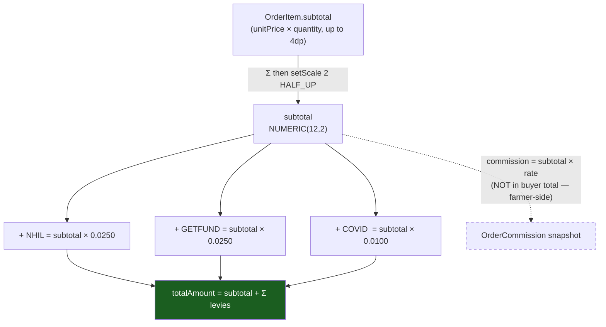
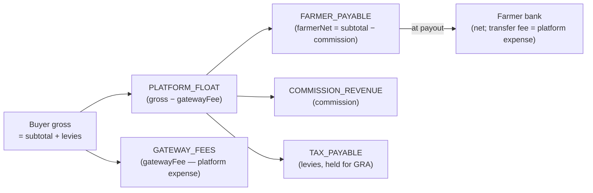
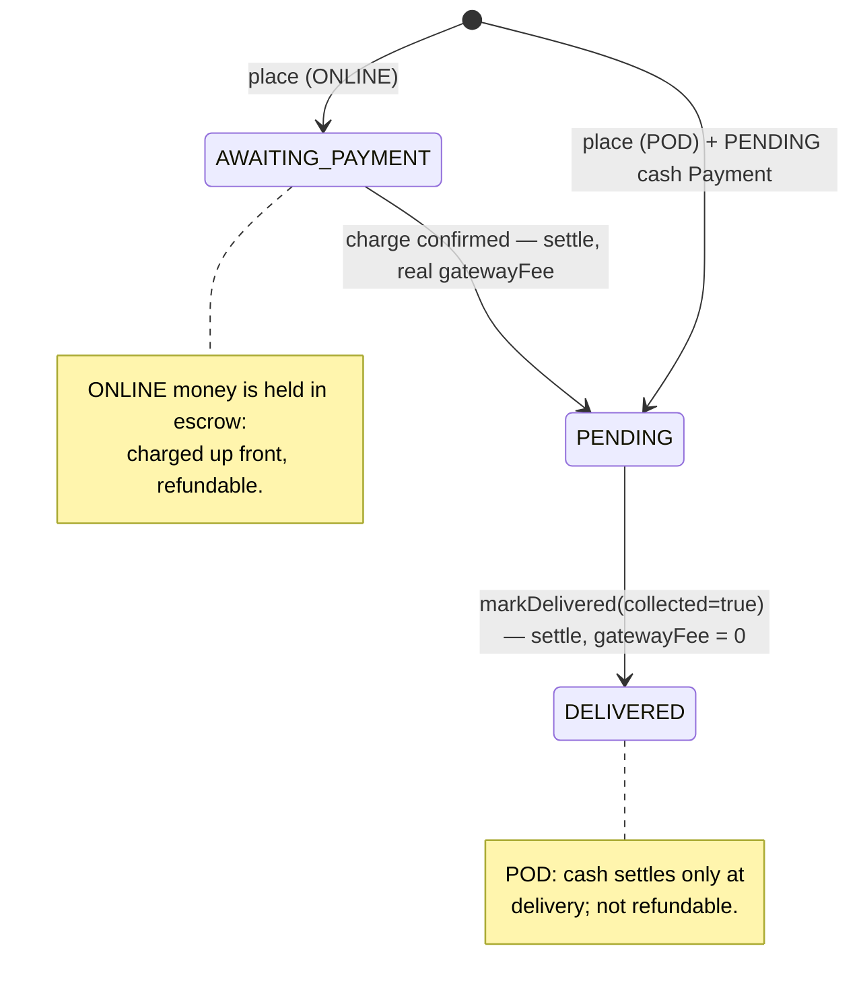

# Money, pricing, tax & commission

This is *the numbers*. Where [the payments overview](index.md) gives you the mental model and the flows, this page nails down exactly how an order total decomposes — gross to the buyer, net to the farmer, the platform's commission, and the Ghana statutory levies — and the value type (`Money`) that every cash figure flows through. It is the canonical home for the rounding rules, the levy math, the commission resolution, the **snapshot-at-placement** principle, and fee incidence.

Two load-bearing ideas anchor everything below:

1. **Commission and tax are snapshotted at order placement** and never recomputed. Rate changes only touch orders placed *after* the change; historical orders, receipts, and ledger postings stay exactly reproducible from their stored snapshots.
2. **Money is never negative.** `Money`'s constructor throws on a negative amount; direction (a refund vs a charge) lives in the *ledger*, expressed as `DEBIT`/`CREDIT`, never as a signed amount. See [the ledger](ledger.md) for the postings these amounts drive.

The platform runs a **gross-to-buyer, net-to-farmer** model: the buyer pays exactly `subtotal + levies`, commission is deducted from the *farmer's* proceeds (never added to the buyer's bill), and both gateway fees are platform expenses.

---

## The `Money` value object

`service/payment/gateway/model/Money.java` is an immutable `record` carrying a `BigDecimal amount` and a `java.util.Currency`. It is the type the **provider/gateway boundary** speaks. Domain order math — subtotal, levies, commission — operates on raw `BigDecimal` columns and only crosses into `Money` when talking to the gateway adapters.

The canonical constructor enforces three invariants and normalizes scale: it rejects a null `amount` (`"amount is required"`), a negative `amount` (`"amount must be non-negative"`), and a null `currency` (`"currency is required"`), then normalizes the amount to scale 2 with `HALF_UP`.

- **GHS-only, major units.** `Money` carries cedis (the major unit) at **scale 2, `HALF_UP`**. The cedi minor unit is the pesewa (1/100). `HALF_UP` is the rounding mode used consistently across the whole money model — `GhanaTaxCalculator`, `CommissionResolver`, and the order-subtotal reduce all agree.
- **Never negative.** A negative `amount` (`amount.signum() < 0`) throws. This is deliberate: **direction lives in the ledger, not in the amount.** A refund is not a "negative charge" — it is a positive `Money` posted with `LedgerDirection.DEBIT`/`CREDIT` lines. Keeping amounts unsigned means a stray sign can never silently flip a credit into a debit.
- **`compareTo` equality.** `equals` compares amounts with `BigDecimal.compareTo`, so `Money.of(new BigDecimal("10.0"), ghanaCedi)` equals `Money.of(new BigDecimal("10.00"), ghanaCedi)` despite the scale difference. `hashCode` hashes `amount.stripTrailingZeros()`, so equal values hash equal.
- **Construction.** `Money.of(BigDecimal, Currency)` is the factory; the constructor does the validation and normalization.

!!! note "Why a value object and not a bare `BigDecimal`?"
    It pins currency to amount (no accidental cross-currency arithmetic), guarantees scale at the boundary, and makes the unsigned invariant a compile-everywhere property rather than a convention.

---

## The minor-unit boundary: cedis ↔ pesewas

Paystack's API speaks **minor units** — integer pesewas (1 cedi = 100 pesewas). CropDoor's domain and `Money` speak **major units** (cedis at scale 2). The only place the two meet is `service/payment/gateway/paystack/PaystackAmounts.java`, a `final` utility with a private constructor whose Javadoc states the rule plainly: *"Domain code never sees pesewas."* It exposes `toMinorUnits(Money)` (major → integer pesewas) and `fromMinorUnits(long, Currency)` (integer pesewas → `Money`).

!!! note "Why major units, and not minor units everywhere?"
    The familiar "store money as integer minor units" rule is really "don't use binary floating point" — and `BigDecimal` already gives exact decimal arithmetic, so that motivation doesn't apply here. The deciding factor is the shape of the math: produce sells in fractional `NUMERIC(10,2)` quantities, commission is a *percentage* of the subtotal, and each levy is a rate times a base — decimal-and-percentage work that integer pesewas would make more error-prone, not less. The system of record is already decimal (`NUMERIC(12,2)` columns mapped to `BigDecimal`), so keeping `Money` in cedis gives **one representation** across entities, order math, receipts, the ledger, and the API — no `×100`/`÷100` scattered through business logic where a missing conversion could silently mis-scale a charge. Pesewas are just Paystack's wire format, and like any provider detail they belong at the edge: the single fail-loud `PaystackAmounts` seam translates, and nothing else in the domain ever sees them.

Both directions are **fail-loud by construction** — rather than rounding at the edge (which could mask a mismatch between what we charged and what Paystack recorded), each throws if the conversion is not exact:

| Method | Operation | Failure mode | What it catches |
| --- | --- | --- | --- |
| `toMinorUnits` | `movePointRight(2).longValueExact()` | `ArithmeticException` if the scaled value has a nonzero fraction | A `Money` carrying sub-pesewa precision before being sent to the gateway. Since `Money` already normalizes to scale 2, this is defense-in-depth. |
| `fromMinorUnits` | `movePointLeft(2).setScale(2, RoundingMode.UNNECESSARY)` | `ArithmeticException` if scaling would require rounding | A malformed inbound integer. `UNNECESSARY` says "this conversion must be exact" rather than silently rounding provider amounts. |

The gateway adapters are the only callers — see [gateway & webhooks](gateway-and-webhooks.md).

---

## Order totals math

The totals are computed **once, at placement**, in `OrderServiceImpl#place` (`service/order/OrderServiceImpl.java`). The shape:

```
subtotal    = Σ OrderItem.subtotal        (rounded once to scale-2 HALF_UP)
totalAmount = subtotal + Σ levy.taxAmount  (NHIL + GETFUND + COVID)
commission  = (separate snapshot; NOT in totalAmount)
```

### Per-item subtotal → order subtotal

Each `OrderItem.subtotal` is priced upstream in `ListingInventoryServiceImpl#deductForOrder` as `unitPrice.multiply(requestedQuantity)`. Because `unit_price` is `NUMERIC(10,2)` and `quantity` is `NUMERIC(10,2)`, the product can carry up to **four** decimal places for fractional quantities. The order subtotal therefore sums each `OrderItem.getSubtotal` from `BigDecimal.ZERO` and rounds **once, at the source**, to scale 2 `HALF_UP`.

This single rounding matters because `subtotal` is the base for **the commission, every tax row, and the persisted `order.subtotal`**. Rounding it once keeps all of them — and the receipt that later reconciles `Σ lines` against the total — consistent with the `NUMERIC(12,2)` columns. Rounding per step instead would risk a one-pesewa drift between the displayed total and the sum of the stored lines.

### Total assembly

At placement, `OrderServiceImpl#place` calls `ghanaTaxCalculator.calculate(subtotal)` for the levy rows, sums their `getTaxAmount` into `totalTax`, and resolves the commission via `commissionResolver.resolve(subtotal, farm.getId(), LocalDate.now())`. The order is then built with `subtotal` set to the rounded subtotal and `totalAmount = subtotal + totalTax`.

**Commission is conspicuously absent from `totalAmount`.** The buyer pays `subtotal + levies`. Commission is the platform's cut of the *farmer's* proceeds — it is deducted on the payout side, not added to the buyer's bill.

### Order total breakdown (waterfall)



---

## Ghana statutory levies (no VAT)

`service/order/GhanaTaxCalculator.java` builds exactly **three** levy rows, each computed on the item subtotal. Fresh agricultural produce is **VAT-exempt**, so there is no VAT line — and as of PR #115 there is no `VAT` constant on the `TaxType` enum at all.

| Levy | `TaxType` | `taxCode` | Rate (`cropdoor.tax.*`) default | Basis |
| --- | --- | --- | --- | --- |
| National Health Insurance Levy | `NHIL` | `"NHIL"` | `0.0250` (2.5%) | `ITEMS` |
| Ghana Education Trust Fund Levy | `GETFUND` | `"GETFUND"` | `0.0250` (2.5%) | `ITEMS` |
| COVID-19 Health Recovery Levy | `COVID_LEVY` | `"COVID_LEVY"` | `0.0100` (1%) | `ITEMS` |

Each row is computed **independently on the subtotal** (the levies are not compounded on each other): the private `levy(...)` helper builds an `OrderTax` with its `taxType`, `basis = ITEMS`, `taxCode`, `rate`, a `baseAmount` equal to the subtotal, a `taxAmount` of `baseAmount × rate` rounded to scale 2 `HALF_UP`, and an `appliedAt` stamp of `Instant.now()`.

**One row per levy.** `model/order/TaxType.java` documents the reason: *"Each levy is filed separately with GRA, so every component is its own row in `order_taxes`."* A single order therefore carries three `order_taxes` rows, each with `basis = ITEMS`. `TaxBasis` also defines `COMMISSION` and `DELIVERY` values for tax that *could* be levied on those bases, but the current calculator only ever emits `ITEMS`.

**Rates are configuration, not code.** `config/GhanaTaxProperties.java` binds `cropdoor.tax.*` and carries the defaults via `@DefaultValue`. There are **no `cropdoor.tax.*` entries in any `application*.properties` file**, so the record defaults — fields `nhil` (`0.0250`), `getfund` (`0.0250`), and `covidLevy` (`0.0100`) — are the live values unless an environment overrides them.

Rates are stored as **fractions** (`0.0250` = 2.5%), so the calculator multiplies directly with no percent conversion. A rate change is a property edit, not a code change. The persisted `rate` column is `DECIMAL(5,4)` — exactly enough for a 4-decimal fraction.

!!! warning "Historical note — the orphaned VAT rows (V80)"
    Before PR #115, `TaxType` carried a `VAT` constant and the schema comment in `V13__create_order_taxes.sql` still listed `VAT` as a legal `tax_type`. Removing the enum constant left orphaned `tax_type = 'VAT'` rows that `@Enumerated(STRING)` could no longer decode — any **detail-read** that materializes the tax lines (e.g. `GET /v1/orders/{orderId}`, receipt detail) ran `TaxType.valueOf("VAT")` and 500'd. `V80__*.sql` deletes them by removing every `order_taxes` row whose `tax_type` is `'VAT'`. The deletion is non-destructive to order totals because `order_taxes` is a snapshot the totals are *never recomputed from* — the stored `tax_amount`/`total_amount` already excluded those rows. Full writeup in [data model & configuration](data-model-and-configuration.md).

---

## Commission model

`service/order/CommissionResolver.java` resolves the platform's commission on each order. It is a **farmer-side deduction**, not a buyer charge.

### Effective-dated rate rows

`model/commission/CommissionRate.java` (table `commission_rates`) stores a `rate` as a **percentage** (`DECIMAL(5,2)`), an optional `farm` (null = platform default), and an `effectiveFrom`/`effectiveTo` date range. `CommissionRateRepository#findEffectiveRate` resolves the winning row for a farm on a date, preferring a **farm-specific override** over the **platform default**, most-recent `effectiveFrom` first — the ordering sorts farm-specific rows ahead of the null-farm default, then by `effectiveFrom` descending.

`findEffectiveRate` takes `findEffectiveCandidates(...).stream().findFirst()`. If **no** rate is effective — not even the platform default — it throws `CommissionRateNotFoundException`.

| `ruleCode` | When | Source |
| --- | --- | --- |
| `FARM_OVERRIDE` | A `commission_rates` row with this `farm_id` is effective on the order date | `rate.getFarm() != null` |
| `PLATFORM_DEFAULT` | No farm override; the `farm_id IS NULL` default row applies | `rate.getFarm() == null` |

The platform default is seeded in `V8__create_commission_rates.sql` as a **10%** row with `farm_id = NULL`, reason `'Platform default commission rate'`, and `effective_from = CURRENT_DATE`.

### Percent → fraction conversion

Rate rows store a **percentage** (`10.00`), but `OrderCommission.rate` is a **fraction** (`DECIMAL(5,4)`). The resolver converts the stored percentage to a fraction with `movePointLeft(2)` at scale 4 `HALF_UP`, computes `commissionAmount = subtotal × rateFraction` at scale 2 `HALF_UP`, and sets `ruleCode` to `PLATFORM_DEFAULT` when the rate has no farm or `FARM_OVERRIDE` otherwise.

So `10.00`% → `0.1000`, and on a `subtotal` of `200.00` the commission is `20.00`. The **commission base is the item subtotal**, not the buyer total — levies are not part of the commission base.

!!! note "Why tax rates and commission rates store differently"
    Levy rates (`cropdoor.tax.*`) are already fractions, so `GhanaTaxCalculator` multiplies directly. Commission rates are stored as percentages (the admin-facing `commission_rates` table reads naturally as "10.00%"), so `CommissionResolver` does the `movePointLeft(2)` conversion. Both land on a scale-4 fraction in their respective snapshot rows.

---

## Snapshot-at-placement principle

Both tax and commission are **immutable snapshots** captured at placement and **never recomputed**.

- `OrderTax` (`order_taxes`) — Javadoc: *"Immutable snapshot of a single tax component."* Stores the `rate`, `baseAmount`, and `taxAmount` as they were at placement.
- `OrderCommission` (`order_commissions`) — Javadoc: *"Immutable snapshot of the commission applied … Never recomputed — rules in `CommissionRate` change over time, but historical orders keep their applied values."* It keeps a `rule` FK back to the `CommissionRate` row that produced it (nullable — the rule may be deleted later) plus the denormalized `ruleCode`, `rate`, `baseAmount`, `commissionAmount`.

This is why the resolver and calculator return **unpersisted** rows with the owning order left unset: in `place`, the order is saved first, then `taxes.forEach(tax -> tax.setOrder(saved))` / `commission.setOrder(saved)` attach the FK before `saveAll`. Settlement later **reads back** these rows rather than recomputing.

The consequence: a rate change — a new `CommissionRate` row, or an edited `cropdoor.tax.*` value — affects only orders placed **after** the change. Historical orders, receipts, and ledger postings stay exactly reproducible from their stored snapshots. This is the foundation the [ledger](ledger.md) double-entry math and the [receipts & credit notes](receipts-and-credit-notes.md) flows rely on.

---

## Farmer net and where the money lands

At settlement (`service/payment/PaymentSettlementServiceImpl#settleConfirmedPayment`), the snapshots are read back and the farmer's net is computed: the commission snapshot rows (`orderCommissionRepository.findByOrderId`) are summed over `getCommissionAmount`, the tax snapshot rows (`orderTaxRepository.findByOrderId`) over `getTaxAmount`, and the farmer's net is `order.getSubtotal().subtract(commission)`.

So **`farmerNet = subtotal − commission`**. The buyer's `totalAmount` (`subtotal + levies`) splits at the charge posting (`LedgerPostings#forChargeSucceeded`) into five lines, net of the gateway fee:

| Account | Direction | Amount | Meaning |
| --- | --- | --- | --- |
| `PLATFORM_FLOAT` | DEBIT | `grossAmount − gatewayFee` | Net cash the platform actually received |
| `GATEWAY_FEES` | DEBIT | `gatewayFee` | Platform expense (the Paystack charge fee) |
| `FARMER_PAYABLE` | CREDIT | `farmerNet` | What the platform owes the farmer (discharged at payout) |
| `COMMISSION_REVENUE` | CREDIT | `commission` | The platform's earned cut |
| `TAX_PAYABLE` | CREDIT | `tax` | Levies the platform holds to remit to GRA |

`grossAmount` here is `order.getTotalAmount()` = `farmerNet + commission + tax`, so the credits exactly fund the debits (a balanced posting). The **levies are platform-held**: they accrue to `TAX_PAYABLE` at charge and are remitted to GRA out-of-band — never the farmer's money, never the platform's revenue. Full T-account treatment and the balancing invariant live in [the ledger](ledger.md).



At **payout** (`LedgerPostings#forPayoutSucceeded`), `FARMER_PAYABLE` is debited by `netAmount`, the provider's `transferFee` is debited to `GATEWAY_FEES`, and `PLATFORM_FLOAT` is credited the cash that left (`net + transferFee`). The farmer receives the full `net`; the transfer fee is, again, the platform's expense. See [core flows](core-flows.md).

---

## Fee incidence — who absorbs what

The buyer pays exactly `subtotal + levies`; both gateway fees are **platform expenses** booked to `GATEWAY_FEES`:

| Fee | When incurred | Who bears it | Ledger account |
| --- | --- | --- | --- |
| Charge fee (Paystack on the inbound charge) | Buyer pays online | Platform | `GATEWAY_FEES` (debit at charge) |
| Transfer fee (Paystack on the payout) | Platform disburses to farmer | Platform | `GATEWAY_FEES` (debit at payout) |
| Commission | Per order | **Farmer** (deducted from proceeds) | `COMMISSION_REVENUE` (platform's earnings) |
| Levies (NHIL/GETFUND/COVID) | Per order | Buyer (added to total) | `TAX_PAYABLE` (held for GRA) |

**The gateway charge fee is deliberately NOT reversed on refund or chargeback.** Paystack does not return its processing fee when a transaction is refunded, so the platform eats it on refunded/charged-back orders. `LedgerPostings#forRefundProcessed` and `#forChargebackReversal` reverse only the obligation credits (`FARMER_PAYABLE`, `COMMISSION_REVENUE`, `TAX_PAYABLE`) and pay the refunded/disputed amount back out of `PLATFORM_FLOAT` — there is no `GATEWAY_FEES` reversal line. This gateway-fee-never-reversed asymmetry is canonical in [the ledger](ledger.md); refund/chargeback math is in [core flows](core-flows.md).

---

## Escrow (ONLINE) vs pay-on-delivery (POD)

`model/order/PaymentMethod.java` has exactly two values — `ONLINE` (Paystack, upfront escrow) and `POD` (cash collected at delivery) — and they pick the placement gate and the settlement timing.

In `OrderServiceImpl#place`, the method (defaulting to `ONLINE` when the request omits it) drives the initial status — `POD` starts the order at `OrderStatus.PENDING`, `ONLINE` at `OrderStatus.AWAITING_PAYMENT`.

| | ONLINE (escrow) | POD (pay-on-delivery) |
| --- | --- | --- |
| Initial `OrderStatus` | `AWAITING_PAYMENT` | `PENDING` |
| `Payment` at placement | None yet (created by checkout) | A `PENDING` cash `Payment`: `provider("cash")`, `idempotencyKey("pod-" + orderId)`, `amount = totalAmount` |
| When settled | At checkout/charge confirmation (Paystack webhook) → `settleConfirmedPayment` with the real `gatewayFee` | At delivery — `markDelivered(..., paymentCollected)` calls `settlePodPaymentOnDelivery` |
| Gateway fee | The actual Paystack charge fee | `BigDecimal.ZERO` — cash carries no gateway fee |
| Refundable? | **Yes** (escrow money was actually moved) | No — there is no online charge to refund |

Both paths converge on the **same money-core**, `PaymentSettlementServiceImpl#settleConfirmedPayment` (its Javadoc: *"Extracted verbatim from the online charge settlement tail so the online and pay-on-delivery paths share one money-core."*). The only differences are *when* it runs and the `gatewayFee` argument. For POD, settlement requires the rider's cash-collected acknowledgement — `settlePodPaymentOnDelivery` throws `PodPaymentNotCollectedException` if `paymentCollected` is false — and then calls `settleConfirmedPayment` with a `BigDecimal.ZERO` gateway fee and an idempotency key of `"pod:" + order id`.

**Cancellation → refund (money side only).** When an order with a `COMPLETED` payment is cancelled — checked via `paymentRepository.existsByOrder_IdAndStatus(orderId, PaymentStatus.COMPLETED)` — `OrderServiceImpl#cancel` sets `order.setRefundDue(true)`.

That flag is the hand-off to the refund machinery. Only ONLINE orders ever reach a `COMPLETED` payment, so only they become refund-due. The refund flow itself — Paystack refund, the `refund.processed` webhook, the reversal posting, the credit note — is documented in [core flows](core-flows.md). The `OrderStatus` cancellation windows are an order-domain concern.



!!! info "Only the money-relevant transitions appear above"
    The `OrderStatus` machine has more states (`ACCEPTED`, `PROCESSING`, `READY_FOR_PICKUP`, `IN_TRANSIT`, `DELIVERED`, `CANCELLED`). The full lifecycle is an order-domain concern.

---

## Currency: GHS hardcoded, single-currency assumption

The platform is **single-currency (Ghana Cedi, `GHS`)** today, hardcoded rather than derived:

- `Order.currency` defaults to `"GHS"` and `place` sets `.currency("GHS")` explicitly.
- The POD `Payment` is built with `.currency("GHS")`; `Payment.currency` also defaults to `"GHS"`.
- Settlement passes `order.getCurrency()` through to the ledger posting, so the ledger transaction records `GHS`.

The seams where per-currency routing would slot in if the platform ever expanded:

- **`Money` already carries a `Currency`** — the value object is currency-aware; it is the call sites that pin `GHS`.
- **`PaystackAmounts.fromMinorUnits`** already takes a `Currency` argument, so the minor-unit boundary is currency-parameterized.
- The gap is purely that order placement and settlement hardcode the string `"GHS"` rather than resolving it from the farm/buyer/market. A multi-currency rollout would source the currency at placement, thread it through tax/commission (the levy/commission rates are GHS-jurisdiction specific), and ensure ledger accounts are per-currency. None of that exists today — it is noted only to mark the seam.

---

## Money column precision conventions

The money-bearing columns share a small, consistent set of precisions:

| Column / field | SQL type | Used by | Note |
| --- | --- | --- | --- |
| `orders.subtotal`, `orders.total_amount` | `NUMERIC(12,2)` | `Order` | Major-unit cedis, scale 2 |
| `order_items.subtotal` | `NUMERIC(12,2)` | `OrderItem` | Σ'd then re-rounded into `orders.subtotal` |
| `order_items.unit_price`, `order_items.quantity` | `NUMERIC(10,2)` | `OrderItem` | Product can carry up to 4dp → re-rounded once |
| `order_taxes.base_amount`, `order_taxes.tax_amount` | `NUMERIC(12,2)` | `OrderTax` | Amounts |
| `order_taxes.rate` | `DECIMAL(5,4)` | `OrderTax` | Fraction, e.g. `0.0250` |
| `order_commissions.base_amount`, `order_commissions.commission_amount` | `NUMERIC(12,2)` | `OrderCommission` | Amounts |
| `order_commissions.rate` | `DECIMAL(5,4)` | `OrderCommission` | **Fraction** (`0.1000`), converted from the percentage |
| `commission_rates.rate` | `DECIMAL(5,2)` | `CommissionRate` | **Percentage** (`10.00`) — admin-facing |
| `payments.amount`, `payments.gateway_fee` | `NUMERIC(12,2)` | `Payment` | `gateway_fee` is nullable until settlement |

Two conventions worth internalizing:

1. **Amounts are `(12,2)`; rates are `(5,4)` fractions — except `commission_rates.rate`, which is a `(5,2)` percentage.** The percentage→fraction conversion happens in `CommissionResolver`; the snapshot row (`order_commissions.rate`) always stores the fraction. Tax rates are fractions end-to-end.
2. **Scale-2, `HALF_UP` everywhere money is rounded.** The subtotal reduce, the levy math, the commission math, and `Money`'s constructor all use `RoundingMode.HALF_UP` at scale 2. The only `UNNECESSARY` mode is at the pesewa boundary (`PaystackAmounts.fromMinorUnits`), where rounding must never occur.

See [data model & configuration](data-model-and-configuration.md) for the exhaustive schema.

---

## The `fees` table is unwired scaffolding

`model/fee/Fee.java` (table `fees`) and `model/fee/FeeType.java` (`COMMISSION`, `DELIVERY`, `PROCESSING`) exist in the schema but are **not part of the live money path**. No service writes a `Fee` row, and no settlement/ledger/receipt code reads one. Real money lives in:

- **`order_commissions`** — the per-order commission snapshot,
- **`order_taxes`** — the per-order levy snapshots,

with the actual cash movements recorded in [the ledger](ledger.md).

Do not route new money logic through `fees`/`FeeType`; treat the table as dormant scaffolding (one of several unwired schema artifacts). If a future delivery-fee or processing-fee feature lands, the decision of whether to revive `fees` or extend the `order_*` snapshot pattern is a design choice, not a given. The canonical inventory of unwired schema is in [data model & configuration](data-model-and-configuration.md).

---

## Worked example

Order: items subtotal `GHS 200.00`, platform-default commission 10%, default levies, ONLINE.

| Quantity | Value |
| --- | --- |
| `subtotal` | `200.00` |
| NHIL (2.5%) | `5.00` |
| GETFUND (2.5%) | `5.00` |
| COVID (1%) | `2.00` |
| `totalAmount` (buyer pays) | `212.00` |
| `commission` (10% of subtotal) | `20.00` |
| `farmerNet` (`subtotal − commission`) | `180.00` |
| Gateway charge fee (example) | `~3.00` (Paystack-determined; platform expense) |
| `PLATFORM_FLOAT` debit at charge | `212.00 − 3.00 = 209.00` |
| `FARMER_PAYABLE` credit | `180.00` |
| `COMMISSION_REVENUE` credit | `20.00` |
| `TAX_PAYABLE` credit | `12.00` |
| `GATEWAY_FEES` debit | `3.00` |

Balance check: credits `180 + 20 + 12 = 212` = debits `209 + 3`. The farmer is later paid `180.00` less the transfer fee's platform cost; the buyer never sees the `20.00` commission.
