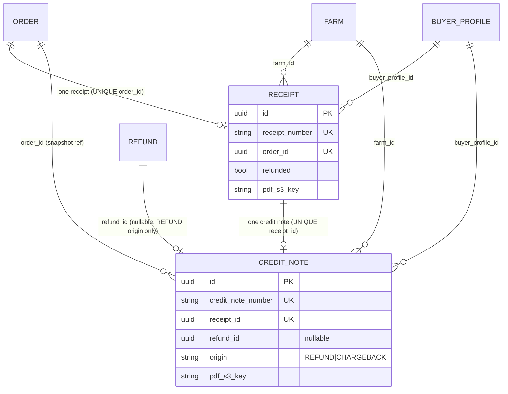
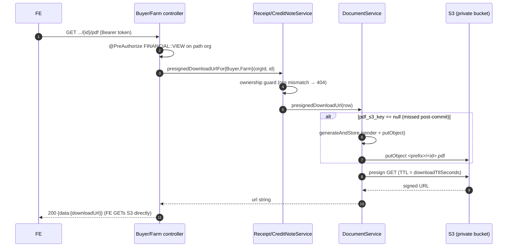

# Receipts & credit notes

CropDoor cuts exactly two immutable financial documents per money lifecycle: the **receipt** — born already-paid the moment a charge settles, one per order, proof that money changed hands — and its counter-document the **credit note** — one per receipt, cut when that payment is reversed (a refund processes, or a chargeback is lost). Because CropDoor runs an [escrow model](core-flows.md) — the buyer pays up front, the platform holds the funds, the farmer is paid out after delivery — money has *already* moved by the time a document exists. So the document is a *receipt* (proof of payment), never an *invoice* (a request for payment). That distinction is load-bearing: there is no ISSUED/OVERDUE/PAID lifecycle, no due date, no "admin records payment" step. The document is born terminal and never voids.

Both documents ride the same machinery end to end: snapshot the order's amounts → idempotently persist a row → emit a dual-sided (farm + buyer) audit → render a branded PDF in an *after-commit* side effect → upload to a private S3 bucket over an isolated credential set → serve per-actor presigned-GET downloads with lazy regeneration. This page covers that shared path. It documents only the **document-side** mechanics — the order, refund, and chargeback flows that *trigger* issuance are covered in [Core flows](core-flows.md).

## Two born-immutable documents

| | Receipt | Credit note |
|---|---|---|
| Meaning | Proof a payment settled | Counter-document: that payment was reversed |
| Cardinality | One per **order** (`UNIQUE order_id`) | One per **receipt** (`UNIQUE receipt_id`) |
| Triggered by | Charge settlement (`settleConfirmedPayment`) | Refund processed **or** chargeback lost |
| Number | `RCP-<orderNumber>` | `CN-<orderNumber>` |
| Service | `ReceiptService` | `CreditNoteService` |
| Table | `receipts` | `credit_notes` |
| Status column | None — born paid, immutable | None — born issued, never voided |
| Origin discriminator | n/a | `origin ∈ {REFUND, CHARGEBACK}` |

Both are **immutable**: no status machine, no "void" transition. A receipt's only post-issue mutation is the denormalized `refunded` flag flipping to `true` when a credit note is later cut against it (`receipt.setRefunded(true)`), plus the lazily-populated `pdf_s3_key`. A credit note never mutates after issue except for `pdf_s3_key`.



## Data model

### Receipts

`model/receipt/Receipt.java` maps the `receipts` table. It extends `BaseEntity` (carrying `created_at` + `updated_at`); `id` is a time-ordered UUID.

| Column | Type | Notes |
|---|---|---|
| `id` | UUID PK | time-ordered |
| `receipt_number` | `VARCHAR(40)` `NOT NULL UNIQUE` | `RCP-<orderNumber>` |
| `order_id` | UUID `NOT NULL UNIQUE` | `@OneToOne(LAZY)`; the one-receipt-per-order guard |
| `farm_id` | UUID `NOT NULL` | `@ManyToOne(LAZY)`; indexed `idx_receipts_farm` |
| `buyer_profile_id` | UUID `NOT NULL` | `@ManyToOne(LAZY)`; indexed `idx_receipts_buyer_profile` |
| `currency` | `VARCHAR(3)` `NOT NULL` | always `"GHS"` |
| `subtotal_amount` | `NUMERIC(12,2)` | `order.getSubtotal()` |
| `tax_amount` | `NUMERIC(12,2)` | sum of the order's `order_taxes` snapshot |
| `commission_amount` | `NUMERIC(12,2)` | sum of the order's `order_commissions` snapshot |
| `total_amount` | `NUMERIC(12,2)` | `order.getTotalAmount()` |
| `issued_at` | `TIMESTAMPTZ NOT NULL` | `Instant.now()` at issue |
| `paid_at` | `TIMESTAMPTZ` | set equal to `issued_at` (born paid) |
| `payment_method` | `VARCHAR(20)` enum | `ReceiptPaymentMethod`; nullable |
| `payment_reference` | `VARCHAR(120)` | `payment.getProviderRef()` |
| `pdf_s3_key` | `VARCHAR(255)` | nullable until the PDF is stored |
| `refunded` | `BOOLEAN NOT NULL` | denormalized; indexed `idx_receipts_refunded`; born `false` |

There is **no status column**. The `refunded` boolean is a denormalized cache of "this receipt's payment was reversed," indexed purely to back the `?refunded=` list filter.

`ReceiptPaymentMethod` (`model/receipt/ReceiptPaymentMethod.java`) has five values — `CARD`, `MOBILE_MONEY`, `BANK_TRANSFER`, `CASH`, `OTHER` — resolved at issue time by `ReceiptService#resolvePaymentMethod`: a pay-on-delivery (POD) order maps to `CASH`; otherwise the gateway's `PaymentChannel` is folded down — `CARD→CARD`, `MOBILE_MONEY→MOBILE_MONEY`, `BANK_TRANSFER→BANK_TRANSFER`, and `USSD`/`QR`/`OTHER`/`null` collapse to `OTHER`.

### Credit notes

`model/creditnote/CreditNote.java` maps the `credit_notes` table. It carries a **snapshot** of the original receipt's amounts so it is self-contained even if the receipt is later touched.

| Column | Type | Notes |
|---|---|---|
| `id` | UUID PK | time-ordered |
| `credit_note_number` | `VARCHAR(40)` `NOT NULL UNIQUE` | `CN-<orderNumber>` |
| `receipt_id` | UUID `NOT NULL UNIQUE` | `@OneToOne(LAZY)`; the one-per-receipt idempotency guard |
| `order_id` | UUID `NOT NULL` | `@ManyToOne(LAZY)` |
| `farm_id` | UUID `NOT NULL` | indexed `idx_credit_notes_farm` |
| `buyer_profile_id` | UUID `NOT NULL` | indexed `idx_credit_notes_buyer_profile` |
| `refund_id` | UUID **nullable** | set on REFUND origin; `null` on CHARGEBACK |
| `origin` | `VARCHAR(20)` enum | `CHECK (origin IN ('REFUND','CHARGEBACK'))` |
| `currency` | `VARCHAR(3)` | copied from the receipt |
| `subtotal_amount` / `commission_amount` / `tax_amount` / `total_amount` | `NUMERIC(12,2)` | copied from the receipt |
| `reason` | `VARCHAR(500)` nullable | refund reason, or `"Chargeback lost (dispute <ref>)"` |
| `issued_at` | `TIMESTAMPTZ NOT NULL` | `Instant.now()` |
| `pdf_s3_key` | `VARCHAR(255)` nullable | populated post-commit |

`CreditNoteOrigin` (`model/creditnote/CreditNoteOrigin.java`) has exactly two values: `REFUND` (admin-initiated, gateway-settled — links a `Refund` row) and `CHARGEBACK` (the card network pulled the funds — `refund_id` stays `null`). The DB `CHECK` constraint mirrors the enum. `refund_id` is **nullable by design**: a chargeback is not a platform-initiated refund, so there is no `Refund` row to point at.

All five parent foreign keys (`receipt_id`, `order_id`, `farm_id`, `buyer_profile_id`, `refund_id`) are `ON DELETE CASCADE` — a credit note is a dependent counter-document that cannot meaningfully outlive any of its parents. Prod never hard-deletes these append-only financial parents; the cascade only changes behavior for data-correction deletes and integration-test teardown. The exhaustive migration history (the invoice→receipt rename and the credit-note tables) lives in [Data model & configuration](data-model-and-configuration.md).

## Receipt issuance

Receipt issuance is driven by `PaymentSettlementServiceImpl#settleConfirmedPayment` — the same method that flips the payment to `COMPLETED`, records the gateway fee, and posts the charge-succeeded entry to [the ledger](ledger.md). Right after the payment is saved it calls `receiptService.issueForOrder(order, payment)`.

`ReceiptService#issueForOrder` (`service/receipt/ReceiptService.java`):

1. **Idempotency pre-check.** If `receiptRepository.existsByOrder_Id(order.getId())`, load and return the existing receipt's response — **no** second save, audit, or document trigger.
2. **Compose the snapshot.** Build the `Receipt` with `receiptNumber = "RCP-" + order.getOrderNumber()`, `currency = "GHS"`, `subtotalAmount = order.getSubtotal()`, `taxAmount` (sum over `OrderTaxRepository#findByOrderId`), `commissionAmount` (sum over `OrderCommissionRepository#findByOrderId`), `totalAmount = order.getTotalAmount()`, `paymentMethod = resolvePaymentMethod(order, payment)`, `paymentReference = payment.getProviderRef()`, and `issuedAt = paidAt = Instant.now()`.
3. **Persist** via `receiptRepository.save(receipt)`.
4. **Emit the dual-sided audit** (see [below](#dual-sided-audit)).
5. **Schedule the PDF** for after-commit generation.

The same `issueForOrder` runs for both ONLINE (escrow) and POD orders — POD simply resolves `payment_method = CASH`. The receipt is the proof-of-payment artifact regardless of channel.

```mermaid
sequenceDiagram
    autonumber
    participant Settle as PaymentSettlementServiceImpl
    participant ReceiptService
    participant Repo as ReceiptRepository
    participant Audit as AuditEmitter
    participant Sync as TransactionSynchronization
    participant Doc as ReceiptDocumentService
    participant S3 as S3 (private receipts bucket)

    Settle->>ReceiptService: issueForOrder(order, payment)
    ReceiptService->>Repo: existsByOrder_Id?
    alt already issued
        Repo-->>ReceiptService: true
        ReceiptService-->>Settle: existing ReceiptResponse (no side effects)
    else first issue
        ReceiptService->>Repo: save(receipt RCP-<orderNumber>)
        ReceiptService->>Audit: receiptIssued(forFarm) + receiptIssued(forBuyer)
        ReceiptService->>Sync: registerSynchronization(afterCommit)
        ReceiptService-->>Settle: ReceiptResponse
        Note over Settle,Sync: settlement transaction commits
        Sync->>Doc: afterCommit → generateAndStore(receiptId)
        Doc->>Doc: renderPdf (Thymeleaf XML → openhtmltopdf)
        Doc->>S3: putObject receipts/<id>.pdf
        Doc->>Repo: receipt.pdf_s3_key = key; save
    end
```

## Credit note issuance

A credit note is cut on **either** of the two payment-reversal paths. Both first flip the receipt's `refunded` flag, then call `CreditNoteService`.

**Refund processed** — `RefundServiceImpl#markProcessed` (the gateway-confirmed `refund.processed` arm) loads the receipt by order, posts the refund ledger entry, sets `receipt.setRefunded(true)`, marks the `Refund` `PROCESSED` and the `Payment` `REFUNDED`, then calls `creditNoteService.issueForRefund(refund, receipt)`. This issues with `origin = REFUND`, the settled refund linked, and `reason = refund.getReason()`. Only ONLINE (escrow) payments are refundable, and the refund must reach `refund.processed`.

**Chargeback lost** — `ChargebackServiceImpl` (the dispute-lost arm) posts the reversal ledger entry, marks the payment `REVERSED`, then if a receipt exists sets `receipt.setRefunded(true)` and calls `creditNoteService.issueForChargeback(order, receipt, disputeReference)`. This issues with `origin = CHARGEBACK`, no linked refund, and `reason = "Chargeback lost (dispute " + disputeReference + ")"`. If the order has no receipt the service logs a warning and skips both the flag and the credit note.

Both delegate to the private `CreditNoteService#issue(receipt, origin, refund, reason)`, which snapshots the receipt's amounts into a new `CreditNote` numbered `CN-<orderNumber>`, persists it, emits the dual-sided audit, and schedules the PDF after-commit — exactly mirroring receipt issuance.

!!! note "Two unrelated 'dispute' concepts"
    The credit note's CHARGEBACK path is driven by a live **Paystack chargeback** (a card-network dispute the `PLATFORM::DISPUTE` endpoints operate on). It is **not** the unwired in-app `model/dispute/*` entity — a planned buyer/farmer dispute feature that is a [roadmap surface](../architecture/roadmap.md).

## Idempotency & concurrency

Both documents are exactly-once per parent, but they guard it differently because the trigger sources differ.

**Receipt** — `existsByOrder_Id` pre-check + plain `save`. Settlement is single-sourced per payment, so the pre-check carries the common case and the `UNIQUE order_id` constraint is the DB backstop.

**Credit note** — a `refund.processed` webhook can be **replayed**, and the refund reconciler can race the webhook, so two writers may target the same receipt concurrently. `CreditNoteService#issue` therefore layers a **race guard** on top of the pre-check: an `existsByReceipt_Id` early-return, then a `saveAndFlush` wrapped in a `try`/`catch` for `DataIntegrityViolationException`.

The `existsByReceipt_Id` pre-check skips the common already-issued case cheaply; the `saveAndFlush` (not a deferred `save`) forces the `UNIQUE receipt_id` constraint to fire **inside** the `try`, so the writer that loses the race catches the `DataIntegrityViolationException`, logs an info line ("Credit note for receipt … already issued concurrently — skipping"), and returns — emitting **no** audit and triggering **no** duplicate document. The unique `receipt_id` index is the final arbiter; the application-level check is just an optimization. These are DB-constraint guards rather than Redis idempotency keys; the broader idempotency-key catalog lives in [Resiliency, audit & ops](resiliency-audit-and-ops.md).

## Post-commit PDF generation

PDF rendering and the S3 upload are deliberately kept **out of the issuing transaction's critical path** and run only **after it durably commits**. The pattern is identical in `ReceiptService` and `CreditNoteService`: when a transaction is active (`TransactionSynchronizationManager.isSynchronizationActive()`), the document service registers a `TransactionSynchronization` whose `afterCommit` callback invokes `safelyGenerateDocument(id)`; when no transaction is active — e.g. a pure unit test — it falls through and calls `safelyGenerateDocument(id)` inline.

Why after-commit: the issuing transaction *is* the order-delivery / refund-settlement / chargeback transaction. Running the S3 PUT inside it would (a) lengthen a financial transaction with a network round-trip and (b) risk a stored PDF for a row that later rolls back. Deferring to `afterCommit` means the PDF is generated only for a row that is genuinely durable. This is the document flow's instance of the AFTER_COMMIT side-effect seam covered in [Gateway & webhooks](gateway-and-webhooks.md).

`safelyGenerateDocument` is **best-effort**: the row is already committed, so a PDF/S3 failure must never disrupt order delivery or the reversal flow. It calls `generateAndStore(id)` inside a `try`/`catch (RuntimeException)`; any `RuntimeException` is logged at `error` (with the row id and the exception message) and **swallowed**, never rethrown.

The **self-heal** is lazy regeneration on first download (see [S3 storage](#s3-storage)): if `pdf_s3_key` is still `null` when someone requests the PDF, the document service renders and stores it on the spot. So a swallowed post-commit failure costs nothing more than a slightly slower first download.

## PDF rendering pipeline

`ReceiptPdfRenderer` and `CreditNotePdfRenderer` are near-identical components that turn an entity + its line items + its tax lines into PDF bytes.

**Dedicated XML-mode Thymeleaf engine.** `ReceiptPdfTemplateConfig#receiptPdfTemplateEngine` builds a `SpringTemplateEngine` over a `ClassLoaderTemplateResolver` with prefix `templates/pdf/`, suffix `.html`, **`TemplateMode.XML`**, UTF-8, cacheable. XML mode (not HTML5) is load-bearing: openhtmltopdf parses with a strict XML parser and rejects HTML5-style unclosed void elements, so the templates must be well-formed XHTML. Both renderers inject this engine by `@Qualifier("receiptPdfTemplateEngine")` — the email engine is `@Primary`, so an unqualified Lombok constructor would resolve the wrong bean (hence the hand-written constructor).

**Context population.** Money and dates are **pre-formatted in the renderer** so the template stays purely presentational and `th:text` auto-escapes all user-supplied text. Money is `currency + " " + String.format(Locale.US, "%,.2f", value)` (a `null` renders as `"—"`); dates are `dd MMM yyyy` in UTC; quantities use `stripTrailingZeros().toPlainString()`. The receipt context carries `receiptNumber`, `paidOn`, `paymentMethodLabel`, `paymentReference`, `orderNumber`, `farmName`, `buyerName`, line-item rows, tax-line rows, subtotal, total, support line, and the QR data URI. The credit-note context swaps the payment fields for `issuedOn`, the referenced `receiptNumber`, and the `reason`.

`paymentMethodLabel` maps the enum to print labels: `CARD→"Card"`, `MOBILE_MONEY→"Mobile money"`, `BANK_TRANSFER→"Bank transfer"`, `CASH→"Cash on delivery"`, `OTHER→"Online"`.

**Brand fonts.** Three Outfit weights are embedded from `/fonts/` via `PdfRendererBuilder#useFont`: `Outfit-Regular.ttf` (400), `Outfit-Bold.ttf` (700), `Outfit-ExtraBold.ttf` (800).

**QR code.** A zxing `QRCodeWriter` encodes a `240×240` PNG (margin 1), Base64-inlined as a `data:image/png;base64,...` URI. The receipt QR points at `${app.frontend.url}/receipts/<receiptId>` (default `https://cropdoor.com`); the credit-note QR at `.../credit-notes/<creditNoteId>`.

**Rasterization.** `PdfRendererBuilder` with `useFastMode()` runs the HTML through openhtmltopdf into a `ByteArrayOutputStream`; an `IOException` becomes an `UncheckedIOException` (caught and swallowed by the best-effort post-commit caller). The templates are `templates/pdf/receipt.html` and `templates/pdf/credit-note.html` (A4, full-bleed brand band `#1B3B2E` / accent `#C4ED3B`).

`ReceiptLineItemBuilder` is the **single source** of the printable breakdown, so the detail response and the PDF agree byte-for-byte: `lineItems(order)` maps each `OrderItem` to `(produceName, quantity, unitPrice, subtotal)`; `taxLines(order)` maps the order's `OrderTax` snapshot to labelled rows ordered `NHIL` → `GETFund` → `COVID Levy`, each rendered as `"<name> (<rate>%)"`, e.g. `"NHIL (2.5%)"`.

## S3 storage

Receipts and credit notes share one private bucket and one **isolated credential set**, distinct from the public listings credentials.

**`ReceiptStorageProperties`** (`@ConfigurationProperties(prefix = "cropdoor.receipts")`) binds `bucket` and `downloadTtlSeconds`. It **fails fast** on a blank bucket (`CROPDOOR_RECEIPTS_BUCKET` is required) and clamps a non-positive TTL to a `300`-second default. The credit-note document service reuses this same properties bean.

**Isolated credentials.** `S3Config#receiptObjectStore` wires an `S3ObjectStore` over `receiptsS3Client` + `receiptsS3Presigner`, both authenticated from `cropdoor.receipts.access-key-id` / `secret-access-key` / `region` (region defaults to `cropdoor.s3.region`). When the static keys are blank the SDK falls back to the AWS default credential chain (the IAM-role path in prod). This mirrors the farm-certifications setup — the receipts bucket never shares the listings credential set. Both document services inject the store via `@Qualifier("receiptObjectStore")`.

**Key schemes** — flat, deterministic, derivable from the row id:

| Document | Object key |
|---|---|
| Receipt | `receipts/<receiptId>.pdf` |
| Credit note | `credit-notes/<creditNoteId>.pdf` |

**Generate & store** (`generateAndStore`): load the row, render the PDF bytes, `objectStore.putObject(bucket, key, pdf, "application/pdf")`, then set `pdf_s3_key` and save.

**Download = presigned GET only, with lazy regen** (`presignedDownloadUrl`): if the row's `pdf_s3_key` is still `null`, it calls `generateAndStore(id)` and reloads the row, then asks `objectStore.presignDownload(bucket, pdfS3Key, Duration.ofSeconds(downloadTtlSeconds))` and returns the resulting `downloadUrl` as a string.

These objects are **never** read via a public CDN URL — `S3ObjectStore#composeReadUrl` is reserved for public listings; sensitive documents go exclusively through the short-lived presigned GET.



## Access model & API

Both documents are **read-only over HTTP** — there are no create/update/delete endpoints, since issuance is internal to the payment flows. There are **16 read endpoints**: eight per document type (buyer `list`/`detail`/`pdf`, farm `list`/`detail`/`pdf`, admin `list`/`detail`). Three actors can read a document: the **buyer** who placed the order, the order's **farm**, and **platform admins**.

| Method & path | Permission gate | Notes |
|---|---|---|
| `GET /v1/buyers/{buyerProfileId}/receipts` | `BUYER::FINANCIAL::VIEW` via `belongsToBuyerProfileWith` | `?refunded=` filter; size 20, sort `issuedAt` DESC |
| `GET /v1/buyers/{buyerProfileId}/receipts/{receiptId}` | `BUYER::FINANCIAL::VIEW` | + ownership guard → 404 |
| `GET /v1/buyers/{buyerProfileId}/receipts/{receiptId}/pdf` | `BUYER::FINANCIAL::VIEW` | + ownership guard; mints presigned URL |
| `GET /v1/farms/{farmId}/receipts` | `FARM::FINANCIAL::VIEW` via `belongsToFarmWith` | `?refunded=` filter |
| `GET /v1/farms/{farmId}/receipts/{receiptId}` | `FARM::FINANCIAL::VIEW` | + ownership guard → 404 |
| `GET /v1/farms/{farmId}/receipts/{receiptId}/pdf` | `FARM::FINANCIAL::VIEW` | + ownership guard |
| `GET /v1/admin/receipts` | `PLATFORM::FINANCIAL::VIEW` (`hasAuthority`) | `?refunded=`; manual `PageRequest`, size clamped to 100 |
| `GET /v1/admin/receipts/{receiptId}` | `PLATFORM::FINANCIAL::VIEW` | detail; no ownership constraint (admins span all orgs); 404 if missing |
| `GET /v1/buyers/{buyerProfileId}/credit-notes` | `BUYER::FINANCIAL::VIEW` | size 20, sort `issuedAt` DESC (no `?refunded=`) |
| `GET /v1/buyers/{buyerProfileId}/credit-notes/{creditNoteId}` | `BUYER::FINANCIAL::VIEW` | + ownership guard → 404 |
| `GET /v1/buyers/{buyerProfileId}/credit-notes/{creditNoteId}/pdf` | `BUYER::FINANCIAL::VIEW` | + ownership guard |
| `GET /v1/farms/{farmId}/credit-notes` | `FARM::FINANCIAL::VIEW` | |
| `GET /v1/farms/{farmId}/credit-notes/{creditNoteId}` | `FARM::FINANCIAL::VIEW` | + ownership guard → 404 |
| `GET /v1/farms/{farmId}/credit-notes/{creditNoteId}/pdf` | `FARM::FINANCIAL::VIEW` | + ownership guard |
| `GET /v1/admin/credit-notes` | `PLATFORM::FINANCIAL::VIEW` | manual `PageRequest`, size clamped to 100 |
| `GET /v1/admin/credit-notes/{creditNoteId}` | `PLATFORM::FINANCIAL::VIEW` | detail; no ownership constraint; 404 if missing |

**Two-layer authorization.** Org-scoped routes carry `@PreAuthorize("@permissionResolutionService.belongsTo{Buyer,Farm}With(..., '<perm>')")`, binding the caller's membership to the **path** org. The single-document and PDF routes then pass through the **service ownership guard**: `loadReceiptOwnedByBuyer` / `...ByFarm` re-loads the row and throws `ReceiptNotFoundException` (404) if its `buyer_profile_id` / `farm_id` doesn't match the path org — so a foreign id resolves to **404, not a leaked document or PDF**. The guard runs *before* the presigned URL is minted. Admin detail reads (`getForAdmin`) carry no ownership constraint — admins span all orgs — and 404 only on a genuinely missing id. The `PLATFORM::FINANCIAL::VIEW` gate is shared with ledger inspection and the reconciliation report; see [Resiliency, audit & ops](resiliency-audit-and-ops.md).

**`?refunded=` filter** (receipts only). A `Boolean refunded` request param routes the buyer/farm/admin list to the `...AndRefunded` / `findByRefunded` repository finder when present, or the unfiltered finder when omitted. Credit notes have no such filter — every credit note is, by definition, a reversal.

**Pagination.** Buyer/farm lists use `@PageableDefault(size = 20, sort = "issuedAt", direction = DESC)`. The admin lists build the `PageRequest` manually with `page`/`size` params, `Math.min(size, 100)` clamping (`MAX_PAGE_SIZE = 100`), and a fixed `issuedAt` DESC sort.

## Response shapes

All responses are wrapped in `ApiResponse<T>`.

**Receipt.** `ReceiptSummary` (list rows) carries `id`, `receiptNumber`, `currency`, `totalAmount`, `issuedAt`, `paidAt`, `refunded`, and a `settlement` label. `ReceiptResponse` (detail) adds `orderId`, `orderNumber`, the internal breakdown (`subtotalAmount`, `taxAmount`, `commissionAmount`), the `parties` (`CounterpartParties{farmName, buyerBusinessName}`), `lineItems` (`ReceiptLineItem{description, quantity, unitPrice, lineTotal}`), `taxLines` (`ReceiptTaxLine{label, amount}`), and `pdfAvailable`.

**Settlement label.** `ReceiptMapper#settlementLabel` is the one piece of presentation logic: it formats the denormalized `refunded` boolean as `"REFUNDED"` when `true`, else `"PAID"` — surfaced on both `ReceiptSummary` and `ReceiptResponse`.

**Credit note.** `CreditNoteSummary` carries `id`, `creditNoteNumber`, `origin` (the enum name), `currency`, `totalAmount`, `issuedAt`. `CreditNoteResponse` adds `receiptNumber` (the original receipt it reverses), `orderId`/`orderNumber`, the breakdown, `reason`, `parties`, `lineItems`, `taxLines` (reusing the receipt DTOs), and `pdfAvailable`.

**`pdfAvailable`.** Computed in the service as `row.getPdfS3Key() != null` and passed into the mapper — it tells the FE whether the `/pdf` endpoint will return immediately or trigger a lazy regen.

**PDF download response.** `ReceiptPdfDownloadResponse` / `CreditNotePdfDownloadResponse` are thin records wrapping a single `downloadUrl` string (the presigned GET URL).

Both mappers are MapStruct `@Mapper(componentModel = "spring")` interfaces, logic-free apart from `settlementLabel`; the line/tax/`pdfAvailable` inputs are supplied by the service, and the order reference + parties resolve via navigation-path `@Mapping` sources.

## Dual-sided audit

Issuing either document emits the audit event into **both** the farm and buyer org feeds, so the same fact surfaces on each counterparty's per-org audit feed. The emitter publishes **twice** with different attribution contexts — once with a `ReceiptContext.forFarm(...)` and once with a `ReceiptContext.forBuyer(...)` (and the credit-note equivalents).

`forFarm` sets `ownerType = FARM, ownerId = farmId`; `forBuyer` sets `ownerType = BUYER, ownerId = buyerProfileId`. The principal is `null` (system-triggered). The actions are `AuditAction.RECEIPT_ISSUED` and `AuditAction.CREDIT_NOTE_ISSUED`.

Every farm/buyer-scoped emission **must** carry both `KEY_OWNER_TYPE` and `KEY_OWNER_ID` in its details map — ArchUnit-pinned, because those keys drive the per-org feed filter. `AuditEmitterImpl#receiptDetails` puts `ownerType`, `ownerId`, `receiptId`, `receiptNumber`, `farmId`, `buyerProfileId`, `totalAmount`; `creditNoteDetails` shares only the `ownerType`/`ownerId`/`farmId`/`buyerProfileId`/`totalAmount` skeleton and **replaces** the receipt id/number with `creditNoteId`, `creditNoteNumber`, and `creditNoteOrigin` — a credit-note detail map carries **no** `receiptId`/`receiptNumber`. The `(ownerType, ownerId)` pair drives attribution while `farmId`/`buyerProfileId` always identify both counterparties. The audit subsystem itself is canonical in [Audit logging](../audit/index.md).

## Receipt PDF reused as dispute evidence

When CropDoor defends a Paystack chargeback, the receipt PDF is uploaded to Paystack as proof of a delivered, paid order. `DisputeDefenseTransactionalSteps` re-renders it **storelessly** — it does not depend on the stored S3 object. It loads the receipt via `receiptRepository.findByOrder_Id(order.getId())` (a `null` result means there is no evidence to attach), then calls `ReceiptDocumentService#renderPdf(receipt)` directly to get the PDF bytes.

`renderPdf` is the **store-free** half of the document service: it loads the order's line items + tax lines and renders bytes, with no S3 read or `pdf_s3_key` dependency. Because the renderer is deterministic — amounts and parties are snapshotted on the receipt, formatting is fixed — the evidence PDF is byte-reproducible from the row at any time, even if the post-commit upload had been swallowed. The dispute-defense flow is documented in [Core flows](core-flows.md).

## Errors & the open-in-view hazard

| Code | HTTP | Message |
|---|---|---|
| `RECEIPT_NOT_FOUND` | 404 | `"Receipt not found."` |
| `CREDIT_NOTE_NOT_FOUND` | 404 | `"Credit note not found."` |

`ReceiptNotFoundException` / `CreditNoteNotFoundException` extend `DomainException`, carry these `ErrorCode`s, and route through the single generic `handleDomain` handler. The **ownership guard** deliberately throws the same 404 on an org mismatch as on a genuinely missing id — so a caller cannot distinguish "doesn't exist" from "isn't yours," preventing id-enumeration leakage across orgs. FE branches on `response.errorCode`, never the message text.

!!! warning "`open-in-view=false` hazard"
    `spring.jpa.open-in-view=false` is set globally, so every lazy association must be touched **inside** a transaction. The receipt/credit-note `toResponse` walks several lazy paths — `receipt.getOrder().getItems()`, `getFarm()`, `getBuyerProfile()`, and the `order_taxes` query inside `ReceiptLineItemBuilder`. The read endpoints stay safe because the service methods are themselves transactional (`@Transactional(readOnly = true)` for detail reads, `@Transactional` for the presigned-URL methods, which may lazily regenerate the PDF). Issuing a row outside a transaction would also bypass the after-commit deferral and render the PDF inline. The canonical treatment of `open-in-view=false` and the materialize-then-HTTP patterns lives in [Resiliency, audit & ops](resiliency-audit-and-ops.md).
