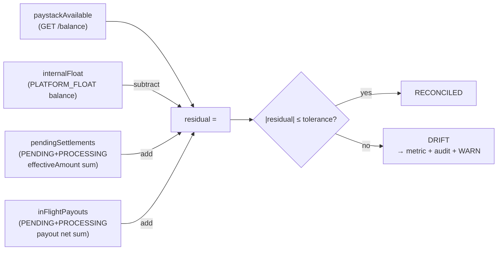
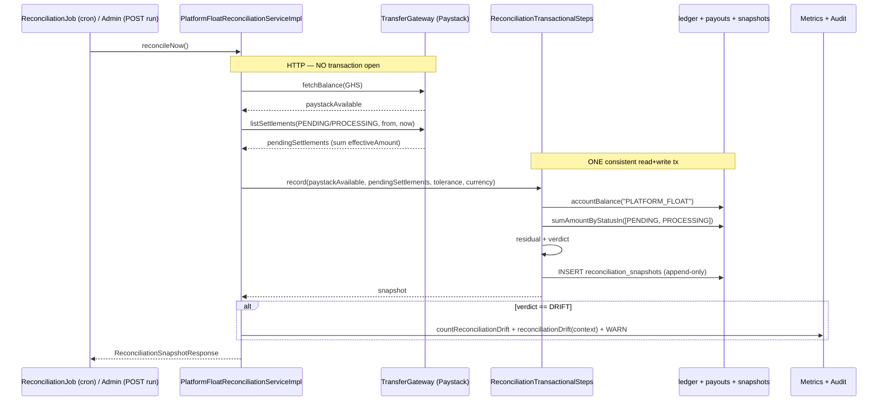
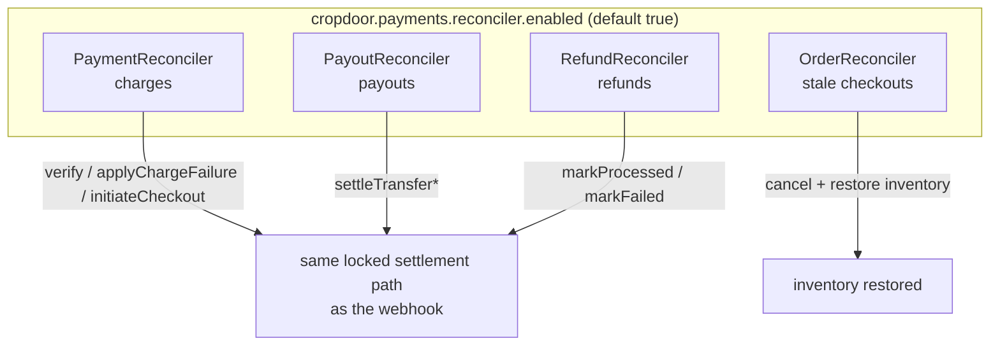

# Reconciliation & reconcilers

Webhooks are the fast path; reconciliation is the durable backstop. CropDoor's payment subsystem has **two independent self-checking layers** that share a name but answer different questions, and they are wired separately — different config prefixes, different enable defaults, different schedule mechanisms.

- The **float reconciliation report** asks: *does our book agree with Paystack's money position right now?* It is an aggregate sweep that compares the `PLATFORM_FLOAT` ledger balance against Paystack's reported balance, records an append-only snapshot, and alerts on drift. It is **alert-only** — it never self-heals and never gates payouts.
- The **four webhook-miss reconcilers** ask: *did any single charge, payout, refund, or checkout get stuck because its terminal webhook was lost?* Each is a per-row backstop that re-polls the provider and re-drives the stuck row to its terminal state through the **same idempotent, locked settlement path the live webhook uses** — so a dropped HTTP callback can never strand money or inventory forever.

This page specifies both layers: the residual identity exactly, the T+1 settlement lag both account for, the HTTP-outside-transaction split they rely on, the grace windows, and the no-double-settle invariant.

!!! note "One-character config trap"
    `cropdoor.payments.reconcili**ation**` is the float sweep. `cropdoor.payments.reconcil**er**` is the four backstops. They are unrelated switches. Read carefully.

For the mental model these sit inside — *initiate synchronously, settle asynchronously, converge idempotently* — see the [payments overview](index.md). The ledger they read is in [the ledger](ledger.md); the live webhook path they mirror is in [gateway & webhooks](gateway-and-webhooks.md).

---

## The two layers at a glance

|  | Float reconciliation | Webhook-miss reconcilers |
|---|---|---|
| **Question answered** | Does our book agree with Paystack right now? | Did any single row get stuck on a lost webhook? |
| **Granularity** | Aggregate — one residual across all money | Per-row — one stuck entity at a time |
| **Output** | An append-only `reconciliation_snapshots` row + a DRIFT alert | A state transition on the stuck row (settled / failed / cancelled) |
| **Self-healing?** | **No** — alert-only; a human investigates DRIFT | **Yes** — re-drives the row to terminal |
| **Config prefix** | `cropdoor.payments.reconciliation` | `cropdoor.payments.reconciler` |
| **Enabled by default?** | **No** (`enabled=false`, opt in per env) | **Yes** (`enabled=true`; the test profile disables) |
| **Schedule mechanism** | `@Scheduled(cron=…)` on `ReconciliationJob` | `@Scheduled(fixedDelay=…)` on each reconciler |
| **Primary class** | `PlatformFloatReconciliationServiceImpl` | `PaymentReconciler`, `PayoutReconciler`, `RefundReconciler`, `OrderReconciler` |

Both layers share one structural rule that makes them safe: **every gateway HTTP call happens outside any database transaction.** Holding a JDBC connection open across a network round-trip to Paystack would pin the connection pool under provider latency, and the app runs `open-in-view=false` so lazy associations cannot be traversed outside a transaction anyway. Each layer therefore splits "gather over HTTP" from "read/write the DB in a transaction." The float sweep does it with a two-bean split; the backstops do it with a "load rows (no tx) → delegate per row to a `@Transactional` method that does the HTTP" shape. The canonical treatment of these patterns lives in [resiliency, audit & ops](resiliency-audit-and-ops.md).

---

## The float reconciliation report

### The residual identity

The float reconciliation computes a single signed **residual** in `ReconciliationTransactionalSteps#record` and compares its magnitude to a tolerance. `residual` subtracts `internalFloat` from `paystackAvailable` and adds back `pendingSettlements` and `inFlightPayouts`; the verdict is `RECONCILED` when `residual.abs()` is within tolerance and `DRIFT` otherwise:

> **residual = paystackAvailable − internalFloat + pendingSettlements + inFlightPayouts**
> **verdict = RECONCILED iff |residual| ≤ tolerance, else DRIFT**

The four figures:

| Figure | Source | What it represents |
|---|---|---|
| `paystackAvailable` | `transferGateway.fetchBalance(currency).amount()` — Paystack `GET /balance` | Money **already settled** into our Paystack available balance, spendable for payouts now. |
| `internalFloat` | `ledgerService.accountBalance("PLATFORM_FLOAT")` | Our book's claim of all money we hold (escrowed buyer funds + retained commission/fees), per the double-entry [ledger](ledger.md). |
| `pendingSettlements` | sum of `effectiveAmount` over Paystack settlements in `PENDING` + `PROCESSING` (`GET /settlement`) | Money charged but **not yet settled** into the available balance — the T+1 lag. |
| `inFlightPayouts` | `payoutRepository.sumAmountByStatusIn([PENDING, PROCESSING])` | Payout net our book has decided to pay out but has not yet credited out of `PLATFORM_FLOAT` (transfer initiated/queued, no terminal webhook). |

**Why this shape.** `internalFloat` is what our book *thinks* it holds. Paystack's money is split across two buckets — already-settled (`paystackAvailable`) and not-yet-settled (`pendingSettlements`) — so `paystackAvailable + pendingSettlements` is Paystack's view of "money that is ours but not yet paid out." `inFlightPayouts` is added back because those payouts are still on our book as a `PLATFORM_FLOAT` balance (we have not posted the disbursement out yet) while Paystack may have already moved or queued the transfer; it corrects the timing skew between "our book hasn't credited the payout out" and "Paystack has it in flight." When everything is in sync the two sides cancel and the residual sits inside tolerance.

The residual is **signed and may be negative** (`ReconciliationSnapshotResponse#residual` documents this); the verdict uses `residual.abs()`. Tolerance exists because settlement timing, rounding to 2dp, and the narrow window between the HTTP gather and the DB read can produce sub-cedi noise that is not a real discrepancy. Default tolerance is **GHS 1.00** (`cropdoor.payments.reconciliation.tolerance`).

#### Worked examples (tolerance = GHS 1.00)

| paystackAvailable | internalFloat | pendingSettlements | inFlightPayouts | residual | verdict |
|---:|---:|---:|---:|---:|---|
| 8 000.00 | 10 000.00 | 2 000.00 | 0.00 | **0.00** | RECONCILED |
| 8 000.00 | 10 000.00 | 1 999.50 | 0.00 | **−0.50** | RECONCILED (\|−0.50\| ≤ 1.00) |
| 8 000.00 | 10 000.00 | 2 000.00 | 250.00 | **+250.00** | DRIFT |
| 5 000.00 | 10 000.00 | 2 000.00 | 0.00 | **−3 000.00** | DRIFT |

### The two-bean split

The float sweep is split across two beans precisely so the HTTP gather stays outside the transaction:

- **`PlatformFloatReconciliationServiceImpl`** (`@Service`) — gathers the Paystack figures over HTTP (`fetchBalance`, `listSettlements`) with **no** active transaction, then alerts on drift.
- **`ReconciliationTransactionalSteps`** (`@Component`) — the `@Transactional` half: in one consistent read transaction it reads `PLATFORM_FLOAT` and the in-flight payout net, computes the residual against the already-gathered Paystack figures, and saves the snapshot.

They are **separate beans** so the `@Transactional` proxy actually applies when the service calls `transactionalSteps.record(...)` — a self-call would bypass the Spring AOP proxy (the same proxy concern the order reconciler solves with a self-provider, below).

`reconcileNow()` step by step:

1. Resolve the `currency` from `properties.getCurrency()` (GHS) and compute the settlement query window from `Instant.now(clock) − settlementLookback` (now − 14 days) to `now`.
2. Gather the Paystack figures **over HTTP with no transaction open**: `transferGateway.fetchBalance(currency).amount()` → `paystackAvailable`, and `sumPendingSettlements(from, now)` (the `PENDING` + `PROCESSING` settlement sum) → `pendingSettlements`.
3. Call `transactionalSteps.record(paystackAvailable, pendingSettlements, tolerance, currency)` — **one DB transaction** that reads the book, computes the residual, and saves the snapshot.
4. If the saved snapshot's verdict is `DRIFT`, fire the three alert channels (`metricsService.countReconciliationDrift(currency)`, a `log.warn`, and `auditEmitter.reconciliationDrift(...)`), then return `mapper.toResponse(snapshot)`.

**Failure handling.** `ReconciliationJob.scheduledReconcile()` wraps the call in `try { … } catch (RuntimeException ex) { log.warn(...) }` — a failed gather (e.g. Paystack unavailable) is logged and swallowed so the scheduler keeps ticking, and **no snapshot is recorded for a failed run**. The next tick retries. The on-demand admin run does *not* swallow — a gateway failure surfaces as the standard gateway error envelope to the admin caller.

### T+1 settlement lag & `pendingSettlements`

When a buyer pays, Paystack does not move that money into our *available* balance immediately. It batches charges into **settlements** that land roughly a business day later (T+1). Between the charge succeeding and the settlement landing, the money is real and ours but is **not** in `paystackAvailable` — it sits in a `PENDING` or `PROCESSING` settlement batch. Reconciliation must add that not-yet-settled money back in, or every run during business hours would look like a large negative drift. The same T+1 lag is why payouts wait for a [clearance window](core-flows.md) before disbursing.

`sumPendingSettlements` iterates the two not-yet-final statuses (`PENDING` and `PROCESSING`), calls `transferGateway.listSettlements(status, from, to)` for each, and sums the **effective** amount (`settlement.effectiveAmount().amount()`) of every batch:

- **Only `PENDING` + `PROCESSING`.** `SettlementStatus` also has `SUCCESS`, but a `SUCCESS` settlement has *already* landed in `paystackAvailable` — counting it would double-count. Only the in-flight batches are summed.
- **`effectiveAmount`, not gross.** `SettlementSummary.effectiveAmount` is the net that lands in the available balance (gross minus the settlement fee) — exactly what `paystackAvailable` will increase by when the batch settles. Summing gross would over-state the incoming money by the settlement fee.
- **`settlementLookback` bounds the query window.** `from = now − settlementLookback` (default **P14D**, 14 days). Settlements older than the lookback are assumed already settled (so already in `paystackAvailable`); 14 days is comfortably longer than the T+1 cycle. This is a *query window*, not a grace window.

`PaystackTransferGateway#listSettlements` walks Paystack's paginated `GET /settlement` and is written to **terminate cleanly** even when the response metadata is missing — so the gather can never spin forever. The loop stops on any of: an empty/null `data` array, or `page >= pageCount`. The defensive bit is `pageCount` defaulting to the *current* page when `meta`/`pageCount` is absent — that forces `page >= pageCount` true on the next check, so a malformed response ends the loop after the current page rather than looping indefinitely. (`SettlementStatus.wireValue()` is the lowercase token Paystack expects, e.g. `"pending"`.)

### Snapshots: append-only

Each run records the money position at that instant in `reconciliation_snapshots` (migration `V81__create_reconciliation_snapshots.sql`). The table is **append-only** — there is no update or delete path; the entity has no mutating mapper, only inserts via `snapshotRepository.save(...)`. The full schema lives in [data model & configuration](data-model-and-configuration.md); the load-bearing columns:

| Column | Type | Notes |
|---|---|---|
| `id` | `UUID` | `@UuidGenerator(style = TIME)` — time-ordered UUID. |
| `created_at` | `TIMESTAMPTZ` | Snapshot instant; the mapper maps it to the response `timestamp`. Indexed `DESC`. |
| `currency` | `VARCHAR(3)` | Single currency, default `GHS`. |
| `internal_float`, `paystack_available`, `pending_settlements`, `in_flight_payouts`, `residual`, `tolerance` | `NUMERIC(19,2)` | Pesewa precision (2dp on cedis). |
| `verdict` | `VARCHAR(12)` | `@Enumerated(STRING)` — stores `RECONCILED` / `DRIFT`. |

The `created_at DESC` index backs both read paths — `findTopByOrderByCreatedAtDesc()` (latest) and `findAllByOrderByCreatedAtDesc(pageable)` (history) — so both serve from the index without a sort step. Append-only + indexed-by-time gives an auditable history: every run's full input figures are retained, so a DRIFT can be investigated against the exact numbers that triggered it. The snapshot is saved **regardless of verdict** (inside the transactional `record`); alerting is layered on top, after the save, only for DRIFT.

### DRIFT: alert-only, never self-healing

When a run's verdict is `DRIFT`, the service fires three alert channels and **does nothing else** — it does not attempt to "fix" the book, because a real drift means our ledger and Paystack genuinely disagree and a human must determine which is right. **Drift never gates payouts.**

1. **Metric.** `metricsService.countReconciliationDrift(currency)` increments the `cropdoor.reconciliation.drift` meter → Prometheus `cropdoor_reconciliation_drift_total{currency}`. Ops alerts on any increase.
2. **Audit.** `auditEmitter.reconciliationDrift(new ReconciliationContext(...))` emits the `RECONCILIATION_DRIFT` action. It is a **system emission** (`publish(null, …)` — no principal actor) whose details map carries all seven figures: `KEY_CURRENCY`, `KEY_INTERNAL_FLOAT`, `KEY_PAYSTACK_AVAILABLE`, `KEY_PENDING_SETTLEMENTS`, `KEY_IN_FLIGHT_PAYOUTS`, `KEY_RESIDUAL`, `KEY_TOLERANCE`. See the [audit subsystem](../audit/index.md).
3. **Log.** A `log.warn` line with the residual, currency, tolerance, and all four input figures.

A `RECONCILED` run records its snapshot silently — no metric, no audit, no warn.

### Admin endpoints

`AdminLedgerController` (`/v1/admin/ledger`) exposes the reconciliation views. **All three reconciliation endpoints — including the on-demand run — are gated on `PLATFORM::FINANCIAL::VIEW`** (no separate write/run permission). The run is intentionally readable-by-anyone-who-can-view: it records a snapshot but performs **no money movement**, so it is treated as a read-with-a-side-record rather than a privileged action.

| Method | Path | Permission | Behavior |
|---|---|---|---|
| `GET` | `/v1/admin/ledger/reconciliation` | `PLATFORM::FINANCIAL::VIEW` | Latest snapshot, or `data: null` when none recorded yet (`latest().orElse(null)`). |
| `GET` | `/v1/admin/ledger/reconciliation/history` | `PLATFORM::FINANCIAL::VIEW` | Page of snapshots, newest first; `size` clamped to **100** (default 20), `Sort.by(DESC, "createdAt")`. |
| `POST` | `/v1/admin/ledger/reconciliation/run` | `PLATFORM::FINANCIAL::VIEW` | Runs `reconcileNow()` and returns the fresh snapshot. A gateway failure surfaces as the standard gateway error envelope. |

All responses are the `ApiResponse<T>` wrapper carrying `ReconciliationSnapshotResponse` (a record: `timestamp`, `currency`, the four figures, `residual`, `tolerance`, `verdict`). The on-demand run is the recommended pre-flight before a large manual payout batch: a fresh `RECONCILED` verdict confirms the book and Paystack agree before money leaves. The same controller's `/balances` and `/transactions` (trial balance and transaction feed) are documented in [the ledger](ledger.md).

---

## The four webhook-miss reconcilers

Every money-moving entity in CropDoor settles primarily on a **Paystack webhook** (the live path — see [gateway & webhooks](gateway-and-webhooks.md)). Webhooks can be lost (a network blip, a deploy mid-delivery, a transient 5xx). Paystack retries for up to **72h**, but the system does not depend on that alone — each money entity has a **reconciler** that periodically re-checks the provider's truth and re-drives the row to its terminal state.

All four are gated by one master switch, **`cropdoor.payments.reconciler.enabled`** (`@ConditionalOnProperty(name = "cropdoor.payments.reconciler.enabled", matchIfMissing = true)` → **default ON**; explicitly `true` in `application.properties`; the **test profile sets it `false`** so schedulers never fire mid-test). The shared `Clock` bean is injected into every reconciler so tests can time-travel deterministically. `batchSize` (default **50**, `cropdoor.payments.reconciler.batch-size`) bounds every scan so one pass can't load an unbounded candidate set.

### Backstop matrix

| Reconciler scan | Recovers | Cadence (config key, default) | Age threshold (default) | Convergence path |
|---|---|---|---|---|
| `PaymentReconciler#verifyPendingCharges` | A charge that **succeeded** but whose webhook was lost (stuck `PENDING`) | `verify-pending-fixed-delay` (PT2M) | `verify-min-age` (PT5M) | `paymentService.verify(ref, payer)` → the FOR-UPDATE-locked `applyChargeOutcomeLocked` |
| `PaymentReconciler#markAbandoned` | A charge the buyer **never completed** (forces `FAILED`, releases inventory) | `abandon-fixed-delay` (PT1H) | `abandon-after` (PT24H) | `paymentService.applyChargeFailure(ref, "abandoned")` |
| `PaymentReconciler#retryStuckInitializations` | An attempt that **never reached the gateway** (no `initiated_at`) | `expire-stale-checkouts-fixed-delay` (PT5M) | `order.uninitiated-checkout-ttl` (PT15M) | `paymentService.initiateCheckout(orderId, payer)` |
| `PayoutReconciler#verifyStuckProcessing` | A payout stuck `PROCESSING` (transfer initiated, no terminal webhook) | `verify-stuck-processing-fixed-delay` (PT2M) | `stuck-processing-threshold` (PT10M) | `payoutService.settleTransfer{Succeeded,Failed,Reversed}` |
| `PayoutReconciler#flagStalePendingPayouts` | **Detects** a payout stranded `PENDING` | `verify-stuck-processing-fixed-delay` (PT2M, shared) | `stuck-processing-threshold` (PT10M) | none — WARN + `countStalePendingPayout` metric, **never auto-retried** |
| `RefundReconciler#verifyPendingRefunds` | A refund stranded `PENDING` (no `refund.processed`/`failed`) | `verify-pending-refunds-fixed-delay` (PT5M) | `refund-verify-min-age` (PT30M) | `refundService.markProcessed` / `markFailed` |
| `OrderReconciler#expireStaleCheckouts` | An order stuck `AWAITING_PAYMENT` whose checkout was abandoned | `expire-stale-checkouts-fixed-delay` (PT5M) | `order.uninitiated-checkout-ttl` (PT15M) | cancel + `inventoryService.restoreForOrder` |

Every scheduled trigger uses `@Scheduled(fixedDelayString = "${…:default}")` — a multi-minute-minimum delay so it never fires inside a short test; tests invoke the worker method directly. Config keys and defaults live in `PaymentGatewaysProperties.Reconciler`; the full table is in [data model & configuration](data-model-and-configuration.md).

### `PaymentReconciler` — charge backstop (three scans)

The durable backstop for charge-in failure modes. It runs three independent scans, each `@Scheduled` on its own delay, each loading a bounded batch and delegating **per row** to a `@Transactional` `PaymentService` method. **None of the scan methods is `@Transactional`** — each loads its candidates (fetch-joining only what the per-row delegate needs), then the per-row call opens its own short transaction. Because some delegates (`verify`, `initiateCheckout`) perform a gateway HTTP call, wrapping the whole batch in one transaction would hold a connection across the network; this shape keeps every HTTP call outside any transaction (the per-flow instance of the materialize-then-HTTP pattern — see [resiliency, audit & ops](resiliency-audit-and-ops.md)).

- **`verifyPendingCharges()`** — recover a lost charge webhook. `cutoff = now − verifyMinAge` (PT5M). Loads `findWithPayerByStatusAndCreatedAtBefore(PENDING, cutoff, …)` — **fetch-joins `payer`** so the per-row `paymentService.verify(reference, payer)` (its own tx + a gateway HTTP call) never touches a lazy proxy on a detached entity. A verification failure for one charge is caught (`catch (Exception ex) → log.warn`) and the scan continues.
- **`markAbandoned()`** — force a never-completed charge to `FAILED` and release inventory. `cutoff = now − abandonAfter` (PT24H). No fetch-join (only the eager `provider_ref` column is needed). Per row calls `paymentService.applyChargeFailure(providerRef, "abandoned")`, which **under the row lock no-ops if the charge already settled** and otherwise marks `FAILED` + restores inventory.
- **`retryStuckInitializations()`** — re-init an attempt that never reached the gateway. `cutoff = now − order.uninitiatedCheckoutTtl` (PT15M). Targets attempts with **null `initiated_at`** (never sent to Paystack), **fetch-joining `payment`, its `order`, and its `payer`**. Per attempt it calls `paymentService.initiateCheckout(orderId, payer)` (the full three-step checkout flow, including a gateway HTTP call). Per-attempt failure is caught and logged; the scan continues.

The charge verify/abandon/init mechanics themselves are in [core flows](core-flows.md); this covers only the scan-and-delegate role.

### `PayoutReconciler` — payout backstop (two scans)

Reconciles payouts stuck in `PROCESSING` (a transfer initiated but no terminal webhook arrived). Disbursement is **manual**, so there is no initiate-eligible job. Both scans run on the shared `verify-stuck-processing-fixed-delay` (PT2M) trigger.

`verifyStuckProcessing()`: `cutoff = now − stuckProcessingThreshold` (PT10M); oldest `last_attempted_at` first. For each payout, `verifyOne` calls `transferGateway.verifyTransfer(reference)` and routes the normalized `TransferStatus` to the matching `PayoutService` settle method — the **same locked path the webhook uses**, so a payout can never double-settle. `SUCCEEDED` routes to `settleTransferSucceeded(reference, feeAmount(verification), payloadOf(verification))`, `FAILED` to `settleTransferFailed(reference, failureReason, payloadOf(verification))`, and `REVERSED` to `settleTransferReversed(reference, failureReason, payloadOf(verification))`; `PENDING` only `log.debug`s.

A `PENDING` verification means the provider hasn't reached terminal yet — the reconciler logs and leaves the payout `PROCESSING` for the next pass. `UNKNOWN` (a fifth `TransferStatus`) is not in the switch and so is also a no-op. Null-safety: `feeAmount` returns `BigDecimal.ZERO` when the verification fee is null; `payloadOf` returns `Map.of()` when the payload is null. A failure for one payout is caught (`catch (RuntimeException) → log.warn`) and the scan continues. The `settleTransfer*` ledger postings are in [core flows](core-flows.md).

!!! warning "Stale-PENDING is detection-only — never re-initiated"
    `flagStalePendingPayouts()` loads payouts stranded in `PENDING` past the threshold — a disburse that may have failed in the HTTP leg between its two local transactions. For each one it WARN-logs and increments `metricsService.countStalePendingPayout()` (meter `cropdoor.payout.stale_pending` → Prometheus `cropdoor_payout_stale_pending_total`). It **never re-initiates or changes status**: the transfer might already have reached the gateway, so a blind retry could **double-pay the farmer**. Ops investigates the metric/log before any manual retry.

### `RefundReconciler` — refund backstop

Reconciles refunds stranded in `PENDING` — a refund initiated but no terminal `refund.processed` / `refund.failed` webhook arrived. Same not-`@Transactional` / HTTP-outside-tx shape as `PayoutReconciler`.

`verifyPendingRefunds()`: `cutoff = now − refundVerifyMinAge` (**PT30M** — the longest grace window of any reconciler; refunds are inherently slow/async at the provider, so re-polling earlier is wasteful). Per row, `verifyOne` resolves the charge gateway via `paymentGatewayRegistry.chargeGateway()`, calls `verifyRefund(providerRef)`, and routes the normalized status: `PROCESSED` to `refundService.markProcessed(providerRef, payloadOf(verification))`, `FAILED` to `refundService.markFailed(providerRef, payloadOf(verification))`, and every other status to a `log.debug` (left `PENDING`, retried next pass).

**Persisted vs gateway `RefundStatus` are two different enums.** The persisted `model.payment.RefundStatus` has exactly three values: `PENDING`, `PROCESSED`, `FAILED`. The gateway-normalized `gateway.model.RefundStatus` has five: `PROCESSED`, `FAILED`, `PENDING`, `NEEDS_ATTENTION`, `UNKNOWN`. The reconciler only settles on the two terminal gateway values; everything else (`PENDING`, `NEEDS_ATTENTION`, `UNKNOWN`) hits the `default` branch — logged, left `PENDING`, retried next pass. So a not-yet-resolved or ambiguous provider state never forces a persisted refund to a wrong terminal state. `markProcessed` / `markFailed` are the **same idempotent path the webhook calls**; refund ledger mechanics and credit-note issuance are in [receipts & credit notes](receipts-and-credit-notes.md).

### `OrderReconciler` — stale-checkout backstop

Releases stock held by abandoned checkouts. Buyers place into `AWAITING_PAYMENT`, which **consumes inventory immediately**; if payment never confirms, this reconciler cancels the order and restores its inventory once the checkout TTL elapses.

This reconciler **is** `@Transactional`, because it does no gateway HTTP — it is a pure DB sweep (claim rows under a lock, mutate them, restore inventory) that must be atomic per pass.

`expireStaleCheckouts()`: `cutoff = now − order.uninitiatedCheckoutTtl` (PT15M). It claims rows with a native query that selects `orders` where `status = 'AWAITING_PAYMENT'` and `created_at < :cutoff`, ordered by `created_at ASC`, limited to `:batchSize`, with `FOR UPDATE SKIP LOCKED`.

`FOR UPDATE SKIP LOCKED` row-locks each claimed order and **skips rows another replica already locked**, so multiple reconciler replicas run concurrently without contending or double-cancelling. For each stale order it sets `CANCELLED` + `cancellationReason = "Checkout expired before payment"` + `cancelledAt`, saves, appends an `OrderStatusHistory` row (`AWAITING_PAYMENT → CANCELLED`, `changedBy = placedByUser`), and calls `inventoryService.restoreForOrder(farm.id, items)`.

!!! note "The self-proxy"
    `scheduledExpireStaleCheckouts()` does **not** call `this.expireStaleCheckouts()` — it calls `selfProvider.getObject().expireStaleCheckouts()` through an injected `ObjectProvider<OrderReconciler>`. A plain `this.` call would bypass the Spring AOP proxy, leaving the `FOR UPDATE` batch and its lazy `getItems()` / `getFarm()` reads with **no open transaction** (the app runs `open-in-view=false`). Routing through the self-provider forces the proxy so `@Transactional` actually applies. The full rationale lives in [resiliency, audit & ops](resiliency-audit-and-ops.md).

---

## Idempotency & no-double-settle

Every reconciler can race the very webhook it backs up — a lost-then-redelivered webhook and a reconciler pass can both observe the same provider success. Correctness rests on one invariant: **the reconciler never applies an outcome directly; it always delegates to the same locked, idempotent settlement method the live webhook uses, keyed on the provider reference.**

| Reconciler | Delegate (shared with webhook) | Idempotency mechanism |
|---|---|---|
| `PaymentReconciler` verify / abandon | `applyChargeOutcomeLocked` (shared with the webhook's `applyChargeOutcome` wrapper) / `applyChargeFailure` | Row-locked; **no-ops if the charge already settled** |
| `PayoutReconciler` | `settleTransfer{Succeeded,Failed,Reversed}` | Locked `settleTransfer*` path; terminal state not re-applied |
| `RefundReconciler` | `markProcessed` / `markFailed` | Idempotent on the refund row; only `PENDING` rows are loaded |
| `OrderReconciler` | self-`@Transactional` + `FOR UPDATE SKIP LOCKED` | Lock claims a row exactly once across replicas; only `AWAITING_PAYMENT` rows match |

Because each reconciler's candidate query filters on the **pre-terminal** status (`PENDING` charge, `PROCESSING` payout, `PENDING` refund, `AWAITING_PAYMENT` order), a row the webhook already settled is simply not loaded; if it *was* loaded a microsecond before the webhook settled it, the locked delegate sees the terminal state and no-ops. Either way a charge, payout, or refund **can never double-settle**. The full idempotency-key catalog is canonical in [resiliency, audit & ops](resiliency-audit-and-ops.md), with the ledger keys recapped in [the ledger](ledger.md).

## Grace windows

Each reconciler waits a minimum age before acting, so it never races the normal happy-path webhook (which usually arrives within seconds). The window is "how long we give the live path to win before the backstop intervenes," tuned to each flow's natural latency.

| Window | Config key (`cropdoor.payments.reconciler.*` unless noted) | Default | Why this length |
|---|---|---|---|
| Charge verify min age | `verify-min-age` | **PT5M** | A successful charge's webhook normally lands within seconds; 5m means we only re-verify genuinely stuck charges. |
| Charge abandon-after | `abandon-after` | **PT24H** | A long window before declaring a `PENDING` charge dead and releasing inventory — gives a slow buyer/bank a full day. |
| Stuck-init TTL | `cropdoor.payments.order.uninitiated-checkout-ttl` | **PT15M** | An attempt with null `initiated_at` after 15m never reached the gateway. |
| Payout stuck threshold | `stuck-processing-threshold` | **PT10M** | A transfer's terminal webhook normally arrives in minutes; 10m flags a genuinely stuck `PROCESSING` payout. |
| Refund verify min age | `refund-verify-min-age` | **PT30M** | The longest window — provider refunds are async (`pending → processing → processed`), so re-polling earlier is wasteful. |
| Stale-checkout TTL | `cropdoor.payments.order.uninitiated-checkout-ttl` | **PT15M** | Cancels `AWAITING_PAYMENT` orders + restores inventory after the checkout window closes. |

The float-reconciliation `settlement-lookback` (P14D) is different in kind — a *query window* for listing pending settlements, not a grace window.

## Testing & observability

Every reconciler and the float service inject the shared **`Clock`** bean and compute time as `Instant.now(clock)` — never `Instant.now()`. This makes the age cutoffs deterministically testable: a test advances a fixed/offset clock to push a row past its grace window, then invokes the worker method directly and asserts the transition. The schedulers never fire mid-test — the webhook-miss reconcilers are disabled wholesale in the test profile (`cropdoor.payments.reconciler.enabled=false`), and the float `ReconciliationJob` is gated by `cropdoor.payments.reconciliation.enabled` (false by default). `OrderReconcilerSelfProxyTest` specifically guards the self-proxy wiring.

Integration coverage (`PaymentReconcilerIT`, `PayoutReconcilerIT`, `RefundReconcilerIT`, `OrderReconcilerIT`, `ReconciliationLifecycleIT`, `LedgerReconciliationIT`, `PlatformFloatReconciliationServiceTest`, `V81ReconciliationSnapshotsTest`) exercises the real Spring-managed beans against a simulated gateway (`provider=noop` / `NoopTransferGateway`). Live verification against real Paystack — including driving a lost webhook and watching the reconciler converge — and the metric/audit ops surface are covered in [resiliency, audit & ops](resiliency-audit-and-ops.md).
