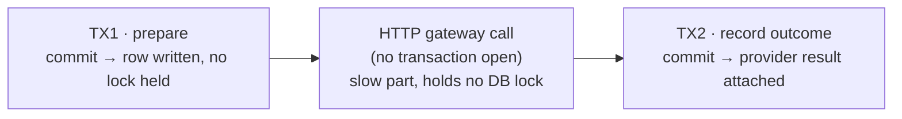
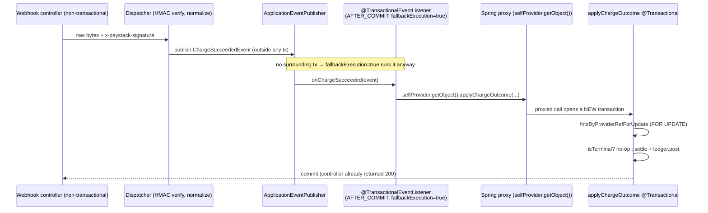
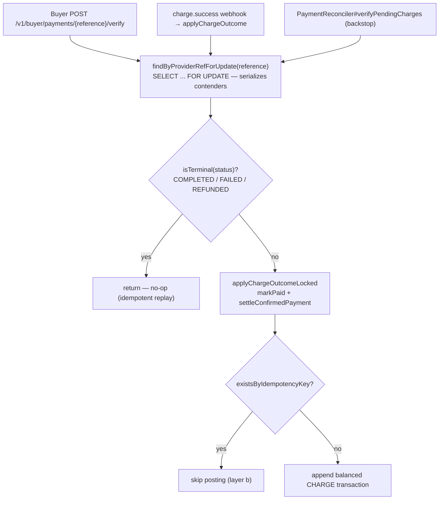
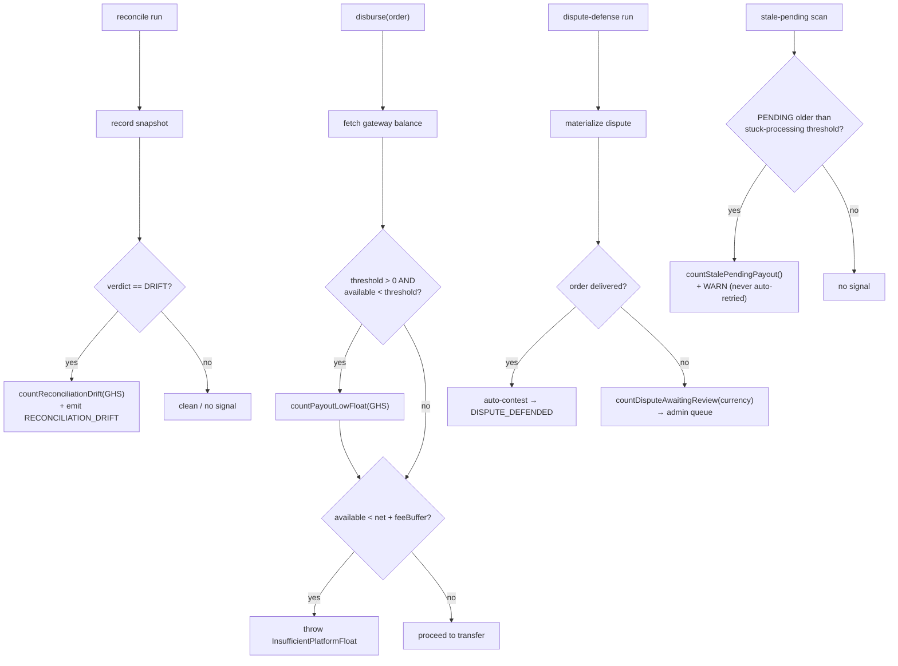
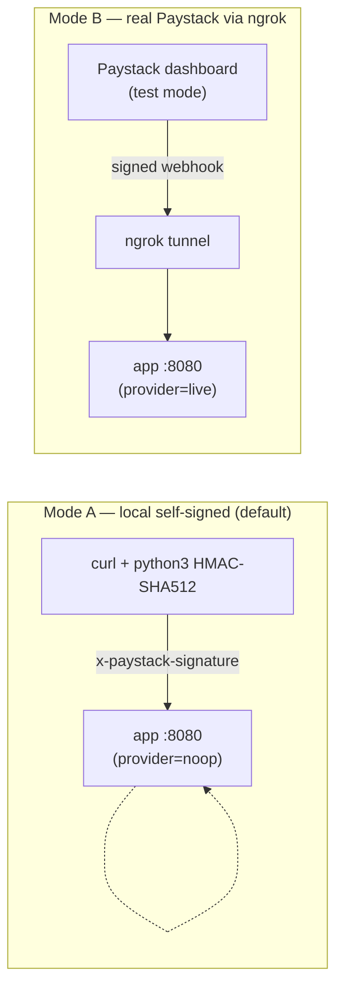
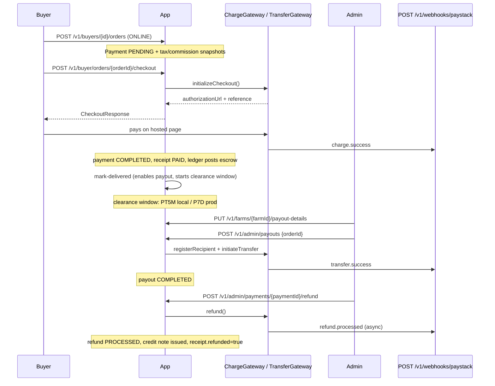
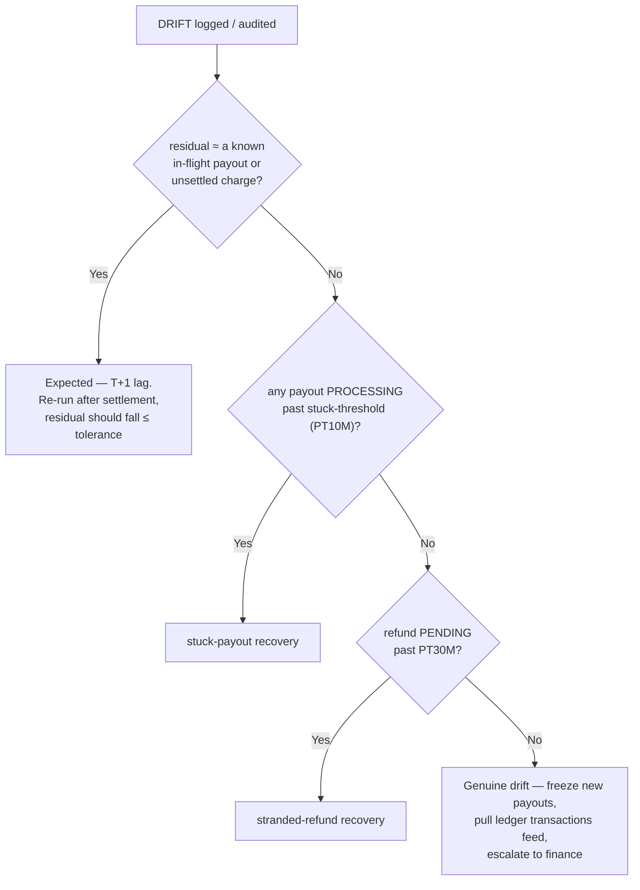

# Resiliency, audit, observability & operations

The payment subsystem moves real money over an unreliable network, so the parts that make it *trustworthy* are as load-bearing as the flows themselves. This page is the cross-cutting layer: how the flows stay correct when Paystack is slow, down, or delivers a webhook twice (resiliency); how every money movement leaves an immutable trail and an alertable signal (audit & observability); who is allowed to move or read money (financial RBAC); and how you exercise and operate the whole thing (live testing & runbook).

It is a deeper sibling of the [Payments overview](index.md). The flows it protects live in [core flows](core-flows.md); the postings it guards live in [the ledger](ledger.md); the webhook ingress and gateway seam it leans on are canonical in [gateway & webhooks](gateway-and-webhooks.md); the whole-platform float check it watches is canonical in [reconciliation](reconciliation.md). The audit infrastructure it plugs into is owned by [audit logging](../audit/index.md), and the metrics/deploy surface by [operations](../operations/index.md).

The one sentence to carry through all three parts: **the synchronous request never tries to be authoritative about the final state of money.** It records intent and returns; the terminal state is decided later by whichever of two redundant async channels — webhook or reconciler — lands first, both funnelling through one locked, idempotent path. Everything below is a consequence of that decision.

---

## Part 1 — Resiliency & error handling

### Initiate sync, settle async, converge idempotent

Every money-moving flow splits into a **synchronous initiation** and an **asynchronous settlement**, with **two independent recovery layers** that converge on the same idempotent code path.

| Flow | Sync initiation | Async settlement (primary) | Async settlement (backstop) |
|------|-----------------|-----------------------------|------------------------------|
| Charge | `PaymentServiceImpl#initiateCheckout` → returns an authorization URL | `charge.success` webhook → `onChargeSucceeded` → `applyChargeOutcome` | `PaymentReconciler#verifyPendingCharges` |
| Payout | `PayoutServiceImpl#disburse` → initiates a Paystack transfer | `transfer.success/failed/reversed` webhook → `settleTransfer*` | `PayoutReconciler#verifyStuckProcessing` |
| Refund | `RefundServiceImpl#initiateRefund` → initiates a Paystack refund | `refund.processed/failed/...` webhook → `mark*` | `RefundReconciler#verifyPendingRefunds` |
| Chargeback | (provider-driven, no sync initiation) | `charge.dispute.create/resolve` webhook → `openChargeback`/`resolveChargeback` | — |

The two async layers are **deliberately redundant**. A dropped or delayed webhook is covered by the reconciler; a reconciler that runs before a webhook is covered because the webhook no-ops on the already-terminal row. The only thing making that redundancy safe is that **both funnel through one locked, idempotent settlement method**. There is no leader election, no dedup table, no message queue — convergence is enforced at the database row, not in the messaging fabric.

### `open-in-view=false` and the patterns that defuse it

CropDoor runs with `spring.jpa.open-in-view=false`. This closes the Hibernate session at the end of each transaction instead of holding it open for the whole request — the correct production setting (it stops accidental N+1 lazy loads during view rendering), but it has a sharp edge: **any code that runs outside a transaction cannot touch a lazy association** without throwing `LazyInitializationException`.

That edge matters because the slow part of an initiation is the provider HTTP round-trip (`/initialize`, `/transfer`, `/refund`). If that call ran *inside* the transaction holding the aggregate row, the row lock would be held for the entire network latency — under load that serializes checkouts and exhausts the connection pool. So initiation is split into **three steps**, with the HTTP call sandwiched between two committed transactions, and the middle step is exactly the non-transactional code that cannot walk a lazy association.

| Flow | TX1 | HTTP (outside tx) | TX2 |
|------|-----|-------------------|-----|
| Checkout | `PaymentServiceImpl#prepareCheckout` | `ChargeGateway#initializeCheckout` | `recordCheckoutInitiated` |
| Refund | `RefundServiceImpl#prepareRefund` | `ChargeGateway#refund` | `attachGatewayPayload` |
| Payout | `PayoutTransactionalSteps#prepare` | `TransferGateway#registerRecipient` + `initiateTransfer` | `PayoutTransactionalSteps#recordInitiated` |

If the HTTP step fails, TX1 has already committed a `PENDING` row — which is exactly what the reconciler later finds and re-verifies. The failure is recoverable *because* the prepare step committed before the call.

Four disciplines keep the non-transactional middle step safe under `open-in-view=false`:

- **Three-step pattern.** The orchestration method (`initiateCheckout`, `initiateRefund`, `disburse`) is itself **non-transactional** and stitches TX1 → HTTP → TX2 together.
- **Self-proxy re-entry.** Checkout and refund call TX1/TX2 through the Spring proxy (`selfProvider.getObject()` on `PaymentServiceImpl` / `RefundServiceImpl`) so each opens its own transaction. A direct `this.prepareCheckout(...)` bypasses the proxy — no transaction, no lock. Payout instead delegates TX1/TX2 to an independently-proxied `@Component`, `PayoutTransactionalSteps`.
- **Materialize-then-HTTP via id-carrier records.** TX1 materializes everything the HTTP step needs into a plain record — primitive ids and already-resolved scalars — so the gateway call needs no session at all.
- **Eager-column reads, not lazy-association walks.** Where a re-fetch is unavoidable (checkout re-fetches the `Payment` by id), the code reads the payment's own eager `amount`/`currency` columns, never `payment.getOrder().getCurrency()` (a lazy `Order` association). `createPayment` copies the order currency onto the payment at creation so they are equal.

The id-carrier records that cross the transaction boundary carrying values, not managed entities:

| Carrier record | Produced by | Carries (selected) |
|----------------|-------------|--------------------|
| `CheckoutPreparation` | `prepareCheckout` | `paymentId`, `attemptId`, `reference`, `reusable`, reusable URL/code/expiry |
| `RefundPreparation` | `prepareRefund` | `refundId`, `orderNumber`, `providerRef`, `alreadyInitiated` |
| `PayoutTransactionalSteps.PreparedDisbursement` | `steps.prepare` | `reference`, `net`, recipient registration / existing recipient code, `orderId` |
| `PayoutTransactionalSteps.PreparedRetry` | `steps.prepareRetry` | `reference`, `net`, `recipientCode`, `orderId` |

### The `AFTER_COMMIT` + `fallbackExecution` + self-proxy trio

Every webhook-driven settlement is wired the same way, and three independent mechanisms cooperate — remove any one and settlement silently breaks. For example `onChargeSucceeded` is annotated `@TransactionalEventListener(phase = TransactionPhase.AFTER_COMMIT, fallbackExecution = true)` and its body does nothing but re-enter the bean through `selfProvider.getObject().applyChargeOutcome(event.reference(), event.verification())`.

| Mechanism | What it does | What breaks if omitted |
|-----------|--------------|------------------------|
| `phase = AFTER_COMMIT` | The listener fires only after the *publishing* transaction commits, so settlement never acts on a payload the publisher then rolled back. | A publisher rollback would orphan a money move. |
| `fallbackExecution = true` | Runs the listener even when there is **no** surrounding transaction — the webhook controller is non-transactional and publishes the event outside any tx. | A `@TransactionalEventListener` published outside a transaction is **silently dropped** — the webhook 200-OKs but never settles. |
| Self-proxy (`selfProvider.getObject()`) | Re-enters the bean through its Spring proxy so the target's `@Transactional` + `FOR UPDATE` lock actually open a new transaction. | A direct `this.applyChargeOutcome(...)` takes no transaction and no row lock; settlement never commits. |

`PaymentServiceImpl`, `PayoutServiceImpl`, `RefundServiceImpl`, and `ChargebackServiceImpl` all inject an `ObjectProvider<SelfInterface> selfProvider` for exactly this re-entry. The event seam itself — how the controller hands raw JSON to the dispatcher, which verifies the HMAC and publishes the normalized event — is canonical in [gateway & webhooks](gateway-and-webhooks.md).

### Idempotency: two layers, everywhere

Every settlement is guarded **twice**, by two mechanisms that fail independently.

**Layer (a) — per-aggregate `FOR UPDATE` lock + terminal no-op.** Charge, payout, and chargeback settlements begin by locking the aggregate row with a pessimistic write lock and bailing on an unexpected state. Charges/payouts no-op if already terminal — `applyChargeOutcomeLocked` returns immediately when the payment status is `COMPLETED`, `FAILED`, or `REFUNDED`; chargebacks guard on the expected source state (`openChargeback` proceeds only from `COMPLETED`, `resolveChargeback` only from `DISPUTED`).

The lock serializes concurrent settlers on the same reference (webhook vs reconciler vs buyer `verify`); the terminal check makes the *second* one through the gate a no-op. Charges and payouts lock via `findByProviderRefForUpdate` (`@Lock(PESSIMISTIC_WRITE)`); refunds are the one exception — `pendingRefundFor` looks up through the **unlocked** `RefundRepository#findByProviderRef` and converges purely on the `RefundStatus.PENDING` state-guard, a terminal-state short-circuit rather than a row lock.

**Layer (b) — ledger `existsByIdempotencyKey` second guard.** Even if layer (a) is somehow bypassed (a bug, a manual replay), the ledger refuses to double-post. `LedgerServiceImpl#post` is the single choke point for every money posting, and it opens by checking `ledgerTransactionRepository.existsByIdempotencyKey(command.idempotencyKey())` — when a transaction with that key already exists it debug-logs and returns without posting.

Because each economic event carries a **deterministic** key (derived from the order / payout / refund / dispute id, never a random UUID), a replayed event recomputes the *same* key and is silently dropped. Layer (b) makes the financial truth safe regardless of how many times an event is delivered.

The three charge-settlement entry points — the buyer's synchronous `verify`, the `charge.success` webhook listener, and the reconciler — all converge on `findByProviderRefForUpdate` + `isTerminal` no-op, then on `existsByIdempotencyKey`. Whatever the arrival order, the first writer wins and the rest are no-ops.

!!! note "The `verify` path's `noRollbackFor`"
    The buyer `verify` path is annotated `@Transactional(noRollbackFor = PaymentAmountMismatchException.class)`. When verification reports an amount/currency that does not match the order, the settler writes the payment `FAILED` (a fraud signal) **and then** throws so the endpoint surfaces a 500. `noRollbackFor` keeps the `FAILED` write committed — without it, the throw would roll back the very state change that records the fraud. The webhook path never throws, so it does not need the override.

### The idempotency-key catalog

Two families exist: **aggregate keys** live on entity rows and de-duplicate *intent*; **ledger transaction keys** live on `ledger_transactions.idempotency_key` and de-duplicate *postings*.

| Key | Format | Where set | Guards |
|-----|--------|-----------|--------|
| Payment (aggregate) | `pay-<orderId>` | `PaymentServiceImpl#createPayment` | one `Payment` per order |
| PaymentAttempt (aggregate) | `attempt-<UUID>` | `PaymentServiceImpl#prepareCheckout` | per checkout attempt (intentionally random) |
| Payment provider ref | `cdr-chr-<UUID>` | `createPayment` (`REFERENCE_PREFIX`) | the Paystack charge reference |
| Refund (aggregate) | `refund-<paymentId>` | `RefundServiceImpl#prepareRefund` | one refund per payment |
| Ledger: charge | `charge:<providerRef>` | `applyChargeOutcomeLocked` | one `CHARGE` posting per charge |
| Ledger: payout success | `payout-success-<payoutId>` | `PayoutServiceImpl#settleTransferSucceeded` | one `PAYOUT` posting per payout |
| Ledger: refund processed | `refund-processed-<refundId>` | `RefundServiceImpl#markProcessed` | one `REFUND` posting per refund |
| Ledger: chargeback reversal | `chargeback-reversal-<disputeReference>` | `ChargebackServiceImpl#resolveChargeback` | one `CHARGEBACK_REVERSAL` per dispute |
| Ledger: chargeback write-off | `chargeback-writeoff-<paymentId>` | `ChargebackServiceImpl#writeOffClawback` | one `CHARGEBACK_WRITEOFF` per payment |

!!! note "Why `attempt-<UUID>` is random"
    The `PaymentAttempt` key is deliberately random — each checkout attempt is a *distinct* intent (the buyer pressed "pay" again), so it must NOT collapse with the previous attempt. Reuse of a still-valid authorization URL is handled separately, by the `isReusable` expiry-buffer check in `prepareCheckout`, not by the idempotency key.

### No `@Retryable`, no circuit breaker — recovery is reconciler-driven

Payment gateway calls carry **no `@Retryable` annotation** and no Spring Retry interceptor. This is deliberate, not an omission.

- **In-process retry would fight idempotency, not help it.** A blind retry of a non-idempotent POST (a transfer, a refund) risks a double-disbursement if the first call actually reached Paystack but the response was lost. Recovery instead re-derives state by *reading* the provider, never by re-POSTing.
- **Recovery is the reconciler.** If a charge `/initialize`, refund `/refund`, or transfer `/transfer` call fails transiently, the synchronous request fails (a `503`), the buyer/admin retries the user action, and the stranded `PENDING`/`PROCESSING` row is re-converged on the next reconciler tick (plus Paystack's 72-hour webhook redelivery as the other half of the net).

The `idempotent` flag threaded through `PaystackHttpClient#post(...)`/`put(...)` only *classifies*; it never retries. It is consumed in exactly one place — 5xx classification — to distinguish a safe-to-replay failure (surfaced `503`) from an unsafe one (`502`), then **declines to replay either way**.

A true **circuit breaker is intentionally not built** (deferred). The failure mode a breaker would address is already partially covered by per-call connect/read timeouts, the reconcilers that drain the backlog once the provider recovers, and the **provider kill switch** (`cropdoor.payments.gateways.paystack.provider=noop`) that lets ops cut over to the inert gateway without a redeploy.

!!! warning "Scope the 'reconciler is the backstop' claim precisely"
    The reconciler re-verifies (reads the provider and settles) for charges, refunds, and **`PROCESSING`** payouts. A **payout whose `/transfer` call failed before TX2** is the exception: it sits in `PENDING` with no provider reference, so it is **not** re-verified. `PayoutReconciler#flagStalePendingPayouts` only WARN-logs it and increments `cropdoor.payout.stale_pending` for a human to investigate — a blind re-initiation could double-pay the farmer because the transfer may already have reached the gateway. Stuck-`PENDING` payouts are *flagged*, never auto-recovered.

### The gateway exception taxonomy

`PaystackHttpClient#execute` classifies every *per-call* provider failure into one of two `GatewayException` subtypes. The provider diagnostic (Paystack body, status line, transport error) stays in `getMessage()` for logs and is **never** echoed to the client — `getClientMessage()` returns the code's curated default, mirroring `SmsSendException`.

| Exception | Triggered by | `ErrorCode` | HTTP | `Retry-After` |
|-----------|--------------|-------------|------|----------------|
| `GatewayTransientException` | connection refused / timeout / I/O (`ResourceAccessException`); **5xx on an idempotent call** | `PAYMENT_GATEWAY_UNAVAILABLE` | 503 | **30 s** |
| `GatewayPermanentException` | HTTP 4xx; `status:false` body on HTTP 200; empty/unparseable body; **5xx on a non-idempotent call** | `PAYMENT_GATEWAY_ERROR` | 502 | — |
| `GatewayConfigurationException` | boot-time: missing secret key, invalid base URL, no gateway for the requested provider | `INTERNAL_ERROR` | 500 | — |

`GatewayConfigurationException` is a boot/constructor fault, never raised by `execute`; it sits outside the `GatewayException` hierarchy and is listed for completeness. The taxonomy's job is to give the *caller* an honest signal: `503 + Retry-After: 30` means "the provider may recover, the operation is safe to attempt again"; `502` means "the provider rejected this, do not blindly replay." The `Retry-After` comes from `GatewayTransientException#getRetryAfterSeconds()` and is emitted by `GlobalExceptionHandler#handleDomain`.

The `RestClient` is built in `PaystackRestClientConfig` with timeouts so a hung provider fails fast into a `GatewayTransientException` rather than blocking a worker:

| Config key | Default | Purpose |
|------------|---------|---------|
| `cropdoor.payments.gateways.paystack.connect-timeout` | `5s` | TCP connect ceiling |
| `cropdoor.payments.gateways.paystack.read-timeout` | `15s` | response read ceiling (every call, including verify) |

### The payment `ErrorCode` catalog

Every payment-reachable failure maps through a single `ErrorCode` constant — the source of truth for both HTTP status and client message. The full generated list lives at `docs/api/error-catalog.md`; the payment-relevant subset:

| `ErrorCode` | HTTP | Raising exception | Meaning |
|-------------|------|-------------------|---------|
| `PAYMENT_NOT_FOUND` | 404 | `PaymentNotFoundException` | no such payment |
| `NOT_FOUND` | 404 | `UnknownPaymentReferenceException` | unknown order/charge reference |
| `FORBIDDEN` | 403 | `PaymentNotOwnedByCallerException` | caller is not the order's buyer |
| `PAYMENT_VERIFICATION_FAILED` | 500 | `PaymentAmountMismatchException` | verified amount/currency ≠ order (fraud signal) |
| `INSUFFICIENT_INVENTORY` | 409 | `InsufficientInventoryException` | stock gone before payment confirmed |
| `INSUFFICIENT_PLATFORM_FLOAT` | 409 | `InsufficientPlatformFloatException` | float can't fund the payout |
| `PAYOUT_CLEARANCE_NOT_MET` | 409 | `PayoutClearanceNotMetException` | clearance window not elapsed |
| `INVALID_PAYOUT_STATE` | 409 | `InvalidPayoutStateException` | payout not in an actionable state |
| `INVALID_REFUND_STATE` | 409 | `InvalidRefundStateException` | refund not in an actionable state |
| `INVALID_CHARGEBACK_STATE` | 409 | `InvalidChargebackStateException` | chargeback not in an actionable state |
| `TRANSFER_RECIPIENT_UNAVAILABLE` | 422 | `TransferRecipientUnavailableException` | farm has no usable payout destination |
| `PAYMENT_GATEWAY_ERROR` | 502 | `GatewayPermanentException` | provider rejected / unparseable |
| `PAYMENT_GATEWAY_UNAVAILABLE` | 503 | `GatewayTransientException` | provider transient/I/O |
| `INTERNAL_ERROR` | 500 | `LedgerImbalanceException`, `GatewayConfigurationException` | server-side integrity/config fault |

Payout-detail validation (`FARM_PAYOUT_DETAILS_NOT_FOUND` 404, `INCOMPLETE_PAYOUT_DETAILS` 400) and `POD_PAYMENT_NOT_COLLECTED` (409) are raised in the payout/order surfaces — see [core flows](core-flows.md).

Payments hold **12 domain exceptions** under `exception/payment/` plus **4** gateway types under `exception/payment/gateway/` (`GatewayException` base + the three above). All obey the platform error-handling standard: every client-reachable failure is a `DomainException` carrying an `ErrorCode`, mapped by a single `GlobalExceptionHandler#handleDomain` (no per-exception handlers); `Retry-After` is opt-in via `getRetryAfterSeconds()`; client message and log diagnostic are separated.

### Ledger integrity failures are hard faults

The ledger is the financial source of truth, so its invariants are enforced at write time and violations are **hard `INTERNAL_ERROR` (500)** faults, not recoverable client errors:

- **Balanced-posting check.** `LedgerServiceImpl#assertBalanced` sums debit and credit lines and throws `LedgerImbalanceException` if they differ. Because every `LedgerPostings` builder constructs a provably balanced line set, an imbalance means a code bug — failing loud (and rolling back the enclosing settlement) is correct.
- **Unknown-account guard.** A line referencing an account code with no `ledger_accounts` row also throws `LedgerImbalanceException`.
- **Append-only, never mutate.** `LedgerServiceImpl` only ever `save`s new transactions. A correction is itself a new reversing transaction. This immutability is what makes the `existsByIdempotencyKey` replay-guard sufficient — see [the ledger](ledger.md).

---

## Part 2 — Audit, observability & security

Every money-moving event leaves an immutable audit row, a small set of Micrometer counters surface the conditions ops alerts on, and a permission catalog plus per-endpoint gates decide who may move, refund, or even read money.

### How a payment audit becomes a row

Payment audits go through `AuditEmitter` (`service/platform/AuditEmitter.java`) — by convention the single source of truth for audit-log map shape, one typed method per `AuditAction`. **No payment action uses the `@Audited` annotation**; every payment emission is an explicit `auditEmitter.X(...)` call (the annotation is sugar for trivial principal-only events, and the aspect's dispatch table registers only `PASSWORD_CHANGE`). `AuditEmitterImpl` builds a `Map<String,Object>` per action and publishes an `AuditEvent`; `AuditEventListener#handleAuditEvent` persists it. That listener is annotated `@Async`, `@TransactionalEventListener(phase = TransactionPhase.AFTER_COMPLETION, fallbackExecution = true)`, and `@Transactional(propagation = Propagation.REQUIRES_NEW)`; it resolves the principal via `entityManager.getReference(User.class, event.userId())` (a `null` reference when `event.userId()` is `null`), builds an `AuditLog` from the event's `action` name, `entityType`, `entityId`, and `details` map, `save`s it through `auditLogRepository`, and increments the audit counter via `metricsService.countAudit(event.action())`.

`AFTER_COMPLETION` (not `AFTER_COMMIT`) persists the row whether the caller's transaction committed *or rolled back* — which is why a `PAYMENT_AMOUNT_MISMATCH` raised on a rolled-back charge still lands in the trail. `REQUIRES_NEW` makes the write independent of the caller's transaction; `@Async` keeps the request/webhook thread unblocked. See [audit logging](../audit/index.md) for the full pipeline.

### The payment audit event catalog

The subsystem owns ~20 `AuditAction` constants plus three order-lifecycle actions that snapshot money. Each maps to exactly one `AuditEmitter` method.

| AuditAction | Emitting flow | Scope / owner |
|---|---|---|
| `RECEIPT_ISSUED` | receipt issue on delivery — **once per side** | dual-sided (farm + buyer) |
| `CREDIT_NOTE_ISSUED` | credit-note issue on refund/chargeback reversal — **once per side** | dual-sided (farm + buyer) |
| `PAYMENT_INITIATED` | `PaymentService#initiateCheckout` | buyer |
| `PAYMENT_SUCCEEDED` | charge verify / `charge.success` webhook | buyer |
| `PAYMENT_FAILED` | failed/abandoned charge | buyer |
| `PAYMENT_AMOUNT_MISMATCH` | gateway amount/currency ≠ payment — **fraud signal** | buyer |
| `PAYOUT_DISBURSED` | admin disburse within clearance | farm |
| `PAYOUT_DISBURSED_EARLY` | admin disburse pre-clearance with override | farm |
| `PAYOUT_SUCCEEDED` | `transfer.success` webhook | farm (principal `null`) |
| `PAYOUT_FAILED` | `transfer.failed` / verify | farm (principal `null`) |
| `PAYOUT_REVERSED` | `transfer.reversed` webhook | farm (principal `null`) |
| `PAYOUT_RETRIED` | admin retry of FAILED/REVERSED payout | farm |
| `REFUND_INITIATED` | admin initiates full refund | buyer |
| `REFUND_PROCESSED` | `refund.processed` webhook | buyer |
| `REFUND_FAILED` | `refund.failed` webhook | buyer |
| `CHARGEBACK_OPENED` | `charge.dispute.create` webhook | buyer (principal `null`) |
| `PAYMENT_REVERSED` | lost chargeback (`charge.dispute.resolve`) | buyer (principal `null`) |
| `DISPUTE_DEFENDED` | scheduled defense job **or** admin manual contest | platform (no owner pair) |
| `DISPUTE_CONCEDED` | admin manual concede | platform (no owner pair) |
| `RECONCILIATION_DRIFT` | float reconciliation, verdict `DRIFT` | platform (principal `null`) |
| `ORDER_PLACED` | buyer places order (creates `Payment`) | order-owned, dual-sided |
| `ORDER_DELIVERED` | mark-delivered (enables payout) | order-owned |
| `ORDER_CANCELLED` | cancellation (may trigger refund) | order-owned, dual-sided |

### Audit scoping rules

Every audit row has a `user_id` (the principal) and a `details` JSONB map. The combination of *who the principal is* and *which `(ownerType, ownerId)` pair the map carries* defines the row's scope. Payment audits fall into five classes:

- **Principal-less (webhook / system).** `user_id` is `null` because the actor is an inbound webhook or a scheduled job, not a human — `CHARGEBACK_OPENED`, `PAYMENT_REVERSED`, `RECONCILIATION_DRIFT`, webhook-driven `PAYOUT_*`, and `DISPUTE_DEFENDED` when emitted by the scheduled job. A `null` `user_id` is a deliberate signal ("no human did this"), not a defect.
- **Buyer-scoped charge / refund / chargeback.** `PaymentContext`, `RefundContext`, and `ChargebackContext` are **always** `OwnerType.BUYER`. A refund reverses a *buyer's* charge, so attribution is the buyer org even though an admin initiated it; the admin identity rides as the `principal`, separate from the owner pair.
- **Farm-scoped payouts.** `PayoutAuditContext` is **always** farm-attributed (`AuditEmitterImpl#payoutDetails` hard-codes `KEY_OWNER_TYPE = "FARM"`); the disbursing/retrying admin is the principal.
- **Dual-sided issued documents.** `RECEIPT_ISSUED` and `CREDIT_NOTE_ISSUED` emit **twice** — once farm-attributed, once buyer-attributed — so the same event surfaces in both org feeds; each carries *both* `farmId` and `buyerProfileId`.
- **Platform-scoped dispute-defense.** `DISPUTE_DEFENDED` / `DISPUTE_CONCEDED` carry **no owner pair**; they belong to the platform audit trail (`PLATFORM::AUDIT::VIEW`), not a per-org feed.

!!! info "What reaches the per-org feed"
    `OrgAuditViewService.VISIBLE_ACTIONS` is the whitelist of actions the per-org audit feed shows. Of the payment domain, **`RECEIPT_ISSUED`, `CREDIT_NOTE_ISSUED`, and `CHARGEBACK_OPENED`** are in it (plus the three order-lifecycle actions, which are order-owned). The buyer-scoped `PAYMENT_*` / `REFUND_*` / `PAYMENT_REVERSED` and farm-scoped `PAYOUT_*` rows **carry** owner pairs (making them feed-eligible) but are **not** whitelisted, so they live only in the platform-wide audit log. Adding a payment event to the org feed means adding its action to `VISIBLE_ACTIONS`.

Every farm- or buyer-scoped emission **must** include `KEY_OWNER_TYPE` + `KEY_OWNER_ID` in its `details` map — enforced structurally by the `*Context` records and unconditional emitter writes, and unit-tested per emitter method (it is a convention, *not* ArchUnit-pinned).

### Observability — the payment metrics

CropDoor exposes Micrometer meters through `MetricsService` (`observability/MetricsService.java`), a typed facade so meter names and tag keys live in one place. Counters are scraped at `/actuator/prometheus`; the Prometheus registry renders `cropdoor.x.y` as `cropdoor_x_y_total` (dots → underscores, `_total` suffix). Four meters are payment-specific (plus `cropdoor_audit_events_total{action}`, incremented for *every* persisted audit row, which tags each payment `AuditAction` too).

| Scrape name | `MetricsService` method | Tags | Fires when | Default state |
|---|---|---|---|---|
| `cropdoor_payout_low_float_total` | `countPayoutLowFloat(currency)` | `currency` | a disburse observes gateway float below `low-float-threshold` — counted **even if** then rejected for insufficient float | **Inert** — threshold `0`; guard only fires when `> 0` |
| `cropdoor_payout_stale_pending_total` | `countStalePendingPayout()` | (none) | `PayoutReconciler#flagStalePendingPayouts()` finds a payout stranded `PENDING` past `stuck-processing-threshold` — flagged for a human, **never auto-retried** (double-pay risk) | Active when the reconciler is on |
| `cropdoor_dispute_awaiting_review_total` | `countDisputeAwaitingReview(currency)` | `currency` | the defense job materialized a dispute on an **undelivered** order, so it routes to the admin queue instead of auto-contesting | Active only when `dispute-defense.enabled=true` (off by default) |
| `cropdoor_reconciliation_drift_total` | `countReconciliationDrift(currency)` | `currency` | a float-reconciliation residual exceeds `reconciliation.tolerance` (verdict `DRIFT`); the same condition emits the `RECONCILIATION_DRIFT` audit | Active only when `reconciliation.enabled=true` (off by default) |

The low-float counter increments **before** the hard `InsufficientPlatformFloatException` check (`required = net + payout-fee-buffer`), so a low-but-sufficient float still signals; its tag is always `GHS`. The T+1 settlement lag the drift check accounts for is canonical in [reconciliation](reconciliation.md).

### The financial permission catalog

All codes are declared as constants on `security/Permissions.java` (never inline a string literal — pinned by `PermissionsCatalogConsistencyTest`), in `<SCOPE>::<DOMAIN>::<ACTION>` form. See [RBAC](../rbac/index.md) for the convention.

| Code | What it gates |
|---|---|
| `PLATFORM::FINANCIAL::VIEW` | Read platform finances: payout/refund/receipt/credit-note lists, ledger trial balance, transactions, reconciliation snapshots/history — **and** running an on-demand reconciliation |
| `PLATFORM::FINANCIAL::MANAGE` | Move/reverse money: disburse, retry payout, initiate refund, write off a chargeback clawback |
| `PLATFORM::CHARGEBACK::VIEW` | List the live Paystack chargeback-dispute review queue |
| `PLATFORM::CHARGEBACK::RESOLVE` | Contest / concede a Paystack chargeback dispute |
| `PLATFORM::ORDER::CANCEL` | Admin-cancel a non-terminal order (may trigger a refund) |
| `FARM::FINANCIAL::VIEW` | Read a farm's revenue, payout details (masked), receipts, credit notes |
| `FARM::FINANCIAL::UPDATE` | Set the farm's payout destination (mobile money / bank) |
| `FARM::FINANCIAL::EXPORT` | Download CSV/PDF farm reports — **declared, not yet wired** |
| `BUYER::ORDER::CREATE` | Place orders / initiate checkout |
| `BUYER::ORDER::VIEW` | View orders / verify a charge |
| `BUYER::FINANCIAL::VIEW` | Read a buyer profile's spending, receipts, credit notes |
| `BUYER::FINANCIAL::EXPORT` | Download CSV/PDF buyer reports — **declared, not yet wired** |

### The permission → endpoint matrix

Two gating mechanisms are in play. **`hasAuthority('<code>')`** is a flat authority check (platform-admin endpoints; the admin holds the authority globally). A **SpEL bean call** — `@permissionResolutionService.<method>(...)` — checks permission **and** org membership in one expression (`hasPermission` for buyer self-service; `belongsToFarmWith` / `belongsToBuyerProfileWith` for org-scoped resources).

| Method & path | Controller | Permission | Mechanism |
|---|---|---|---|
| `POST /v1/buyer/orders/{orderId}/checkout` | `BuyerCheckoutController` | `BUYER::ORDER::CREATE` | `hasPermission` SpEL (+ caller-owns) |
| `POST /v1/buyer/payments/{reference}/verify` | `BuyerCheckoutController` | `BUYER::ORDER::VIEW` | `hasPermission` SpEL (+ caller-owns) |
| `POST /v1/admin/payouts` | `AdminPayoutController` | `PLATFORM::FINANCIAL::MANAGE` | `hasAuthority` |
| `POST /v1/admin/payouts/{payoutId}/retry` | `AdminPayoutController` | `PLATFORM::FINANCIAL::MANAGE` | `hasAuthority` |
| `GET /v1/admin/payouts` | `AdminPayoutController` | `PLATFORM::FINANCIAL::VIEW` | `hasAuthority` |
| `POST /v1/admin/payments/{paymentId}/refund` | `AdminRefundController` | `PLATFORM::FINANCIAL::MANAGE` | `hasAuthority` |
| `GET /v1/admin/refunds` | `AdminRefundController` | `PLATFORM::FINANCIAL::VIEW` | `hasAuthority` |
| `POST /v1/admin/chargebacks/{paymentId}/write-off` | `AdminChargebackController` | `PLATFORM::FINANCIAL::MANAGE` | `hasAuthority` |
| `GET /v1/admin/disputes` | `AdminDisputeController` | `PLATFORM::CHARGEBACK::VIEW` | `hasAuthority` |
| `POST /v1/admin/disputes/{disputeId}/contest` | `AdminDisputeController` | `PLATFORM::CHARGEBACK::RESOLVE` | `hasAuthority` |
| `POST /v1/admin/disputes/{disputeId}/concede` | `AdminDisputeController` | `PLATFORM::CHARGEBACK::RESOLVE` | `hasAuthority` |
| `GET /v1/admin/ledger/balances` | `AdminLedgerController` | `PLATFORM::FINANCIAL::VIEW` | `hasAuthority` |
| `GET /v1/admin/ledger/transactions` | `AdminLedgerController` | `PLATFORM::FINANCIAL::VIEW` | `hasAuthority` |
| `GET /v1/admin/ledger/reconciliation` (+ `/history`) | `AdminLedgerController` | `PLATFORM::FINANCIAL::VIEW` | `hasAuthority` |
| `POST /v1/admin/ledger/reconciliation/run` | `AdminLedgerController` | `PLATFORM::FINANCIAL::VIEW` | `hasAuthority` — **write gated on VIEW** |
| `GET /v1/admin/receipts` (+ `/{receiptId}`) | `AdminReceiptController` | `PLATFORM::FINANCIAL::VIEW` | `hasAuthority` |
| `GET /v1/admin/credit-notes` (+ `/{creditNoteId}`) | `AdminCreditNoteController` | `PLATFORM::FINANCIAL::VIEW` | `hasAuthority` |
| `POST /v1/admin/orders/{orderId}/cancel` | `AdminOrderController` | `PLATFORM::ORDER::CANCEL` | `hasAuthority` |
| `PUT /v1/farms/{farmId}/payout-details` | `FarmPayoutDetailsController` | `FARM::FINANCIAL::UPDATE` | `belongsToFarmWith` SpEL |
| `GET /v1/farms/{farmId}/payout-details` | `FarmPayoutDetailsController` | `FARM::FINANCIAL::VIEW` | `belongsToFarmWith` SpEL |
| `GET /v1/farms/{farmId}/receipts` / `credit-notes` (+ `/{id}`, `/{id}/pdf`) | `FarmReceiptController` / `FarmCreditNoteController` | `FARM::FINANCIAL::VIEW` | `belongsToFarmWith` SpEL |
| `GET /v1/buyers/{buyerProfileId}/receipts` / `credit-notes` (+ `/{id}`, `/{id}/pdf`) | `BuyerReceiptController` / `BuyerCreditNoteController` | `BUYER::FINANCIAL::VIEW` | `belongsToBuyerProfileWith` SpEL |
| `POST /v1/webhooks/paystack` | `PaystackWebhookController` | *(none — `permitAll` + HMAC)* | see below |

### Notable RBAC facts

Three are intentional — a reviewer should not "fix" them by reflex:

1. **There is no `PLATFORM::PAYOUT` permission.** Payouts are governed entirely by the generic financial permissions: every mutation gates on `PLATFORM::FINANCIAL::MANAGE`, the list on `PLATFORM::FINANCIAL::VIEW`. Payout authorization is folded into `FINANCIAL`.
2. **The reconciliation *run* write is gated only on `PLATFORM::FINANCIAL::VIEW`.** `POST /v1/admin/ledger/reconciliation/run` records a fresh snapshot (a write) but is treated as read-grade — it mutates only an append-only diagnostic table and posts no money. It is the one payment write not behind `MANAGE`.
3. **`FARM::FINANCIAL::UPDATE` is the only farm-side financial write**, and in practice it is held only by the farm **Owner** role (auto-minted with all FARM permissions at profile creation). The companion read returns a **masked** view — account / mobile-money numbers reduced to their last four digits.

### Webhook endpoint security

`POST /v1/webhooks/paystack` is the one payment endpoint with **no RBAC gate** — `permitAll` in `SecurityConfig` because Paystack is unauthenticated by JWT. Authentication is the **raw-byte HMAC-SHA512 signature** (verified over the exact received bytes; a Jackson re-serialize would reorder keys and break it), and the contract is **always-200-once-authenticated** — both canonical in [gateway & webhooks](gateway-and-webhooks.md). Security-relevant facts: the controller is `@Hidden` (excluded from OpenAPI); a signature mismatch returns **404** (not 401/403) so an attacker can't distinguish "wrong signature" from "no such route"; a per-IP rate limit (`200 req / 60 s`, scope `webhook-paystack:ip`) returns **429** on breach.

The actuator surface is separately gated: only `/actuator/health`, `/actuator/health/**`, and `/actuator/info` are `permitAll`; **everything else under `/actuator/**` (including `/actuator/prometheus` and `/actuator/metrics`) requires `hasRole("ADMIN")`**. A Prometheus scraper must present an admin role.

### Governance rules that fail the build

| Rule (mechanism) | What it pins |
|---|---|
| Owner pair on org-scoped audit (convention — *not* ArchUnit) | Every farm/buyer-scoped emission must carry `KEY_OWNER_TYPE` + `KEY_OWNER_ID`; enforced by the `*Context` records + unconditional emitter writes + per-emitter unit tests |
| `OrgIsolationArchitectureTest` | No `controller/farm/..` may depend on buyer-side packages, and vice versa; likewise `service/farm/..` ↔ buyer |
| `AuditAopArchitectureTest` | `@Audited` accepts **only** a single `AuditAction value()`; the `aspect/` package has a hard **6-file cap** |
| `PermissionsCatalogConsistencyTest` | Every `Permissions` constant matches `<SCOPE>::<DOMAIN>::<ACTION>` with an identifier mirroring the code |

### Operational alerting guidance

| Signal | Meaning | Recommended response |
|---|---|---|
| `cropdoor_reconciliation_drift_total` increments / `RECONCILIATION_DRIFT` audit | Internal `PLATFORM_FLOAT` and Paystack disagree beyond `reconciliation.tolerance` (default `1.00 GHS`), after pending settlements + in-flight payouts | **Page finance.** Pull the latest snapshot (`GET /v1/admin/ledger/reconciliation`); the audit `details` carry the four figures + residual + tolerance. Pause large disbursements until reconciled. |
| `cropdoor_payout_low_float_total` increments | A disburse saw gateway float below `low-float-threshold` (only meaningful where set `> 0`) | **Top up the Paystack balance** before upcoming payouts start failing the funding guard. Inert by default; enable per-env for the early warning. |
| `cropdoor_dispute_awaiting_review_total` increments | The defense job found a chargeback on an **undelivered** order it won't auto-contest | **Triage `GET /v1/admin/disputes`** before Paystack's 16h auto-accept. Contest if you can evidence delivery, else concede. |
| `PAYMENT_AMOUNT_MISMATCH` audit appears | A gateway-reported amount/currency did not match — a **fraud / tampering signal** | **Investigate immediately.** `details` carry `expectedAmount` vs `reportedAmount`, the provider ref, and the buyer owner pair. Do not auto-settle. |
| `cropdoor_audit_emission_failure_total{action}` increments | An `@Audited` dispatch threw and the row was dropped | **Investigate.** No payment action uses `@Audited`, so a payment value here is itself a misconfiguration. |

!!! tip "Reconcilers, not retries, are the durable backstop"
    Payment gateway calls use **no `@Retryable`**; recovery is the scheduled reconcilers plus Paystack's 72h webhook redelivery, and the gateway circuit breaker is intentionally not built. So when a metric stays elevated, the question is "is the reconciler catching up?", not "did a retry exhaust?"

---

## Part 3 — Live testing & runbook

### The two testing modes

The webhook-driven flows (charge → receipt, refund → credit note, chargeback, transfer → payout) are all triggered by a Paystack webhook hitting `POST /v1/webhooks/paystack`. There are two ways to deliver them, and **both drive the identical controller → dispatcher → event-listener → service code path** — so Mode A is enough to verify *our* code, and Mode B additionally verifies the *Paystack integration* (real signature, real payload shape, real async timing).

| | **Mode A — local self-signed** | **Mode B — real Paystack via ngrok** |
|---|---|---|
| Gateway bean | `NoopChargeGateway` / `NoopTransferGateway` (`provider=noop`) | `PaystackChargeGateway` / `PaystackTransferGateway` (`provider=live`) |
| Who computes the HMAC | **You** (you choose the webhook secret) | **Paystack** (signs with the real `.env` secret key) |
| Who delivers the webhook | You self-`POST` it with `curl` | Paystack dashboard → ngrok tunnel → app |
| Network / account | None (offline, deterministic) | Internet + a Paystack **test** account |
| What it proves | Our normalization + settlement + ledger logic | The above **plus** Paystack's real delivery |
| Cost risk | Zero | Real money **if you boot on live keys** — gate on TEST keys |

The Noop gateways are `@ConditionalOnProperty(..., havingValue = "noop")` and return deterministic stand-ins without any HTTP — `NoopChargeGateway#initializeCheckout` returns `https://noop.checkout.local/<reference>`, `NoopTransferGateway#fetchBalance` always returns `GHS 1,000,000.00`. Terminal outcomes are never produced by the Noop gateway itself; they are simulated by *publishing the corresponding webhook event* — which is exactly what Mode A's `curl` does. The `provider=live|noop` kill switch is canonical in [gateway & webhooks](gateway-and-webhooks.md).

### Local boot recipe and seeded logins

The local profile already pins `provider=noop` and a short clearance window (`cropdoor.payments.payout.clearance-window=PT5M`, vs. base `P7D`), so a payout clears in five minutes. The live-verify recipe boots with `./mvnw spring-boot:run`, layering the seeder and magic-login admin on top by passing these flags through `-Dspring-boot.run.arguments`: `--app.bootstrap.seed-test-data.enabled=true`, `--app.bootstrap.seed-test-data.shared-password=ReceiptVerify1!`, `--app.bootstrap.seed-test-data.magic-otp=123456`, `--app.bootstrap.seed-test-data.magic-login-phones=+233500000021`, `--cropdoor.auth.phone-gate.enabled=false`, and (Mode A only) `--cropdoor.payments.gateways.paystack.webhook-signing-secret=cropdoorlocalwebhook`. The table explains each:

| Flag | Why |
|---|---|
| `seed-test-data.enabled=true` | Seed buyers/farmers/admin |
| `seed-test-data.shared-password=<pw>` | Shared password for all seeded logins |
| `seed-test-data.magic-otp=123456` | OTP value issued to allowlisted phones (suppresses SMS) |
| `seed-test-data.magic-login-phones=+233500000021` | Allowlists `fe.admin@cropdoor.test`'s phone so its login OTP is `123456` and SMS is suppressed — enables 2-step admin MFA over plain HTTP. E.164 required |
| `auth.phone-gate.enabled=false` | Skip the phone-verification gate |
| `gateways.paystack.webhook-signing-secret=<known>` | **Mode A only.** A value *you* choose so you can compute the HMAC (overrides `.env`, harmless under Noop) |

| Login | Role | MFA |
|---|---|---|
| `buyer1@cropdoor.test` | buyer | none (single-step) |
| `farmer1@cropdoor.test` | farmer | none (single-step) |
| `fe.admin@cropdoor.test` (phone `+233500000021`) | `FE_TEST_ADMIN` — all PLATFORM permissions | 2-step MFA, OTP `123456` |

The `FE_TEST_ADMIN` role carries every PLATFORM permission (so it reaches all the financial admin endpoints) but is deliberately **not** the system `SUPER_ADMIN` role; the attachment is gated on the magic-login allowlist, so a known-shared-password full admin never lands in an env (e.g. prod) that leaves the allowlist empty.

### Mode A — self-signed webhooks

Paystack signs every webhook with `HMAC-SHA512` over the raw request bytes, hex-encoded into `x-paystack-signature`. In a shell you reproduce `PaystackWebhookSimulator` by computing `HMAC-SHA512(rawBody, webhookSecret)` (hex) with `python3` — keying it on the `cropdoorlocalwebhook` secret from the boot recipe — and passing the digest as the `x-paystack-signature` header; the committed `docs/runbooks/ngrok-paystack-live-testing.md` carries the exact one-liner.

Place an **ONLINE** order (omit `paymentMethod` ⇒ ONLINE/escrow, refundable; POD/cash is not), then `POST /v1/buyer/orders/{orderId}/checkout` to mint a `PENDING` payment whose `reference` is the charge ref. Self-`POST` each terminal event to `localhost:8080/v1/webhooks/paystack` with `Content-Type: application/json` and the computed `x-paystack-signature` header; the `event` field uses the exact `case` labels in `PaystackEventDispatcher#dispatch`. A `charge.success` body carries `data.reference` (the charge ref), `data.status="success"`, `data.amount` and `data.fees` in pesewas, `data.currency="GHS"`, and `data.channel` (e.g. `mobile_money`) — it drives the payment to `COMPLETED` and the receipt to `PAID`. A `refund.processed` body carries `data.status="processed"`, `data.currency="GHS"`, and the charge ref under `data.transaction.reference` — it drives the refund to `PROCESSED` and issues the credit note.

Verified against `PaystackEventDispatcher`:

- `amount` and `fees` are in **pesewas** (minor units; order total × 100), converted via `PaystackAmounts.fromMinorUnits(...)`.
- A refund webhook reads the **charge** reference from `data.transaction.reference` (falling back to flat `transaction_reference`) — *not* a refund-specific id. `refund.processed` publishes `RefundProcessedEvent`; `refund.pending`/`refund.processing` publish `RefundPendingEvent`; `refund.failed` publishes `RefundFailedEvent`.
- A chargeback arrives as `charge.dispute.create` and resolves with `charge.dispute.resolve`. `charge.dispute.remind` is **log-only**. There is no `charge.reversed` event — a post-success clawback is a dispute. The merchant-win decision is losing-safe: WON requires `status=resolved` **and** `resolution=declined` **and** `refund_amount == 0`; anything else is a loss.
- `paymentId` (needed by the admin refund endpoint) is not exposed by any buyer endpoint — get it from the DB: `SELECT id FROM payments WHERE provider_ref='<chargeRef>'`.
- The per-IP rate limit is **200 requests / 60 s** — a tight `for` loop of test webhooks can trip a `429`.

### Mode B — ngrok + real Paystack

Full step-by-step (tunnel setup, dashboard config, teardown) lives in the committed `docs/runbooks/ngrok-paystack-live-testing.md`. The load-bearing facts:

1. **`provider=live`, never `provider=paystack`.** The real gateway beans are gated on `havingValue="live"` (Noop on `"noop"`); `provider=paystack` matches **neither**, so all gateway beans vanish and the context fails to start (`PayoutServiceImpl` → no `TransferGateway` bean). Boot with `--cropdoor.payments.gateways.paystack.provider=live` and do **not** override `webhook-signing-secret` — Paystack signs with the real secret key and `effectiveWebhookSigningSecret()` falls back to `secretKey`.
2. **Set the dashboard webhook URL** to `https://<id>.ngrok-free.app/v1/webhooks/paystack` (test-mode toggle on). The Paystack account owner does this.
3. **Paystack rejects the seeded `.test` email** → `400 "Invalid Email Address Passed"` at checkout. Set a real-looking buyer email first (a Gmail `+alias`); it becomes the login identifier: `UPDATE users SET email='you+buyer1@gmail.com' WHERE email='buyer1@cropdoor.test';`
4. **Real-Paystack refunds are async** (`pending → processing → processed`, minutes, sometimes needing a dashboard nudge under *Transactions → the txn → Refunds*). The credit note issues only on the final `refund.processed`. Only ONLINE (escrow) payments are refundable.
5. **Transfer-OTP must be disabled** on the test account before a payout disburse can complete (otherwise the transfer waits on an OTP) — go-live checklist item #1.
6. **Never read `.env`** — the app self-loads it, so AWS / Paystack secrets resolve without you reading them. Before any *real* checkout, **ask the human whether the keys are TEST keys** — a live-key charge is real money.

Test-card for the hosted checkout: `4084 0840 8408 4081`, exp any future, CVV `408`, PIN `0000`, OTP `123456`.

### End-to-end happy path

The full money lifecycle: place → checkout → pay → settle → mark-delivered → disburse → refund.

!!! note "mark-delivered's optional body"
    `POST /v1/farms/{farmId}/orders/{orderId}/mark-delivered` takes an **optional** `{"paymentCollected": <bool>}` body (`@RequestBody(required = false)`); when omitted it defaults to `false`. For a POD order where the rider collected cash you send `{"paymentCollected": true}`, but the endpoint never rejects a missing body — it marks the order delivered cash-not-collected. For ONLINE orders the flag is ignored since the charge already settled.

### State the happy path can't reach locally

Some states cannot be produced by the local happy path. The discipline: **set it directly via `docker exec <pg> psql` rather than skipping the check — and say you did.** Against the dev Postgres container (`postgres-cropdoor`, port `5434`), run `docker exec postgres-cropdoor psql -U cropdoor_admin -d cropdoor_db -tAc "<sql>"`, substituting one of the statements below:

| You need… | SQL |
|---|---|
| The `paymentId` for a charge ref | `SELECT id FROM payments WHERE provider_ref='<chargeRef>';` |
| To confirm a refund settled | `SELECT status, provider_ref FROM refunds WHERE provider_ref='<chargeRef>';` |
| To confirm the credit note issued | `SELECT credit_note_number, origin FROM credit_notes WHERE order_id='<id>';` |
| Force a charge "old enough" for the reconciler | backdate `payments.created_at` past `verify-min-age` (PT5M) |

`psql -c`/`-tAc` does not interpolate `:'var'` bind variables — substitute the value into the string yourself before running.

### Recovering a stuck charge / payout / refund

Every webhook-driven state has a **reconciler** as its durable backstop. All three are gated on `cropdoor.payments.reconciler.enabled` (default **on**; the test profile sets it false), run on fixed delays, process `batch-size=50` rows per scan, and converge through the *same locked settle path* as the webhook — so a row can never double-settle. The reconcilers are deliberately **not** `@Transactional` (they keep gateway HTTP calls outside any transaction).

| Stuck state | Reconciler / method | Trigger | Picks up rows… | Action |
|---|---|---|---|---|
| Charge `PENDING` (lost `charge.success`) | `PaymentReconciler#verifyPendingCharges` | `verify-pending-fixed-delay` (PT2M) | `PENDING` older than `verify-min-age` (PT5M) | re-`verify` → settle if succeeded |
| Charge abandoned (buyer never paid) | `PaymentReconciler#markAbandoned` | `abandon-fixed-delay` (PT1H) | `PENDING` older than `abandon-after` (PT24H) | force `FAILED`, restore inventory |
| Checkout that never reached the gateway | `PaymentReconciler#retryStuckInitializations` | `expire-stale-checkouts-fixed-delay` (PT5M) | attempt `PENDING`, `initiated_at IS NULL`, older than `uninitiated-checkout-ttl` (PT15M) | re-`initiateCheckout` |
| Payout `PROCESSING` (lost `transfer.*`) | `PayoutReconciler#verifyStuckProcessing` | `verify-stuck-processing-fixed-delay` (PT2M) | `PROCESSING` older than `stuck-processing-threshold` (PT10M) | `verifyTransfer` → settle SUCCEEDED/FAILED/REVERSED |
| Payout `PENDING` (failed `/transfer` before TX2) | `PayoutReconciler#flagStalePendingPayouts` | same scan | `PENDING` past `stuck-processing-threshold` | **WARN + `countStalePendingPayout()` only — never re-verified** |
| Refund `PENDING` (lost `refund.processed`) | `RefundReconciler#verifyPendingRefunds` | `verify-pending-refunds-fixed-delay` (PT5M) | `PENDING` older than `refund-verify-min-age` (PT30M) | `verifyRefund` → `markProcessed`/`markFailed` |

**Manual recovery, in order of preference:**

1. **Wait for the reconciler.** If you see `… — reconciler will recover` in the logs, the dispatch failed *after* the signature verified; the matching reconciler re-converges on its next tick. Usually do nothing.
2. **Force a re-verify now.** For a charge, call `POST /v1/buyer/payments/{reference}/verify`. For payouts/refunds there is no admin verify endpoint — shorten the wait by backdating `created_at`/`last_attempted_at` past the min-age via psql.
3. **Replay the webhook (Mode A).** Re-`POST` the terminal event with a valid signature. Idempotent — the locked settle no-ops if already terminal.
4. **Retry a failed payout.** `POST /v1/admin/payouts/{payoutId}/retry` re-initiates the transfer (bounded by `reconciler.max-payout-attempts=5`).

!!! warning "A stuck-`PENDING` payout is detection-only"
    `Payout <id> stuck in PENDING since <ts> — possible failed initiation; investigate before any manual retry, the transfer may have reached the gateway` (WARN). This is `flagStalePendingPayouts`: a payout whose initiation may have failed in the HTTP leg. It is **never auto-retried** — re-initiating could double-pay. Investigate before any manual `/retry`.

### Interpreting a DRIFT snapshot

The float reconciliation (`PlatformFloatReconciliationServiceImpl#reconcileNow`, surfaced at `GET /v1/admin/ledger/reconciliation`, run on demand via `POST /v1/admin/ledger/reconciliation/run`) compares the internal `PLATFORM_FLOAT` against the Paystack-reported balance plus pending settlements and in-flight payouts. If `|residual| > tolerance` the verdict is `DRIFT`, and the service increments `countReconciliationDrift`, logs the four figures + residual, and emits the `RECONCILIATION_DRIFT` audit. Defaults: `tolerance=1.00`, `settlement-lookback=P14D`, `cron=0 0 2 * * *` (daily 02:00), scheduled job **off by default**. The residual model and the T+1 settlement lag are canonical in [reconciliation](reconciliation.md).

### The dispute (chargeback) review queue

Live chargebacks surface via `charge.dispute.create` → `ChargebackOpenedEvent`; `charge.dispute.remind` is logged when Paystack wants feedback. Two response paths:

- **Automated defense** (`ChargebackDefenseJob` → `ChargebackDefenseService#defendBatch`): scans disputes awaiting our feedback and submits the delivery receipt as evidence. Gated by `cropdoor.payments.chargeback-defense.enabled` (**off by default**), `cron=0 0 * * * *` (hourly, must beat Paystack's 16h auto-accept SLA), `lookback=P7D`.
- **Manual write-off** when a chargeback is lost and the clawback is unrecoverable: `POST /v1/admin/chargebacks/{paymentId}/write-off {"reason":"…"}` books the loss (409 if there is nothing to write off).

!!! info "Two unrelated 'dispute' concepts"
    `PLATFORM::CHARGEBACK::*` and the chargeback endpoints operate on **live Paystack chargeback disputes**. This is unrelated to the unwired in-app `model/dispute/*` entity (a planned buyer/farmer dispute feature). See the [roadmap](../architecture/roadmap.md).

### Payments go-live checklist

| # | Item | Config / surface | Build state |
|---|---|---|---|
| 1 | **Transfer-OTP disabled** on the Paystack account | Dashboard (ops, not code) | Done on test; ops step before any payout |
| 2 | **Dispute-defense automation** | `cropdoor.payments.chargeback-defense.enabled=true` + cron | Built; **off by default**, opt in per env |
| 3 | **PLATFORM_FLOAT ↔ Paystack reconciliation** | `cropdoor.payments.reconciliation.enabled=true` + `cron=0 0 2 * * *` | Service + admin reads/run built; scheduled job **off by default** |
| 4 | **Payout funding guard** | `payout.payout-fee-buffer` + `InsufficientPlatformFloatException` | **Built** — enforced in `PayoutServiceImpl#disburse` |
| — | Charge/payout/refund reconcilers | `cropdoor.payments.reconciler.enabled` | **Built**, default **on** (off only in the test profile) |

Items #2 and #3 are *built but disabled* — going live means flipping the `enabled` flag, not writing new code. The deferred/future-work note (no gateway circuit breaker; no `@Retryable` on gateway calls) is in Part 1.

### Postman handoff

Every payment feature ships a hand-authored Postman v2.1 collection at `docs/postman_collections/cropdoor-<feature>.postman_collection.json` (gitignored) — the FE/QA handoff artifact. The `info.description` is the runbook (numbered steps, the admin-MFA recipe, seeded logins, the IDs-are-DB-specific note); collection variables pre-fill `baseUrl`, one `<actor>Token` per actor, credentials, and every path/query id from the seeded dev DB. Every login request's `test` script captures its token — `pm.collectionVariables.set('buyerToken', pm.response.json().data.accessToken);` (note `.data.` — all responses are `ApiResponse<T>`). Admin login is two requests: step 1 `POST /v1/auth/login` captures `challengeId`, step 2 `POST /v1/auth/login/mfa/verify {challengeId, "123456"}` captures `adminToken`. Validate (`python3 -c "import json; json.load(open(...))"`) then drive the flow against the running app.
