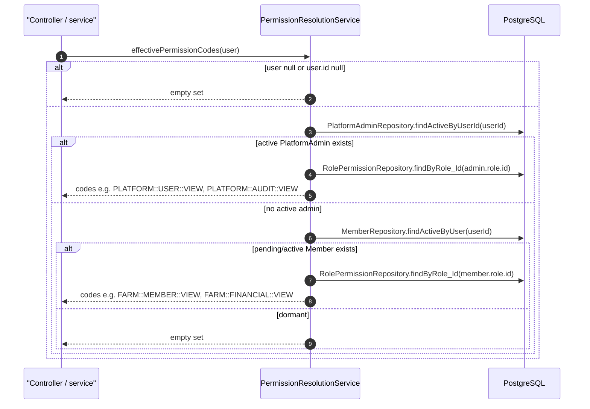
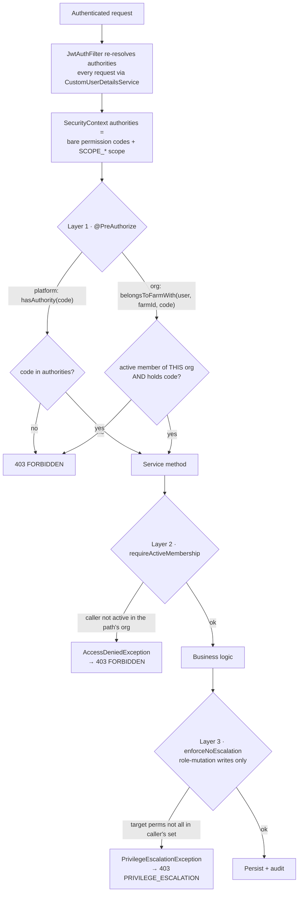
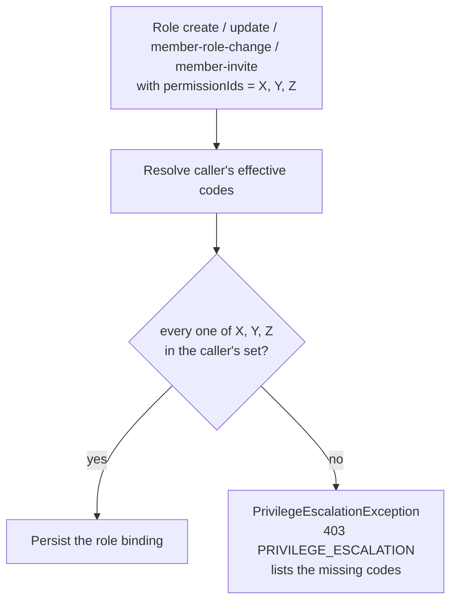

# Authorization: resolution & the three gates

Authentication answers *who is this caller* (see [Auth](../auth/index.md)). Authorization answers the next question — *what may they do right now* — and CropDoor answers it **fresh from the database on every request**. There is no permission cache and no authority baked into the JWT: a caller's effective permissions are recomputed each time, so a role edit takes effect on the caller's very next call.

This page covers the two halves of that answer. First, **permission resolution** — how `PermissionResolutionService` turns a `User` and their role into a set of effective permission codes. Then the **three authorization gates** every request crosses: an admission gate at the controller, an org-boundary re-check in the service, and a write-time containment rule on role mutations. Each gate answers a different question, and the reason there are three rather than one is the whole point of this page. The permission catalog itself (every code, its consumers, the migration that seeded it) lives on the permission-catalog page; here we cover the *machinery* that reads those codes. System roles and the `Owner`-role invariants live in [Roles](roles.md); the org model (`Member`, one-org-per-user) is shared with the [Domain](../domain/index.md) section.

---

## Permission resolution

The single source of truth for "what can this caller do" is `PermissionResolutionService` (`service/rbac/PermissionResolutionService.java`). Its `effectivePermissionCodes(User)` method returns an immutable `Set<String>` of bare permission codes, resolved live from the caller's one active role.

### The resolution order

The resolver walks one of two chains, **platform first**:

1. **Platform tier.** `PlatformAdminRepository#findActiveByUserId` — an `ACTIVE` `PlatformAdmin` row resolves to its role's permission codes. If a caller somehow held both an admin row and a member row, the admin path wins; the order is defined even though today the two are mutually exclusive.
2. **Org tier.** Otherwise `MemberRepository#findActiveByUser` — a `PENDING` *or* `ACTIVE` `Member` (`model/rbac/Member.java`), since the query matches both statuses — resolves to its role's codes. Because a user holds [at most one such membership](../domain/index.md), that one role is the caller's full org-scoped authority. (A `PENDING` invitee resolves to the codes here but is still turned away at the org controller — the admission gate adds a strict `ACTIVE` filter; see the load-bearing note below.)
3. **Dormant.** No active admin *and* no active member yields an **empty set**. A `STAFF` user whose membership was revoked, expired, or org-deleted lands here — they can authenticate but hold no permissions.

Both branches join `Role → RolePermission → Permission` and project `Permission#getCode`. The codes are scope-disjoint by convention (`FARM::*`, `BUYER::*`, `PLATFORM::*`), so they coexist in one flat set without prefixing.

### Load-bearing properties

- **Read-only and transactional.** The service is `@Transactional(readOnly = true)`; the whole `Admin/Member → Role → RolePermission → Permission` traversal runs in one read.
- **Uncached, by design.** Codes are re-resolved on every call. A mid-session role edit propagates on the caller's next request — there is no cache to invalidate, so stale permissions are always a *client-side* artifact (see the [debugging table](#common-403-scenarios) below).
- **The two chains disagree on `PENDING` — strict `ACTIVE` lives only in the org admission gate.** The platform chain is strictly `ACTIVE`: `PlatformAdminRepository#findActiveByUserId` filters `status = 'ACTIVE'`, so a `SUSPENDED` / `REVOKED` / `EXPIRED` admin resolves as dormant. The org chain is looser: `findActiveByUser` matches `status IN ('PENDING','ACTIVE')` and the resolver adds no further check, so a `PENDING` (invited-but-not-yet-accepted) member resolves to its role's **full** codes — only `REVOKED`, `EXPIRED`, and `ORG_DELETED` members are dormant. The strict `ACTIVE`-only requirement for org endpoints is enforced separately, by `belongsToFarmWith` / `belongsToBuyerProfileWith`, which layer a `status == ACTIVE` filter on top before admitting the request (Layer 1). So a `PENDING` member has codes on paper but is still turned away at the org controller.

### The convenience accessors

Everything that needs an authorization decision funnels through one of these methods on the same service, so the resolution logic lives in exactly one place:

| Method | Returns | Used by |
| --- | --- | --- |
| `effectivePermissionCodes(User)` | `Set<String>` | the write-time no-escalation check; the basis of every other accessor |
| `hasAll(User, Collection<String>)` | `boolean` — caller's set contains **every** required code | the write-time no-escalation comparison and the org-tier service-layer permission checks (member invite/revoke/view, audit-feed access, role mutation) |
| `hasPermission(User, String)` | `boolean` — caller's set contains the code | non-org-scoped gates that carry no owner id (e.g. the buyer marketplace) |
| `belongsToFarmWith(User, farmId, code)` | `boolean` — caller is an `ACTIVE` member of **that farm** *and* holds the code | the org-tier controller admission gate (Layer 1) |
| `belongsToBuyerProfileWith(User, buyerProfileId, code)` | `boolean` — same, for a buyer profile | the buyer-side admission gate |

`belongsToFarmWith` / `belongsToBuyerProfileWith` are the ones that fuse two questions — *"member of this specific org?"* and *"holds this code?"* — into a single boolean. They exist because the org tier needs both answers at the controller boundary, as the next section explains.

!!! note "Two resolvers, one concept"
    The `@PreAuthorize` gates on **platform** endpoints read the authorities pre-loaded into Spring's `SecurityContext` by `CustomUserDetailsService` (`security/CustomUserDetailsService.java`), which rebuilds them when `JwtAuthFilter` re-authenticates each request. `PermissionResolutionService` is the resolver the **org** gates and all service-layer checks call directly. Two entry points, both uncached. For org members and non-super platform admins they resolve identically — through the caller's role's `role_permissions` rows (`RolePermissionRepository#findByRole_Id`). They diverge only for super admins: `CustomUserDetailsService` short-circuits to the whole catalog via `PermissionRepository#findByScope(PLATFORM)`, while `PermissionResolutionService` resolves a super admin through the `SUPER_ADMIN` role's own `role_permissions` join like any other role — both still yield the entire `PLATFORM` catalog, the first by construction, the second because every additive migration grants that role every `PLATFORM` permission.

---

## The three authorization gates

Authorization is unified across both tiers. Every authenticated request is gated at up to **three distinct layers**, each answering a question the others cannot.

| Layer | Question it answers | Where it lives | Failure |
| --- | --- | --- | --- |
| 1 · admission | Does the caller hold the permission? (and, org-tier, in *this* org?) | `@PreAuthorize` on the controller method | `AccessDeniedException` → **403** `FORBIDDEN` |
| 2 · org-boundary | Is the caller an active member of the org named in the path? | `requireActiveMembership` in the service | `AccessDeniedException` → **403** `FORBIDDEN` |
| 3 · no-escalation | Are all permissions being granted ⊆ the caller's own? | `enforceNoEscalation` in the service (writes only) | `PrivilegeEscalationException` → **403** `PRIVILEGE_ESCALATION` |

### Layer 1 — `@PreAuthorize` at the controller (admission)

The declarative admission gate, visible at the boundary. Its form differs by tier:

- **Platform tier** (`/v1/admin/...`) gates on a bare authority: `AdminUserController` (`controller/admin/AdminUserController.java`) annotates its list endpoint `@PreAuthorize("hasAuthority('PLATFORM::USER::VIEW')")` and its suspend endpoint `hasAuthority('PLATFORM::USER::SUSPEND')`. `hasAuthority` reads the `SecurityContext` authorities. A platform permission has no per-row scope — an admin who can `PLATFORM::USER::VIEW` can view all users — so a code check alone is sufficient.
- **Org tier** (`/v1/farms/{farmId}/...`, `/v1/buyer-profiles/{buyerProfileId}/...`) gates on a **SpEL bean call**: `FarmRoleController` (`controller/farm/FarmRoleController.java`) annotates create with `@PreAuthorize("@permissionResolutionService.belongsToFarmWith(authentication.principal.user, #farmId, 'FARM::ROLE::CREATE')")`, and update/delete with `FARM::ROLE::UPDATE` / `FARM::ROLE::DELETE`. That single expression binds the permission **to the org in the path** — it is true only when the caller is an active member of *that* farm and holds the code. A member of farm A calling farm B's endpoint fails here even with the right code.

Authorities are **not** carried in the JWT. `JwtAuthFilter` (`security/jwt/JwtAuthFilter.java`) re-runs `CustomUserDetailsService#loadUserByUsername` on every request to rebuild them from the database, and adds only a `SCOPE_<value>` authority from the token's `scope` claim. The old `roles` claim was deliberately dropped — the token proves identity and scope, never permission.

### Layer 2 — `requireActiveMembership` in the service (org-boundary)

Org-scoped service methods re-assert the boundary before any business logic. `OrgRoleService#requireActiveMembership` (`service/rbac/OrgRoleService.java`) loads the caller's active `Member` and fails unless its `(ownerType, ownerId)` matches the target org, throwing Spring's `AccessDeniedException` — a generic **403 `FORBIDDEN`**. Every mutating and reading method on `OrgRoleService` (`createRole`, `updateRole`, `patchRole`, `deleteRole`, `listRoles`, `getRole`, …) opens with this call.

This looks redundant with the org-tier `@PreAuthorize`, and that redundancy is the point: it is **defense in depth**. The check fails closed even if a future controller calls the service method without the matching annotation, or an internal caller reaches it directly. The service's sibling guard `requireRoleMutationPermission` says as much in its own contract — a service-layer gate that *mirrors* the controller's annotation so the boundary holds no matter how the method is reached.

### Layer 3 — `enforceNoEscalation` (write-time, role-mutation only)

The one rule neither admission nor org-boundary can express: **a caller can never grant a permission they do not themselves hold.** When a caller binds a permission set to a role, every code in that set must be ⊆ the caller's live effective set, else `PrivilegeEscalationException` → **403 `PRIVILEGE_ESCALATION`**.

This is checked against the caller's **current** effective set, so a caller who has since lost a permission cannot propagate it forward through a role they created earlier. On the org tier it fires at every write that binds `role_permissions` (rows 1–4); the platform-role path (last row) is a different, weaker gate — a super-admin-only check on the admin-management bucket, with **no** caller-subset containment at all:

| Write site | `Class#method` | How |
| --- | --- | --- |
| Create org role | `OrgRoleService#createRole` | `enforceNoEscalation(caller, newPermissions)` |
| Update / patch org role | `OrgRoleService#updateRole`, `#patchRole` | re-checked against the caller's current set |
| Reassign a member's role | `OrgMemberService#changeMemberRole` (`service/org/OrgMemberService.java`) | `hasAll(caller, newRolePermissionCodes)`, else `PrivilegeEscalationException` |
| Invite a member into a role | `OrgMemberInviteService#invite` (`service/org/OrgMemberInviteService.java`) | `hasAll(caller, invitedRolePermissionCodes)` — the invited role's codes must be ⊆ the caller's set |
| Create / update platform role | `PlatformRoleService#createRole`, `#updateRole` (`service/admin/PlatformRoleService.java`) | **No caller-subset check.** `resolveAndValidatePermissions` only verifies each code exists and is `PLATFORM`-scoped, then requires a super admin for the admin-management bucket (`PLATFORM::ADMIN::INVITE`/`SUSPEND`/`REVOKE`, `PLATFORM::ROLE::CREATE`/`UPDATE`/`DELETE` → `"Only SUPER_ADMIN may grant: …"`). A non-super-admin holding `PLATFORM::ROLE::CREATE`/`UPDATE` may grant any *non-bucket* `PLATFORM` permission they do not hold. |

Because it guards only writes that mutate `role_permissions`, Layer 3 is **not** a per-request admission gate — a plain read never reaches it.

### Why three, not one

Each gate does a job the others structurally cannot:

| If we had only… | What breaks |
| --- | --- |
| Layer 1 (`@PreAuthorize`) | A forgotten or bypassed annotation on a new controller opens the org boundary — nothing behind it re-checks membership. The declarative gate is only as good as its presence on every method. |
| Layer 2 (`requireActiveMembership`) | The permission contract vanishes from the boundary. New developers reach for `@PreAuthorize`, don't find it, and either duplicate or skip the check. Admission belongs *visible at the controller*. |
| Layer 1 + 2 | Neither expresses the *write-time containment* invariant. A member with `FARM::ROLE::CREATE` could still mint a role granting permissions they don't hold, escalating their own org's privilege surface. |

The two admission-style 403s (Layers 1 and 2) are **deliberately generic** — the body's `errorCode` is `FORBIDDEN` and never names which permission was missing, so an attacker cannot probe the permission map. The escalation 403 is the one that *is* distinguishable, by its `errorCode` `PRIVILEGE_ESCALATION` (not by a different HTTP status — every gate returns 403), so a legitimate admin UI can tell "you lack the permission entirely" from "you're trying to grant one you don't hold."

### What is *not* in this picture

- **No `requirePermission(...)` admission calls in services.** Service methods do not re-run the permission check the controller already made. The only service-layer permission logic that remains is the defense-in-depth org-boundary (Layer 2) and the write-time containment (Layer 3) — decisions `@PreAuthorize` cannot express.
- **`hasAll(...)` is not a request-admission gate.** It survives only inside the write-time no-escalation comparison and the org-tier service-layer permission checks (member invite/revoke/view, audit-feed access, role mutation). MFA-requirement is **not** one of them — `mfaRequiredForUser` reads the active role's `mfa_required` flag via `role.isMfaRequired()`, not `hasAll`.
- **No permission in the token.** The JWT carries identity and a `scope` claim; authorities are rebuilt from the DB per request. Do not add a permissions claim — it would be a cache with no invalidation.
- **Dormant is empty, not an exception.** A dormant `STAFF` caller resolves to an empty set, so every `hasAuthority` / `belongsTo*With` gate simply returns false. `STAFF_DORMANT_NO_MEMBERSHIP` is *defined* in `dto/ErrorCode.java` (and `exception/StaffDormantException.java`) as the intended code for this case, but no runtime path currently throws it — a dormant caller today receives the generic `FORBIDDEN` from a gate returning false, indistinguishable from an ordinary permission denial.

---

## Adding a permission-gated endpoint

Both tiers gate at the controller with `@PreAuthorize`. They differ only in what the service must add behind it. Every code referenced goes through a `Permissions.*` constant (`security/Permissions.java`) in the `<SCOPE>::<DOMAIN>::<ACTION>` shape — never an inline string literal.

### Platform tier (`/v1/admin/...`)

1. Annotate the controller method `@PreAuthorize("hasAuthority('" + Permissions.X + "')")` with the platform code the endpoint requires.
2. The service usually needs **no** extra permission check — platform permissions have no per-row scope. Add service-level guards only for genuine invariants (last-super-admin protection, no-self-modification), never to re-check the permission.

### Org tier (`/v1/farms/{farmId}/...` or `/v1/buyer-profiles/{buyerProfileId}/...`)

For an org endpoint with a clean permission gate, all of the following are **mandatory** — skipping any is a security regression:

1. **Admission at the controller** — `@PreAuthorize("@permissionResolutionService.belongsToFarmWith(authentication.principal.user, #farmId, '<CODE>')")` (or `belongsToBuyerProfileWith` for the buyer side). This fuses the permission and the org-boundary at the boundary.
2. **`requireActiveMembership` in the service** — the defense-in-depth org-boundary re-check, so the method fails closed regardless of how it is called.
3. **`enforceNoEscalation` in the service** — *only* on endpoints that mutate `role_permissions` (role create/update/patch, member-role change).
4. **Audit emission** — the typed `AuditEmitter` method for the action, carrying `KEY_OWNER_TYPE` + `KEY_OWNER_ID` in its details map so the mutation shows up on that org's [audit feed](../audit/index.md).
5. **Slice test** — happy path, missing permission → 403, wrong-org membership → 403, unauthenticated → 401. The org slice test config enables method security so `@PreAuthorize` actually fires.

### When *not* to use `@PreAuthorize`

A few endpoints have an admission rule that does not reduce to a single permission code — and papering over it with a fake `@PreAuthorize("isAuthenticated()")` would hide the real rule. For these, omit the annotation, enforce the rule in the service, and document *why* with a Javadoc note on the controller method:

- **Delete a farm** — the rule is "owner **or** super admin", a per-farm ownership + role check the deletion service performs by comparing the farm's owner id to the caller and testing super-admin status.
- **Get a farm / list its roles** — the rule is "any active member of this farm", enforced by the service-level membership check alone.

---

## Common 403 scenarios

When a caller who "should" have access gets a 403, the response body's `errorCode` (never the message text — the [error-handling standard](../architecture/index.md) has frontends branch on the code) tells you which gate fired.

### "I have the role but the action is refused"

The `errorCode` — and its HTTP status — tells you whether this is an authorization denial (403) or a post-admission business-rule conflict (409). Frontends branch on the code name, so the semantics hold either way.

| `errorCode` | HTTP | What it means | Fix |
| --- | --- | --- | --- |
| `FORBIDDEN` | 403 | The caller lacks the required permission (Layer 1), is not an active member of the path's org (Layer 2), or is a dormant `STAFF` caller with no active `Member` row (empty set → every gate returns false). Intentionally generic — it never says which. | Re-resolve via `GET /v1/auth/me`; confirm the gated code is present and the org context matches. A dormant `STAFF` user needs an owner to re-invite them (or an admin to restore the org from soft-delete). |
| `PRIVILEGE_ESCALATION` | 403 | Trying to grant a permission the caller does not hold (Layer 3). | Have a higher-privileged caller grant it, or drop the code from the role. |
| `OWNER_ROLE_IMMUTABLE` | 403 | Trying to edit or delete an `Owner` role. | You can't at runtime — only a Flyway migration touches it. See [Roles](roles.md). |
| `OWNER_ROLE_NOT_INVITABLE` | 409 | Trying to invite a member onto the `Owner` role. | The Owner role belongs to the org founder only. |
| `LAST_SUPER_ADMIN` | 409 | Trying to revoke or suspend the last active super admin. | Promote a second super admin first. |
| `CANNOT_ACT_ON_SELF` | 409 | An admin trying to suspend or revoke their own assignment. | Have a peer do it. |

### "I'm in the right org but still get 403"

Layer 2 failed: the caller's active membership is in a *different* org than the path. Check `GET /v1/auth/me` — the `context.ownerId` must equal the `{farmId}` (or `{buyerProfileId}`) in the URL. Cross-org access is denied even with the correct permission code; that is exactly what `belongsToFarmWith` and `requireActiveMembership` enforce.

### "I just got promoted but the UI shows old permissions"

The backend has no permission cache — the stale list is entirely client-side. Refresh it either way:

- `POST /v1/auth/refresh-token` returns a fresh response with re-resolved permissions, or
- `GET /v1/auth/me` rehydrates the current permission set directly.

Because `effectivePermissionCodes` runs on every call, the promotion is already live server-side; the client just needs to re-read it. See [Auth](../auth/index.md) for the refresh flow.

### "ArchUnit failure: cross-tenancy isolation"

The build enforces that a class under `controller/farm/` cannot depend on any buyer-side package (`controller/buyer/`, `service/buyer/`, `repository/buyer/`), and symmetrically for the buyer side, and that `service/farm/` cannot depend on buyer-side services or repositories (and vice versa). The pin lives in `OrgIsolationArchitectureTest` (`src/test/java/com/cropdoor/backend/architecture/OrgIsolationArchitectureTest.java`). If you tripped it, a farm-side class reached for a buyer-side bean (or the reverse) — move the shared dependency into a tenant-neutral package (the shared org-scoped beans like `PermissionResolutionService`, `OrgRoleService`, and `OrgMemberService` are the sanctioned crossing points), or invert the call direction. The rule tightens data isolation between the two org tiers so a bug on one side cannot read the other's data.

---

**See also**

- [RBAC overview](index.md) — the two-tier model and how these pieces fit together
- [Roles](roles.md) — system roles, the immutable `Owner` role, custom roles, and the no-escalation invariant in context
- [Domain](../domain/index.md) — the `Member` / one-org-per-user org model
- [Audit](../audit/index.md) — the per-org audit feed these mutations write to
- [Security](../security/index.md) — the JWT filter chain and scope claim
