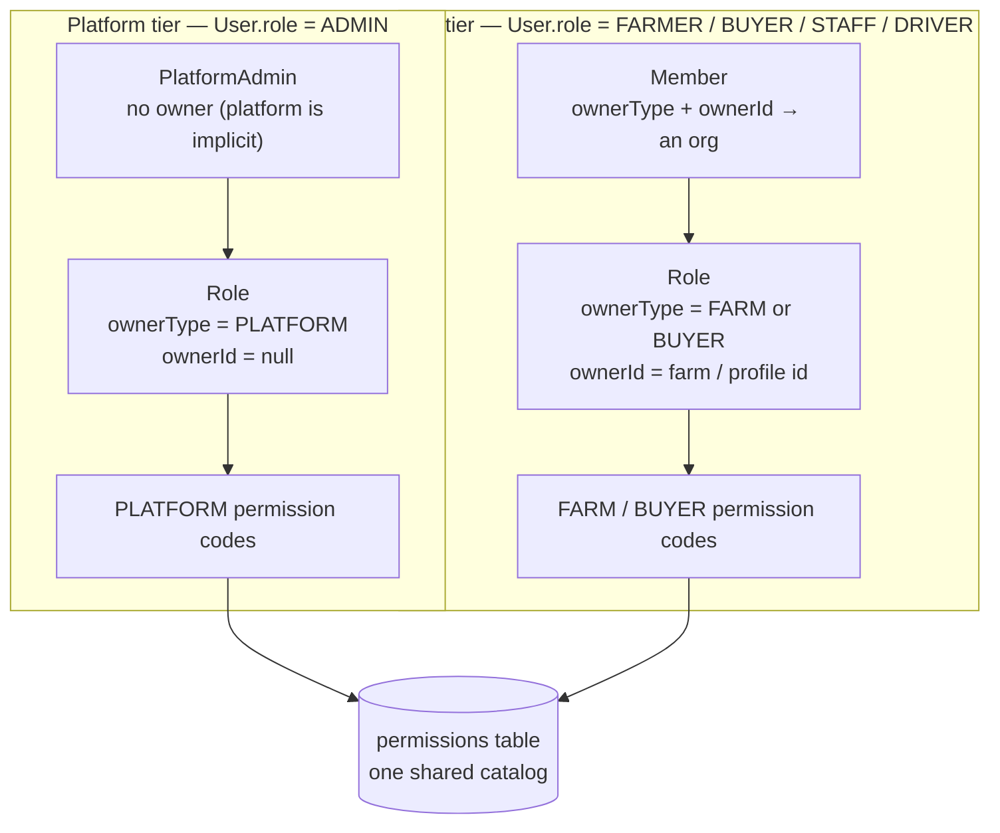
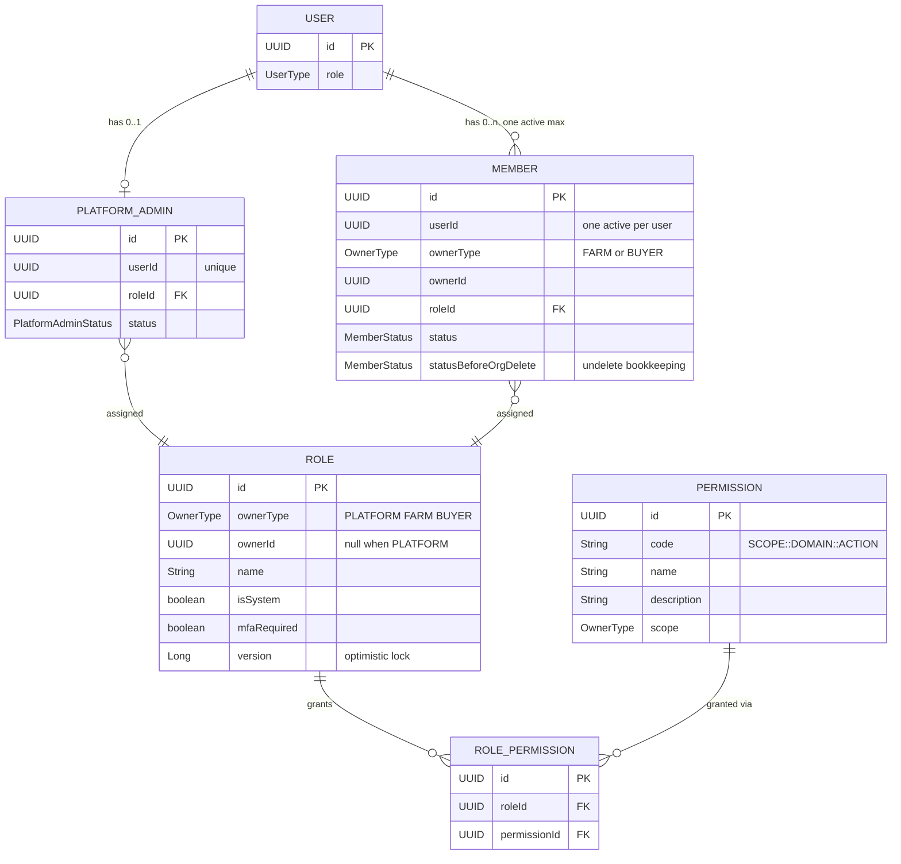
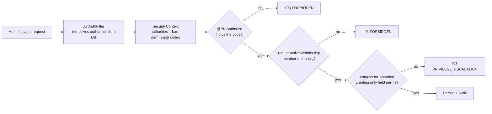

# RBAC & permissions

How CropDoor decides who can do what, once a request is already authenticated. Authentication answers *who is this caller* — the [authentication section](../auth/index.md) owns that. This section answers the next question: *what are they allowed to do*, and how the platform enforces it consistently across two very different populations of user.

CropDoor runs **two parallel RBAC tiers** that share one `Role` + `Permission` catalog but stay isolated at the entity level. Platform admins police the whole system through a platform tier; every farm and buyer organization runs its own org-scoped tier with its own roles. Both resolve to the same shape at request time — a flat set of permission codes in `<SCOPE>::<DOMAIN>::<ACTION>` form — so a single resolver and a single set of gates serve both. This page is the front door: the two-tier model, the entity graph, how a check flows, and the invariants that keep the model tight. The sibling pages go deep on each.

## The two-tier model

A `User` is one of a few `UserType` values (`model/user/User.java`). ADMIN users belong to the **platform tier**; FARMER, BUYER, STAFF, and DRIVER users belong to the **org tier**. The two tiers assign roles through different tables and manage different lifecycles, but they draw permissions from the same catalog.



### Why two tiers, not one polymorphic table

`PlatformAdmin` (`model/rbac/PlatformAdmin.java`) and `Member` (`model/rbac/Member.java`) look similar — each links a `User` to a `Role` and tracks a status — but they model different concepts, so they stay separate on purpose:

- **Ownership differs.** A platform admin has no owner; the platform itself is the implicit scope. A member carries a real `(ownerType, ownerId)` pointer to the specific farm or buyer profile it belongs to.
- **Lifecycles differ.** `PlatformAdminStatus` (`INVITED → ACTIVE ↔ SUSPENDED`, `any → REVOKED`, or `INVITED → EXPIRED` when an invite is never accepted) is admin-flavored; `MemberStatus` (`PENDING → ACTIVE → REVOKED / ORG_DELETED`, or `PENDING → EXPIRED` when an invite lapses) is org-flavored, including the org-soft-delete state that has no platform analogue.
- **Automation differs.** Each tier has its own invite/accept services and its own scheduled cleanup, which diverge in non-trivial ways.

The split is deliberate and load-bearing — do not merge the two into one membership entity.

### What the tiers share and don't

| Shared across both tiers | Owned separately per tier |
| --- | --- |
| The `Role` entity (`model/rbac/Role.java`), polymorphic over `OwnerType` | The assignment table — `platform_admins` vs `members` |
| The `Permission` catalog (`model/rbac/Permission.java`) | The status enum — `PlatformAdminStatus` vs `MemberStatus` |
| The `RolePermission` join (`model/rbac/RolePermission.java`) | The invite + accept services |
| The resolver `PermissionResolutionService#effectivePermissionCodes` (`service/rbac/PermissionResolutionService.java`) | The scheduled lifecycle automation |

### Polymorphic role ownership

`Role` is polymorphic over `OwnerType` (`model/common/OwnerType.java`), the same enum used for `Permission.scope`. That single enum is what keeps a permission from ever attaching to the wrong kind of role:

| `ownerType` | `ownerId` | Meaning |
| --- | --- | --- |
| `PLATFORM` | `null` | A platform-tier role |
| `FARM` | `<farmId>` | A farm-tier role belonging to that farm |
| `BUYER` | `<buyerProfileId>` | A buyer-tier role belonging to that profile |

The `null`-when-`PLATFORM`, non-null-otherwise shape is pinned at the database level by the V19 `roles_owner_valid` check constraint, so a malformed role can never be persisted. Because `Permission.scope` reuses `OwnerType`, a `scope = FARM` permission only ever joins to a `ownerType = FARM` role. (`OwnerType` collapsed an earlier, identical `PermissionScope` enum — the two were duplicates.)

Every permission code follows one shape:

```
<SCOPE>::<DOMAIN>::<ACTION>
```

where `SCOPE ∈ PLATFORM | FARM | BUYER`, `DOMAIN` is a resource noun, and `ACTION` is the verb — e.g. `PLATFORM::USER::VIEW`, `FARM::ROLE::CREATE`, `BUYER::AUDIT::VIEW`. Every code referenced from Java goes through a constant on `security/Permissions.java`, and every constant has a matching row in the `permissions` table; the [permission catalog](permission-catalog.md) is the full enumeration and the convention in detail.

## Entity relationships

The whole RBAC graph is six entities. `User` fans out to at most one `PlatformAdmin` and zero-or-more `Member` rows (but at most one *active* membership); each assignment points at a `Role`; a `Role` grants many `Permission` rows through the `RolePermission` join.



A few facts the diagram encodes:

- **`PlatformAdmin.userId` is uniquely constrained** — a user is a platform admin at most once.
- **The one-active-membership rule** is enforced by a partial unique index on `members(user_id) WHERE status IN ('PENDING','ACTIVE')`, not by a plain unique column, so revoked/expired/org-deleted rows can accumulate without blocking a fresh invite. The org-model side of this (Owner minting, re-invite reuse, dormant STAFF) lives in the [domain section](../domain/index.md); the RBAC mechanics live in [members & org lifecycle](members-and-org-lifecycle.md).
- **`Role.version`** is a JPA optimistic lock — concurrent role edits race-detect and one caller gets a 409.
- **`Member.statusBeforeOrgDelete`** is the bookkeeping column that lets an org undelete restore each member to its exact pre-delete status.

## How a permission check flows

The single source of truth for *what can this user do right now* is `PermissionResolutionService#effectivePermissionCodes` (`service/rbac/PermissionResolutionService.java`). It resolves a `User` to a flat `Set<String>` of permission codes in one read-only transaction:

1. `PlatformAdminRepository.findActiveByUserId` first — if an *ACTIVE* `PlatformAdmin` row exists, its role's permission codes win (a SUSPENDED / REVOKED / EXPIRED / INVITED admin row resolves as dormant and falls through to the member branch). **Platform beats member**: the resolver's precedence is defined even though today no user holds both.
2. Otherwise `MemberRepository` for the caller's membership — if present, that role's codes are returned.
3. Neither → **empty set**. A STAFF user with no active membership is *dormant*: they authenticate fine, but hold zero permission codes, so every org-scoped endpoint denies them with a generic 403 at the first gate. (A dedicated `STAFF_DORMANT_NO_MEMBERSHIP` error code is defined for this case but is not currently emitted — no code path throws it.)

There is **no cache** — permissions are resolved on every call, so a mid-session role edit takes effect on the caller's next token refresh with nothing to invalidate. The convenience accessor `PermissionResolutionService#hasAll` returns true only when the resolved set contains every required code; it is what the write-time escalation guard uses.

Authorities are **not** carried in the JWT. `JwtAuthFilter` (`security/jwt/JwtAuthFilter.java`) re-resolves them from the database on every request through `CustomUserDetailsService` (`security/CustomUserDetailsService.java`), which grants the bare permission codes as Spring Security authorities. A request then crosses up to three gates:



- **Gate 1 — `@PreAuthorize` at the controller** answers *does the caller hold permission X*, using a bare code. Both tiers gate here.
- **Gate 2 — `requireActiveMembership` in the service** answers *is the caller a member of the org named in the path* — something a permission code alone cannot express, so a member of farm A with `FARM::LISTING::VIEW` still cannot read farm B.
- **Gate 3 — `enforceNoEscalation`** fires only on role-mutation writes, checking that every permission being granted is a subset of the caller's own effective set.

The [authorization page](authorization.md) is the full account of why three layers rather than one. All three deny with **403** — gates 1 and 2 as a generic `FORBIDDEN`, gate 3 as `PRIVILEGE_ESCALATION`.

### Load-bearing invariants

These hold across both tiers; several are pinned at the database or build level, not just in service code. Each is a one-liner here — the [security invariants page](security-invariants.md) is the depth reference.

| Invariant | The rule in one line |
| --- | --- |
| **No privilege escalation** | A caller can never grant a permission they don't hold; re-checked at role create, role update, member invite, and member role change. |
| **Owner role immutable + non-invitable** | The auto-minted `Owner` role cannot be edited, deleted, or assigned by invite — only a Flyway migration touches it. |
| **One org per user** | At most one active membership per user, enforced by a partial unique index and a service-level check. |
| **PLATFORM roles must MFA** | Every `ownerType = PLATFORM` role has `mfa_required = true`, pinned by the V37 check constraint and re-forced server-side. |
| **Last super-admin protection** | The final active super-admin cannot be revoked or suspended — no admin-lockout path. |
| **No self-modification** | An admin cannot suspend or revoke their own platform-admin assignment; a peer must act. |
| **Cross-tenancy isolation** | Farm-side classes cannot inject buyer-side beans (or vice versa), pinned at build time by ArchUnit. |

## In this section

| Page | Covers |
| --- | --- |
| [Permission catalog](permission-catalog.md) | Every permission code grouped by scope, the `<SCOPE>::<DOMAIN>::<ACTION>` convention, `Permissions.*`-constant discipline, and the recipe for adding one |
| [Roles](roles.md) | System roles (`SUPER_ADMIN`, `Owner`) and custom roles — minting, the `isSystem` / `mfaRequired` flags, and the auto-grant-all-of-scope pattern |
| [Authorization](authorization.md) | The three-layer gate pipeline (`@PreAuthorize` → `requireActiveMembership` → `enforceNoEscalation`), authority resolution, and endpoint recipes |
| [Security invariants](security-invariants.md) | The hard rules in depth — escalation, owner immutability, one-org-per-user, MFA pin, last-super-admin, no-self-mod, cross-tenancy isolation |
| [Members & org lifecycle](members-and-org-lifecycle.md) | Member invite/accept/revoke/role-change, the dormant-STAFF case, the per-org audit feed, and org soft-delete + undelete cascade |

## Where it lives

| Concern | Source |
| --- | --- |
| Permission constants + code convention | `security/Permissions.java` |
| Authority resolution at request time | `security/CustomUserDetailsService.java`, `security/jwt/JwtAuthFilter.java` |
| Permission resolver + org-role mutations | `service/rbac/` (`PermissionResolutionService`, `OrgRoleService`) |
| RBAC entities | `model/rbac/` (`PlatformAdmin`, `Member`, `Role`, `Permission`, `RolePermission`, `MemberStatus`, `PlatformAdminStatus`) |
| Owner-type enum | `model/common/OwnerType.java` |
| Persistence | `repository/rbac/` (`PlatformAdminRepository`, `MemberRepository`, `RolePermissionRepository`, `PermissionRepository`) |
| Org lifecycle services (shared by both org tiers) | `service/org/` (`OrgMemberInviteService`, `OrgDeletionService`, `OrgAuditViewService`) |

!!! info "Status"
    **Shipped.** Both tiers are wired through entities, resolver, gates, migrations, and ArchUnit pins, and back every admin and org-scoped endpoint in production. Several catalog rows (`FARM::LISTING::*`, `FARM::ORDER::*`, and similar) are seeded ahead of the endpoints that will gate on them — see the [permission catalog](permission-catalog.md) for which codes are wired today versus forward-compatible.
