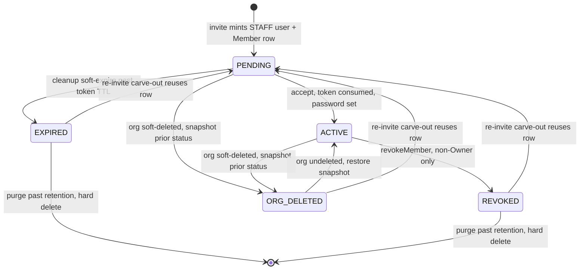
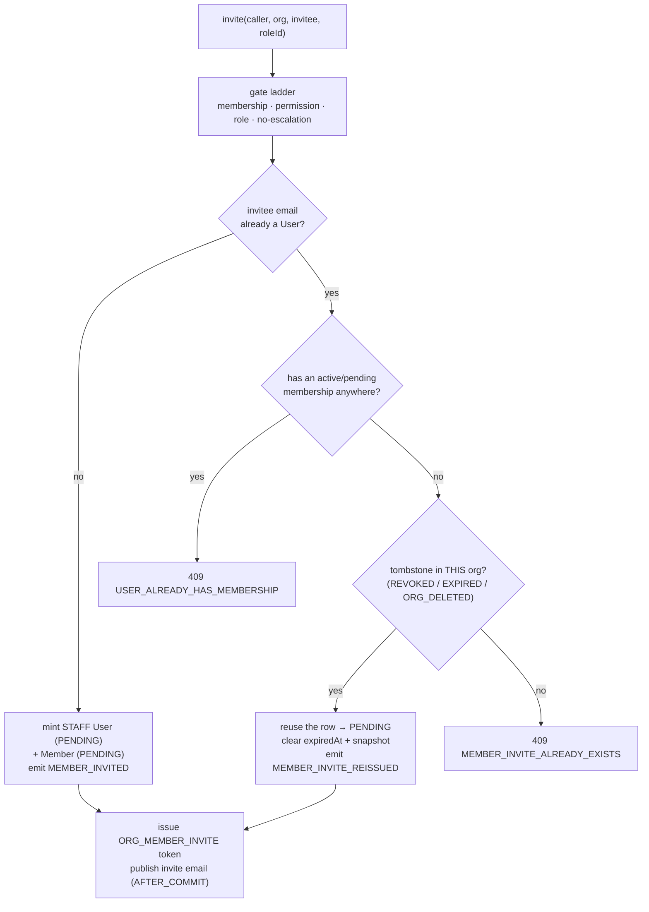
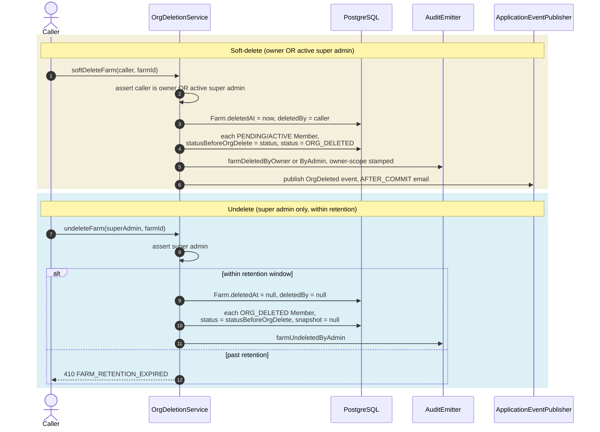

# Members, org lifecycle & the audit feed

Roles and permissions describe *what* an org-scoped caller can do; this page covers the machinery that binds a caller to an org role and keeps that binding honest over time. Three mechanics live here: the **member lifecycle** (how a `User` becomes — and stops being — an active member of a farm or buyer org), the **per-org audit feed** (the curated, owner-scoped view of what happened inside one org), and the **org soft-delete + undelete cascade** (how deleting an org freezes its team and how an undelete thaws it back to exactly where it was).

This is the org-tier counterpart to the platform-admin invite/lifecycle machinery. The broader org model — why `Member` and `PlatformAdmin` stay separate, how the `Owner` role is minted, the one-org-per-user rule as a domain concept — lives in the [domain section](../domain/index.md); this page owns the RBAC *mechanics*: the state machine, the gates each transition crosses, and the services that run them. The three-layer gate pipeline these services sit behind is the subject of [authorization](authorization.md), and the audit subsystem they write into is documented in the [audit section](../audit/index.md).

## The member entity

A membership is one `Member` row (`model/rbac/Member.java`, table `members`) linking a `User` to a `Role` within a specific org, carried by the polymorphic `(ownerType, ownerId)` pointer (`FARM`/`BUYER` plus the farm or buyer-profile id). Beyond the obvious columns, three fields carry the lifecycle:

| Field | Role |
| --- | --- |
| `status` (`MemberStatus`) | The lifecycle state — the subject of the state machine below. Defaults to `PENDING` at mint. |
| `expiredAt` | Stamped when the cleanup job soft-expires an un-accepted invite (`PENDING → EXPIRED`); read by the hard-delete pass to decide which `EXPIRED` rows have aged past retention. Cleared on re-invite. |
| `statusBeforeOrgDelete` | The bookkeeping snapshot that makes org-undelete exact — captures the member's status at the moment its org was soft-deleted, so an undelete can restore the precise prior state. Cleared after restore. |
| `version` (`@Version`) | JPA optimistic lock. Concurrent re-invite, revoke, and role-change flows race-detect on it, and the losing writer gets a `409` rather than silently clobbering. |

The one-active-membership rule (a user is a member of at most one org at a time) is enforced by a partial unique index on `members(user_id) WHERE status IN ('PENDING','ACTIVE')`, so `REVOKED` / `EXPIRED` / `ORG_DELETED` tombstones accumulate freely without blocking a fresh invite — which is exactly what the re-invite carve-out below relies on.

## Member lifecycle

`MemberStatus` (`model/rbac/MemberStatus.java`) has five states. The happy path is a two-step **invite → accept**; every other edge is a lifecycle event — expiry, revocation, org deletion, or a re-invite reusing a tombstoned row.



| State | Meaning | Entered by | Left by |
| --- | --- | --- | --- |
| `PENDING` | Invited, not yet accepted | `invite` (fresh mint) or a re-invite reusing a tombstone | accept → `ACTIVE`; soft-expire → `EXPIRED`; org delete → `ORG_DELETED` |
| `ACTIVE` | Accepted, full member; the only state the permission resolver treats as live | `accept` | `revokeMember` → `REVOKED`; org delete → `ORG_DELETED` |
| `REVOKED` | Removed by an operator; a dormant tombstone | `revokeMember` | re-invite → `PENDING`; hard-deleted past retention |
| `EXPIRED` | Invite lapsed without acceptance | cleanup soft-expire pass | re-invite → `PENDING`; hard-deleted past retention |
| `ORG_DELETED` | The owning org was soft-deleted; read-only/dormant | org soft-delete cascade | org undelete → restored snapshot; re-invite → `PENDING` |

Only `ACTIVE` counts. `MemberRepository#findActiveByUser` is what every gate consults, so a member in any other state is invisible to the org's endpoints. A `STAFF` user whose only membership is a `REVOKED` / `EXPIRED` / `ORG_DELETED` tombstone is **dormant** — they authenticate fine, but every org-scoped endpoint answers `403 STAFF_DORMANT_NO_MEMBERSHIP` until they accept a fresh invite. (The dormant-STAFF concept is shared with the [domain section](../domain/index.md); the enforcement is the empty-permission-set path in [authorization](authorization.md).)

### Two services, one lifecycle

The lifecycle is split across two `@Service` beans under `service/org/`, and the split is by concern, not by tier:

| Service | Owns | Key methods |
| --- | --- | --- |
| `OrgMemberInviteService` (`service/org/OrgMemberInviteService.java`) | Invite **issuance**, **accept**, and the scheduled **cleanup** job | `invite`, `accept`, `cleanupOrgInvites` |
| `OrgMemberService` (`service/org/OrgMemberService.java`) | Member **management** on an existing roster | `revokeMember`, `changeMemberRole`, `listMembers`, `listMembersForAdmin`, `memberCounts` |

Both are shared org-scoped beans that farm-side and buyer-side controllers may inject (the cross-tenancy ArchUnit rule forbids a farm controller from reaching into buyer services, but these org-neutral beans are the sanctioned shared surface — see [security invariants](security-invariants.md)).

### Invite issuance

`OrgMemberInviteService#invite` pre-creates the invitee and their `PENDING` membership. Before anything persists it runs a gate ladder, and each rung has its own failure:

1. **Caller is an active member of the target org** — `findActiveByUser` must return a membership whose `(ownerType, ownerId)` matches the path; otherwise `AccessDeniedException` (`403`).
2. **Caller holds the invite permission** — `FARM::MEMBER::INVITE` or `BUYER::MEMBER::INVITE` per `ownerType`; otherwise `403`.
3. **Target role belongs to this org and is not the `Owner` role** — a system role trips `OwnerRoleNotInvitableException` (`409 OWNER_ROLE_NOT_INVITABLE`); the `Owner` role is bound to the founder and can never be granted by invite.
4. **No privilege escalation** — every permission code on the target role must be in the caller's own effective set, or `PrivilegeEscalationException` (`403 PRIVILEGE_ESCALATION`). This is the same write-time subset check the role-mutation paths enforce; re-running it here stops a caller from handing out, via invite, a role richer than they hold.

Only then does it branch on whether the invitee already exists:



The **re-invite carve-out** is what the partial unique index buys: if the invitee has a `REVOKED` / `EXPIRED` / `ORG_DELETED` tombstone in the *same* org, `invite` reuses that exact row — flipping it back to `PENDING`, clearing `expiredAt` and `statusBeforeOrgDelete`, re-pointing it at the new role — and emits `MEMBER_INVITE_REISSUED` instead of `MEMBER_INVITED`. Two concurrency races are absorbed into the same `409 USER_ALREADY_HAS_MEMBERSHIP`: an optimistic-lock failure on the reused row (another operator re-invited the same user to this org first) and a unique-index violation on the `PENDING` flip (another operator re-invited them to a *different* org first).

The invite mints a `VerificationToken` of purpose `ORG_MEMBER_INVITE` with a TTL of `app.org.invite-token-ttl-hours` (default `168`, i.e. 7 days), and publishes the invite email on an `AFTER_COMMIT` transactional event so a rolled-back invite never sends mail. The audit emission carries a `MemberInviteContext` (`service/platform/audit/context/MemberInviteContext.java`) that stamps the owner-scope keys the feed below depends on.

### Accept

`OrgMemberInviteService#accept` consumes the raw token, sets the invitee's password, flips the `User` to `ACTIVE`, and flips the membership `PENDING → ACTIVE` with `joinedAt` stamped. It guards against a stale link: if the membership is no longer `PENDING` (already accepted, revoked, expired, or org-deleted), it rejects with `InvalidVerificationTokenException`. On success it emits `MEMBER_INVITE_ACCEPTED` and immediately issues a session — MFA-aware, exactly like login: if the accepted role has `mfaRequired = true`, the response is an MFA challenge (the OTP has already been dispatched) rather than full tokens. The HTTP shape of that accept-and-session step is documented in the [authentication section](../auth/index.md).

### Revoke and role-change

`OrgMemberService` owns the two mutations on an existing roster, both guarded against the immutable `Owner` role and both wrapped in optimistic-lock handling:

- **`revokeMember`** — checks the caller's membership + `FARM::MEMBER::REVOKE` / `BUYER::MEMBER::REVOKE`, refuses to revoke a member whose role `isSystem` (the `Owner` — ownership transfer is not a v1 operation), flips `status → REVOKED`, and emits `MEMBER_REVOKED`. A concurrent edit surfaces as `ConcurrentMemberEditException` (`409`).
- **`changeMemberRole`** — the role-reassignment path. It rejects reassigning *away from* the `Owner` role (`OwnerRoleImmutableException`, `403 OWNER_ROLE_IMMUTABLE`) and reassigning *to* the `Owner` role (`OwnerRoleNotInvitableException`, `409`); requires the new role to belong to the member's own org; checks the caller's membership + `FARM::MEMBER::INVITE` / `BUYER::MEMBER::INVITE`; re-runs the **no-escalation** subset check against the new role's permissions; then repoints `member.role` and emits `MEMBER_ROLE_CHANGED`. The no-escalation re-check at role-change time is deliberate — a caller who has since lost a permission can no longer propagate it by reassigning someone into a role that carries it.

### Scheduled cleanup

`OrgMemberInviteService#cleanupOrgInvites` runs daily (`cron = "0 30 3 * * *"`, 03:30) in three passes, each batch-bounded:

| Pass | Selects | Action |
| --- | --- | --- |
| Soft-expire | `PENDING` rows older than the token TTL | `→ EXPIRED`, stamp `expiredAt`, emit `MEMBER_INVITE_EXPIRED`, notify the inviter by email |
| Purge expired | `EXPIRED` rows past `app.org.invite-expired-retention-days` (default `30`) | hard-delete the `Member` + its invite tokens, emit `MEMBER_INVITE_PURGED`; also delete the `STAFF` `User` **iff** it has no other memberships |
| Purge revoked | `REVOKED` rows aged past the same retention window | hard-delete the `Member` row **only** — a revoked member was a real participant whose `User` account may still be in use elsewhere |

`ORG_DELETED` rows are deliberately **not** touched by cleanup: their lifecycle is owned by the org-deletion path (restored on undelete, or aged out when the org itself is permanently purged), not by member age. A `@PostConstruct` config check fails startup fast if the token TTL is not strictly less than the retention window (in hours) — a misconfiguration that would otherwise let rows become purge-eligible before they ever aged into `EXPIRED`.

### The controller gate

Org-member and audit endpoints do **not** gate with a bare `hasAuthority(...)`. Because a permission code alone cannot answer "member of *which* org?", the controllers gate with a SpEL bean call that fuses both questions — `@permissionResolutionService.belongsToFarmWith(principal, #farmId, 'FARM::…')` (and the `belongsToBuyerProfileWith` twin), backed by `service/rbac/PermissionResolutionService.java`. That resolver returns true only when the caller is an **`ACTIVE` member of exactly this org** *and* the code is in their effective set. The owning service method then re-checks the same membership + permission before mutating — belt-and-suspenders, so a service invoked from anywhere still enforces the org boundary.

| Endpoint | Controller | Gate (permission code) |
| --- | --- | --- |
| `GET /v1/farms/{farmId}/members` | `controller/farm/FarmMemberController.java` | `FARM::MEMBER::VIEW` |
| `POST /v1/farms/{farmId}/members/invites` | `FarmMemberController` | `FARM::MEMBER::INVITE` |
| `DELETE /v1/farms/{farmId}/members/{memberId}` | `FarmMemberController` | `FARM::MEMBER::REVOKE` |
| `PUT /v1/farms/{farmId}/members/{memberId}/role` | `FarmMemberController` | `FARM::MEMBER::INVITE` |
| `GET /v1/farms/{farmId}/audit` | `controller/farm/FarmAuditController.java` | `FARM::AUDIT::VIEW` |
| `GET /v1/buyer-profiles/{buyerProfileId}/…` | `controller/buyer/BuyerProfileMemberController.java`, `BuyerProfileAuditController.java` | `BUYER::MEMBER::*` / `BUYER::AUDIT::VIEW` |

The `Owner` role holds every permission of its scope, so an org founder always passes these gates; a custom-role member passes only where their role was explicitly granted the code. All codes route through constants on `security/Permissions.java` — the almanac's [permission catalog](permission-catalog.md) is the full enumeration.

## Per-org audit feed

Every farm and buyer profile has a curated audit feed — `GET /v1/farms/{farmId}/audit` and `GET /v1/buyer-profiles/{buyerProfileId}/audit`, served by `OrgAuditViewService#listForOrg` (`service/org/OrgAuditViewService.java`). It is not "show every audit row for this org": it is the **intersection of an action whitelist and an owner-scope match**, so an org sees the events that concern it and nothing that would leak a member's personal identity or a platform-admin action across the tenancy boundary.

After the membership + `FARM::AUDIT::VIEW` / `BUYER::AUDIT::VIEW` gate, the query filters two ways at once:

```
visible(row)  ⟺  row.action ∈ VISIBLE_ACTIONS
               ∧  details ->> 'ownerType' = <path ownerType>
               ∧  details ->> 'ownerId'   = <path ownerId>
```

The owner-scope half is a JSONB extraction against the audit row's structured `details` column. `AuditLogRepository#findByActionInAndOwnerScope` (`repository/platform/AuditLogRepository.java`) expresses it with `function('jsonb_extract_path_text', a.details, 'ownerType')` — which resolves to Postgres's `->>` operator at execution time, making the query Postgres-specific — matched against `ownerType.name()` and the stringified `ownerId`.

### The `KEY_OWNER_TYPE` + `KEY_OWNER_ID` hard rule

That JSONB match is why there is a non-negotiable emitter rule: **every farm- or buyer-scoped audit emission must stamp `KEY_OWNER_TYPE` and `KEY_OWNER_ID` into its details map.** The two keys are the literal strings `ownerType` and `ownerId` (`service/platform/AuditKeys.java`), written by the org-scoped emitter methods in `service/platform/AuditEmitterImpl.java` from each event's context record (e.g. `MemberLifecycleContext`, `OrgDeletionContext`). An emission that omits them is invisible to its own org's feed even if its action is whitelisted — the owner-scope predicate can never match. The rule is enforced by review plus the audit-emitter unit tests that assert the keys on every org-scoped method; see the [audit section](../audit/index.md) for the emitter/`@Audited` model.

### The visible-action whitelist

`VISIBLE_ACTIONS` is an `EnumSet` of `AuditAction` values (`model/platform/AuditAction.java`) held in `OrgAuditViewService`. It is an **allow-list**: a newly-added audit action is *not* shown in org feeds until it is deliberately added here — the safe default is invisible. It has grown well past its original member/role core to cover the full span of org-relevant activity:

| Category | Whitelisted actions (representative) |
| --- | --- |
| Member lifecycle | `MEMBER_INVITED`, `MEMBER_INVITE_ACCEPTED`, `MEMBER_INVITE_EXPIRED`, `MEMBER_INVITE_REISSUED`, `MEMBER_INVITE_PURGED`, `MEMBER_REVOKED`, `MEMBER_ROLE_CHANGED` |
| Org-role CRUD | `FARM_ROLE_CREATED` / `UPDATED` / `DELETED`, `BUYER_ROLE_CREATED` / `UPDATED` / `DELETED` |
| Org lifecycle | `FARM_CREATED`, `BUYER_CREATED`, `FARM_DELETED_BY_OWNER` / `_BY_ADMIN`, `FARM_UNDELETED_BY_ADMIN`, and the `BUYER_*` twins |
| Verification & moderation | `FARM_VERIFICATION_SUBMITTED`, `FARM_APPROVED`, `FARM_REJECTED`, `FARM_SUSPENDED` / `_UNSUSPENDED`, `BUYER_SUSPENDED` / `_UNSUSPENDED` |
| Listings | `LISTING_CREATED`, `LISTING_UPDATED`, `LISTING_ARCHIVED`, `LISTING_RESTORED`, `LISTING_BULK_PRICE_UPDATED`, `LISTING_IMAGE_ADDED` / `_REMOVED` |
| Orders | `ORDER_PLACED`, `ORDER_ACCEPTED`, `ORDER_STATUS_ADVANCED`, `ORDER_DELIVERED`, `ORDER_CANCELLED` |
| Payments | `CHARGEBACK_OPENED`, `RECEIPT_ISSUED`, `CREDIT_NOTE_ISSUED` |

What stays **out** is as important as what is in: personal-identity events (`LOGIN`, `OTP_*`, `PASSWORD_*`) would leak one member's account activity to the whole org, and platform-admin events (`ADMIN_*`) don't belong on an org feed at all — neither is whitelisted, so neither ever appears.

## Org soft-delete + undelete cascade

Deleting a farm or buyer profile is a **soft** delete with a recovery window, run by `OrgDeletionService` (`service/org/OrgDeletionService.java`). It flips the org's `deletedAt` / `deletedBy` (on `model/farm/Farm.java` / `model/buyer/BuyerProfile.java`) and cascades the team into a frozen state — nothing is physically removed until the retention window lapses.



**Who can delete.** The soft-delete entry points (`softDeleteFarm` / `softDeleteBuyerProfile`) are *not* `@PreAuthorize`-gated at the controller — the rule is "the org's owner **or** an active super admin," a per-org ownership check the service enforces directly (`DELETE /v1/farms/{farmId}` on `controller/farm/FarmController.java` delegates straight in). Undelete is stricter: `POST …/farms/{farmId}/undelete` on `controller/admin/AdminOrgController.java` gates on `hasRole('SUPER_ADMIN')`, and the service re-asserts an **active** `SUPER_ADMIN` platform-admin row so a suspended or revoked admin cannot authorize a restore.

**What cascades.** Only membership state. Every `PENDING`/`ACTIVE` member is snapshotted into `statusBeforeOrgDelete` and flipped to `ORG_DELETED`; undelete reverses it exactly, reading each member back to its captured prior status (falling back to `ACTIVE` only for a row that never flowed through the cascade). This snapshot is the whole trick — without it, undelete would have to reconstruct the pre-delete roster from the audit log.

**What never cascades.** Orders and payouts are deliberately left alone — financial records reference the org by foreign key and must keep querying historical data after a soft-delete. Listing and review cascades are a forward-compatible extension point, not wired today. The [domain section](../domain/index.md) covers the org lifecycle from the data-model side.

**The recovery window.** `app.org.deletion-retention-days` (default `30`) bounds undelete. Past it, `undeleteFarm` / `undeleteBuyerProfile` raise `FarmRetentionExpiredException` — mapped to `410 GONE` (`FARM_RETENTION_EXPIRED`) — and recovery becomes a DBA operation. Notifications ride `AFTER_COMMIT` application events (`OrgDeletedByOwnerEvent` / `OrgDeletedByAdminEvent`), so an email never goes out for a deletion that rolled back and a mail-transport hiccup never rolls back the deletion.

## Failure modes at a glance

| Exception | Trigger | HTTP · `errorCode` |
| --- | --- | --- |
| `AccessDeniedException` | Caller not an active member of the path's org, or missing the gated permission | `403 FORBIDDEN` |
| `PrivilegeEscalationException` | Inviting/reassigning into a role carrying a permission the caller lacks | `403 PRIVILEGE_ESCALATION` |
| `OwnerRoleImmutableException` | Reassigning a member *away from* the `Owner` role | `403 OWNER_ROLE_IMMUTABLE` |
| `OwnerRoleNotInvitableException` | Inviting or reassigning a member *into* the `Owner` role | `409 OWNER_ROLE_NOT_INVITABLE` |
| `UserAlreadyHasMembershipException` | Invitee already has an active/pending membership (incl. the two re-invite races) | `409 USER_ALREADY_HAS_MEMBERSHIP` |
| `MemberInviteAlreadyExistsException` | Invitee's email is registered with no reusable tombstone in this org | `409 MEMBER_INVITE_ALREADY_EXISTS` |
| `ConcurrentMemberEditException` | Optimistic-lock clash on a concurrent revoke / role-change | `409` |
| `MemberNotFoundException` | Revoke / role-change targets a non-existent member | `404 MEMBER_NOT_FOUND` |
| `InvalidVerificationTokenException` | Accept link consumed against a membership no longer `PENDING` | `400` |
| `FarmRetentionExpiredException` | Undelete after the retention window lapsed | `410 FARM_RETENTION_EXPIRED` |

`STAFF_DORMANT_NO_MEMBERSHIP` (`403`) is the resolver-level companion — not thrown by these services but returned by any org-scoped endpoint a dormant STAFF user hits, because the empty permission set fails every gate. The full code → status → message mapping lives on `dto/ErrorCode.java` and in the almanac's error-handling reference.

## Where it lives

| Concern | Source |
| --- | --- |
| Member entity + status enum | `model/rbac/Member.java`, `model/rbac/MemberStatus.java` |
| Invite / accept / scheduled cleanup | `service/org/OrgMemberInviteService.java` |
| Roster management (list / revoke / role-change) | `service/org/OrgMemberService.java` |
| Combined membership + permission gate | `service/rbac/PermissionResolutionService.java` (`belongsToFarmWith`, `belongsToBuyerProfileWith`) |
| Per-org audit feed | `service/org/OrgAuditViewService.java`, `repository/platform/AuditLogRepository.java` |
| Owner-scope audit keys | `service/platform/AuditKeys.java`, `service/platform/AuditEmitterImpl.java` |
| Org soft-delete + undelete cascade | `service/org/OrgDeletionService.java` |
| Endpoints | `controller/farm/FarmMemberController.java`, `controller/farm/FarmAuditController.java`, `controller/farm/FarmController.java`, `controller/buyer/BuyerProfileMemberController.java`, `controller/buyer/BuyerProfileAuditController.java`, `controller/admin/AdminOrgController.java` |
| Permission constants | `security/Permissions.java` |

!!! info "Status"
    **Shipped.** Member invite/accept/revoke/role-change, the daily cleanup job, the per-org audit feed, and org soft-delete + undelete are wired through entities, services, gates, migrations, and tests, and back every org-scoped roster and audit endpoint in production.
