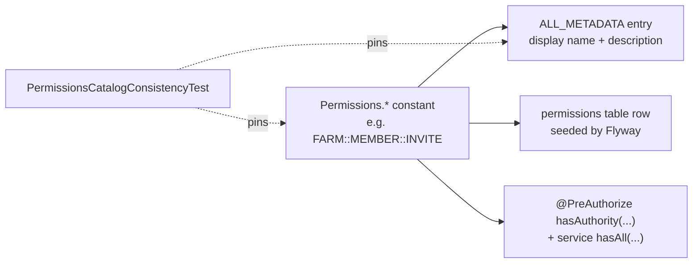

# The permission catalog

A **permission** is a single bare-string code — `FARM::MEMBER::INVITE`, `PLATFORM::USER::SUSPEND` — that gates exactly one capability somewhere in the API. Roles aggregate permissions; users hold roles through a `PlatformAdmin` row (platform tier) or a `Member` row (org tier). At request time the code is the whole story: the frontend branches on whether the resolved permission set contains the code, and the backend gate asks Spring Security `hasAuthority('<CODE>')`. Permissions are never carried in the JWT — they are re-resolved from the database on every request (see [Authorization](authorization.md)).

This page is the canonical enumeration: the code convention, the three scopes, the special roles that hold whole scopes automatically, the full 65-code catalog, the guarantees that keep the Java constants and the database rows from drifting apart, and the recipe for adding a new code. Every code lives as a `public static final String` constant on `security/Permissions.java` and as a matching row in the `permissions` table — those two facts, pinned by a test, are what make a bare string safe to scatter across annotations.

## The code convention

Every permission code has exactly three `::`-separated segments:

```
<SCOPE>::<DOMAIN>::<ACTION>
```

- **`SCOPE`** is one of `FARM`, `BUYER`, `PLATFORM`. It decides which tier the code belongs to and which roles can ever hold it — a code with scope `FARM` only attaches to a role whose `ownerType` is `FARM`. `Permission.scope` and `Role.ownerType` share the same `model/common/OwnerType.java` enum.
- **`DOMAIN`** is the noun the permission targets — `MEMBER`, `ROLE`, `LISTING`, `ORDER`, `FINANCIAL`, `AUDIT`, `ORG`, `USER`, `ADMIN`, `DISPUTE`, `SETTINGS`, and so on. A domain may contain an underscore (`SAVED_FARM`, `TEST_SEED`).
- **`ACTION`** is a verb drawn from a fixed vocabulary of sixteen.

Codes are scope-disjoint by construction, so the bare wire form never collides — `hasAuthority('FARM::ROLE::CREATE')` is unambiguous, and Spring authorities carry no separate scope prefix to strip.

### The action vocabulary

`ACTION` must be one of these sixteen verbs. `VIEW` is the canonical read verb — the catalog never uses `READ`. `MANAGE` is the escape hatch, reserved for resources that do not cleanly decompose into CRUD.

| Verb | Used for |
| --- | --- |
| `CREATE` | Bring a resource into existence (a role, a listing, an order). |
| `VIEW` | Read a resource or list. The one read verb — `READ` is not used. |
| `UPDATE` | Mutate an existing resource. |
| `DELETE` | Soft-delete (usually) a resource. |
| `CANCEL` | Take a non-terminal resource out of flight (a cancellable order). |
| `INVITE` | Issue an invite token that does not yet bind the invitee. |
| `REVOKE` | Tear down an existing relationship or assignment. |
| `SUSPEND` | Freeze an account or organization without deleting it. |
| `APPROVE` | Admit a farm or buyer organization to the platform. |
| `FULFILL` | Advance an order to fulfilled. |
| `RESOLVE` | Close out a dispute with a decision. |
| `RESPOND` | Post a public reply (a farm's response to a review). |
| `SEND` | Emit a message in a conversation. |
| `EXPORT` | Bulk-download in a non-UI format — distinct from `VIEW` because it is logged. |
| `IMPERSONATE` | Act on the platform as another user for support. |
| `MANAGE` | Operate an opaque resource that does not decompose into CRUD. |

!!! note "Where `MANAGE` actually lives"
    `MANAGE` is deliberately rare. Today it holds exactly five codes: `BUYER::SAVED_FARM::MANAGE`, `BUYER::ADDRESS::MANAGE`, `PLATFORM::FINANCIAL::MANAGE`, `PLATFORM::SETTINGS::MANAGE`, and `PLATFORM::TEST_SEED::MANAGE` — each a bucket of operations (save/unsave/annotate, create/edit/delete/set-default, read-and-write configuration) where splitting into per-verb codes would add rows without adding a real authorization boundary. Reach for it only when the alternative is inventing verbs the catalog doesn't have.

## Scopes at a glance

The three scopes map onto CropDoor's two RBAC tiers: `PLATFORM` is the admin tier; `FARM` and `BUYER` are the two org tiers. The [two-tier model](index.md) explains why the split exists; this table is the shape of it.

| Scope | Tier | Held by | Codes | Domains |
| --- | --- | --- | --- | --- |
| `FARM` | Org (farm) | Farm `Owner` + custom farm roles | 23 | `MEMBER`, `ROLE`, `LISTING`, `ORDER`, `FINANCIAL`, `AUDIT`, `ORG`, `VERIFICATION`, `REVIEW`, `MESSAGE` |
| `BUYER` | Org (buyer) | Buyer `Owner` + custom buyer roles | 19 | `MEMBER`, `ROLE`, `MARKETPLACE`, `SAVED_FARM`, `ORDER`, `FINANCIAL`, `AUDIT`, `ORG`, `REVIEW`, `MESSAGE`, `ADDRESS` |
| `PLATFORM` | Platform admin | `SUPER_ADMIN` + custom admin roles | 23 | `USER`, `ADMIN`, `ROLE`, `AUDIT`, `DISPUTE`, `FINANCIAL`, `SETTINGS`, `TEST_SEED`, `ORG`, `DELIVERY`, `ORDER` |

**65 permissions total** at the time of writing. Every `PLATFORM`-scope role additionally must have `mfa_required = true` — holders of any platform permission are platform admins, and platform admins always pass through MFA (see [Security invariants](security-invariants.md)).

## Special cases: roles that hold a whole scope

Three rules govern how roles acquire codes, and two of them mean a role's effective set is computed live rather than stored as `role_permissions` rows:

- **`SUPER_ADMIN` holds every `PLATFORM` permission**, resolved at request time. `security/CustomUserDetailsService.java` (`#loadAdminPrincipal`) grants a super admin the result of `repository/rbac/PermissionRepository.java` (`#findByScope`) for `OwnerType.PLATFORM` rather than reading their stored grants. A newly seeded `PLATFORM` code therefore flows to every super admin on the next request — no backfill.
- **The auto-minted `Owner` role holds every permission of its scope** — but as a *stored snapshot*, not a live resolution. `service/farm/FarmServiceImpl.java` (`#createFarm`) and `service/buyer/BuyerProfileServiceImpl.java` (`#createBuyerProfile`) mint the `Owner` role from `findByScope(OwnerType.FARM)` / `findByScope(OwnerType.BUYER)` at org-creation time and persist the result as fixed `role_permissions` rows. A new `FARM::*` / `BUYER::*` code therefore reaches only orgs created *after* it is seeded — existing Owner roles keep their snapshot until a backfill migration grants the new row. The `Owner` role is immutable and non-invitable — see [System and custom roles](roles.md).
- **Custom roles hold only their explicit grants.** A non-`Owner`, non-`SUPER_ADMIN` role holds exactly the `RolePermission` rows its creator selected. It does **not** auto-acquire newly seeded codes; an org must opt in by editing the role. This is deliberate — an org's "Field Worker" role should not silently gain a capability the platform ships next quarter.

!!! info "Forward-compatible rows"
    A code can be seeded before the endpoint that gates on it ships. Several catalog rows exist ahead of their surface — the row is real, the `Owner`/`SUPER_ADMIN` auto-grant picks it up, and the controller wiring lands later. A permission's presence in the catalog is not a guarantee that an endpoint reads it yet.

## The full catalog

Every row below is one constant on `security/Permissions.java` and one row in the `permissions` table. The constant identifier is the code with `::` replaced by `_` (`FARM::MEMBER::INVITE` → `FARM_MEMBER_INVITE`), and the display name and description mirror the seeded row — all three pinned by the consistency test. Rows are grouped by domain in declaration order.

### `FARM` scope (23)

| Code | Name | Gates |
| --- | --- | --- |
| `FARM::MEMBER::INVITE` | Invite team members | Issue and re-issue org-member invites for the farm. |
| `FARM::MEMBER::REVOKE` | Revoke team members | Remove a team member from the farm. |
| `FARM::MEMBER::VIEW` | View team roster | View the list of current and past members. |
| `FARM::ROLE::VIEW` | View roles | List farm roles and the permission catalog. |
| `FARM::ROLE::CREATE` | Create roles | Create non-Owner roles within the farm role catalog. |
| `FARM::ROLE::UPDATE` | Update roles | Update non-Owner role permissions. |
| `FARM::ROLE::DELETE` | Delete roles | Delete non-Owner roles. |
| `FARM::LISTING::VIEW` | View listings | Read produce listings the farm has posted. |
| `FARM::LISTING::CREATE` | Create listings | Post new produce listings on behalf of the farm. |
| `FARM::LISTING::UPDATE` | Update listings | Edit existing listings. |
| `FARM::LISTING::DELETE` | Delete listings | Remove listings from the marketplace. |
| `FARM::ORDER::VIEW` | View incoming orders | See the order queue for the farm. |
| `FARM::ORDER::FULFILL` | Mark orders fulfilled | Update an order's status to fulfilled. |
| `FARM::FINANCIAL::VIEW` | View financial data | See revenue, payouts, and tax summaries. |
| `FARM::FINANCIAL::UPDATE` | Update payout details | Set the farm's payout destination (mobile money or bank account). |
| `FARM::FINANCIAL::EXPORT` | Export financial data | Download CSV/PDF financial reports. |
| `FARM::AUDIT::VIEW` | View farm audit feed | Access the curated per-farm audit-event feed. |
| `FARM::ORG::DELETE` | Soft-delete the farm | Initiate the 30-day soft-delete of the farm. |
| `FARM::VERIFICATION::CREATE` | Submit verification | Create and submit the farm's verification with documents. |
| `FARM::VERIFICATION::VIEW` | View verification | View the farm's verification status and documents. |
| `FARM::REVIEW::RESPOND` | Respond to reviews | Post a public response to a buyer's review. |
| `FARM::MESSAGE::VIEW` | View messages | Read conversations and messages with buyers. |
| `FARM::MESSAGE::SEND` | Send messages | Start conversations and send messages to buyers. |

### `BUYER` scope (19)

| Code | Name | Gates |
| --- | --- | --- |
| `BUYER::MEMBER::INVITE` | Invite team members | Issue and re-issue org-member invites for the buyer profile. |
| `BUYER::MEMBER::REVOKE` | Revoke team members | Remove a team member from the buyer profile. |
| `BUYER::MEMBER::VIEW` | View team roster | View the list of current and past members. |
| `BUYER::ROLE::VIEW` | View roles | List buyer roles and the permission catalog. |
| `BUYER::ROLE::CREATE` | Create roles | Create non-Owner roles within the buyer role catalog. |
| `BUYER::ROLE::UPDATE` | Update roles | Update non-Owner role permissions. |
| `BUYER::ROLE::DELETE` | Delete roles | Delete non-Owner roles. |
| `BUYER::MARKETPLACE::VIEW` | Browse marketplace | Read produce listings across all farms and public farm storefronts. |
| `BUYER::SAVED_FARM::MANAGE` | Manage saved suppliers | Save, unsave, and annotate farms a buyer follows. |
| `BUYER::ORDER::CREATE` | Place orders | Place new orders against listings. |
| `BUYER::ORDER::VIEW` | View orders | See the order history for the buyer profile. |
| `BUYER::FINANCIAL::VIEW` | View financial data | See spending and receipt summaries. |
| `BUYER::FINANCIAL::EXPORT` | Export financial data | Download CSV/PDF financial reports. |
| `BUYER::AUDIT::VIEW` | View audit feed | Access the curated per-buyer audit-event feed. |
| `BUYER::ORG::DELETE` | Soft-delete the profile | Initiate the 30-day soft-delete of the buyer profile. |
| `BUYER::REVIEW::CREATE` | Leave reviews | Rate and review farms after a delivered order. |
| `BUYER::MESSAGE::VIEW` | View messages | Read conversations and messages with farms. |
| `BUYER::MESSAGE::SEND` | Send messages | Start conversations and send messages to farms. |
| `BUYER::ADDRESS::MANAGE` | Manage delivery addresses | Create, edit, delete, and set the default buyer delivery address. |

### `PLATFORM` scope (23)

| Code | Name | Gates |
| --- | --- | --- |
| `PLATFORM::USER::VIEW` | View users | List and inspect platform users. |
| `PLATFORM::USER::SUSPEND` | Suspend users | Suspend or unsuspend user accounts. |
| `PLATFORM::USER::IMPERSONATE` | Impersonate users | Act on the platform as another user for support purposes. |
| `PLATFORM::ADMIN::VIEW` | View admin assignments | List and inspect platform-admin assignments. |
| `PLATFORM::ADMIN::INVITE` | Invite admins | Invite new platform admins. |
| `PLATFORM::ADMIN::SUSPEND` | Suspend admins | Suspend or unsuspend platform-admin assignments. |
| `PLATFORM::ADMIN::REVOKE` | Revoke admins | Revoke a platform-admin assignment permanently. |
| `PLATFORM::ROLE::VIEW` | View admin roles | List and inspect platform admin roles and the permission catalog. |
| `PLATFORM::ROLE::CREATE` | Create admin roles | Create new non-system platform admin roles. |
| `PLATFORM::ROLE::UPDATE` | Update admin roles | Update non-system platform admin roles. |
| `PLATFORM::ROLE::DELETE` | Delete admin roles | Delete non-system platform admin roles. |
| `PLATFORM::AUDIT::VIEW` | View audit logs | Read the platform-wide audit trail. |
| `PLATFORM::DISPUTE::VIEW` | View disputes | Read open and closed disputes. |
| `PLATFORM::DISPUTE::RESOLVE` | Resolve disputes | Take action to resolve a dispute. |
| `PLATFORM::FINANCIAL::VIEW` | View platform finances | Read platform-wide financial data. |
| `PLATFORM::FINANCIAL::MANAGE` | Manage platform finances | Manage platform financial records. |
| `PLATFORM::SETTINGS::MANAGE` | Manage platform settings | Read and update platform configuration. |
| `PLATFORM::TEST_SEED::MANAGE` | Manage test seed | Refresh ephemeral seed data on shared testing environments. Not for production use. |
| `PLATFORM::ORG::APPROVE` | Approve organisations | Approve or reject farm and buyer organisations. |
| `PLATFORM::ORG::SUSPEND` | Suspend organisations | Suspend or reinstate farms and buyer profiles. |
| `PLATFORM::ORG::VIEW` | View organizations | View the platform-wide list of farms and buyer profiles and their members. |
| `PLATFORM::DELIVERY::VIEW` | View deliveries | View the platform-wide delivery logistics feed. |
| `PLATFORM::ORDER::CANCEL` | Cancel orders | Cancel a non-terminal order, e.g. a failed or refused delivery the farm cannot exit. |

## Consistency guarantees

A bare string used in a `@PreAuthorize` annotation is a magic value — a typo compiles, ships, and silently denies every request. CropDoor buys that risk down with three linked guarantees.



- **Every code goes through a `Permissions.*` constant.** Java code — controller `@PreAuthorize` expressions, service-layer `service/rbac/PermissionResolutionService.java` (`#hasAll`) checks, test fixtures — references the constant, never the inline literal. Concatenating the constant into the annotation string (`hasAuthority('" + Permissions.FARM_MEMBER_INVITE + "')`) keeps the code path and the catalog pointing at the same value.
- **Every constant has a matching database row.** Codes are seeded by Flyway migrations — `V42__rename_permission_codes_to_scoped_format.sql` re-seeded the canonical `SCOPE::DOMAIN::ACTION` catalog and re-linked `SUPER_ADMIN` and every `Owner` role, with later additive migrations adding rows. The `permissions` table is the runtime source of truth that `findByScope` and the role-permission joins read.
- **`PermissionsCatalogConsistencyTest` pins the Java side.** The architecture test (`src/test/java/com/cropdoor/backend/architecture/PermissionsCatalogConsistencyTest.java`) asserts, over reflection on every `public static final String` on `Permissions`: each code has exactly three `::` segments; the scope is one of `FARM | BUYER | PLATFORM`; the action is one of the sixteen allowed verbs; the constant identifier equals its code value with `::` replaced by `_`; `ALL_METADATA` covers every constant exactly once; and `Permissions.all()` returns precisely the declared code set. Any drift — a stray verb, a mismatched identifier, a metadata gap — fails the build.

`ALL_METADATA` — a `public static final List<PermissionMetadata>` on `security/Permissions.java` (the `PermissionMetadata` record type is defined in `security/PermissionMetadata.java`) — carries each code's display name and description in-process, so the role-builder surface and request-payload validation can work against the catalog. `Permissions.all()` and `Permissions.isValid(code)` let server-side code accept-list a submitted permission code without a database round-trip.

## Adding a new permission

Codes are additive and forward-only. The recipe (pinned by `CLAUDE.md`'s permission-code convention):

1. **Pick the canonical code.** Choose the scope (`FARM`, `BUYER`, `PLATFORM`), the domain noun, and an action from the sixteen-verb vocabulary — `VIEW` for reads, `MANAGE` only for genuinely opaque resources. Confirm the code is unique.
2. **Add the constant and its metadata.** Declare a `public static final String` on `security/Permissions.java` whose identifier is the code with `::` replaced by `_` (`FARM::ORG::ARCHIVE` → `FARM_ORG_ARCHIVE`), and add a matching `ALL_METADATA` entry with a display name and one-sentence description. The consistency test requires both.
3. **Write a forward-only Flyway migration.** Take the next free `V`-number and `INSERT` the row into `permissions`. If the code is `PLATFORM`-scope, also grant it to the `SUPER_ADMIN` role, mirroring `V42`'s `INSERT … SELECT` pattern. Never edit an applied migration to add a row — that breaks Flyway checksum validation on every existing environment.
4. **Wire the gate.** Reference the constant from the controller — `@PreAuthorize("hasAuthority('" + Permissions.X + "')")` — and from any service-layer check via `Permissions.X`. Org-tier endpoints additionally enforce the org-boundary (`requireActiveMembership`) and, for role mutations, the no-escalation rule; see [Authorization](authorization.md).

Two mechanics fall out of the special-case rules above. A new `PLATFORM` code reaches every super admin automatically on the next request — the principal resolves its scope live through `CustomUserDetailsService`'s `findByScope`, and every additive migration also grants the row to the `SUPER_ADMIN` role directly, so no backfill is needed. A new `FARM`/`BUYER` code is different: the `Owner` role is a stored `role_permissions` snapshot taken at org-creation time, so the code reaches only orgs created *after* it is seeded — existing Owners need a backfill migration to pick it up. Custom roles never auto-acquire a new code on any tier; an org must edit the role to grant it.

## Where it lives

| Concern | Source |
| --- | --- |
| Code constants + in-process metadata | `security/Permissions.java`, `security/PermissionMetadata.java` |
| Runtime resolution (`hasAll`, `effectivePermissionCodes`) | `service/rbac/PermissionResolutionService.java` |
| Authority loading (super-admin / Owner whole-scope grant) | `security/CustomUserDetailsService.java`, `repository/rbac/PermissionRepository.java` |
| Role-to-permission binding + no-escalation | `service/rbac/OrgRoleService.java`, `service/admin/PlatformRoleService.java` |
| Owner-role mint at org creation | `service/farm/FarmServiceImpl.java`, `service/buyer/BuyerProfileServiceImpl.java` |
| Entities | `model/rbac/Permission.java`, `model/rbac/Role.java`, `model/rbac/RolePermission.java`, `model/common/OwnerType.java` |
| Seeded rows | Flyway migrations under `src/main/resources/db/migration/` (canonical re-seed in `V42`) |
| Convention pin | `src/test/java/com/cropdoor/backend/architecture/PermissionsCatalogConsistencyTest.java` |

**See also:** [RBAC overview](index.md) for the two-tier model · [System and custom roles](roles.md) for how roles aggregate these codes · [Authorization](authorization.md) for the three-layer gate that reads them · [Security invariants](security-invariants.md) for the no-escalation and MFA rules · the [Domain model](../domain/index.md) for the Member/Owner org model · the [Payments section](../payments/index.md) for how financial endpoints gate on `PLATFORM::FINANCIAL::*`.
