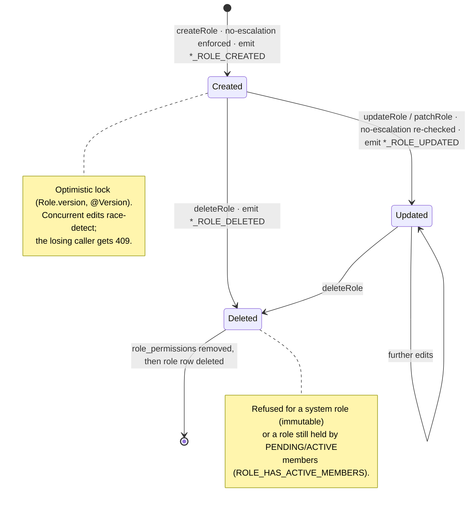
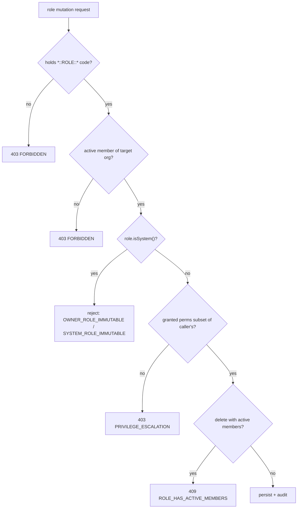

# Roles: system & custom

A **role** is a named bundle of permissions that a user holds through a membership row. CropDoor has exactly two kinds. **System roles** are minted by the platform itself — `SUPER_ADMIN` at boot, `Owner` when a farm or buyer profile is created — and are immutable to every runtime caller; only a Flyway migration can touch them. **Custom roles** are created on demand by a caller who holds the right `*::ROLE::CREATE` permission, hold only the permissions that caller explicitly grants, and are freely editable within the guardrails below.

Both kinds live in one `roles` table, mapped by `model/rbac/Role.java` and polymorphic across `OwnerType` ∈ `{PLATFORM, FARM, BUYER}` (see the [two-tier model](index.md)). The single flag that separates the two kinds — and that every runtime immutability check keys on — is `Role.isSystem()`. This page covers what each system role is, how custom roles are created and mutated, and the lifecycle a role moves through. For the full permission enumeration behind these roles, see the [permission catalog](permission-catalog.md); for the invariants the mutation paths enforce, [security invariants](security-invariants.md).

## System roles

Two system roles exist today, both `is_system = true` and both minted with the *entire* permission set of their scope — but they hold it two different ways. **`SUPER_ADMIN`** is resolved live: `security/CustomUserDetailsService.java` (`loadAdminPrincipal`) grants the whole `PermissionRepository#findByScope(PLATFORM)` catalog to the principal whenever its role matches, so a newly-seeded `PLATFORM` permission reaches every super admin on the next request with **no backfill** (additive migrations also grant the row to the `SUPER_ADMIN` role, keeping the stored join complete for service-layer checks). The org **`Owner`** role is the opposite: it is minted with a *fixed* set of `role_permissions` rows, snapshotted once from `findByScope(FARM|BUYER)` at profile-creation time (`FarmServiceImpl#createFarm`, mirrored in `BuyerProfileServiceImpl`), and an org member's effective set is read back from those stored rows (`PermissionResolutionService` → `RolePermissionRepository#findByRole_Id`), never re-resolved. So a newly-seeded `FARM`/`BUYER` permission reaches only *newly-created* orgs — it does **not** flow to existing Owner roles without a backfill migration (the same Flyway path `V39` used to flip `mfa_required` on pre-existing Owner rows).

| Role | Tier (`OwnerType`) | Permission set | `mfaRequired` | Mutable at runtime? |
| --- | --- | --- | --- | --- |
| `SUPER_ADMIN` | `PLATFORM` | every `PLATFORM::*` permission (`findByScope(PLATFORM)`) | `true` — pinned | No — delete is refused (`SYSTEM_ROLE_IMMUTABLE`); edits go through Flyway |
| `Owner` | `FARM` | every `FARM::*` permission (`findByScope(FARM)`) | `false` | No — `OWNER_ROLE_IMMUTABLE` / `OWNER_ROLE_NOT_INVITABLE` |
| `Owner` | `BUYER` | every `BUYER::*` permission (`findByScope(BUYER)`) | `false` | No — same as farm Owner |

### `SUPER_ADMIN` — the platform system role

`SUPER_ADMIN` is seeded by the `V19__create_platform_admin_rbac.sql` migration as an `owner_type = PLATFORM`, `is_system = true` row. The first user to hold it is created at application boot by `bootstrap/SuperAdminBootstrapRunner.java` from the `app.bootstrap.super-admin.*` properties; the runner is **idempotent** — it skips when an active super admin already exists.

Its authority is resolved at request time, not stored as join rows. `security/CustomUserDetailsService.java` (`loadAdminPrincipal`) grants `ROLE_SUPER_ADMIN` plus the whole `findByScope(OwnerType.PLATFORM)` permission catalog whenever the principal's role name matches. That match is on the literal string in `model/rbac/PlatformRoleNames.java` (`SUPER_ADMIN`), which is therefore **load-bearing** — renaming the row without updating the constant would silently strip super-admin authorities from every super admin.

`SUPER_ADMIN` always requires MFA. The `mfa_required = true` invariant for every `PLATFORM`-scope role is enforced both server-side and by a database `CHECK` constraint (`V37__role_mfa_required.sql`); see [security invariants](security-invariants.md) for the enforcement detail.

### `Owner` — the org system role

When a farm or buyer profile is created, an `Owner` role is auto-minted **atomically** in the same transaction and the founder is auto-assigned to it. `service/farm/FarmServiceImpl.java` (`createFarm`) and `service/buyer/BuyerProfileServiceImpl.java` (`createBuyerProfile`) run the identical shape:

```text
persist Farm/BuyerProfile row
mint Owner role  (ownerType = FARM|BUYER, ownerId = new org id, isSystem = true, mfaRequired = false)
attach every findByScope(FARM|BUYER) permission as role_permissions
create founder Member  (status = ACTIVE, role = Owner)
emit FARM_CREATED / BUYER_CREATED audit
```

The role's `name` is the display label `OWNER` from `model/rbac/OrgRoleNames.java`. Unlike the platform side, this name is **not** load-bearing: every org-tier authorization check keys on `Role.isSystem()`, never on the string. Unlike `SUPER_ADMIN`, the org `Owner` is minted with `mfaRequired = false` (`V39__org_owner_roles_drop_mfa_required.sql`), so org owners are not MFA-challenged at login — org-side MFA is opt-in per *custom* role.

!!! note "`is_system`, not the name, is the security signal"
    The immutability and non-invitability checks below all test `Role.isSystem()`. The `OWNER` / `SUPER_ADMIN` name strings are display and (on the platform side only) principal-resolution labels. Never gate authorization on a role name in org-tier code.

The `Owner` role is **immutable** and **non-invitable** — no runtime path can edit it, delete it, invite a member onto it, or move a member off it. The exceptions that enforce this, and the paths that raise them:

| Attempted action | Exception | HTTP | Raised in |
| --- | --- | --- | --- |
| Update / patch / delete an org system role | `OwnerRoleImmutableException` | 403 `OWNER_ROLE_IMMUTABLE` | `OrgRoleService#rejectIfOwnerRole` |
| Reassign a member *off* the Owner role | `OwnerRoleImmutableException` | 403 `OWNER_ROLE_IMMUTABLE` | `OrgMemberService#changeMemberRole` |
| Invite a member directly *onto* a system role | `OwnerRoleNotInvitableException` | 409 `OWNER_ROLE_NOT_INVITABLE` | `OrgMemberInviteService#invite` |
| Change a member's role *to* the Owner role | `OwnerRoleNotInvitableException` | 409 `OWNER_ROLE_NOT_INVITABLE` | `OrgMemberService#changeMemberRole` |

Ownership transfer is intentionally unsupported in v1: keeping the Owner role immutable means every "is this the owner?" check stays a simple `is_system` test instead of a "current owner" lookup. Changing an Owner role's *permissions* is a Flyway change against its seeded `role_permissions` rows — there is no runtime path. The [member lifecycle page](members-and-org-lifecycle.md) covers the reassignment flow these exceptions guard.

## Custom roles

Custom roles carry `is_system = false` and hold **only** the permissions granted at create/update time — they do not auto-acquire newly-seeded permissions the way system roles do. Both tiers create them through a permission-holder, but the two services differ in what extra rules apply.

### Org-tier custom roles

`service/rbac/OrgRoleService.java` owns the farm/buyer role catalog. Every mutation is gated at the controller by a bare permission code (`FARM::ROLE::CREATE`, `FARM::ROLE::UPDATE`, `FARM::ROLE::DELETE`, and the `BUYER::` equivalents, all sourced from `security/Permissions.java`) and re-checked defensively at the service. Beyond the permission gate, each method enforces:

- **Active membership in the target org** — `requireActiveMembership` rejects a caller acting on an org they are not an active member of, even with the right permission code (a farm-A member cannot mutate farm-B's catalog).
- **No privilege escalation** on `createRole`, `updateRole` (full replace), and `patchRole` (partial update, whenever `permissionIds` is supplied) — every granted permission must be a subset of the caller's *current* effective set. Re-checking on update means a caller who has since lost a permission cannot propagate it forward.
- **`mfaRequired` is the caller's choice** (a `null` request value defaults to `false`) — this is the per-role MFA knob product wants: a "Finance Manager" role can require MFA while a "Field Worker" role does not.

`deleteRole` adds two guards. It refuses a system role (`OwnerRoleImmutableException`), and it refuses to delete a role still held by any `PENDING` or `ACTIVE` member (`RoleHasActiveMembersException`, 409 `ROLE_HAS_ACTIVE_MEMBERS`) — the caller must reassign or revoke those members first, so a delete can never leave a member pointing at a dangling `role_id`. On a clean delete, the role's `role_permissions` rows are removed before the role row itself.

### Platform-tier custom roles

`service/admin/PlatformRoleService.java` is the platform analogue (e.g. an `Auditor` role). It differs from the org path in three ways:

- **`mfaRequired` is pinned `true`** server-side, regardless of caller input — the `PLATFORM`-must-MFA invariant.
- **The admin-management bucket is super-admin-only.** Granting any of `PLATFORM::ADMIN::INVITE`, `PLATFORM::ADMIN::SUSPEND`, `PLATFORM::ADMIN::REVOKE`, `PLATFORM::ROLE::CREATE`, `PLATFORM::ROLE::UPDATE`, `PLATFORM::ROLE::DELETE` (the six-member `ADMIN_MGMT_PERMS` set) as a non-super-admin raises `PrivilegeEscalationException`. This is the platform path's *only* permission-based grant gate — `PlatformRoleService` does **not** run the org tier's caller-subset check (it never resolves the caller's effective set), so a non-super-admin holding `PLATFORM::ROLE::CREATE` can grant any *non-bucket* `PLATFORM` permission whether or not they hold it.
- **Only `PLATFORM`-scoped, known permission codes are accepted** — an unknown code or a non-platform scope raises `InvalidPlatformRoleException` (400 `INVALID_PLATFORM_ROLE`). `deleteRole` refuses the seeded `SUPER_ADMIN` system row (`SystemRoleImmutableException`, 409) and refuses a role still held by active admins (`RoleHasActiveAdminsException`, 409).

### No privilege escalation, at every grant point

On the **org tier**, a caller can never grant a permission they do not themselves hold — the caller-subset rule is checked at every place an org role's permission set is bound. (The platform tier is the exception: it enforces only the super-admin-only admin-management bucket, not caller-subset — see the row below.) The full diagram and rationale live in [security invariants](security-invariants.md). The enforcement points relevant to roles:

| Enforcement point | Source |
| --- | --- |
| Org role create | `OrgRoleService#createRole` → `enforceNoEscalation` |
| Org role update / patch | `OrgRoleService#updateRole` / `#patchRole` |
| Member role change (org) | `OrgMemberService#changeMemberRole` |
| Platform role create / update | `PlatformRoleService` — **super-admin-only admin-management bucket only**; does not run the caller-subset check (see [security invariants](security-invariants.md)) |

The caller's effective set is resolved fresh on each check by `service/rbac/PermissionResolutionService.java` — no cache, so a mid-session permission loss takes effect on the next mutation. See [permission resolution](authorization.md) for how that set is computed.

## Role mutation lifecycle

A custom role moves through a small state machine. System roles have **no runtime transitions** — they enter the diagram only via Flyway (`SUPER_ADMIN`) or org creation (`Owner`) and leave it only via Flyway.



Concurrent edits are safe because `Role` carries a JPA optimistic-lock counter (`version`, mapped `@Version`): two operators flipping the same role's permission set race-detect, and the loser receives a 409 through the global handler. Every successful transition emits an org-scoped audit event (`FARM_ROLE_CREATED`, `BUYER_ROLE_UPDATED`, …) carrying the org's owner type and id, so it lands on that org's audit feed — see the [audit section](../audit/index.md).

The guard chain a mutation runs before it takes effect:



## Exception reference

Every role-mutation failure is a `DomainException` mapped to its HTTP status by its `ErrorCode`, per the [error-handling standard](../architecture/index.md).

| Exception | `ErrorCode` (HTTP) | Trigger |
| --- | --- | --- |
| `OwnerRoleImmutableException` | `OWNER_ROLE_IMMUTABLE` (403) | Edit/patch/delete an org system role, or reassign a member off the Owner role |
| `OwnerRoleNotInvitableException` | `OWNER_ROLE_NOT_INVITABLE` (409) | Invite onto, or change a member to, the Owner role |
| `RoleHasActiveMembersException` | `ROLE_HAS_ACTIVE_MEMBERS` (409) | Delete an org role still held by `PENDING`/`ACTIVE` members |
| `PrivilegeEscalationException` | `PRIVILEGE_ESCALATION` (403) | Grant a permission the caller lacks; non-super-admin grants the admin-management bucket |
| `RoleNotFoundException` | `ROLE_NOT_FOUND` (404) | Mutate a non-existent org role |
| `SystemRoleImmutableException` | `SYSTEM_ROLE_IMMUTABLE` (409) | Delete the platform `SUPER_ADMIN` system role |
| `RoleHasActiveAdminsException` | `ROLE_HAS_ACTIVE_ADMINS` (409) | Delete a platform role still held by admins |
| `InvalidPlatformRoleException` | `INVALID_PLATFORM_ROLE` (400) | Unknown/non-`PLATFORM` permission codes, or a non-platform role id |

## Where it lives

| Concern | Source |
| --- | --- |
| Role entity + optimistic lock | `model/rbac/Role.java` |
| System-role name constants | `model/rbac/PlatformRoleNames.java` (`SUPER_ADMIN`), `model/rbac/OrgRoleNames.java` (`OWNER`) |
| Org custom-role CRUD + Owner immutability | `service/rbac/OrgRoleService.java` |
| Platform custom-role CRUD + MFA pin + admin-mgmt guard | `service/admin/PlatformRoleService.java` |
| Owner auto-mint at profile creation | `service/farm/FarmServiceImpl.java`, `service/buyer/BuyerProfileServiceImpl.java` |
| Member role change (Owner guards) | `service/org/OrgMemberService.java`, `service/org/OrgMemberInviteService.java` |
| Effective-permission resolution | `service/rbac/PermissionResolutionService.java` |
| Super-admin bootstrap | `bootstrap/SuperAdminBootstrapRunner.java` |
| Permission codes | `security/Permissions.java` |
| Seed + MFA-pin migrations | `V19__create_platform_admin_rbac.sql`, `V37__role_mfa_required.sql`, `V39__org_owner_roles_drop_mfa_required.sql` |

## Related pages

- [The two-tier model](index.md) — where `PLATFORM` / `FARM` / `BUYER` roles fit
- [Permission catalog](permission-catalog.md) — the full code enumeration these roles bundle
- [Authorization](authorization.md) — the three gate layers and permission resolution
- [Security invariants](security-invariants.md) — no-escalation, Owner immutability, last-super-admin, the MFA pin
- [Members & org lifecycle](members-and-org-lifecycle.md) — invites, role changes, one-org-per-user
- [Domain model](../domain/index.md) — the org model shared by Member and Owner
- [Auth](../auth/index.md) — MFA at login and how a refreshed session re-resolves permissions
