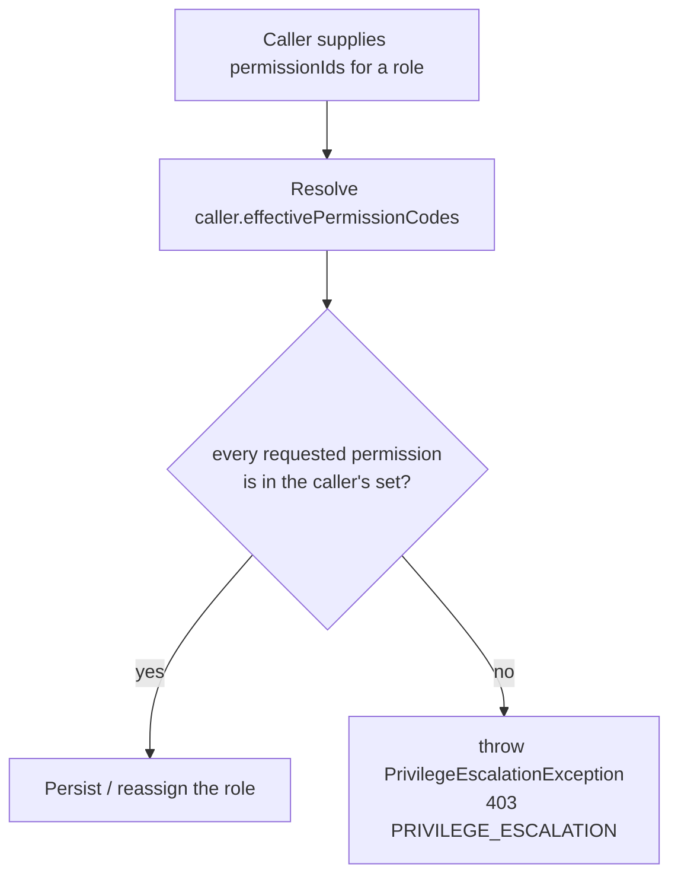
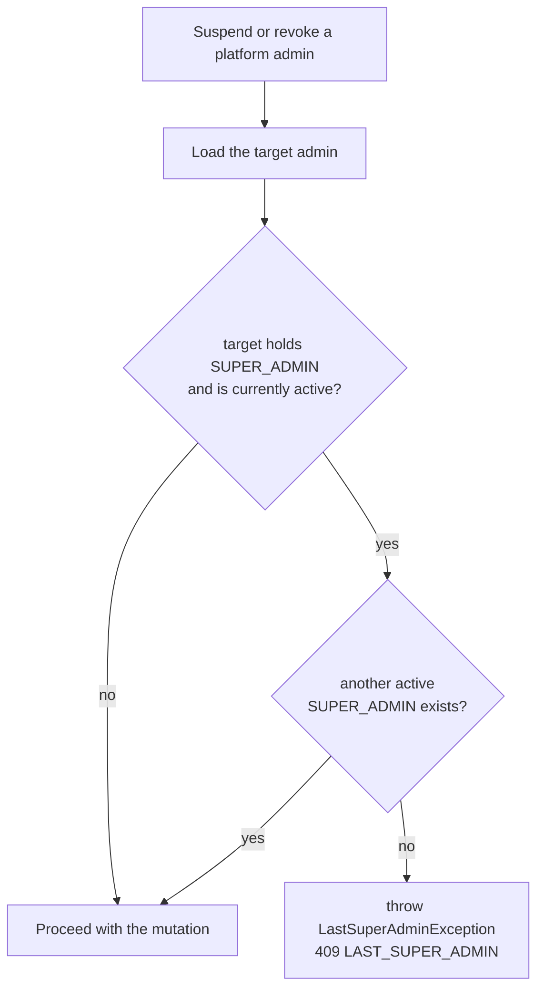
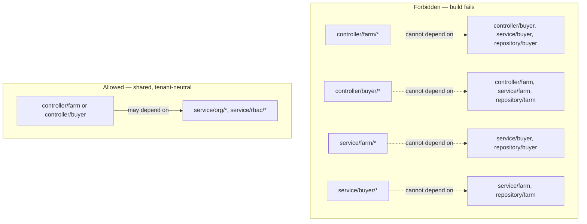

# Security invariants

Seven hard rules keep CropDoor's two-tier RBAC honest. Each one closes a specific way the model could otherwise be subverted — a caller minting a role more powerful than themselves, an org founder losing the keys to their own org, an admin locking the whole platform out, or one tenant reaching into another's data. This page is the depth reference for all seven: the invariant stated crisply, *why* it exists, *where* it is enforced, and the exception or mechanism that carries it.

The common thread is **defense in depth**. Every rule is enforced in service code, but the load-bearing ones are *also* pinned one layer down so they cannot rot: some by a PostgreSQL `CHECK` constraint or partial unique index that rejects a bad row before it persists, one by an ArchUnit test that fails the build. Where a rule has both a runtime check and a structural pin, the structural pin is the backstop — service code can regress, a migration or a compile-time rule cannot be quietly bypassed. For the mechanics these invariants protect, see [authorization](authorization.md) (the three-gate pipeline), [roles](roles.md) (system vs custom roles), and [members & org lifecycle](members-and-org-lifecycle.md) (the member state machine); the org-model side of one-org-per-user lives in the [domain section](../domain/index.md).

## The seven at a glance

| Invariant | Why it exists | Enforced where | Exception / mechanism |
| --- | --- | --- | --- |
| **No privilege escalation** | A caller must never mint a role more powerful than themselves | `service/rbac/OrgRoleService.java`, `service/org/OrgMemberService.java`, `service/org/OrgMemberInviteService.java`, `service/admin/PlatformRoleService.java` | `PrivilegeEscalationException` (403) |
| **Owner role immutable + non-invitable** | Ownership transfer is unsupported in v1; keep "Owner" a fixed anchor | `service/rbac/OrgRoleService.java`, `service/org/OrgMemberService.java`, `service/org/OrgMemberInviteService.java` | `OwnerRoleImmutableException` (403), `OwnerRoleNotInvitableException` (409); only a Flyway migration edits the Owner grant |
| **One org per user** | A user belongs to at most one organization at a time | Partial unique index `uq_members_user_active` (V32) + service check | `UserAlreadyHasMembershipException` (409) |
| **PLATFORM roles must MFA** | Platform admins wield the strongest permissions; MFA is non-negotiable | `roles_platform_must_require_mfa` CHECK (V37) + server-side force in `service/admin/PlatformRoleService.java` | `mfa_required` pinned `true`; caller input ignored |
| **Last super-admin protection** | Prevent an unrecoverable admin lockout | `service/admin/PlatformAdminService.java` | `LastSuperAdminException` (409) |
| **No self-modification** | Force admin-lifecycle changes through a peer, not oneself | `service/admin/PlatformAdminService.java` | `CannotActOnSelfException` (409) |
| **Cross-tenancy isolation** | Farm-side code must never touch buyer-side beans, or vice versa | `src/test/java/com/cropdoor/backend/architecture/OrgIsolationArchitectureTest.java` (build-time) | ArchUnit rule; build fails |

The exceptions map to `ErrorCode` constants in `dto/ErrorCode.java`, each carrying its own HTTP status and a curated, client-safe message. Frontends branch on the constant name, never the message text — see the [error-handling standard](../architecture/index.md) for the shape of every failure.

## No privilege escalation

**The rule.** A caller can never grant a permission they do not themselves hold. Whenever a role's permission set is bound to a caller-supplied list, every code in that list must be a subset of the caller's own effective permissions:

```
granted ⊆ caller.effectivePermissionCodes
```

**Why.** Without it, any user who can create a custom role could hand themselves — or an accomplice — permissions their own role never carried, defeating the entire point of scoped roles. The check is re-run on *every* write that binds permissions, so a caller who has *lost* a permission since first creating a role can no longer propagate it forward.

**Where it is enforced.** The effective set comes from `service/rbac/PermissionResolutionService.java` (`effectivePermissionCodes` / `hasAll`), and the caller-subset guard fires at four **org-tier** write points (the platform tier uses a different, weaker gate — see the last table row):



| Write point | Location | Note |
| --- | --- | --- |
| Create org role | `OrgRoleService#createRole` | `enforceNoEscalation(caller, permissions)` before persist |
| Update / patch org role | `OrgRoleService#updateRole`, `#patchRole` | Re-checked against the caller's **current** effective set |
| Change a member's role | `service/org/OrgMemberService.java#changeMemberRole` | The new role's permission codes must be a subset of the caller's set |
| Invite a member into a role | `service/org/OrgMemberInviteService.java#invite` | The invited role's permission codes must be a subset of the caller's set |
| Create / update platform role | `service/admin/PlatformRoleService.java` | **Not** the org subset rule. `PlatformRoleService` never resolves the caller's effective set (it doesn't inject `PermissionResolutionService`); its only permission gate is the super-admin-only admin-management bucket below. A non-super-admin holding `PLATFORM::ROLE::CREATE` can grant any non-bucket `PLATFORM` permission they don't hold. |

**The admin-management carve-out.** On the platform tier, six permissions — `PLATFORM::ADMIN::INVITE`, `PLATFORM::ADMIN::SUSPEND`, `PLATFORM::ADMIN::REVOKE`, `PLATFORM::ROLE::CREATE`, `PLATFORM::ROLE::UPDATE`, `PLATFORM::ROLE::DELETE` (the `ADMIN_MGMT_PERMS` set in `PlatformRoleService`) — can be granted **only by a super admin**, regardless of whether the caller happens to hold them. A non-super-admin attempting to place any of those on a role trips the same `PrivilegeEscalationException`. All codes flow through constants on `security/Permissions.java`; none is inlined as a string literal.

!!! note "The status is 403, not 422"
    `PrivilegeEscalationException` carries `ErrorCode.PRIVILEGE_ESCALATION`, which maps to **403 Forbidden** in `dto/ErrorCode.java`. It shares the status of an ordinary permission denial — the distinguishing signal for a UI is the `PRIVILEGE_ESCALATION` error-code name, not a distinct HTTP status.

## Owner role immutable + non-invitable

**The rule.** The auto-minted `Owner` role for a farm or buyer profile cannot be edited, deleted, reassigned, or handed to anyone by invite. It is a fixed anchor bound to the org founder.

**Why.** Ownership transfer is deliberately unsupported in v1. If Owners could reassign Owner-rights, every "is this the owner?" check would have to become a "is this the *current* owner?" check with all the race and audit complexity that implies. Keeping the role itself immutable sidesteps the whole problem — there is exactly one Owner per org, minted at creation, and it never moves.

**Where it is enforced.** The `Owner` role is a *system* role (`isSystem = true` on `model/rbac/Role.java`), and that flag is what every guard keys on:

| Attempted action | Location | Exception |
| --- | --- | --- |
| Edit / patch / delete the Owner role | `service/rbac/OrgRoleService.java` (`updateRole`, `patchRole`, `deleteRole`) | `OwnerRoleImmutableException` (403) |
| Reassign a member *away from* the Owner role | `service/org/OrgMemberService.java#changeMemberRole` | `OwnerRoleImmutableException` (403) |
| Reassign a member *into* a system role | `service/org/OrgMemberService.java#changeMemberRole` | `OwnerRoleNotInvitableException` (409) |
| Invite a new member *as* an Owner | `service/org/OrgMemberInviteService.java` | `OwnerRoleNotInvitableException` (409) |

**The one legitimate path.** Changing the Owner role's *permission set* requires a Flyway migration that edits the seeded `role_permissions` rows. No runtime code path can touch it — which is exactly the guarantee. (The Owner grant is a *mint-time snapshot* described in [roles](roles.md): every `FARM::*` or `BUYER::*` permission of the org's scope, captured as fixed `role_permissions` rows when the org is created. A newly-seeded permission therefore reaches only orgs created after it — existing Owner roles pick it up only through a backfill migration, the same Flyway path that edits the snapshot.)

## One org per user

**The rule.** A user is a member of **at most one** organization at a time. A person may found or join a farm *or* a buyer profile, but never hold two active memberships at once.

**Why.** It keeps the permission resolver unambiguous — there is a single active `Member` row to resolve against, so "what can this user do right now?" has one answer, not a merge across orgs. It also matches the product model: staff, drivers, and org owners belong to one business.

**Where it is enforced — two layers.**

- **Database (the backstop).** A **partial unique index**, `uq_members_user_active` (migration V32), on `members(user_id)` restricted to `WHERE status IN ('PENDING','ACTIVE')`. Because it is *partial*, revoked, expired, and org-deleted rows accumulate freely without blocking a fresh invite — only a live (pending or active) membership is unique-constrained. A malformed second active membership can never persist, even if a service check is bypassed.
- **Service.** `service/org/OrgMemberInviteService.java` checks for an existing active membership before persisting and throws `UserAlreadyHasMembershipException` (409). The same guard fires in `service/farm/FarmServiceImpl.java` and `service/buyer/BuyerProfileServiceImpl.java` when a user tries to found a second org.

**Two consequences.**

- **Re-invite reuse.** If the invitee already has a `Member` row in the *same* target org with a terminal status (`REVOKED`, `EXPIRED`, or `ORG_DELETED`), the invite reuses that row rather than inserting a new one — surfaced as a distinct re-invite audit event. The partial index is what makes this safe.
- **Dormant STAFF.** A STAFF user whose only membership is terminal is *dormant*: `effectivePermissionCodes` resolves to the empty set, so every org-scoped endpoint returns 403 `STAFF_DORMANT_NO_MEMBERSHIP` until they accept a fresh invite. The full lifecycle lives in [members & org lifecycle](members-and-org-lifecycle.md); the org-model framing is in the [domain section](../domain/index.md).

## PLATFORM roles must MFA

**The rule.** Every role with `ownerType = PLATFORM` must have `mfa_required = true`. Platform admins are always challenged for MFA at login.

**Why.** Platform-tier roles carry the strongest permissions in the system — user suspension, admin management, financial visibility. Multi-factor authentication on those accounts is non-negotiable, so the requirement is pinned at the schema level rather than left to application logic.

**Where it is enforced — two layers.**

- **Database (the backstop).** The `roles_platform_must_require_mfa` CHECK constraint (migration V37): `owner_type <> 'PLATFORM' OR mfa_required = true`. A platform role with MFA off simply cannot be written.
- **Server.** `service/admin/PlatformRoleService.java` ignores the caller's `mfaRequired` input on platform-role create/update and pins it `true` — so the constraint is never even reached with a bad value.

**The org-tier contrast.** For FARM and BUYER roles, `mfa_required` is a per-role, Owner-configurable flag by design (a "Finance Manager" custom role can require MFA while a "Field Worker" role does not). As of the V39 migration, the auto-minted `Owner` role for both farms and buyer profiles is created with `mfa_required = false` — so an org owner is **not** MFA-challenged at login, and org-side MFA is opt-in per *custom* role. Platform admins always are challenged. This asymmetry is intentional; see [roles](roles.md) for the flag's semantics.

## Last super-admin protection

**The rule.** The final active super admin cannot be suspended or revoked. There must always be at least one active `SUPER_ADMIN` on the platform.

**Why.** It prevents an unrecoverable lockout. Without the guard, one misclick — or one malicious actor with admin-management rights — could leave the platform with zero active super admins and no path back in.

**Where it is enforced.** `service/admin/PlatformAdminService.java`, checked *before* any suspend or revoke mutation:



The ordering differs by operation. In **revoke**, the invariant is checked first — *before* the "only a super admin may act on a super admin" authorization check — so system integrity outranks the actor's identity: even an actor with unexpectedly elevated privileges is blocked from dropping the last super admin, surfacing `409 LAST_SUPER_ADMIN`. In **suspend**, the privilege check runs first, so a non-super-admin who tries to suspend the last active super admin is stopped with `403 PRIVILEGE_ESCALATION` before the invariant is ever evaluated. A super-admin caller reaches the invariant on both paths. The flowchart above focuses on the invariant and omits the privilege check; only the revoke path guarantees invariant-before-privilege ordering. To remove the current super admin, invite and activate a second one first.

## No self-modification

**The rule.** An admin cannot suspend, unsuspend, or revoke **their own** platform-admin assignment. Someone else must perform the change.

**Why.** It forces every admin-lifecycle change through a peer, which prevents accidental self-lockout and removes a whole class of "I revoked myself and now can't undo it" support incidents. It also means a compromised session cannot quietly demote-then-escalate a single account in isolation.

**Where it is enforced.** `service/admin/PlatformAdminService.java` compares the caller's user id against the target admin's user id and throws `CannotActOnSelfException` (409) on a match. The scope is precisely the admin-status lifecycle operations — suspend, unsuspend, revoke — on one's own `PlatformAdmin` row; the same self-guard covers admin-driven user management in `service/admin/AdminUserServiceImpl.java`.

## Cross-tenancy isolation

**The rule.** No farm-side class may depend on a buyer-side bean, and no buyer-side class may depend on a farm-side bean. The two org tenancies are wired independently and can only meet through shared, tenant-neutral beans.

**Why.** A farm controller that accidentally injected `BuyerProfileService` — or a farm service that reached into a buyer repository — would open a path for one organization's code to read or mutate another tenancy's data. Pinning the boundary at *compile time* means the leak is caught before it can ship, not discovered in an incident.

**Where it is enforced.** `src/test/java/com/cropdoor/backend/architecture/OrgIsolationArchitectureTest.java` — an ArchUnit test that fails the build on any forbidden dependency:



The four rules are symmetric: farm controllers must not touch buyer controllers/services/repositories, buyer controllers must not touch farm ones, and the same for the service layer in both directions. Shared org-scoped beans under `service/org/` (the invite, deletion, and audit-view services) and `service/rbac/` (`PermissionResolutionService`, `OrgRoleService`) remain injectable by both sides — that is where the two tenancies are *meant* to meet. When a genuine cross-need arises, the fix is to move the dependency into a shared package or invert the call direction, never to relax the rule.

## Exception reference

Every invariant surfaces as a typed `DomainException` carrying an `ErrorCode` from `dto/ErrorCode.java`. The status codes below are the verified mappings:

| Exception | `ErrorCode` | HTTP | Raised when |
| --- | --- | --- | --- |
| `PrivilegeEscalationException` | `PRIVILEGE_ESCALATION` | **403** | Granting a permission the caller does not hold (or a non-super-admin granting the admin-management bucket) |
| `OwnerRoleImmutableException` | `OWNER_ROLE_IMMUTABLE` | **403** | Editing, deleting, or reassigning a member away from a system (`Owner`) role |
| `OwnerRoleNotInvitableException` | `OWNER_ROLE_NOT_INVITABLE` | **409** | Inviting or reassigning a member into the `Owner` role |
| `UserAlreadyHasMembershipException` | `USER_ALREADY_HAS_MEMBERSHIP` | **409** | Inviting a user who already holds an active membership |
| `LastSuperAdminException` | `LAST_SUPER_ADMIN` | **409** | Suspending or revoking the final active super admin |
| `CannotActOnSelfException` | `CANNOT_ACT_ON_SELF` | **409** | An admin acting on their own admin assignment |

`STAFF_DORMANT_NO_MEMBERSHIP` (403) is the related denial a dormant STAFF user hits on any org-scoped endpoint — a consequence of one-org-per-user rather than a distinct guard.

## Where it lives

| Concern | Source |
| --- | --- |
| Effective-permission resolver + subset guard | `service/rbac/PermissionResolutionService.java`, `service/rbac/OrgRoleService.java` |
| Member-role-change escalation + Owner-reassign guards | `service/org/OrgMemberService.java` |
| Member invite + one-org-per-user check + invite-time escalation guard | `service/org/OrgMemberInviteService.java` |
| Org founding (second-org guard) | `service/farm/FarmServiceImpl.java`, `service/buyer/BuyerProfileServiceImpl.java` |
| Platform-role admin-management bucket guard + MFA pin | `service/admin/PlatformRoleService.java` |
| Last-super-admin + no-self-modification | `service/admin/PlatformAdminService.java`, `service/admin/AdminUserServiceImpl.java` |
| Permission constants | `security/Permissions.java` |
| Error codes | `dto/ErrorCode.java` |
| Cross-tenancy build-time pin | `src/test/java/com/cropdoor/backend/architecture/OrgIsolationArchitectureTest.java` |
| Schema pins | `V19` (`roles_owner_valid`), `V32` (`uq_members_user_active`), `V37` (`roles_platform_must_require_mfa`), `V39` (Owner MFA off) under `src/main/resources/db/migration/` |

!!! info "Status"
    **Shipped.** All seven invariants are live: enforced in service code, and — for one-org-per-user, the platform-MFA pin, the Owner-ownership shape, and cross-tenancy isolation — additionally backstopped by a database constraint, a partial unique index, or an ArchUnit build gate.
